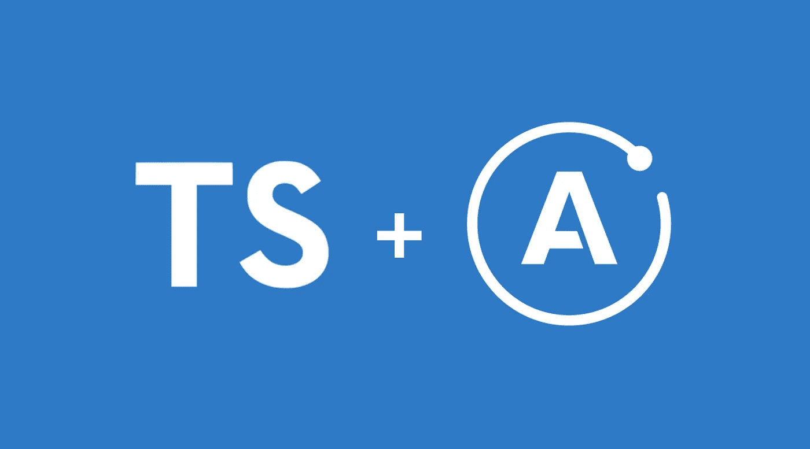
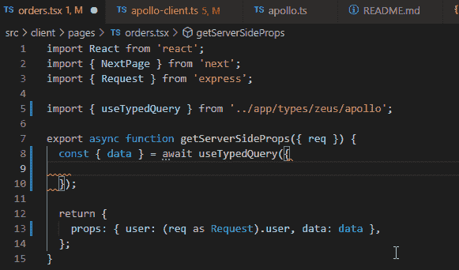

# 使用 Apollo 自动输入 GraphQL 查询和结果

> 原文：<https://medium.com/geekculture/automagically-typed-graphql-queries-and-results-with-apollo-3731bad989aa?source=collection_archive---------11----------------------->

喜欢将 GraphQL 查询写成字符串并得到非类型化的结果吗？我也没有。这个问题有时被称为“双重声明问题”，你可以在这里[和这里](https://babel-blade.netlify.app/docs/declarationdeclaration.html)和[这里](https://github.com/acro5piano/typed-graphqlify/tree/d89f5b950a77862ab3f7d965134a07d4e75e03a6#motivation)读到更多关于它的细节，但是你已经明白了。难道就不能采用 GraphQL 模式，编写类型化查询，得到类型化结果吗？如何开箱即用，而不必显式命名类型？

TLDR；你可以用一个方法完成所有这些事情！在[的 nestjs-starter repo](https://github.com/thisismydesign/nestjs-starter) 中，我使用带有端到端类型的 GraphQL 来[连接 nestjs 和 Next.js](https://csaba-apagyi.medium.com/nestjs-react-next-js-in-one-mvc-repo-for-rapid-prototyping-faed42a194ca) 。

有大量的尝试来解决这个问题，最值得注意的是:

*   apollo 的 codegen ( [1](/open-graphql/automatically-generate-typescript-definitions-for-graphql-queries-with-apollo-codegen-e73eae72b561) ， [2](https://moonhighway.com/typescript-and-apollo) ，[3](https://www.leighhalliday.com/generating-types-apollo))——这是对结果进行类型化的部分解决方案，仍然需要您显式地分配类型
*   一个实验性的[巴别塔插件](https://github.com/babel-blade/babel-blade)(!)-当然感觉有点过头了
*   解决这一部分或那一部分的几个库: [gotql](https://github.com/khaosdoctor/gotql) ， [typed-graphqlify](https://github.com/acro5piano/typed-graphqlify) ， [graphql-typed-client](https://github.com/helios1138/graphql-typed-client)
*   gqless ，一个基于不同范例的客户端，它需要代码和概念的改变(但是如果你能接受的话，看起来真的很酷)
*   阿波罗客户端的一些想法( [1](https://github.com/apollographql/apollo-feature-requests/issues/275) 、 [2](https://github.com/apollographql/apollo-feature-requests/issues/114) )
*   (我怀疑[可执行模式](https://www.graphql-tools.com/docs/generate-schema)的实现可以以某种方式重用，但似乎没有人这么做？)

以上所有都是部分解决方案，或者不是你可以直接在 apollo 中使用的东西。

graphql-zeus 来救援了！

*最后更新时间:2022.03 (* `*graphql-zeus 4.0.4*` *)*

# 第一步，安装

# 步骤 2，生成类型

您可以选择提交生成的文件或忽略它，并将生成的文件包含在您的构建脚本中。

# 步骤 3，键入客户端

`— apollo`标志生成一个名为`useTypedQuery`的阿波罗`useQuery`的类型化版本，您可以立即使用。它接受类型化查询并返回类型化结果。

有时候不能用钩子(比如在 [Next.js SSR](https://stackoverflow.com/a/71636434/2771889) )。对于这些情况，您可以定义一个类似于`useTypedQuery`的`typedQuery`

您可以在[nestjs-starter repo](https://github.com/thisismydesign/nestjs-starter)中看到这种做法，例如在[订单页面](https://github.com/thisismydesign/nestjs-starter/blob/20f29ff421b6ab5e39f30930b9071e455b0705e6/src/client/pages/orders.tsx)中。

repo 展示了一个用于快速原型制作的示例 NestJS MVC 架构。它[原生服务 Next.js](https://csaba-apagyi.medium.com/nestjs-react-next-js-in-one-mvc-repo-for-rapid-prototyping-faed42a194ca) 作为前端，与 GraphQL 连接，以及一些附加功能，如通过 Passport 和 Cognito 进行身份验证。