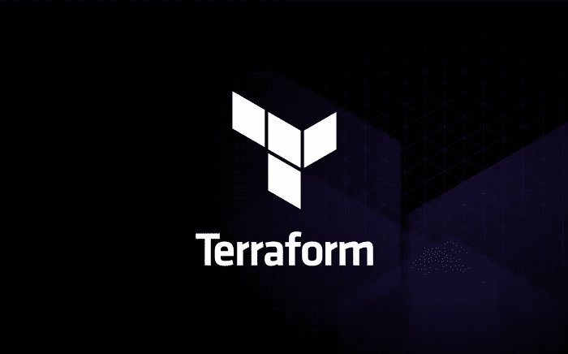
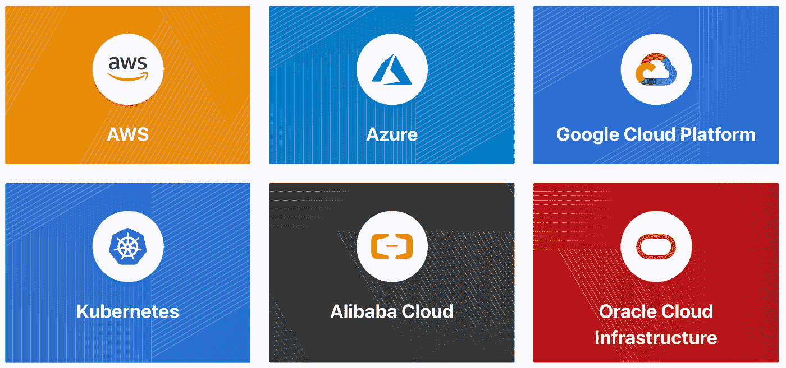
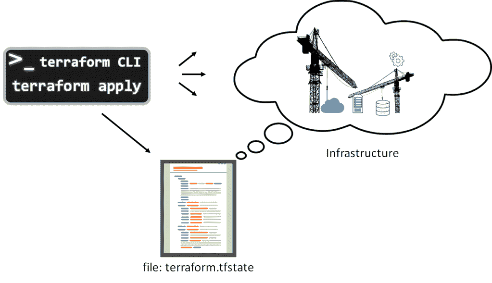

# 使用 Terraform 自动化 Azure 基础设施供应—第一部分

> 原文：<https://medium.com/geekculture/automate-azure-infrastructure-provisioning-with-terraform-part-i-ef3be36c2c80?source=collection_archive---------11----------------------->

source — [https://blog.devgenius.io/how-to-create-a-terraform-custom-module-for-an-ec2-instance-ea30a1d4b1f8](https://blog.devgenius.io/how-to-create-a-terraform-custom-module-for-an-ec2-instance-ea30a1d4b1f8)

# **什么是 Terraform**

Terraform 是一个基础设施供应工具。基本上，它用于以编程方式创建、管理和销毁项目的部署基础设施。它可以管理大多数云提供商的基础架构组件，如前门、线墙、密钥库、存储、虚拟机等。最重要的是，由于我们是通过代码库来配置基础架构的，因此我们可以复制和重用相同的代码库，通过对代码库进行微小的修改来为不同的环境或项目配置基础架构。这是使用这个强大工具的主要好处。另一方面，通过云控制台创建基础设施并相应地管理它们是一项非常繁琐的任务。当我们需要创建一个新环境时，如果我们手动创建，将会花费大量时间。但是通过 terraform，我们可以高效地自动化这个过程。

Terraform 是使用 HashiCorp 配置语言(HCL)编写的，它支持所有主要的云提供商。

source — [https://registry.terraform.io/browse/providers](https://registry.terraform.io/browse/providers)

## 声明性与命令性特征

source — [https://www.educative.io/blog/declarative-vs-imperative-programming](https://www.educative.io/blog/declarative-vs-imperative-programming)

命令式编程意味着，我们有目的地提供达到目标所需的所有指令，或者提供完成目标所需的所有步骤。例如，在基础架构配置中:

*   添加 2 台服务器
*   创建 DNS 设置
*   添加必要的权限和路由规则等。

但是在声明式编程中，我们只提供我们需要的目标或最终结果。例如，我们需要一个部署基础设施，包括 2 台服务器和必要的组件。

Terraform 是一种声明式编程语言，我们在其中声明最终需要的设置，然后 terraform 核心将识别当前状态以及完成最终状态所需的步骤。因此，在管理透视图中使用它更容易、更方便，因为我们不需要管理基础架构供应中的任何中间步骤。如果我们通过正确配置相关模块来提供最终状态，那么 terraform 将为目标基础设施规划所需的步骤。

# 地形文件结构

当我们管理 terraform 代码库时，我们可以有几种不同用途的文件，并提高代码库的可读性和效率。

*   在文件 **main.tf** 中可以找到带有所需资源块的模块的初始设置。
*   模块的变量定义包含在文件 **variables.tf** 中。
*   资源的输出定义在文件 **outputs.tf** 中。
*   通过允许这些值只设置一次，然后在整个配置中用作参考， **locals.tf** 可以帮助简化配置。
*   Terraform 变量定义文件的扩展名为. tfvars 或. tfvars.json。 **tf 文件**。而。 **tfvars** 文件用于定义变量，它们有时被称为变量定义文件。

# Terraform tfstate 文件

source — [https://digitalvarys.com/complete-terraform-tutorial-part-4-terraform-state/](https://digitalvarys.com/complete-terraform-tutorial-part-4-terraform-state/)

这个文件记录了我们在云提供商中创建的所有资源。主要是它拥有云提供者中真实世界实体的所有配置，通常它被称为 terraform.tfstate 文件。如果我们在一个团队环境中，它既可以本地管理，也可以远程管理。Terraform 使用此本地状态来制定计划和修改您的基础架构。Terraform 在每次操作之前都会进行刷新，以更新实际基础设施的状态。在项目的整个生命周期中保持这个文件是很重要的，如果它被破坏，我们在云提供商中创建的资源可能会被破坏或改变。要运行 terraform 并将其更改应用到云，必须有这个文件。否则，它将初始化一个新文件，并且不会与我们在云提供商端拥有的任何当前资源同步。

# 不同阶段的地形命令

1.  **terraform init**—terra form init 命令执行后端初始化、子模块安装和插件安装，以便设置与 terra form 一起使用的工作目录。
2.  **terraform validate** —在不访问任何外部数据或服务的情况下验证目录中的配置文件。该命令必须在 terraform init 之后执行。
3.  **地形计划—** 该将提供一个执行计划，指明将要完成的步骤，而不实际执行这些步骤。
4.  **terraform 应用** —应用 terraform 基于配置文件构建或修改基础设施。默认情况下，首先创建一个计划，并且必须接受该计划才能实施。
5.  **地形摧毁** —摧毁地形管理的基础设施。

让我们在下一篇博客中讨论**使用 Terraform 和 Azure DevOps 部署基础设施**部分。

谢谢，继续阅读☺️.