# 使用 Terraform 自动化 Azure 基础设施供应—第二部分

> 原文：<https://medium.com/geekculture/automate-azure-infrastructure-provisioning-with-terraform-part-ii-499594678624?source=collection_archive---------4----------------------->

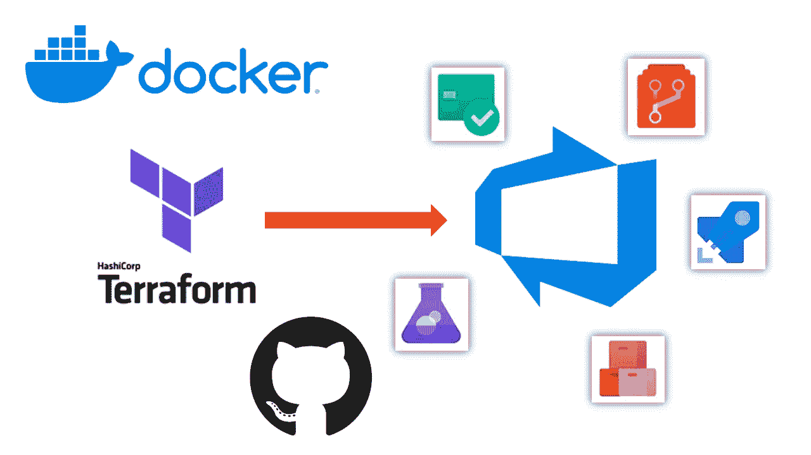

source — Author

如果你错过了我之前的博客，我在那里讨论了 Terraform，请在我的个人资料中参考。

# 使用 Terraform 和 Azure DevOps 部署基础设施

## 什么是 CI/CD？持续集成和持续交付

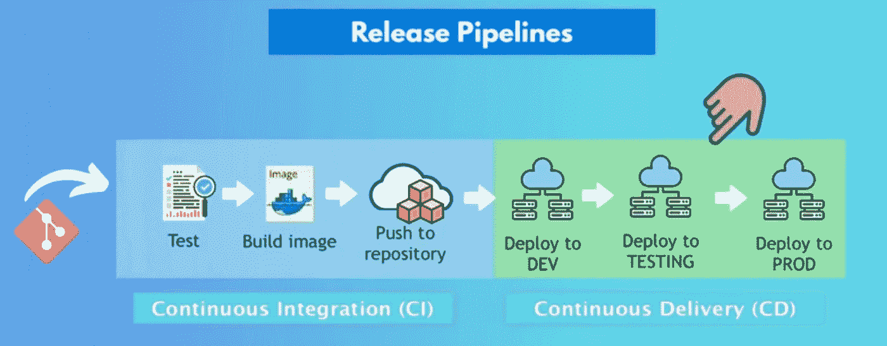

source — [https://www.youtube.com/c/TechWorldwithNana](https://www.youtube.com/c/TechWorldwithNana)

**持续集成(CI)**

持续集成是开发人员尽可能频繁地将他们的变更合并回主分支的实践。在这里，我们主要练习的是对代码库做任何必要的修改。然后，我们根据我们使用的技术栈，将这些更改打包到 war 文件或 jar 文件或任何必要的软件包中。然后，我们将使用选定的基本映像为包构建 docker 映像，并将其推送到公共或私有 docker 容器存储库。

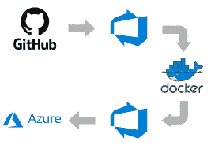

source — [https://www.youtube.com/c/TechWorldwithNana](https://www.youtube.com/c/TechWorldwithNana)

**连续交货(光盘)**

因为在构建步骤之后，它自动地将所有的代码变更发布到测试和/或生产环境中，所以持续交付是持续集成的扩展。在这里，我们从 docker 存储库中获取上面推送的映像，然后将其部署到容器中的相关 pod。根据要求和流量，可能存在复制因素，我们有多个单元来满足更大的传入流量。

## 服务连接

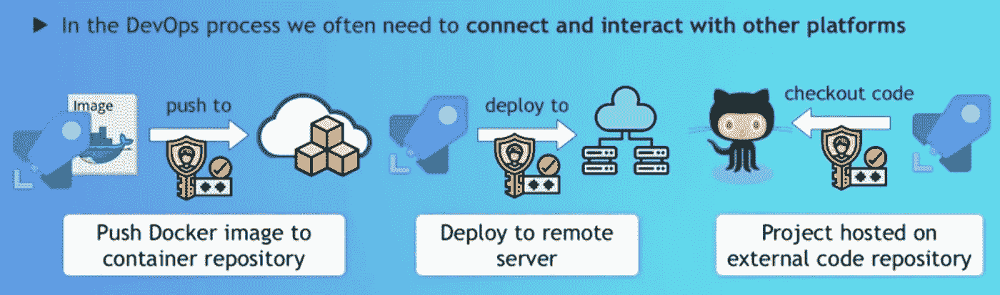

source — [https://www.youtube.com/c/TechWorldwithNana](https://www.youtube.com/c/TechWorldwithNana)

在开发运维过程中，我们经常需要连接到不同的平台并与之通信。
对于 Azure DevOps 连续构建和连续发布管道来说，与外部和远程服务通信并执行活动，服务连接是必要的。通俗的说，我们在本地运行 terraform 的时候，基本上做的就是登录我们的 Azure 账号(az login)并设置订阅。

然后运行 terraform 计划并应用。但是，当我们通过管道实现流程自动化时，我们需要自动完成这些任务。为了做到这一点，我们创建了一个叫做服务连接的东西，这是一种特权用户类型的东西，通过这个帐户，它可以与 Azure 端执行任务。

## 演示项目

*   资源—[https://github.com/Sachin-Mamoru/weatherapi](https://github.com/Sachin-Mamoru/weatherapi)

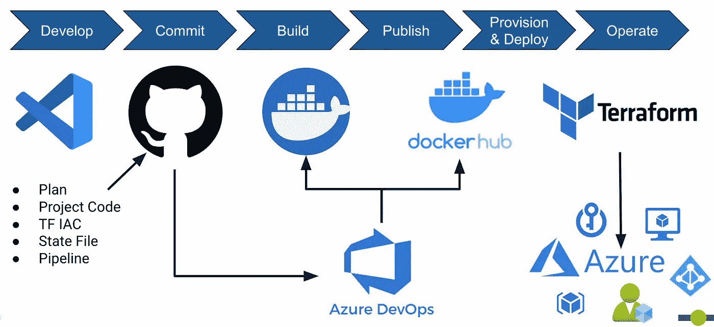

source — Author

简单地说，项目

1.  首要的事情是创建一个存储帐户来存储 tfstate 文件，因为我们正在自动化这个过程，所以我们不能在本地保存它。相反，我创建了一个 Azure 存储帐户并保存在那里。

```
terraform { backend "azurerm" { resource_group_name = "tf_rg_storage" storage_account_name = "tffilestorage" container_name = "tfstate" key = "terraform.tfstate" }}
```

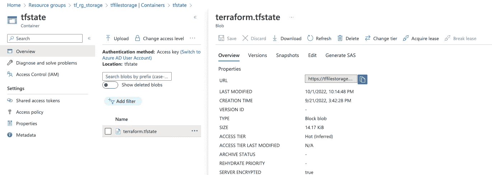

source — Author

2.广告应用程序—客户端密码创建

在这里，我们需要创建一个广告应用程序，然后创建一个客户端密码作为服务主体。正如我之前解释的，我们需要这个应用程序作为我们的特权用户，它将根据给定的权限和角色与 Azure 端进行所有的身份验证。

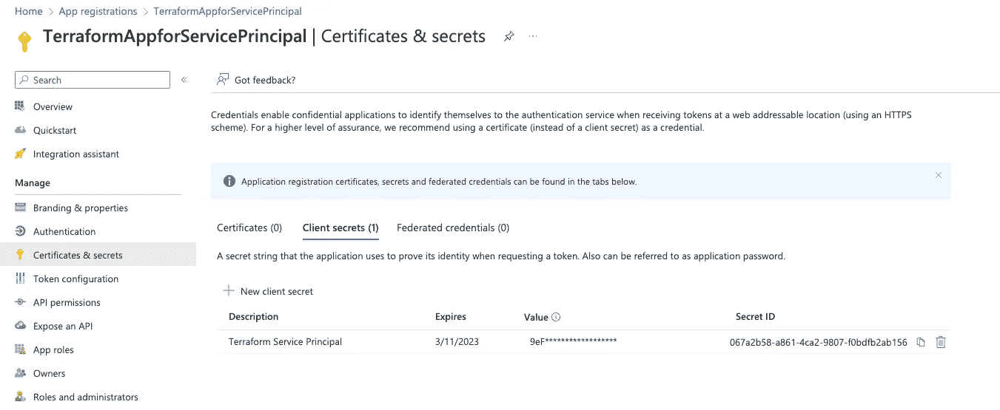

source — Author

3.服务主体的环境变量

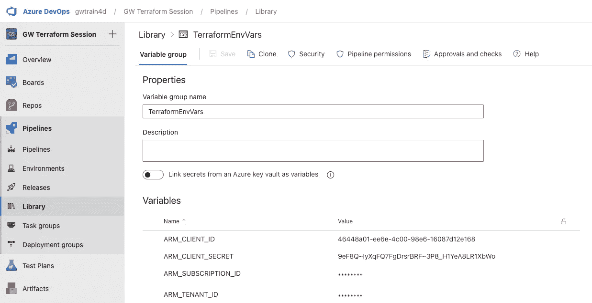

source — Author

执行管道需要创建的 AD 应用程序和 Azure 订阅帐户详细信息。因此，我们需要将它们添加到管道变量组中，这样就可以为管道获取这些值。

4.对于这个演示项目，我使用了由 dotnet SDK weather API 项目提供的一个示例项目。然后我用这个项目制作了一个 docker 图像。为此，添加了一个 docker 文件来创建管道中的映像。

5.现在让我们回到地形部分。在 main.tf 文件中，我将创建几个资源。

*   资源组对创建的资源进行分组
*   使用构建的 docker 映像运行 VM 的容器
*   保护机密的密钥库
*   随机密码资源，用于生成随机密码以保存密钥库中的秘密。

正如您在代码中看到的，我为每个资源创建了单独的模块，因为这样更容易管理代码库的可读性和效率。

正如我前面解释的，我使用 variables.tf 文件来声明变量。变量的定义在 terraform.tfvars 文件中。

现在让我们运行管道。所以基本上，对于一个新手来说，去 azure DevOps 并在那里创建管道 YAML 文件并将其推送到 GitHub 会更容易。这样更容易，而不是从头开始写。

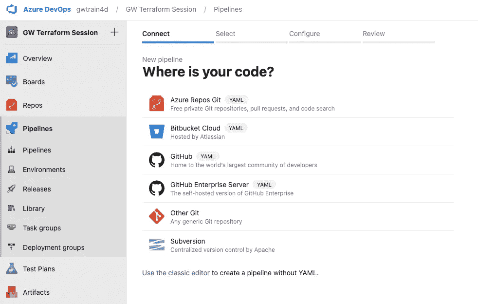

source — Author

转到管道部分并选择新建管道，然后配置您的代码库并创建管道 YAML 文件。

正如您在 pipeline 文件中看到的，我已经创建了第一个作业来构建包含最新更改的 docker 映像，并将其作为我的 docker 存储库推送到 docker hub。这是项目的 CI(持续集成)部分。

然后在管道的第二阶段，我将运行 terraform 来提供部署项目的基础设施。所以在 Azure 端创建了所有必要的资源之后。我们将从 docker hub 获取构建的 docker 映像，并将其推送到容器实例。这是项目的 CD(连续交付)部分。

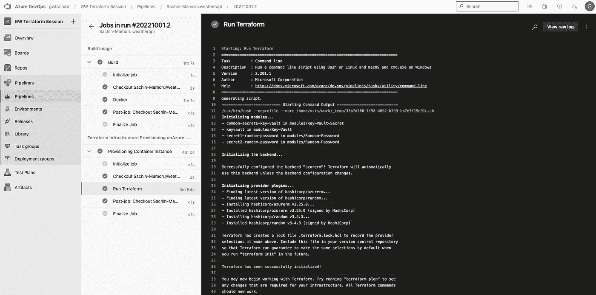

source — Author

具体来说，在这里你可以看到 terraform 计划，其中计划了创建我们在 tf 文件中需要的资源所需的所有步骤。

现在，一旦你进入 azure 门户，你会看到它已经创建了你所有的资源。

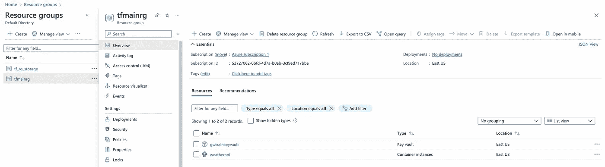

source — Author

现在让我们检查一下我们部署的天气 API 实例是否在工作。

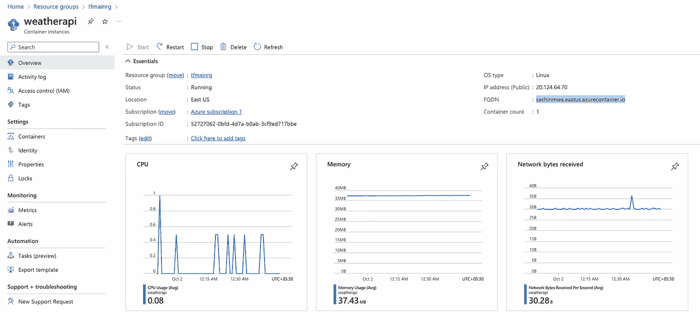

source — Author

在这里，您可以看到使用我们给定的 DNS 名称标签生成了一个 URL。

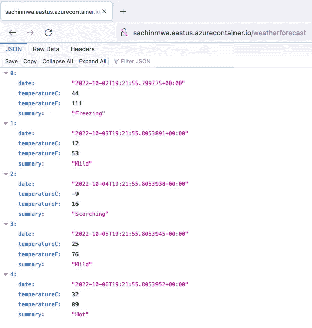

source — Author

如您所见，我们的项目通过使用 terraform 自动配置基础设施而成功部署。

让我们在下一篇博客中讨论使用 Terraform 部件的**问题。**

谢谢，继续读☺️.