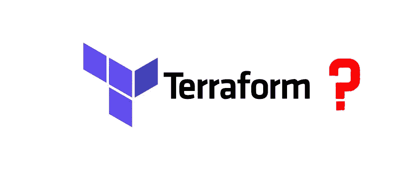
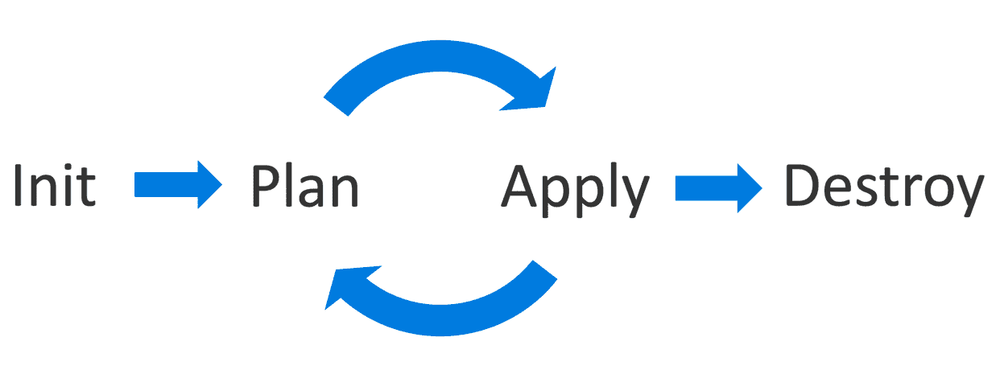
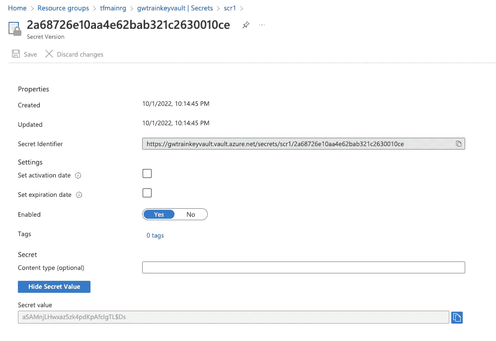
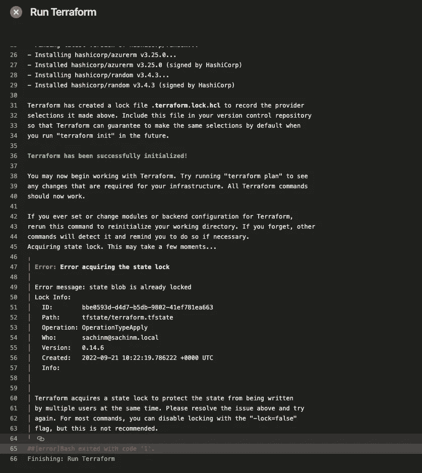
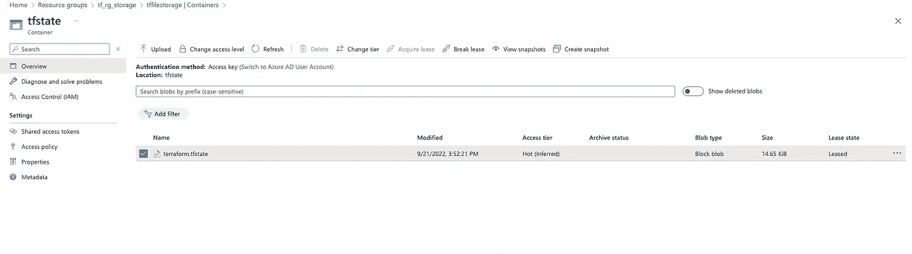
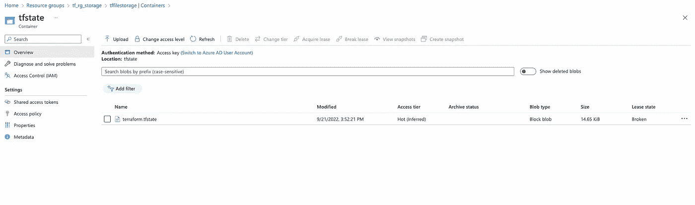

# 使用 Terraform 自动化 Azure 基础设施供应—第三部分

> 原文：<https://medium.com/geekculture/automate-azure-infrastructure-provisioning-with-terraform-part-iii-597552137dc?source=collection_archive---------8----------------------->



source — Author

如果你错过了我之前的博客，在那里我讨论了使用 Terraform 和 Azure DevOps 部署基础设施，请参考我的个人资料。在那里，我解释了一个演示项目和所有需要的代码库。

在进入地形问题之前，让我们先讨论一下地形摧毁命令及其问题。

# 使用地形摧毁基础设施



source — [https://riddhi-shree.medium.com/terraform-destroy-its-easy-67df22fe3028](https://riddhi-shree.medium.com/terraform-destroy-its-easy-67df22fe3028)

通过这样做，Terraform Plan 将在销毁模式下运行，并显示建议的销毁修改，而不实际进行这些修改。
Terraform 会正确分析依赖模块，然后按照相反的模式删除。

但是当使用 Terraform 破坏 Azure 资源时，会出现一些问题。

*   防止资源删除— [管理资源生命周期](https://learn.hashicorp.com/tutorials/terraform/resource-lifecycle?in=terraform/state#prevent-resource-deletion)

此生命周期选项可防止 Terraform 意外删除关键资源。

```
lifecycle {
prevent_destroy = true
}
```

如果需要删除资源，此属性应为 false。

*   删除锁

我们可以在资源中添加几个删除锁来防止删除。例如，ACR (Azure 容器注册中心)锁定存储帐户锁定等。

我们必须在删除前移除这些锁。

*   从属模块

当我们在 Azure 中创建资源时，会有依赖模块。对于一个实例，在创建密钥库之前，我们需要创建密钥库访问策略。那么如果因为上面提到的一些情况，导致依赖模块无法删除怎么办？那么依赖于这些模块的所有模块都不能被删除。所以它会让地形摧毁阶段失败。

# 使用 Terraform 的问题

*   有些资源不支持地形改造

例如:管道代理池创建—[https://github . com/Azure/terraform-Azure RM-ACI-devo PS-Agent/issues/4](https://github.com/Azure/terraform-azurerm-aci-devops-agent/issues/4)

*   状态错误

关于已经提供的资源的数据保存在 Terraform 状态文件中。资源被映射到您的配置，并且所有相关的元数据都被跟踪。如果您的状态不同步，Terraform 可能会更改或删除您当前的资源。

*   缺乏语言灵活性

不能在 tfvars 文件中进行字符串插值。通常我们使用 tfvars 文件来定义变量。因此，如果我们想在不同的环境中重用相同的配置，我们不能在 tfvars 文件中这样做，因为字符串插值不能在其上完成。

*   在状态文件中存储敏感值

这里，terraform 将以明文形式将密码值存储在 tfstate 文件中。这是一个主要的安全问题。我在我的一篇博客中讨论过这个问题。

[](https://sachinmamoru.medium.com/most-secured-approach-to-provision-azure-key-vault-and-manage-secrets-6fc8f83f547c) [## 提供 Azure 密钥库和管理机密的最安全的方法

### 在解释这些方法之前，我们需要理解密钥库和环境供应的用例。

sachinmamoru.medium.com](https://sachinmamoru.medium.com/most-secured-approach-to-provision-azure-key-vault-and-manage-secrets-6fc8f83f547c) 

为了记录，我将向您展示我在以前的博客中讨论过的项目的 tfstate 文件。

现在让我们检查创建的密钥库中的一个秘密值。



source — Author

如果您在上面的 tfstate 文件中搜索这个值，您会看到它已经以纯文本的形式存储了秘密值。

为了缓解这个问题，最好使用单独的 bash 文件存储秘密，而不是使用 Terraform。

# 要点

现在让我们来讨论我在项目中遇到的几个关键点。

## 状态文件锁定

有时，当我们在状态中间停止 terraform 应用程序时，文件会损坏，其状态会被锁定，在此情况下，我们无法应用到 terraform，直到我们释放锁定。



source — Author

为此，我们必须访问 Azure 门户，并需要获得状态文件存储帐户来解除租约。



source — Author

一旦你点击**解除租赁**，它将解除锁定。



source — Author

现在，您将看到租赁状态为“已中断”。现在，您可以再次应用地形。

## mac m1 pro 机器中的 Docker 映像构建

基于 ARM 的 MacBook Pro 中的苹果 M1 Pro 处理器可能会导致这个问题。因此，Docker build 命令默认以 arm64 为目标。
实际上，Docker 认为苹果 M1 Pro 平台是 linux/arm64/v8。
在版本标签和构建命令中提供平台就足够了:

```
docker build --platform=linux/arm64 -t <image-name>:<version>-arm64
```

## Azure Pipelines 对私人项目拨款的变化

Azure 方面发生了一个政策变化，微软已经暂时禁止为公共项目和新组织中的某些私人项目免费提供并行工作。

[](https://devblogs.microsoft.com/devops/change-in-azure-pipelines-grant-for-private-projects/) [## Azure Pipelines 对私人项目拨款的变化

### Azure Pipelines 从一开始就向客户提供免费的 CI/CD。这允许人们尝试 Azure…

devblogs.microsoft.com](https://devblogs.microsoft.com/devops/change-in-azure-pipelines-grant-for-private-projects/) 

但是您可以通过以下表格申请免费层。

 [## Microsoft 表单

### 编辑描述

又名 ms](https://aka.ms/azpipelines-parallelism-request) 

这就是关于**用 Terraform** 自动化 Azure 基础设施供应的博客系列。

谢谢，继续读☺️.