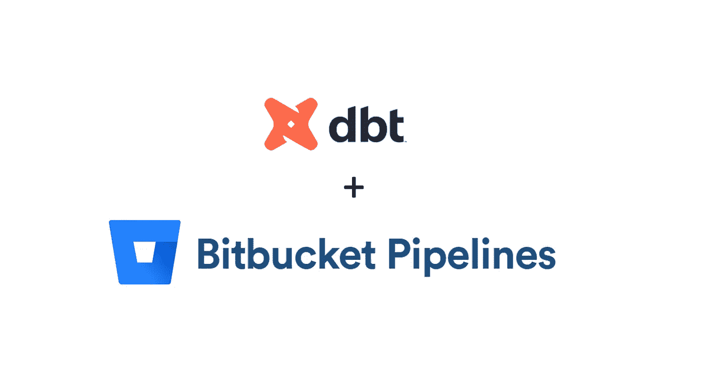

# 使用位桶管道自动运行 DBT

> 原文：<https://medium.com/geekculture/automate-dbt-runs-with-bitbucket-pipelines-3e7528ff991f?source=collection_archive---------5----------------------->

Logo Images from [here](https://www.scalefree.com/understanding-automation/attachment/dbt-logo/) and [here](https://docs.spectralops.io/integration/bitbucket/).

由于手动运行 dbt 命令可能会变得有点无聊，所以我最近决定使用 bitbucket 管道来自动化一些 dbt 命令。无论您想测试连接、生成文档还是运行 dbt，Bitbucket 管道都可以实现。

每次连接或代码出现问题时，您的 bitbucket 管道都会失败，您会在放置东西之前知道…