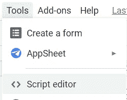
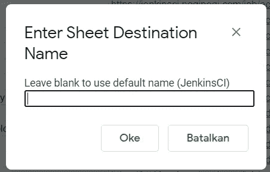
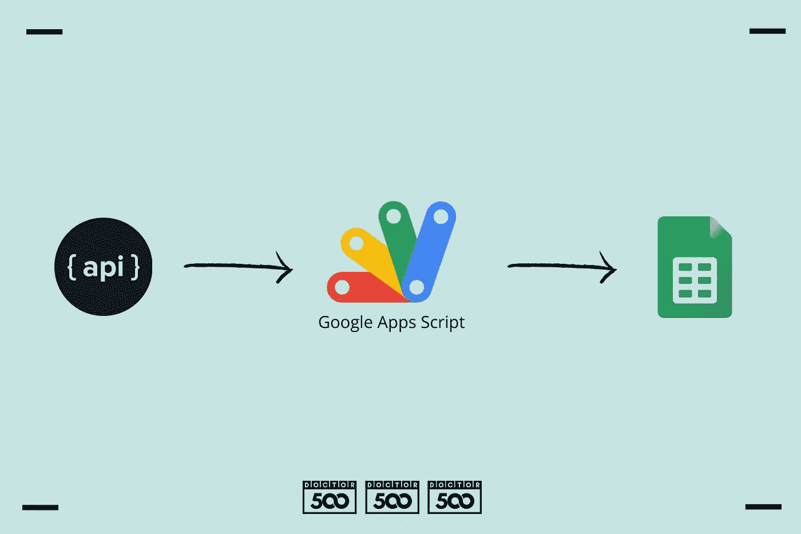
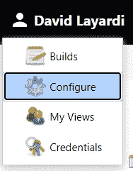
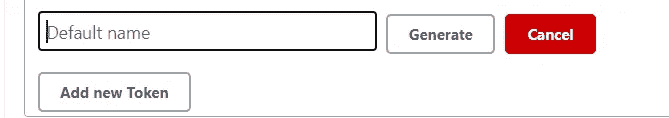
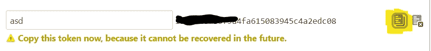
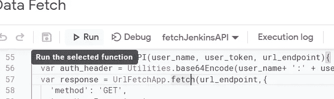
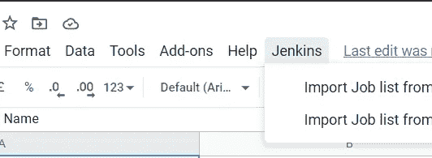
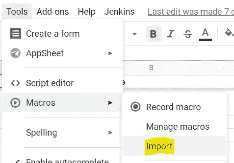
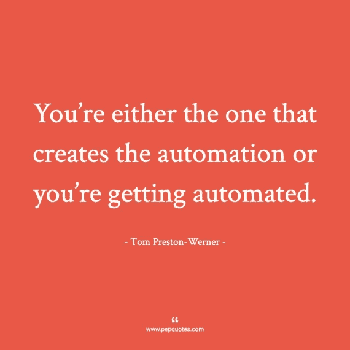

# 使用 Google Apps 脚本自动从 Jenkins API 工作列表导出到 Google 工作表

> 原文：<https://medium.com/geekculture/automate-export-from-jenkins-api-job-list-to-google-sheets-using-google-apps-script-2eef44008bdc?source=collection_archive---------9----------------------->

有一天，你被要求创建一个数据列表，这些数据来自一个 API，来自一个*公共平台*的外观，更容易让管理层理解，比如 Google Sheets。我经历的一个真实案例是将 Jenkins 的工作列表导出到 Google Sheets，用于管理视图审计目的。感谢 Google 提供了与我们可以使用的各种附加功能的简单集成。我们这次要讨论的一个问题是 Google Apps 脚本。

# 使用 Google Apps 脚本轻松获取数据

accessing Google Apps Script in Google Sheets

要访问 Google Sheets 中的 Google Apps 脚本，只需进入上层菜单部分，点击**工具**，然后点击**脚本编辑器**。如果您熟悉 Javascript 语法，这个工具很容易适应，并且具有非常好的特性，可以在各种 Google 产品的使用中提供一些额外的特性。这里有一些引自[谷歌开发者页面](https://developers.google.com/apps-script/overview)的功能

*   将[自定义菜单](https://developers.google.com/apps-script/guides/menus)、[对话框和侧栏](https://developers.google.com/apps-script/guides/dialogs)添加到 Google 文档、工作表和表单中。
*   为 Google Sheets 编写[自定义函数](https://developers.google.com/apps-script/execution_custom_functions)和[宏](https://developers.google.com/apps-script/guides/sheets/macros)。
*   发布[网络应用](https://developers.google.com/apps-script/execution_web_apps)——无论是独立的还是嵌入谷歌网站的。
*   与其他[谷歌服务](https://developers.google.com/apps-script/guides/services)互动，包括 AdSense、分析、日历、驱动、Gmail 和地图。
*   构建[附加组件](https://developers.google.com/workspace/add-ons/overview)来扩展 Google 文档、工作表、幻灯片和表单，并将它们发布到附加组件商店。
*   将一个 Android 应用程序转换成一个 Android 插件，这样它就可以在移动设备上与用户的 Google Doc 或 Sheet 交换数据。
*   通过构建一个聊天机器人来简化谷歌聊天的工作流程。

我觉得很棒的一个优点是，我们不需要为简单的用户输入创建一个界面。例如，如果你只是想让用户输入工作表名称，你可以在编辑`.gs`脚本时很容易地添加下面一行:

这是结果:

Custom input box dialog in Google Sheets

# 使用 Google 企业应用套件脚本需要考虑的事项(案例研究)

如果你正在做的工作是重复性的，你可以考虑学习这个工具的一件事是你需要的数据检索的容易性。也许我们会经常使用 ***复制&粘贴*** 的方法来处理数据，如果我们能够减少手工完成的步骤，这可以防止以后的人为错误。为了更具描述性，让我们看看下面的例子

Workflow example when processing data using the manual data conversion method

使用 Google Apps 脚本，我们可以直接将 API 中的数据输入到我们的工作表中，而无需使用手动流程。上面用例的一个例子是，当你手动输入 API 数据时(例如使用[covertcsv.com](https://www.convertcsv.com/json-to-csv.htm))，你使用一些转换器工具从 API 复制回结果，并将其复制回 Google Sheets。如果你只做一次，这可能看起来很正常，但是如果你做十几次(因为来自数据源/任何环境的更新),它会驱使我们去做一个低效的任务。

Workflow processing data using Google Apps Script

通过减少外部工具的使用和自动执行，使我们能够降低可能发生的人为错误的风险，并缩短我们处理/再处理数据的时间。此外，创建脚本可以帮助我们预测我们使用的数据源/ API 源何时会有一些变化或额外的结构，因为我们可以简单地调整脚本中数据源的映射。手动过程可能使该调整步骤更长，并且更容易出现人为错误

# 我们开始吧！

本教程可以应用于另一种 API 用法，只需调整您想要在获取步骤中使用的数据结构。

## 从 Jenkins 获取数据

首先，我们从理解 Jenkins API 的数据结构开始，在这种情况下，该结构仅特定于 Job list 部分，用于检索关于已经在 Jenkins 中运行的作业的信息，以及它们的最后活动日期。

Jenkins API 结构有许多冗余的属性，我们可以利用这种结构来更容易地根据我们需要的上下文来检索数据。我试图找出 Jenkins API 上所有可用的属性，并把它们放在本文的末尾，你可以把它作为参考。

在这种情况下，我们将检索作业 ID(从`fullName`属性中获取)、`displayName`、`url`和上次作业运行时间戳(从`lastBuild`对象中的`timestamp`属性中获取)。

## 从 Google Apps 脚本获取 API 数据

Jenkins API 需要认证才能工作，如果您没有使用 Jenkins API，只需调整到您使用的 API 认证方法。

You can find it on the top right corner Jenkins UI

首先，您需要生成一个用户令牌。点击个人资料菜单列表部分的**配置**菜单。找到 **API 令牌**部分，点击**添加新令牌**按钮。

键入您的令牌名称以描述令牌的用法，然后单击**生成**。

复制显示的令牌，或者只需单击右侧的复制图标。下面是在 Google Apps 脚本中从 API 检索数据的代码片段

Basic script to fetch data from Jenkins API

`let auth_header = Utilities.base64Encode(user_name+ ‘:’ + user_token);`

在本节中，您可以看到 Jenkins 身份验证使用了用 base64 方案编码的用户名和用户令牌的组合。然后和请求头一起发送。Google Apps 脚本已经通过调用`Utilites`库提供了 base64 编码器。下一个，这部分是最重要的

`let response = UrlFetchApp.fetch(url_endpoint,{ ‘method’: ‘GET’, ‘muteHttpExceptions’ : true, ‘headers’ : {‘Authorization’ : ‘Basic ‘+ auth_header} });`

Google Apps 脚本有一个库`UrlFetchApp`，我们可以用它从 API 获取数据。这个请求的返回类型是`HTTPResponse`对象类型，所以我们需要把它解析成 JSON，以便更容易处理。此外，为了确定我们希望从 Jenkins 检索哪个属性，我们可以在端点 URL 中指定属性，如上面的代码片段所示。

## 在 Google Sheets 中运行应用程序脚本

有两种方法可以用来运行我们创建的脚本。第一种是直接在 Google Apps 脚本编辑器菜单上运行，在 Google Sheets 上运行。

Run button in Google Apps Script Editor

要在编辑器菜单中运行，只需按下键盘上的`Run`键或`CTRL + R`。请确保打开“表单”窗口，因为如果关闭该窗口，各种与表单相关的库将无法工作。

第二个是创建一个菜单来调用函数。这个方法是创建一个显示菜单，它出现在 Google 工作表导航中，通过创建这个菜单，我们可以更容易地访问脚本，而不需要打开菜单编辑器。下面是向 Google Sheets 导航添加菜单的函数片段。

但是需要注意的是，当用户**刷新**表单上的窗口时，已经创建的菜单将会消失，为此，我们需要重新运行脚本，以便菜单再次出现。我们不需要再次打开编辑器菜单来添加该菜单，因为 Google 提供了导入宏功能，所以我们可以在不打开编辑器的情况下执行该功能。只需访问谷歌表单中的以下菜单

How to run a script without using accessing editor UI

然后，您可以选择包含向工作表添加菜单的功能。然后功能名称会出现在`Import`按钮下面。单击函数名，脚本将会运行。好，现在让我们添加数据到我们的表

## 将数据从 API 添加到工作表

向 Google Sheets 添加数据的过程从获取工作表名称开始，然后我们将向数据添加一个标题，并执行一个循环来输入数据。结果会是这样的

在这个脚本中，我们创建了一个数组，用于保存和格式化数据源，并将数据插入到工作表中。

对于标题，我们可以使用`setFrozenRows`，这样当数据向下滚动时，标题不会移动。因为`A1`到`D1`是一个表头，那么用来输入数据的范围从`A2`开始。

# 结果

下面是完整脚本的结果示例

# 关闭

*   Google Apps 脚本帮助我们轻松地从 API 获取数据，如果有新数据添加，只需运行脚本即可再次填充数据。
*   如果我们手工操作，可重用的自动化操作可以防止人为错误。
*   我们还可以通过添加 UI 菜单来改善脚本使用体验，这样我们就不需要打开 Google Apps 脚本编辑器来运行脚本了
*   谷歌应用程序脚本为每个谷歌文档应用程序提供定制的用户界面，所以如果我们需要用户的简单输入，我们不需要建立用户界面。

You’re either the one that creates the automation or you’re getting automated (Tom Preston Werner). Images:[pepquotes.com](https://pepquotes.com)

# Jenkins Jobs API 结构参考