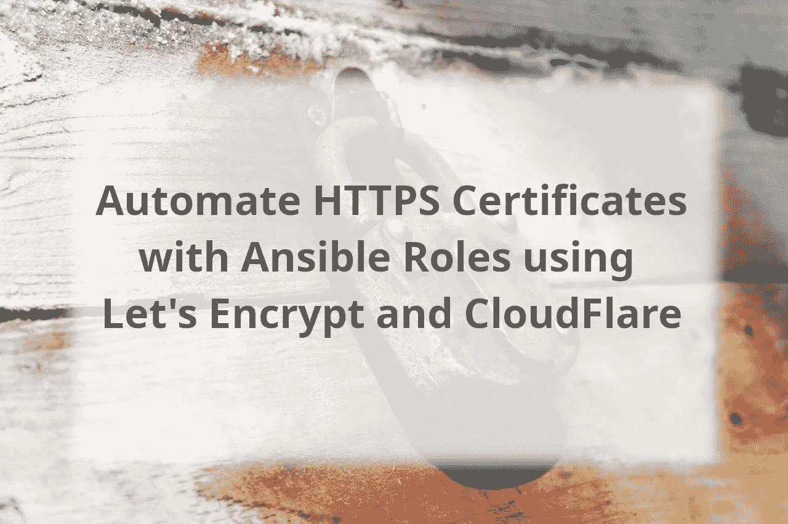
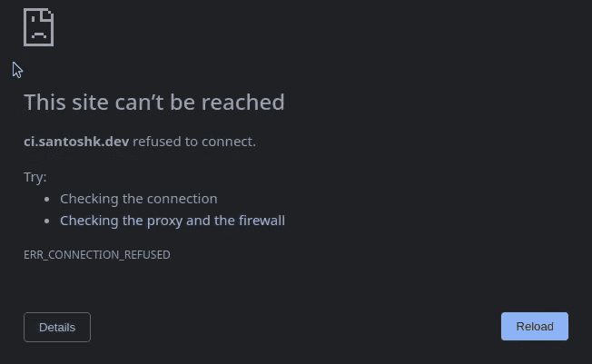
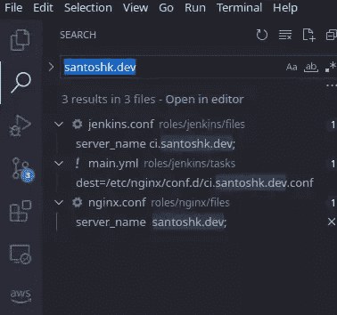
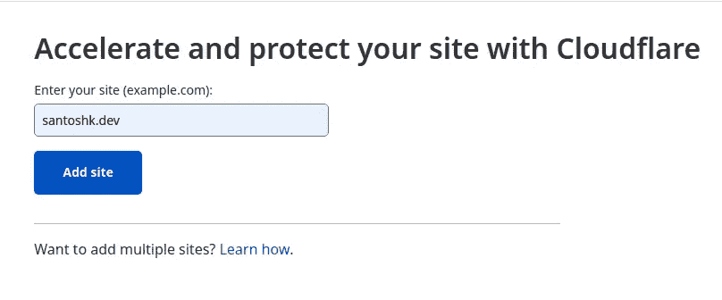
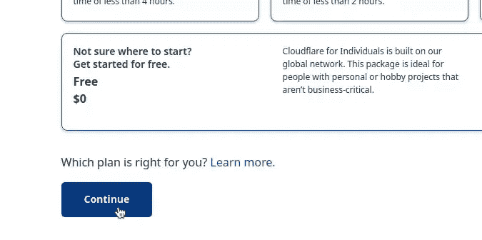
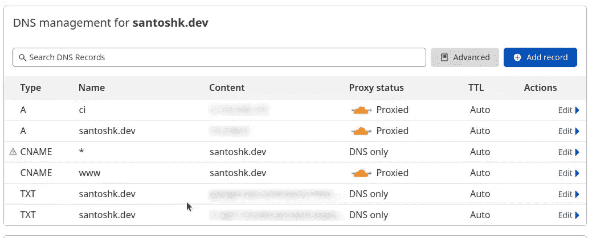
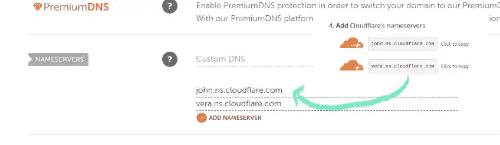
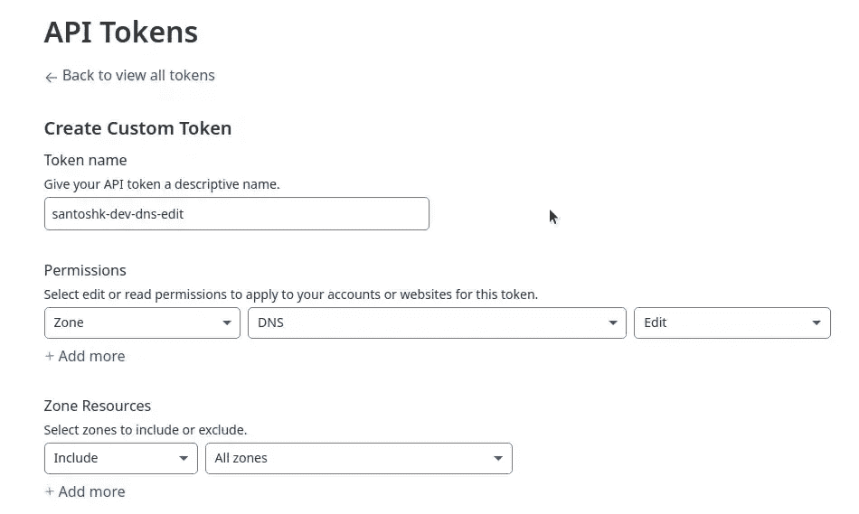
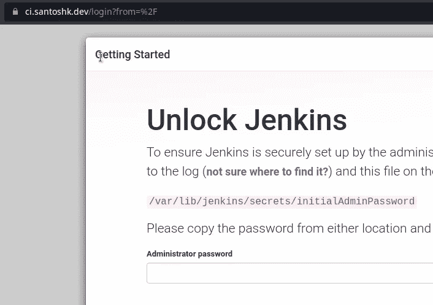

# 自动化 HTTPS 证书与可预见的角色。让我们加密& CloudFlare

> 原文：<https://medium.com/geekculture/automate-https-certificates-with-ansible-roles-ft-lets-encrypt-cloudflare-16a07d5211db?source=collection_archive---------18----------------------->



# 概述

我们已经看到了如果你有一个 VPS 并且你正在使用 Nginx，如何在域上[启用 HTTPS。在另一篇文章中，我们也谈到了](https://santoshk.dev/posts/2021/how-i-enabled-https-on-my-ec2-hosted-website/)[开始使用 Ansible](https://santoshk.dev/posts/2021/getting-started-with-ansible-as-a-fullstack-developer/) ，在这篇文章中，我写了 Ansible 中的一些基本概念，比如库存、模块、剧本。我们还讨论了有关目录结构的角色。

# 我们将涵盖的内容

在[的上一篇文章](https://santoshk.dev/posts/2021/wildcard-domain-certificate-using-aws-route53-and-lets-encrypt/)中，我们看到了我是如何在一个网站的所有子域名上启用 HTTPS 的。我是手动做的，不是用 Ansible。这篇文章是我将自动化这个过程的延续。

在上一篇帖子中，我也没有在公开回购中添加任何东西，因为我发现在网上公开存储我的安全相关数据令人毛骨悚然。因此，我们可以使用称为变量的东西，而不是将配置公开放在任务或模板上。vairables 的好处是我们可以把它放在一个单独的文件中，并从那里使用它。如果我们分开保存变量，我们也可以从命令行覆盖变量，并使用 ansi ble-vault 来加密它们。变量也用于替换模板文件中的占位符文本。

这是我的 Ansible 学习系列的第三篇文章，在这篇文章中，我将谈论:

*   如何在获取 HTTPS 证书的自动化过程中使用 Ansible？
*   另一方面，我将介绍模板和变量。我们还将看到如何从命令行覆盖变量。

# 从我们停下的地方继续

只是为了让每个人都在相同的轨道上(假设你自己也在这样做)。我现在就有这个装置。

1.  **1 VPC** 运行 *Ubuntu 20.04* 。我从 AWS 租赁的。你可以从任何你想租的地方租。确保你可以 ssh 到它，并有 sudo 访问安装的东西。
2.  **1 域**。HTTPS 证书通常颁发给域名，而不是 IP 地址。
3.  我的 Ansible 配置的 v0.1.0 版[。](https://github.com/santosh/ansible/tree/v0.1.0)

**一个旁注**。您不能将 Windows 作为控制节点。虽然可以用 Linux/Mac 来管理 Windows 机器。这意味着，如果你在 Windows 上，请使用 WSL 或切换到 Linux 或 Mac，以方便为准。

**另一面注**。这一次我没有我的 santosh.pictures 域，我在以前的帖子中使用过。相反，我将使用这个 santoshk.dev 域。关于这个领域的一些事情:

1.  映射到 netlify，它是我的 Hugo JAMStack 网站的主机。所以我们只有`*.santoshk.dev`可以修补。
2.  与本系列之前的一些帖子不同，这个域名不是停在 53 号公路上，而是在 namecheap.com。

你实际上不需要在 namecheap 上注册/转让你的域名。我试图使这篇文章注册不可知。

# 用我们的剧本安装 Jenkins 和 Nginx

如果你跟着我，你需要用我们的剧本[克隆我的可配置](https://github.com/santosh/ansible) >检验到`v.0.1.0` >安装 nginx 和 jenkins。

这是我用来在 EC2 机器上安装 Jenkins 和 Nginx 的命令:

```
ansible-playbook -i inventory -u ubuntu playbooks/jenkins.yml ansible-playbook -i inventory -u ubuntu playbooks/nginx.yml
```

如果你不熟悉上面的命令，你一定要看看我以前的帖子。

一旦您运行我们自己编写的 nginx 剧本，您应该会在剧本的控制台输出中收到一个 IP 地址。如果你去那个地址，你应该看到解锁詹金斯网页。

Jenkins 页面的真正需求是，我们必须在浏览器和 AWS 上的 Jenkins 服务器之间建立安全连接。为此，我们需要一个域名。

# 任务 1:为子域输入一个 DNS 条目

我将把 ci.santoshk.dev 映射到运行 nginx 剧本后得到的 IP 地址。这是一个手动过程，将取决于你的域名停在哪里。

基本上我所做的就是创建了一个 *A 记录*，host 是`ci`而`Value`是 nginx 主机的 IP。


*Adding A Record*

# 任务 2:为每个子域配置单独的 nginx

在我们的角色中查看 v0.1.0 的`nginx.conf`，特别是`server`块:

```
server {
        listen       80 default_server;
        listen       [::]:80 default_server;
        server_name  _;
        root         /usr/share/nginx/html;

        # Load configuration files for the default server block.
        include /etc/nginx/default.d/*.conf;

        location / {
            proxy_pass http://localhost:8080/;
        }

        error_page 404 /404.html;
            location = /40x.html {
        }

        error_page 500 502 503 504 /50x.html;
            location = /50x.html {
        }
    }
```

如果我们计划在根域上托管 Jenkins，那么这个配置就可以工作。但是现在我们是在子域的基础上做的，我们需要把它提取到另一个文件。

# 任务 2.1:分离核心 nginx 和 jenkins 配置

我们将从`nginx.conf`中删除第 43–45 行，然后将它放在一个名为`jenkins.conf`的单独文件中。以下是这个文件的内容。

```
server {
    server_name ci.santoshk.dev; location / { 
        proxy_pass [http://localhost:8080/;](http://localhost:8080/;)
    }
}
```

现在稍微解释一下。正如你所看到的，我们在这个文件中覆盖了`server_name`指令，告诉 nginx 下面的反向代理条目是针对 ci.santoshk.dev 子域的。这里，每个反向代理条目将被映射到 ci.santoshk.dev + path，例如`ci.santoshk.dev` + `/` = `ci.santoshk.dev/`。哪一个会去`localhost:8080`。

我希望我在这里是清楚的，如果不是，请留下评论，我会尽我所能解释这一点。

还请注意，上述`nginx.conf`将被存储在`/etc/nginx/nginx.conf`。而`jenkins.conf`注定是 nginx 主机上的`/etc/nginx/conf.d/ci.santoshk.dev.conf`。

有了詹金斯和 Nginx 的支持。和 nginx 重启与上述分离，让我们检查…

```
ubuntu@ip-10-2-1-10:/etc/nginx$ curl http://ci.santoshk.dev
<html><head><meta http-equiv='refresh' content='1;url=/login?from=%2F'/><script>window.location.replace('/login?from=%2F');</script></head><body style='background-color:white; color:white;'>

Authentication required
<!--
-->

</body></html>
```

是啊，看来我们要有所进展了。看起来这个页面正在将我们重定向到`/login?from=%2F`，这是 Jenkins 的登录页面。

但是，如果你试图在浏览器上访问站点`http://ci.santoshk.dev`，情况就不一样了。



*Connection Error*

这是因为你的浏览器将你从`http://ci.santoshk.dev`->-T12【注意 http 后面的`s`】重定向过来。在 2022 年，这是所有现代浏览器的默认行为。

我们很快就会回到这个问题上来，但让我们先做下一件事。

# 任务 2.2:让 nginx 配置成为 jenkins 角色的一部分

实际上，我并没有对我的回购协议做任何修改。实际上，我在上面创建的文件应该放在 jenkins 角色中。现在，我们将把它放在`roles/jenkins/files`子目录中。

```
$ tree roles/jenkins/
roles/jenkins/
├── files
│   └── jenkins.conf
└── tasks
    ├── debian.yml
    ├── main.yml
    └── redhat.yml

2 directories, 4 files
```

我们还将在安装 jenkins 时复制此配置。为此，我在`roles/jenkins/tasks/main.yml`中添加了一个新任务:

```
- include: redhat.yml
   when: ansible_os_family == "RedHat"

+- name: ensure /etc/nginx/conf.d/ directory exists
+  file: path=/etc/nginx/conf.d state=directory recurse=yes
+- name: copy jenkins nginx config
+  copy: src=jenkins.conf dest=/etc/nginx/conf.d/ci.santoshk.dev.conf
 - name: run systemctl daemon-reload
   ansible.builtin.systemd:
     daemon_reload: yes
```

如果你这样做了，并且在一个新的实例上运行这两个角色，你应该能够运行上面提到的`curl`命令，并期望得到相同的结果。

**采取行动**:如果你自己正在学习本教程，并且真的想记住知识，那么请验证 playbook 正在工作，并且你能够从 nginx 主机上获得相同的输出。

# 任务 3:使用变量和模板重构现有角色

即使在这个阶段，我们已经有太多的硬编码关键字，现在我们需要使用 Ansible 中的另一个概念。这将使我们的工作变得容易，因为我们可以对相同的变量使用不同的值。是的，你猜对了。我们将使用变量。

使用变量的[文档页面是你首先应该参考的。如果你觉得这很吓人，我会保护你的。](https://docs.ansible.com/ansible/latest/user_guide/playbooks_variables.html)

即使在[这一点上](https://github.com/santosh/ansible/tree/4276b7c624bc572195dce6de3b07b7be634873a1)我们也有很多地方可以改进。一个大的重构是移除根域的硬编码。

我实际上打算公开我的 ansible 配置，让全世界都可以访问它，在这种情况下,`santoshk.dev`没有多大意义。这个值应该是动态的，应该在玩书的时候从命令行传递



Hardcoded root domain

这样，别人就更容易使用我的角色。让我们采取主动:

# 任务 3.1:将文件转换为模板

如果你用`{{ fqdn }}`替换所有出现的域名，你会有 2 个。conf 文件，每一个都分别处于 nginx 和 jenkins 角色。角色的`files`子目录中的这些配置文件现在无效。这是因为文件不能有变量。`files`子目录中的每个文件都是专门为了从控制器移动到受控节点，没有任何动态性。

```
Changes not staged for commit:
        modified:   roles/jenkins/files/jenkins.conf
        modified:   roles/jenkins/tasks/main.yml
        modified:   roles/nginx/files/nginx.conf
```

我们必须将它们从`files`子转盘移到`templates`子转盘。此外，让它们有一个. j2 扩展名，表示一个 Jinja2 模板文件。

```
Changes to be committed:
        renamed:    roles/jenkins/files/jenkins.conf -> roles/jenkins/templates/jenkins.conf.j2
        renamed:    roles/nginx/files/nginx.conf -> roles/nginx/templates/nginx.conf.j2
```

您还需要将两个角色中的`copy`模块改为`template`模块。

```
-  copy: src=jenkins.conf dest=/etc/nginx/conf.d/ci.santoshk.dev.conf
+  template: src=jenkins.conf.j2 dest=/etc/nginx/conf.d/ci.{{ fqdn }}.conf
```

别忘了`.j2`。

```
-  copy: src=nginx.conf dest=/etc/nginx/nginx.conf mode=preserve
+  template: src=nginx.conf.j2 dest=/etc/nginx/nginx.conf mode=preserve
```

在我提交上述更改之前，我需要在文件的某个地方存储一个`fqdn`的默认值。

# 任务 3.2:将默认值设置为变量

接下来，您需要在我们的 ansible config repo 中的某个地方定义这个`fqdn`变量。这个变量的去向是一个很好的问题。文件上说[申报单可以放在 16 个地方](https://docs.ansible.com/ansible/latest/user_guide/playbooks_variables.html#understanding-variable-precedence)。

在这 16 种中，让我们从最常见的开始。

1.  **内部角色的** `default` **下级**。

这个子目录专用于静态变量。这意味着，如果你必须构建一个类似 _[https://archive.apache.org/dist/tomcat/tomcat-version/_,](https://archive.apache.org/dist/tomcat/tomcat-version/_,)的 URL，那么`https://archive.apache.org/dist/tomcat/tomcat-`部分将放入`default`，因为它们很可能不会改变。

2.**里面角色的** `vars` **分角色的**。

继续上面的例子，`version`零件将放入这个子零件中，因为它们将随着时间不断增加。

3.**内**外`host_vars`。

这用于覆盖`default`或`vars`中特定于任何机器的任何变量。

4.内部`group_vars`。

这将覆盖上面列出的所有内容。`group_vars`按照惯例用于覆盖特定的一组机器。这种分组因组织而异。

我们可以将该变量放入的最窄的合理范围是 jenkins 角色范围(var 和 default)。这本来是可行的，但如果我们这样做，我们就会有一个副本。这是因为 nginx 角色也列出了相同的域名。当我们编写 certbot 角色时，我们会有相同的副本。我们需要考虑更大范围的事情。

这一次，我将使用 group_vars 方法。但是在这篇文章的后面，我们将同时使用`default`和`vars`。

为此，让我们在根目录下创建一个文件夹`group_vars`，并在其中包含一个名为`all`的文件。

```
$ mkdir group_vars
$ touch group_vars/all
```

打开文件，写下以下内容:

```
---fqdn: santoshk.dev
```

所有这一切加在一起，这个工作没有错误。

```
PLAY RECAP ******************************************************************************************
10.2.1.10                  : ok=9    changed=3    unreachable=0    failed=0    skipped=1    rescued=0    ignored=0
```

我登录到那台机器，验证`fqdn`是否被替换为实际值。

如果您想从命令行覆盖`fqdn`的值，您可以将`-e "fqdn=example.com"`传递给 ansible 或 ansible-playbook 命令。下面的例子:

```
ansible-playbook -i inventory -u ubuntu playbooks/nginx.yml -e "fqdn=example.com"
```

更新到这里可以在[https://github.com/santosh/ansible/tree/v0.3.0](https://github.com/santosh/ansible/tree/v0.3.0)找到

# 任务 4:将名称廉价名称服务器指向 CloudFlare for certbot

这种情况对我来说是特定的，因为我使用 Namecheap 来保留我的域名，但我也想做一个基于 DNS 的验证来显示我们要加密的域名的所有权。Namecheap 对 Let's Encrypt 的支持是有争议的。虽然你应该为商业实体使用付费证书是正确的，但这不适用于我们这些正在学习 SSL 的人。[您可能想阅读这篇关于 Namecheap 上 certbot dns 认证支持的](https://community.letsencrypt.org/t/web-hosting-who-support-lets-encrypt/6920#nosupport)。

只要你使用[这些 DNS 提供商中的任何一个](https://eff-certbot.readthedocs.io/en/stable/using.html#dns-plugins)，你就是好的。因为 Namecheap 不在其中，所以我决定换一个上面提到的。如果您的域名没有在该列表中的任何注册商处注册，那么我建议您不花任何钱就改用 CloudFlare。

我决定将我的域名服务器指向 CloudFlare 的域名服务器，并从那里管理 DNS。我将快速浏览一下将这个 DNS 设置从 Namecheap 切换到 CloudFlare 的过程。

1.  注册并将站点添加到 CloudFlare

注册 [CloudFlare](https://www.cloudflare.com/) 完全免费。注册后，寻找一个写着“添加网站”的按钮。



Add a new site to CloudFlare

一旦你这样做，选择免费计划。这个计划对我们将要做的事情来说已经足够了。



Choose the free plan

一旦您选择了计划，CloudFlare 将扫描您现有的域中的 DNS 条目，并让您使用它们创建相同的条目，以无缝完成迁移过程。



Review DNS records to import

现在剩下的唯一一步是更改名称服务器条目。向你的注册商查询哪里可以改变你的域名服务器。



Change nameserver from Namecheap to CloudFlare

我已经通过域名服务器更新了这些内容:

现在，我有一个域名为 Namecheap 的域名，其域名服务器指向 CloudFlare。

# 任务 5:使用 Ansible 自动生成证书

子域条目创建后返回 Ansible。我们需要使用 certbot，就像我们在之前的帖子中所做的那样。在那篇文章中，我们使用了 route53 dns 插件。不过这次我们要用的是 [cloudflare 插件](https://certbot-dns-cloudflare.readthedocs.io/en/stable/)。

# 任务 5.1:获取 CloudFlare API 令牌

certbot 必须通过编程方式与 CloudFlare 对话，以验证域的所有权。因此，我们必须从他们那里获得 API 令牌来代表我们行事。

要做到这一点…

1.  转到 CloudFlare 配置文件的 [API 令牌](https://dash.cloudflare.com/profile/api-tokens)部分，点击“创建令牌”按钮。
2.  向下滚动并寻找一个选项，显示**创建自定义令牌**选择“开始”。
3.  创建自定义令牌以编辑 DNS 区域。确保包括所有区域。



API Token to edit DNS Zone

您可能想要复制如上图所示的设置。
4。继续**查看概要**，然后**创建令牌**。你会得到类似`tqFnsPtJyFAKet0KENpeIpu8lt4j_eu6JlJlYhEM`的东西。记下来。

如果您还有任何困惑，请查看 [certbot-dns-cloudflare](https://certbot-dns-cloudflare.readthedocs.io/en/stable/) 。

# 任务 5.2:创建证书机器人角色以获取证书

现在是时候开始实际的证书生成工作了。受[手动启用域上的 HTTPS](https://santoshk.dev/posts/2021/wildcard-domain-certificate-using-aws-route53-and-lets-encrypt/#step-3-get-certificate-for-your-domain--subdomains-from-lets-encrypt)的启发，我将编写一个等效的 ansible 角色。由于关注点的分离，我们没有将此流程包括在任何一个现有的角色中。首先，我们需要从 Jenkins 或 Nginx 角色中分离出来，这样我们就可以在缺少这些角色的情况下重用这个角色。我们总是可以结合使用它们。

这里与上一篇文章的主要区别是，我们这次使用的是 CloudFlare。IAM 和 Route53 不相关。

最好先概述一下我们希望这个角色实现的目标:

1.  安装证书机器人
2.  安装 certbot cloudflare dns 插件
3.  将`dns_cloudflare_api_token`存储在 cloudflare.ini 中并运行 certbot

写完这个角色后，我们还需要对现有角色进行一些更新。

因此，让我们快速浏览一下 certbot 角色中的文件。

## roles/certbot/tasks/main.yml

```
- include: debian.yml
  when: ansible_os_family == "Debian"- name: create /etc/letsencrypt
  file: path=/etc/letsencrypt state=directory recurse=yes
- name: copy cloudflare.ini
  template: src=cloudflare.ini.j2 dest=/etc/letsencrypt/cloudflare.ini
- name: run certbot
  command: certbot certonly --dns-cloudflare --dns-cloudflare-credentials /etc/letsencrypt/cloudflare.ini --email '{{ letsencrypt_email }}' --domain '*.{{ fqdn }}' --agree-tos --non-interactive
```

## roles/certbot/tasks/debian.yml

```
- name: update all packages on Debian
  apt: "upgrade=yes update_cache=yes cache_valid_time=86400"
- name: install pip3
  apt: name=python3-pip state=present
- name: install certbot and certbot-dns-cloudflare
  command: pip3 install certbot 'zope.interface>=5.3.0a1' certbot-dns-cloudflare
```

## roles/certbot/vars/main.yml

```
---
letsencrypt_email: [you@example.com](mailto:you@example.com)
```

## roles/cert bot/templates/cloud flare . ini . J2

这个 API 令牌与我们之前获得的令牌相同。

```
dns_cloudflare_api_token = {{ dns_cloudflare_api_token }}
```

## 剧本/nginx.yml

我已经决定在 nginx 角色之前运行这个角色，所以这个:

```
hosts:
     - web
   roles:
+    - certbot
     - nginx
```

有了上面的文件，我运行这个命令来执行:

```
ansible-playbook -i inventory -u ubuntu playbooks/nginx.yml -e "letsencrypt_email=<[myemail@domain.com](mailto:myemail@domain.com)>" -e "dns_cloudflare_api_token=LtWvEXAMPLEvs8mZnqMs_syNvHdIMA2w9EcHPEhL"
```

这里的新东西是`-e`语法。我们已经在上面的一个模板中定义了`dns_cloudflare_api_token`。

```
PLAY RECAP *****************************************************************************************************
10.2.1.10                  : ok=14   changed=2    unreachable=0    failed=0    skipped=1    rescued=0    ignored=0
```

我们的 certbot 角色将在`/etc/letsencrypt/live/{{ fqdn }}/`生成并保存证书。

**采取行动**:在`playbooks/nginx.yml`中禁用 nginx 角色，仅运行 certbot 角色。它应该运行没有任何错误。

# 任务 5.3:在 nginx 上配置 HTTPS

Certbot 角色将生成证书，但是我们还需要更新 nginx 和 jenkins 角色来使用证书。我想到了一些变化:

## roles/nginx/templates/nginx . conf . J2

```
@@ -17,6 +17,8 @@ http {

     access_log  /var/log/nginx/access.log  main;

+    server_tokens       off;
+    ssl_protocols       TLSv1.2 TLSv1.3;
     sendfile            on;
     tcp_nopush          on;
     tcp_nodelay         on;
@@ -40,6 +42,17 @@ http {
         # Load configuration files for the default server block.
         include /etc/nginx/default.d/*.conf;

+        listen       443 ssl;
+
+        ssl_certificate /etc/letsencrypt/live/{{ fqdn }}/fullchain.pem;
+        ssl_certificate_key /etc/letsencrypt/live/{{ fqdn }}/privkey.pem;
+
+
+        # redirect non-https traffic to https
+        if ($scheme != "https") {
+            return 301 [https://$host$request_uri](https://$host$request_uri);
+        }
+
         error_page 404 /404.html;
             location = /40x.html {
         }
```

使用`server_tokens off`，nginx 发送的响应头不会包含任何将该服务器标识为 nginx 服务器的内容。出于安全目的，攻击者无法知道服务器使用的是哪个版本的 nginx，也无法利用特定于该版本的漏洞。

通过`ssl_protocols TLSv1.2 TLSv1.3`，我们告诉 nginx 使用`TLSv1.2`和`TLSv1.3`。还有其他旧版本，我已经省略了。用最新的来说很好。

除了端口 80，我们还监听端口 443。为此，我们需要配置`ssl_certificate`和`ssl_certificate_key`。配置的其余部分不言自明。

## 角色/Jenkins/templates/Jenkins . conf . J2

```
@@ -1,5 +1,11 @@
 server {
     server_name ci.{{ fqdn }};
+
+    listen       443 ssl;
+
+    ssl_certificate /etc/letsencrypt/live/{{ fqdn }}/fullchain.pem;
+    ssl_certificate_key /etc/letsencrypt/live/{{ fqdn }}/privkey.pem;
+
     location / {
        proxy_pass [http://localhost:8080/](http://localhost:8080/);

+       proxy_set_header   Host              $host;
+       proxy_set_header   X-Real-IP         $remote_addr;
+       proxy_set_header   X-Forwarded-For   $proxy_add_x_forwarded_for;
+       proxy_set_header   X-Forwarded-Proto $scheme;
+
     }
```

我们需要詹金斯服务器块相同的`listen`和`ssl_certificate*`指令。

我运行了剧本，现在 ci.santoshk.dev 没有拒绝我的连接。



Correct HTTPS setup of subdomain

到这里的代码可以在[https://github.com/santosh/ansible/tree/v0.4.1](https://github.com/santosh/ansible/tree/v0.4.1)找到。

# 结论

在这篇文章中，我们学习了角色中的变量和模板。我们也看到了我们可以把变量放在什么不同的位置。我们还看到了如何将这些变量注入模板。然后还学习了如何从命令行覆盖它们。除此之外，我们还学习了如何从“让我们加密”中获取 HTTPS 证书。

不幸的是，这篇文章越来越长，最好能在这个系列的下一部分发表。在下一篇文章中，我将讨论为更新、安全强化和重构角色设置 cron。

如果这篇文章给你的生活增加了价值，请考虑与你的网络分享。如果你订阅了我的时事通讯，你会得到关于软件开发的提示和技巧、教程和操作方法。请订阅我的博客。

*原载于 2022 年 2 月 4 日*[*https://santoshk . dev*](https://santoshk.dev/posts/2022/automate-https-certificates-with-ansible-roles/)*。*