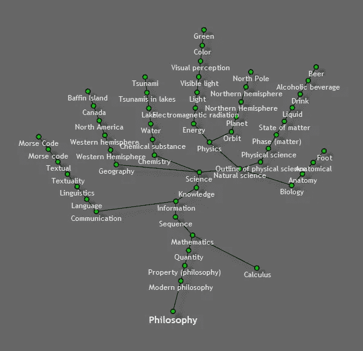
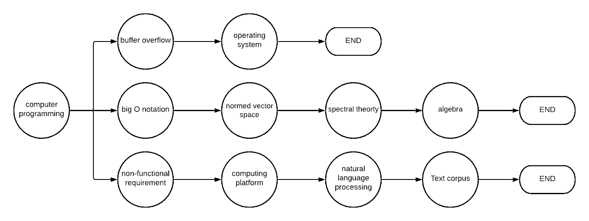
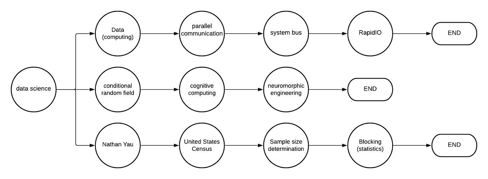

# 用 Python 实现维基链接游戏的自动化

> 原文：<https://medium.com/geekculture/automate-the-wiki-link-game-with-python-6f8f2aee3594?source=collection_archive---------41----------------------->

## …并添加有趣的随机扭曲！


Photo by [Luke Chesser](https://unsplash.com/@lukechesser?utm_source=medium&utm_medium=referral) on [Unsplash](https://unsplash.com?utm_source=medium&utm_medium=referral)

[维基链接游戏](https://en.wikipedia.org/wiki/Wikipedia:Wiki-Link_Game)是维基百科上的一种游戏，玩家从一个随机页面开始，通过连续点击页面上的第*个*链接进行游戏(其中 *N* 是玩家事先选择的随机数)。通过这样做，播放器将从一个页面重定向到另一个页面，直到一个页面没有链接可点击(称为短页面结束)或链接到以前访问过的页面(无限循环结束)。发生这种情况之前被访问的页面数量是最终得分。

听起来很无聊？根据维基百科，它[“旨在浪费时间和生命”](https://en.wikipedia.org/wiki/Wikipedia:Wiki-Link_Game)，所以我也不建议在周末和朋友玩它。然而，如果你还在读这篇文章，你可能是个程序员，而且程序员通常不会被邀请参加周末聚会。相反，我们编写 Python 脚本。(还是只有我这样？)

因此，本文将关注使用 Python 实现维基链接的自动化。更具体地说，这个程序将研究这个游戏具有的一个非常有趣的特征，即当 *N=1* (即总是点击每个页面的第一个链接)游戏大约 97%的时间在维基百科的“哲学”页面[结束](https://www.daniellamprecht.com/wp-content/uploads/2016/08/Evaluating-and-Improving-Navigability-of-Wikipedia-a-Comparative-Study-of-eight-Language-Editions.pdf)。



Figure 1: [All Roads Lead to “Philosophy” from Xefer](https://xefer.com/2011/05/wikipedia)

然而，这项研究没有表明的是，这一结果是否源于只使用维基百科结构中每个页面的第一个链接*或*。因此，本文旨在用一个随机的 *N* (即在每个页面上随机选择一个链接)来重做这项研究。通过这样做，我们可以丢弃我们使用的链接的元素，并立即获得维基百科整体结构的概述。*那么让我们开始吧！*

## 创建程序

创建这个程序的第一步是把维基百科的数据放到我们的环境中。这可以通过多种网络抓取工具来完成，但是对于这个程序，我们选择了 Python 的`wikipedia` API。有了这个 API，我们可以基于一个搜索词(用户通常放在搜索栏中)访问所有维基百科页面。

但是，一些搜索词可以引用多个页面。例如，搜索词“纽约”可以指“纽约(州)”的页面或“纽约市”的页面。这叫做`Disambiguation Error`。为了处理这个错误，我们的程序总是选择第一个(最有可能的)选项。

```
**try:**
    p = wikipedia.page(page)
**except** wikipedia.DisambiguationError **as** e:
    s = options[0]
    p = wikipedia.page(s)
```

接下来，在选择页面之后，我们需要提取可用的链接。这可以通过在页面名称中添加`links`属性来实现。然后我们从这些链接中选择一个随机的链接来继续这个维基链接游戏。

```
link = random.choice(p.links)
```

在选择一个链接后，我们检查它是否有效，并引导到一个页面，在那里我们可以继续我们的游戏。如果这是真的，游戏进行到下一页。如果没有，游戏结束，呈现最终得分。

```
**try:**
    p = wikipedia.page(link)
**except** wikipedia.exceptions.PageError:
    print('game over. Your score:', score)
    exit(0)wiki_link(link, score + 1)
```

这段代码的完整版本可以在下面的附录中找到，还有一个到 repl.it 的链接，在那里你可以自己尝试这个程序！

## 结果

最后，在创建程序之后，我们可以开始绘制它的结果。为了做到这一点，我们用相同的起始页面运行程序三次，并用图形表示它后面的页面。我们在本文中试验的两个不同的起点是**计算机** **编程**和**数据科学**(非常合适……)。



Figure 2: Pages visited with **computer programming** as a starting point

首先是以计算机编程为起点的网页。到目前为止，还没有可以观察到的模式。除了所有被访问的页面都是与编程相关的。



Figure 3: Pages visited with **data science** as a starting point

其次是以数据科学为起点的页面。就像前面的图一样，没有真正的模式可以观察。图 2 和图 3 唯一的共同点是它们都有相似的长度。

## 最后

为本文编写的程序通常是有效的，并且可能非常适合那些仍然对“[浪费时间和生命”](https://en.wikipedia.org/wiki/Wikipedia:Wiki-Link_Game)(维基链接游戏的意图)感兴趣的人。因此，在下面的附录中给出了该程序的工作副本的链接。

就研究而言。程序没有发现任何使用随机链接的相似模式。因此，看起来这种特性部分是只使用第一个链接而不仅仅是维基百科所固有的。然而，如果实验可以扩大到更大的规模，也许仍然可以发现不同的模式。

## 附录

[](https://replit.com/@timokats/wikilink#main.py) [## 维基 _ 链接

### timokats 的 Python repl

replit.com](https://replit.com/@timokats/wikilink#main.py)