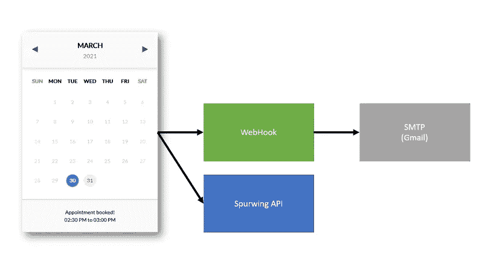
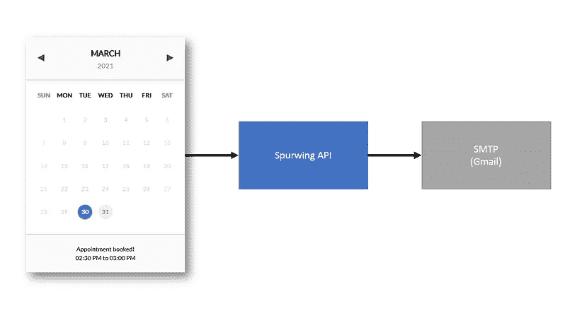

# 使用 NodeJS 自动化您的数字约会和预订

> 原文：<https://medium.com/geekculture/automate-your-digital-appointments-and-bookings-with-nodejs-6e914cd8a4e5?source=collection_archive---------12----------------------->

在本指南中，我们将了解 iCalendar 协议，以及它在日常生活中如何用于安排约会和预订。

# 介绍

电子邮件行业经历了很多历史问题。允许用户使用电子邮件安排和预订活动就是其中之一。早在 1998 年，iCalendar 协议被发明出来，为通过电子邮件安排约会和事件提供标准接口。简单来说，就是你的邮件客户端(Gmail、Outlook 等)收发的文件。).这个文件包含了事件的细节:状态，组织者细节，参加者细节，以及像 RSVP 这样有用的插件。

下面的例子展示了 iCalendar 的实际应用(在 Gmail 上)。基本上，它只是一封附有活动的标准电子邮件(invite.ics 文件)——这使得 Gmail 可以显示一个漂亮的用户界面，上面有活动的详细信息:日期、地点、与会者和 RSVP 按钮(是，也许，不是)。


# 综合

使用 iCalendar 协议相当简单，大多数编程语言都有许多维护良好的库。我们今天将使用 NodeJS。

完整的 GitHub 代码可以在我们的库找到。包含所有逻辑的文件是`index.js`，我们将在这里分析它。

# 体系结构

我们的简单应用程序充当一个 REST 服务，只有一个 GET 端点。我们将这个端点称为我们的 WebHook。这意味着外部应用/服务可以向我们的 WebHook URL 发出 GET 请求，这将创建一个 iCalendar 事件并通过电子邮件发送给所有与会者。

端点 URL 将类似于:`/appointment?name=Billy&email=billy@gmail.com`

我们的整个流程可以想象成这样:



流量分析:

1.  一个客户使用我们的前端部件来预约。
2.  Spurwing API 接收并处理客户端的请求。
3.  成功后，小部件的代码调用我们的 WebHook。
4.  webhook 创建一个 iCalendar 事件，并向参与者发送电子邮件。
5.  每位与会者都会收到带有 RSVP 选项的电子邮件。

上面的流程实际上是一个临时的变通方法，不安全。理想情况下，这个流程应该被简化。WebHook 应该由私有服务(而不是公共 REST 服务)来处理。在我们的例子中，它应该是 Spurwing API 级别的附加功能，目前正在建设中:



# 履行

这里我们简单分析一下 NodeJS 的代码结构。如前所述，完整代码请参考我们的 GitHub 资源库。

要配置这个 WebHook 服务，您需要创建一个文件`config.js`(或者重命名它)并输入以下凭证:

```
module.exports = {
  organizer: {
    name: '',      // organizer's name
    email: '',     // organizer's email
    smtp_pass: '', // email password (or app password)
  },
  attendee: {
    name: '',      // host's name
    email: '',     // host's email
  },
}
```

需要注意的是，在这种配置中，我们提供了一个组织者和一个参与者(也称为主持人)。组织者可以是一个`no-reply`公司电子邮件或一个仅用于发送自动电子邮件的电子邮件帐户。这不应该是你真正的电子邮件帐户。

出席者/主持人其实是你自己；安排与客户约会的人(从网站)。这可能看起来很奇怪，但组织者是一个不包括在约会中的电子邮件帐户。它只是一个用于发送电子邮件的账户(但不是实际会议的一部分)。但是，与会者/主持人包括在会议中。

我自己花了一些时间才弄明白这一点，原因是这样的:当我们使用 Gmail/Outlook 手动安排活动时，组织者也是与会者/主持人——您不会收到 RSVP 电子邮件，因为您的电子邮件服务已经将活动放在您的日历中。但是在这里，我们不直接访问我们的日历，而是利用 iCalendar 协议向我们自己和客户发送电子邮件。

如果组织者和与会者/主持人使用相同的电子邮件帐户，您将不会收到任何电子邮件，也无法将其添加到您的日历中。因为 iCalendar 协议假定您的电子邮件服务已经为您做到了这一点。

一旦配置了这些细节，您就可以按原样使用代码了。但是你也应该对`index.js`做一些修改，比如配置服务端口和邮件的标题、主题、正文/摘要。这些字段在行尾标有`// change`。

要启动这项 WebHook 服务，您可以使用`node index.js`或 PM2(包括`ecosystem.config.js`)。

# 调用 WebHook

要从前端 JavaScript 调用你的 WebHook，你可以使用 XHR/Ajax。我更喜欢这样使用 jQuery:

```
// SpurwingHookURL = "https://YourSite.com/SpurwingHook/appointment"
if (SpurwingHookURL) {
    $.getJSON(SpurwingHookURL, {
        name,
        email,
        start: fixDateOffset(selectedSlot),
        end: fixDateOffset(D.appointment.end),
    }, function(resp) {
        console.log(SpurwingHookURL, resp)
    })
}
```

这将创建一个带有四个 URL 参数的 GET 请求:客户端名称、电子邮件和事件的开始/结束时间(ISO 格式)。

# 结论

这实际上非常简单明了。唯一违背直觉的部分是，我们需要为组织者使用另一个电子邮件帐户，为与会者/主持人部分使用您的个人电子邮件。

[iCalendar 集成代码](https://github.com/Spurwingio/iCalendar-Integrations/)

[预约小工具代码](https://github.com/Spurwingio/Appointment-Scheduling-Widgets/tree/main/SimpleAppointmentScheduling)

欲了解更多日程安排、预订和日历资源，请访问斯普林[https://www.spurwing.io/](https://www.spurwing.io/)

尽情享受吧！