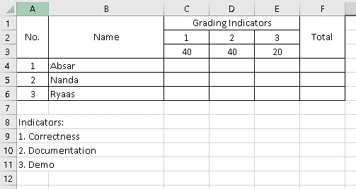
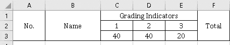
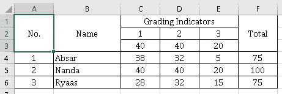
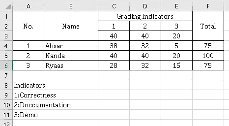
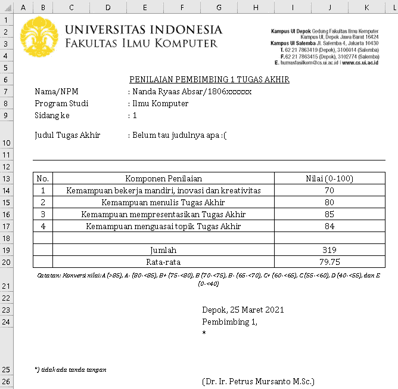

# 使用 Python 自动生成 Excel 文件

> 原文：<https://medium.com/geekculture/automate-your-excel-file-generation-with-python-42552dabd654?source=collection_archive---------13----------------------->

有了它，生活轻松多了！


为重复的文档创建一个模板可以节省你很多时间。但是，你能想象当你有模板和里面的数据可以自动完成吗？

> 让我们用 Python 自动生成 excel 文件吧！

例如，在本文中，我将创建一个类似于这样的示例分级系统表



Sample grading worksheet

**第一步——安装你需要的库**

我用[**xlsxwriter**](https://xlsxwriter.readthedocs.io/)**来帮我完成这个过程，安装完成后别忘了把它导入到 Python 代码中**

```
pip install xlsxwriter
```

****步骤 2 —创建工作簿****

**工作簿本身将包含一个或多个工作表(我们将工作的地方)。我们创建一个名为 **grading.xlsx.** 的文件，该过程将生成一个包含一个工作表的空工作簿**

```
import xlsxwriterworkbook = xlsxwriter.Workbook('grading.xlsx')
```

****步骤 3 —创建工作表****

**我们将创建一个工作表来处理上面的模板**

```
worksheet = workbook.add_worksheet('Assignment 1')
```

****步骤 4 —创建模板****

**定义行和列(零索引)**

```
row = 0
col = 0
```

**这意味着我们有一个指针**指向工作表的单元格 A1** ，这将帮助我们完成模板制作过程。**

**模板中的列名比其他列名宽。我们需要调整它，使列变得更大**

```
worksheet.set_column('B:B', 15)
```

**在工作表中写东西之前，我创建了一些函数来帮助我格式化将要写的文本**

```
def default_format(workbook):
    default = workbook.add_format({
        'font_name':REGULAR_FONT,
        'font_size':REGULAR_SIZE,
        'valign':'top',
    })
    return defaultdef text_box_wrap_format(workbook):
    text_box_wrap = workbook.add_format({
        'font_name':REGULAR_FONT,
        'font_size':REGULAR_SIZE,
        'align':'justify',
        'valign':'vcenter',
        'border':True,
        'text_wrap':True
    })
    return text_box_wrapdef text_box_center_wrap_format(workbook):
    text_box_center_wrap = workbook.add_format({
        'font_name':REGULAR_FONT,
        'font_size':REGULAR_SIZE,
        'align':'center',
        'valign':'vcenter',
        'border':True,
        'text_wrap':True
    })
    return text_box_center_wrap
```

**创建模板的标题。对于前两列，这很简单。我们需要 xlsxwriter.worksheet 中的 merge_range 函数。**

```
worksheet.merge_range(row, col, row+3, col, "No.", text_box_center_wrap_format(workbook))
worksheet.merge_range(row, col+1, row+3, col+1, "Name", text_box_center_wrap_format(workbook))
```

**对于分级指标一栏，就比较棘手了。我们需要一些 python 操作**

```
indicators = [
    ['Correctness', 40],
    ['Doccumentation', 40],
    ['Demo', 20]
]
tmp_col = col+2+len(indicators)-1
worksheet.merge_range(
    row, col+2, row, tmp_col, "Grading Indicators", 
    text_box_center_wrap_format(workbook)
)
for idx, indicator in enumerate(indicators):
    worksheet.write(row+1, col+2+idx, idx+1, text_box_center_wrap_format(workbook))
    worksheet.write(row+2, col+2+idx, indicator[1], text_box_center_wrap_format(workbook))
```

**对于最后一个专栏**

```
worksheet.merge_range(row, tmp_col+1, row+2, tmp_col+1, "Total", text_box_center_wrap_format(workbook))
```

****

**The current worksheet looks like**

**更新行，使其指向**单元格 A4****

```
row += 3
```

**现在，我们需要填写表格。我需要导入下面的东西来转换行，列到单元格符号**

```
from xlsxwriter.utility import xl_rowcol_to_cell
```

**我加了一本关于这个标记的字典**

```
students_grade = {
    "Nanda" : [40, 40, 20],
    "Ryaas" : [28, 32, 15],
    "Absar" : [38, 32, 5]
}
```

**在单元格中写下分数**

```
for idx, (name, grades) in enumerate(sorted(students_grade.items())):
    worksheet.write(row, col, idx+1, text_box_center_wrap_format(workbook))
    worksheet.write(row, col+1, name, text_box_center_wrap_format(workbook))
    st_cell_grade = xl_rowcol_to_cell(row, col+2)
    tmp_col = col+2
    for grade in grades:
        worksheet.write(row, tmp_col, grade, text_box_center_wrap_format(workbook))
        tmp_col += 1
    end_cell_grade = xl_rowcol_to_cell(row, tmp_col-1)
    worksheet.write(
        row, tmp_col, "=SUM({}:{})".format(st_cell_grade, end_cell_grade),
        text_box_center_wrap_format(workbook)
    )
    row += 1
```

**现在，它看起来像这样**

****

**yay! looks nice**

**为了最终确定它，我们需要编写指标解释**

```
row += 1
worksheet.write(row, col, "Indicators:", default_format(workbook))
row += 1
for idx, indicator in enumerate(indicators):
    placeholder = "{}:{}".format(idx+1, indicator[0])
    worksheet.write(row, col, placeholder, default_format(workbook))
    row += 1
```

**最后，我们需要关闭工作簿**

```
workbook.close()
```

****

**Final result**

> **我们完了！**

# **我如何在 PPL 中实现它？**

**在我的软件工程项目中，我要求完成为思思当生成 excel 文件的任务。**

****

**Sample template that I need to implement**

## **过程中的问题**

1.  **需求会随着时间而变化。但是它处理好了，因为我们在开发阶段使用了敏捷方法**
2.  **该任务包括在模板中插入讲师的签名。这很难，因为您需要调整签名图像的大小并更改其属性，以便它能够适合给定的单元格。我花了一整天才找到能解决这个问题的东西**

## **我从中学到的东西**

1.  **用 excel 创建模板，而不是硬编码模板中的所有内容。有必要为另一个模板创建一个可以多次使用的函数。它可以帮助您节省开发时间，并尝试更改或调试某些东西
    例如，我用它来创建格式(在上面的示例中给出)并在表单中签名**
2.  **分离文件让我在执行任务时更加专注。例如，我创建了 **berkas_helper.py** 来管理所有关于单元格格式的内容，创建了 **genereate_berkas.py** 来管理模板生成的主要逻辑**
3.  **这很有帮助，因为我们完成模板所需的数据放在数据库中。所以，自动化可以用这些代码来完成。它可能会减少填充模板的人工参与。**

# **结论**

**自动生成 excel 文件很有帮助，所以这个过程可以有效地完成。**

# **参考**

1.  **[https://xlsxwriter.readthedocs.io/](https://xlsxwriter.readthedocs.io/)**