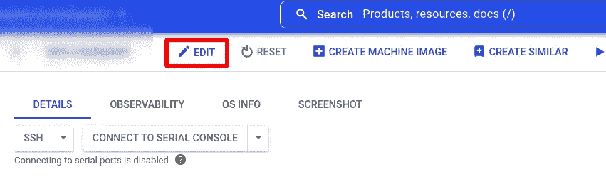
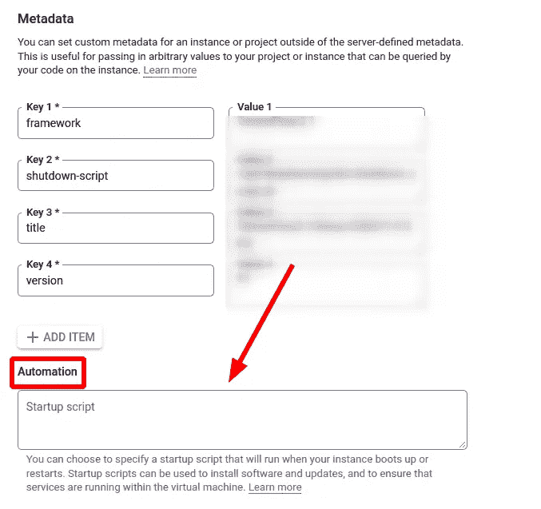
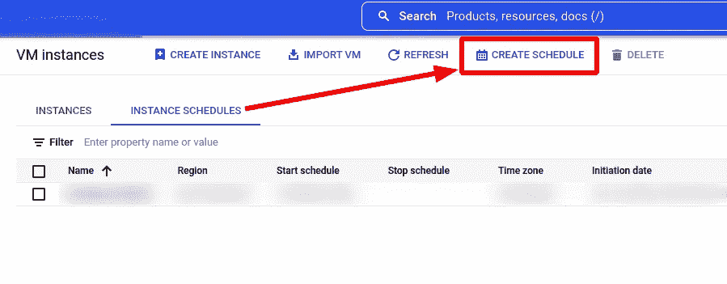
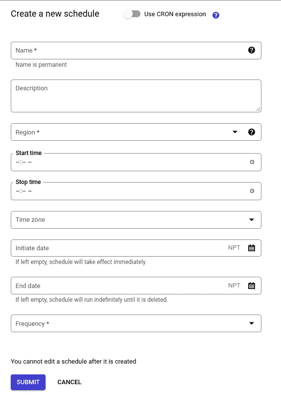
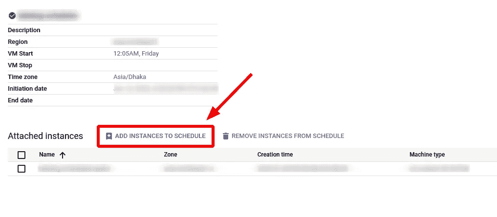

# 自动化您的 GCP 虚拟机实例程序

> 原文：<https://medium.com/geekculture/automate-your-gcp-vm-instance-program-fda3a5e66bfa?source=collection_archive---------3----------------------->

如果您有任何位于 Google Cloud 的 VM 实例中的脚本需要在每天/每周/每月的特定时间运行，并且这是一个非常长时间运行的过程(例如，用于机器学习模型训练的数据管道、数据爬虫等)。)，那么本文将指导您实现任务的自动化。


Photo by [Alex Knight](https://unsplash.com/@agk42?utm_source=medium&utm_medium=referral) on [Unsplash](https://unsplash.com?utm_source=medium&utm_medium=referral)

## 问题场景

您的脚本/程序可以使用任何语言，但是为了简单起见，让我们假设我们正在尝试自动化 Python 脚本。

比方说，你正在做谷歌计算引擎的虚拟机实例。你有一个 Python 脚本`main.py`，它执行一些特定的任务(例如，从多个站点收集数据，训练机器学习模型等。).您需要在每周五的 12:00 AM 执行相同的任务(运行脚本),然后您有几个选项来自动执行这个过程。

1.  对发布/订阅主题使用云函数。
2.  在 VM 实例中添加一个`startup-script`来自动运行程序。

如上所述，本文主要关注长期运行的流程；我将解释如何解决长时间运行的流程。如果你的工作时间少于 540 秒，你可以考虑第一个选项。否则，最好采用第二种方法。第一个选项不适用于长时间运行的流程，因为谷歌云功能最多可以运行 940 秒。

但是，什么是“启动脚本”？

> 启动脚本是在虚拟机(VM)实例的启动过程中执行任务的文件。启动脚本可以应用于项目中的所有虚拟机，也可以应用于单个 VM⁴.

## 配置虚拟机实例和环境

如果您尝试向 VM 实例添加一个`startup-script`，您的启动脚本将在`root`用户模式下运行。

当您使用 SSH 连接将 VM 实例远程连接到本地机器时，您将以不同于 root 模式的用户身份登录。您可以通过以下命令进入 root 用户模式:

```
$ sudo su -
```

该命令将带您进入根用户模式。您将不会在 root 模式下找到您的编码资源，您可能在通过 SSH 将 VM 实例连接到您的本地机器时使用它。所以，我建议维护一个 git repo 来维护你的代码，并在 root 用户中克隆 git repo。您还应该将程序依赖项安装到 root 用户中。例如，如果您的程序运行在 Anaconda 虚拟环境中，那么在 root 用户中安装 Anaconda。通过登录到根用户模式，确保您可以正确运行您的程序。假设您可以在虚拟环境中通过以下命令完美地运行您的程序:

```
$ python main.py
```

您的虚拟机中可能存在不同的 python 解释器。只要确定您正在使用哪个 python 解释器来运行您的程序，您就可以在终端中运行以下命令来查看您正在使用哪个解释器。如果您在虚拟环境中工作，那么激活它，并运行以下命令。

```
$ which python
```

这将为您的 python 解释器提供路径，如`usr/bin/python3`。

## 启动脚本

要在实例中附加一个`startup-script`，请转到*计算引擎>虚拟机实例*页面。然后单击您的目标虚拟机实例。现在，编辑实例。



Screenshot 1: VM instance page

点击编辑。之后，向下滚动页面，你会发现一个叫做“元数据”的部分。在那里，在自动化部分下，您可以添加您的`startup-script`。



Screenshot 2: Startup-script section

例如:假设我们的驱动代码存在于`/root/data_pipeline/src/main.py`文件中。所以，为了在 VM 启动时自动运行程序，我们可以编写下面的`startup-script`。

```
#! /bin/bash

/usr/bin/python3 /root/data_pipeline/src/main.py
```

我们希望运行程序保持运行，没有任何形式的中断，即使其他一些虚拟机和主 GCP 项目中的配置发生了变化。为了不间断地运行程序，我们应该启用`shielded-learn-integrity-policy`策略。为此，我们可以在调用`main.py`脚本之前添加以下命令。

```
#! /bin/bashgcloud compute instances update <instance-name> --zone <instance-zone-name> --shielded-learn-integrity-policy/usr/bin/python3 /root/data_pipeline/src/main.py
```

当`main.py`程序执行完成时，我们希望我们的 VM 实例自动停止。为此，我们可以在`startup-script`的末尾添加以下命令:

```
#! /bin/bashgcloud compute instances update <your-instance-name> --zone <instance-zone-name> --shielded-learn-integrity-policy/usr/bin/python3 /root/data_pipeline/src/main.pygcloud compute instances stop <your-instance-name> --zone <instance-zone-name>
```

您也可以根据需要在`startup-script`中添加其他命令。例如:

```
#! /bin/bashsudo service tor restartgcloud compute instances update <your-instance-name> --zone <instance-zone-name> --shielded-learn-integrity-policyulimit -n 100000/usr/bin/python3 /root/data_pipeline/src/main.pygcloud compute instances stop <your-instance-name> --zone <instance-zone-name>
```

上面的脚本让我们的程序在 VM 实例启动时自动执行，并在程序执行完成后停止 VM 实例。

现在，我们需要安排实例自动启动 VM 实例。

## 调度虚拟机实例

转到*导航菜单>计算引擎>虚拟机实例*页面。有一段叫`INSTANCE SCHEDULES`。


Screenshot 3: Instance Schedules page on GCP UI

去那个选项卡。现在，您会在顶栏中找到一个名为`CREATE SCHEDULE`的部分



Screenshot 4: Create Schedules page on GCP UI

如果您单击创建时间表，您将看到如下页面:



Screenshot 5: Scheduler form to submit

你想取什么名字都行。区域面积必须与虚拟机实例的区域相匹配。定义一个**开始时间**和**频率**(如每日/每周/每月等。).您不需要定义任何**停止时间，**，因为我们已经有了一个在`main.py`程序在`startup-script`中结束执行后自动停止实例的命令。

您还可以使用 CRON 表达式来定义实例的开始时间。最后，提交页面。这将创建一个调度程序页面。转到该页面，您会发现在其中添加实例的选项。



Screenshot 6: Adding your instance to schedulerScreenshot 1

只需将目标实例添加到其中，就大功告成了。

这将允许您的实例在预定页面上您定义的开始时间自动启动，从`startup-script`调用`main.py`文件，在程序完成执行后，VM 实例将自动关闭。

## 参考

[1].【https://cloud.google.com/functions/quotas】 [【2】。](https://cloud.google.com/functions/quotas)[https://cloud . Google . com/compute/docs/instances/startup-scripts/Linux](https://cloud.google.com/compute/docs/instances/startup-scripts/linux)
[3]。[https://cloud . Google . com/compute/shielded-VM/docs/integrity-monitoring # updating-baseline](https://cloud.google.com/compute/shielded-vm/docs/integrity-monitoring#updating-baseline)T10【4】。[https://cloud . Google . com/compute/docs/instances/startup-scripts/](https://cloud.google.com/compute/docs/instances/startup-scripts/)

**作者**

[](https://www.linkedin.com/in/sksoumik/) [## Sadman Kabir Soumik -人工智能工程师- Venturas Ltd | LinkedIn

### 三年行业经验，八年动手编程经验的 AI/ML 工程师。在过去…

www.linkedin.com](https://www.linkedin.com/in/sksoumik/)