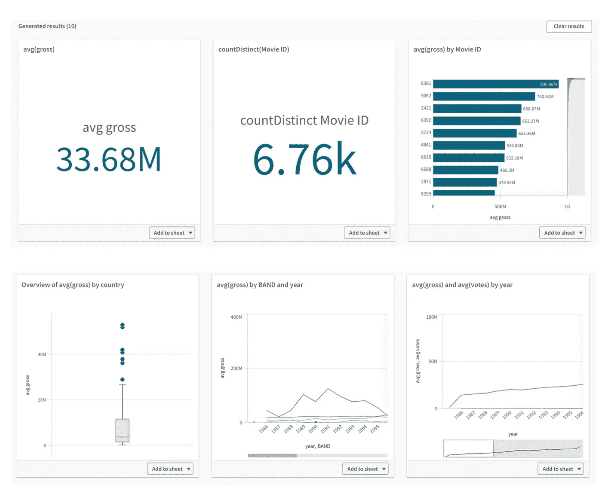
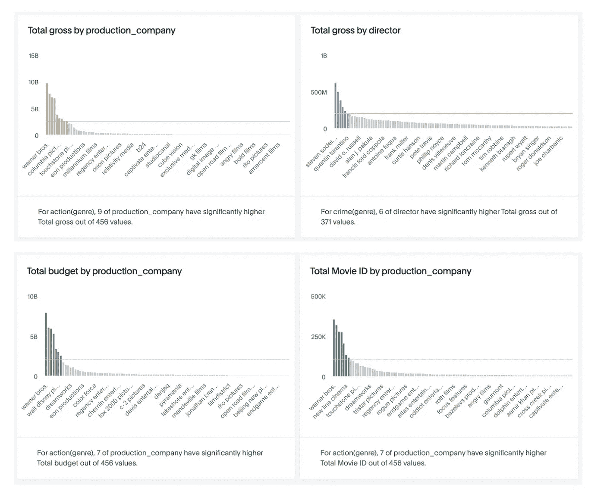
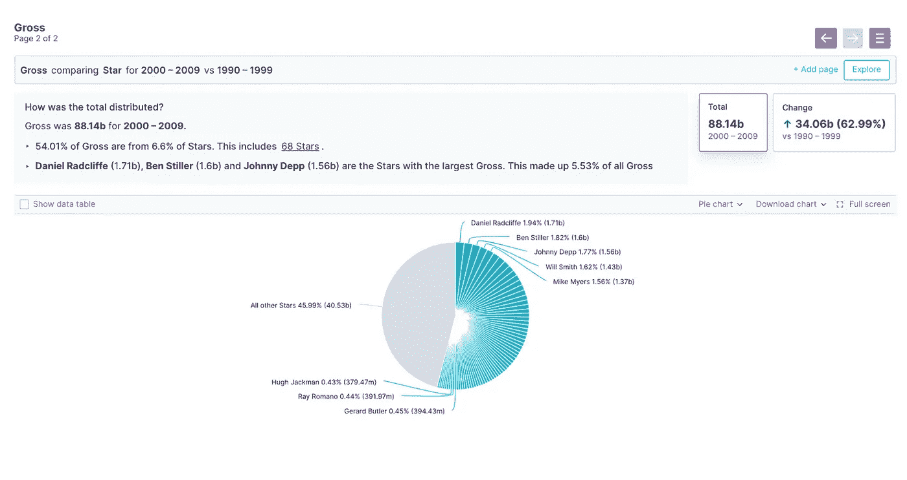
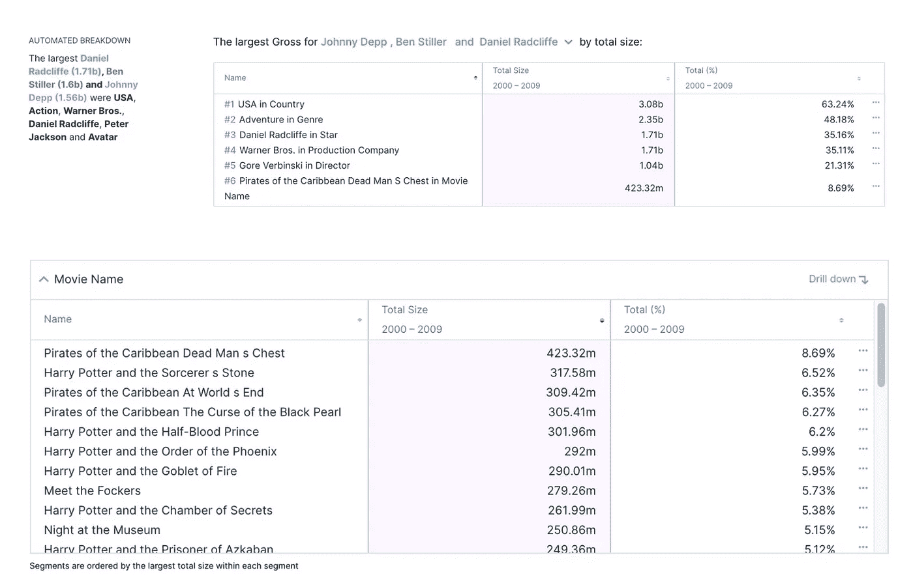
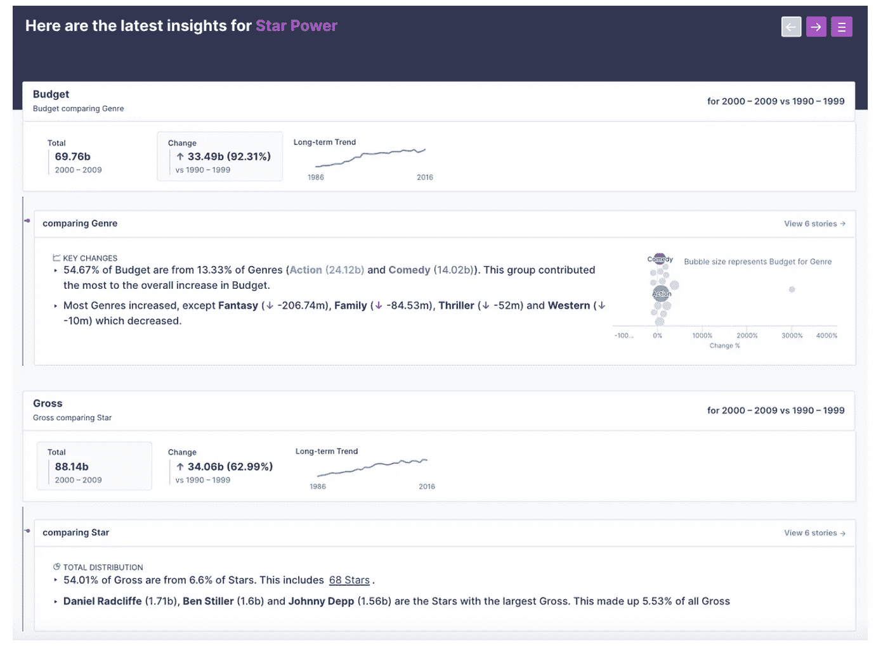
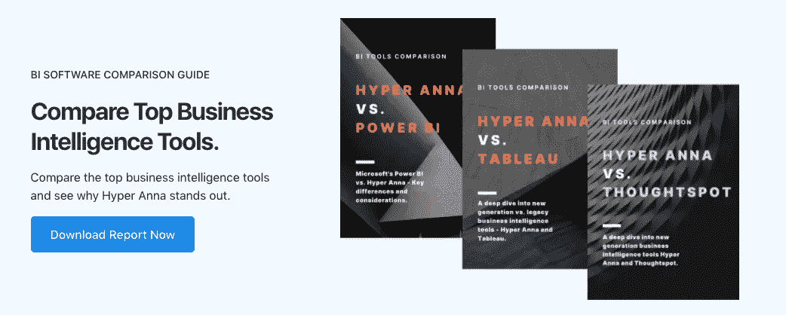

# 自动化分析烘焙:Hyper Anna vs Qlik vs ThoughtSpot

> 原文：<https://medium.com/geekculture/automated-analytics-bakeoff-hyper-anna-vs-qlik-vs-thoughtspot-d999b7a2bbed?source=collection_archive---------17----------------------->

*自动化洞察挑战。因为不是所有的洞见都是‘洞见’。*

Automated Analytics BakeOff: Hyper Anna vs Qlik vs ThoughtSpot

H 下一代商业智能(BI)工具——**Hyper Anna**和 **ThoughtSpot** 如何与传统玩家如 **Tableau** 、 **Qlik** 和 **Power BI** 相提并论？尤其是在服务成本、洞察速度和洞察质量(包括准确性)等关键指标上？

将人工智能嵌入商业智能工具的一个关键承诺是，它如何帮助**揭示隐藏的洞察力**，这是我们在使用传统方法构建手动报告和仪表板时经常错过的。

随着近年来 [**自动化分析**](https://hyperanna.medium.com/everything-you-need-to-know-about-automated-analytics-efec1d0db31b) 的兴起，许多 BI 工具声称它们有能力自动为业务(如财务、销售、营销团队)生成可操作的见解。**但是，有洞见，就有‘洞见’。**

## 那么什么是自动化洞察呢？

> **自动化洞察**被定义为软件可以在没有人类帮助的情况下自行生成的洞察。

2020 年， [Gartner](https://www.gartner.com/smarterwithgartner/gartner-top-10-trends-in-data-and-analytics-for-2020/) 强调了仪表板的衰落，指出自动化分析的采用:

> **趋势——仪表板的下降**
> 
> **自动化程度更高、消费化体验更强的动态数据故事**将取代直观的点击式创作和探索。因此，用户使用预定义仪表板的时间将会减少。向**上下文相关数据故事**的转变意味着，最相关的见解将根据每个用户的上下文、角色或用途流向他们。这些**动态洞察**利用了**增强分析、NLP、流式异常检测和协作**等技术。
> 
> 数据和分析领导者需要定期评估他们现有的分析和商业智能(BI)工具，以及提供新的增强和 NLP 驱动的用户体验而不是预定义仪表板的创新创业公司。

然而，自动生成的洞察在质量上存在巨大差距。也就是说，由一个 BI 工具生成的自动化洞察的质量与另一个不同。一些自动化的见解可能终究不是“见解”。

在这篇文章中，我们想给你真实的例子，展示由 [**Hyper Anna**](https://www.hyperanna.com/?utm_campaign=website &utm_source=medium&utm_medium=automated-analytics-bake-off&utm_content=ha-homepage) **、ThoughtSpot** 和 **Qlik** 生成的自动化洞察——使用真实世界的数据实现透明和公平。IMDB 数据集包括预算、票房总额和电影细节。

# **结果— Qlik**

这是 Qlik。

在这里，您可以看到生成的自动化洞察的质量只是一个简单的数据聚合。

This is Qlik. The insights are not comparable to the quality of a human analyst.

这种洞察力比不上人类分析师的素质。

# **结果—思考点**

这是思想点。

在这里，您可以看到生成的自动化洞察的质量也只是一个简单的数据聚合。

This is ThoughtSpot. The insights are not comparable to the quality of a human analyst.

这种洞察力比不上人类分析师的素质。

# **结果—超级安娜**

这是超级安娜。

在这里，您可以看到自动化见解的质量和数量远远超过 Qlik 和 ThoughtSpot 产生的基本聚合数据摘要。

相反，Hyper Anna 提供了一个丰富的数据故事，有上下文、证据、视觉效果和书面摘要——其输出可与人类数据分析师的输出相媲美。

首先，Hyper Anna 呼吁电影工作室大幅增加投资，与前 10 年相比增加了 92%。投资的增加是由动作片和喜剧片推动的。另一方面，奇幻、家庭和惊悚片的投资都有所下降。

This is Hyper Anna. Insights For Everyone.

全球 54%的票房仅由 68 位影星带动(6.6%)。尤其是丹尼尔·雷德克里夫、本·斯蒂勒和约翰尼·德普三人，他们贡献了全球总票房的 5.5%。

This is Hyper Anna. Automated Data Discovery.

这得益于《哈利波特与加勒比海盗》系列的上映。

This is Hyper Anna. Automated Data Discovery.

最后，Anna 在一页纸中总结了所有关键要点，比得上一个人类分析师的总结。

但是，Anna 并没有花费数小时或数天来总结调查结果，而是主动、自动地在几分钟内完成了所有分析。

Hyper Anna’s self service insights gives you confidence. Not strips you of it.

# 结论

在 Hyper Anna，我们相信数据会给你信心。不是剥夺你的权利。

随着 BI 技术的进步，Hyper Anna 等新一代工具正处于提供真正有洞察力的见解的最前沿，这些见解准确、快速，旨在展现**啊哈**时刻，因此团队可以专注于最重要的行动。

# 想了解更多信息吗？

最近一次更新于 2021 年 5 月，这份 40 页的报告是“Hyper Anna vs. Top BI Tools”指南。下载探索:

## **内容**

1.  **Hyper Anna 与 Tableau、Qlik、Power BI:** Hyper Anna、Tableau、Qlik 和 Power BI 对比，并排特性对比
2.  **数据可视化与洞察:**分析和讲故事与仪表盘非常不同
3.  超越仪表盘:自然语言处理(NLP)的兴起
4.  **新机器时代:**自动化数据发现、自助式商业智能、机器学习和分析

**底线**

CEO、CFO、CDO 和主要决策者的实际产品测试和功能比较。

[**在此下载免费指南→**](https://www.hyperanna.com/resources/bi-tools-comparison?utm_campaign=website &utm_source=medium&utm_medium=automated-analytics-bake-off&utm_content=ha-page-bi-tools-comparison)

**_ _ _ _ _ _ _ _ _ _ _ _ _ _ _ _ _ _ _ _ _ _ _ _ _**

**关于 HYPER ANNA —** 全球排名第一的自动化分析平台，被微软、IAG、新加坡电信和西太平洋银行等全球公司使用。[https://www.hyperanna.com/](https://www.hyperanna.com/?utm_campaign=website &utm_source=medium&utm_medium=automated-analytics-bake-off&utm_content=ha-homepage)