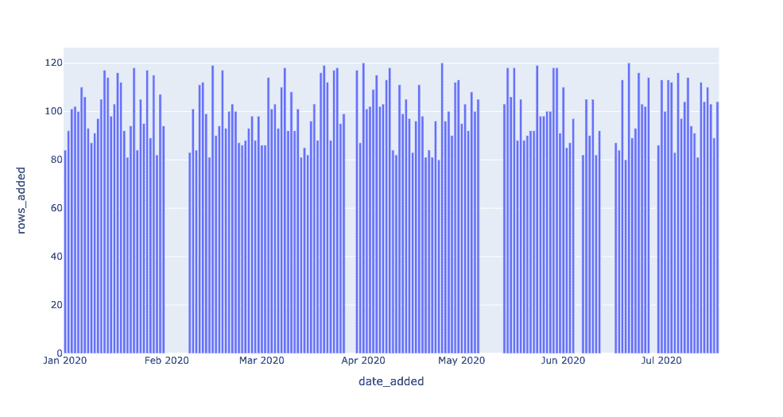
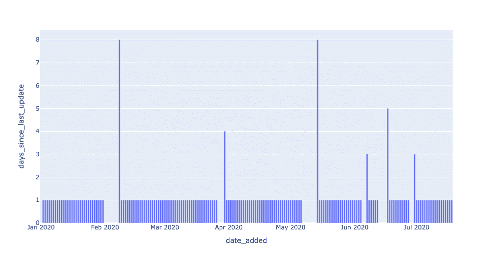
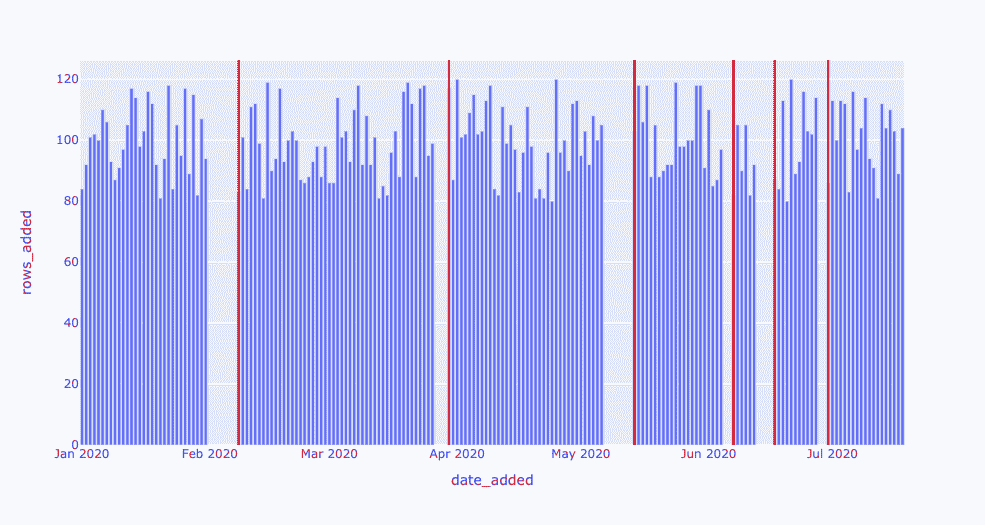
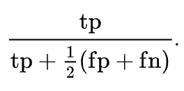
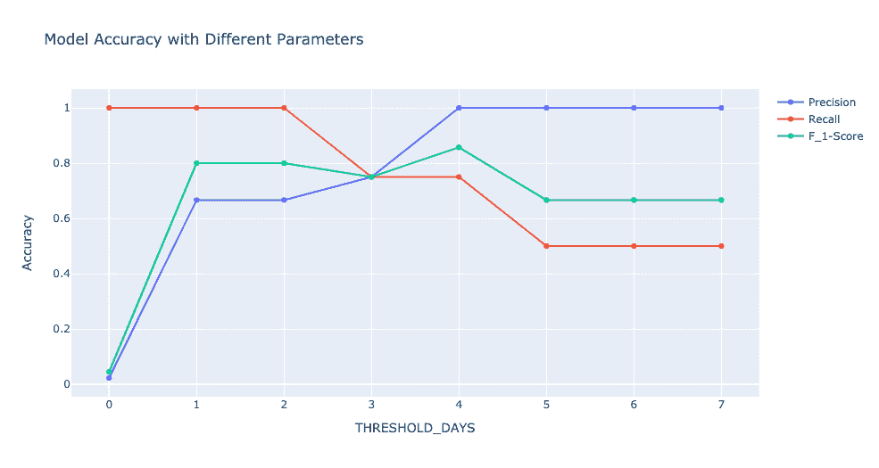

# 利用 SQL 和机器学习进行大规模自动化数据质量测试

> 原文：<https://medium.com/geekculture/automated-data-quality-testing-at-scale-with-sql-and-machine-learning-798d00ef8532?source=collection_archive---------7----------------------->

## *如何让您的数据管道更加可靠、精确和可靠*

**巴尔摩西&莱恩卡恩斯**

Image courtesy of Edvin Richardson on [Pexels](https://www.pexels.com/photo/space-shuttle-launch-during-nighttime-796206/)

*数据管道可能因为一百万种不同的原因而中断，但是我们如何确保这种“数据宕机”被实时识别和解决？有时，只需要一些 SQL、一个 Jupyter 笔记本和一点机器学习。*

*在本系列文章中，我们将介绍如何从头开始创建自己的数据可观察性监视器，映射到数据健康的五大支柱***。第一部分可以在这里找到***，第二部分可以在这里找到***。****

***本系列的第三部分改编自 Barr Moses 和 Ryan Kearns' O'Reilly 的培训，* [*管理数据停机时间:将可观测性应用于您的数据管道*](https://www.oreilly.com/live-training/courses/managing-data-downtime/0636920508717/) *，这是业内首个关于数据可观测性的课程。关联练习可用，* [*此处*](https://github.com/monte-carlo-data/data-downtime-challenge) *，本文所示改编代码可用，* [*此处*](https://github.com/monte-carlo-data/data-observability-in-practice) *。***

**随着公司依赖越来越多的数据来驱动日益复杂的管道，这些数据必须可靠、准确和值得信赖。当数据中断时——无论是由于模式改变、空值、重复还是其他原因——我们需要知道，并且**快速**。如果我们不小心，陈旧的表或错误的指标，如果不加以检查，可能会很快影响下游仪表板和消费者。**

**我们使用“[数据停机时间](https://towardsdatascience.com/the-rise-of-data-downtime-841650cedfd5)”来指代数据丢失、出错或不准确的时间段。如果您是一名数据专业人员，您可能很熟悉提出以下问题:**

*   **数据是最新的吗？**
*   **数据是否完整？**
*   **字段是否在预期范围内？**
*   **零利率是高于还是低于它应有的水平？**
*   **模式改变了吗？**

**要回答这些问题，我们可以从软件工程师的剧本中抽出一页:[数据可观测性](https://observability.workshop.aws/en/anomalydetection.html)。数据工程师将[数据可观察性](https://towardsdatascience.com/what-is-data-observability-40b337971e3e)定义为组织回答这些问题和评估其数据生态系统健康状况的能力。反映数据健康的关键变量，数据可观察性的五个支柱是:**

*   ****新鲜度**:我的数据是最新的吗？我的数据是否有未更新的时间间隔？**
*   ****分布**:我的数据在现场级别有多健康？我的数据是否在预期范围内？**
*   ****Volume** :我的数据输入是否符合预期的阈值？**
*   ****模式**:我的数据管理系统的正式结构改变了吗？**
*   ****血统**:如果我的部分数据宕机，对上下游有什么影响？我的数据源如何相互依赖？**

**在本系列文章中，我们拉开帷幕，研究数据可观测性是什么样子的——代码中的*。***

**在我们实践中的数据可观察性系列的最后一部分中，我们将后退一步，思考一般来说是什么造就了一个好的数据质量监控器*。也许你已经阅读了第一部分和第二部分，并且在想，“这些都是有趣的练习，但是我们如何在我的*真实生产环境*中实际应用这些概念*使用机器学习领域的概念，我们可以回答这个问题。****

*机器学习有助于大规模的数据观察。配备了机器学习的检测器可以更灵活地应用于大量的表，随着数据仓库的增长，不再需要手动检查和规则。此外，机器学习检测器可以实时学习和适应数据，并捕捉复杂的季节模式，否则人眼将无法看到。*

*让我们开始吧——不需要预先的机器学习经验。*

# *我们的数据环境*

**本教程基于我们奥莱利课程的* [*练习 4*](https://github.com/monte-carlo-data/data-downtime-challenge/blob/master/exercise_text/ex4.md) *，* [*管理数据停机*](https://www.oreilly.com/live-training/courses/managing-data-downtime/0636920508717/) *。欢迎您使用 Jupyter 笔记本和 SQL 自行尝试这些练习。**

*你可能还记得第一和第二部分，我们正在用[模拟天文数据](https://github.com/monte-carlo-data/data-observability-in-practice/blob/main/EXOPLANETS.db)研究可居住的外行星。不幸的是，这些数据并不真实——它是为了教学目的而捏造的——但是如果你愿意，你可以假装它是直接来自[毅力](https://astronomy.com/news/2020/07/mars-2020-launch-perseverance-rover-ready-to-head-to-the-red-planet)的。:)*

*我们使用 Python 生成数据集，对我们在生产环境中遇到的真实事件的数据和异常进行建模。(这个数据集完全免费使用，存储库中的 [utils 文件夹](https://github.com/monte-carlo-data/data-downtime-challenge/tree/master/data/utils)包含生成数据的代码。)*

*在本练习中，我们使用 SQLite 3.32.3，它应该可以通过命令提示符或 SQL 文件以最少的设置访问数据库。这些概念实际上可以扩展到任何查询语言，并且这些实现可以扩展到 MySQL、Snowflake 和其他数据库环境，只需很少的修改。*

*在本文中，我们将只关注`EXOPLANETS`表:*

*请注意，`EXOPLANETS`被配置为手动跟踪一个重要的元数据——`date_added`列，它记录了我们的系统发现这颗行星的日期，并自动将其添加到我们的数据库中。在第一部分中，我们使用一个简单的 SQL 查询来可视化每天添加的新条目的数量:*

*该查询生成如下所示的数据:*

**

*换句话说，`EXOPLANETS`表每天都会更新大约 100 个条目，但是在没有输入数据的日子里会“离线”。我们引入了一个名为`DAYS_SINCE_LAST_UPDATE`的指标来跟踪表格的这一方面:*

*结果看起来像这样:*

**

*通过一个小的修改，我们将一个**阈值参数**引入到我们的查询中，以创建一个*新鲜度检测器*。我们的检测器返回`EXOPLANETS`中最新数据超过 1 天的所有日期。*

**

*图中的尖峰代表了`EXOPLANETS`表使用旧数据或“陈旧”数据的情况。在某些情况下，这种中断可能是标准的操作程序——也许我们的望远镜应该进行维护，所以一个周末都没有记录数据。然而，在其他情况下，中断可能代表数据收集或转换的真正问题——可能我们将日期更改为 ISO 格式，传统上推送新数据的工作现在失败了。我们可能有这样的启发:停机时间越长越糟糕，但除此之外，我们如何保证只检测数据中真正的问题呢？*

*简单的回答是:你不能。建立一个完美的预测器是不可能的(无论如何，对于任何有趣的预测问题)。但是，我们可以使用机器学习中的一些概念，以更结构化的方式来构建问题，结果是，提供大规模的数据可观察性和信任。*

# *通过机器学习改进警报*

## *假阳性和假阴性*

*每当我们就数据管道中断发出警报时，我们不得不质疑警报是否准确。警报是否表示真正的问题？我们可能会担心两种情况:*

1.  *发出了警报，但没有真正的问题。我们浪费了用户的时间来响应警告。*
2.  *有一个真正的问题，但没有发出警报。我们忽略了一个真正的问题。*

*这两种情况被描述为**假阳性**(预测异常，实际正常)和**假阴性**(预测正常，实际异常)，我们想要避免它们。发布假阳性就像在喊狼来了——我们拉响了警报，但一切正常。同样，发布假阴性就像在站岗时睡觉——出了问题，但我们什么也没做。*

*我们的目标是尽可能避免这些情况，并专注于最大化**真阳性**(预测异常，实际上是个问题)和**真阴性**(预测 OK，实际上 OK)。*

## *精确度和召回率*

*因此，我们需要一个好的检测方案来减少误报和漏报。在机器学习实践中，更常见的是思考相关但更有见地的术语，**精确**和**回忆**:*

****

*一般来说，精确度告诉我们，当我们发出警报时，我们的正确率是多少。具有良好精度的模型输出*可信的警报*，因为它们的高精度保证了它们很少谎报。*

*一般来说，回忆告诉我们实际上有多少问题需要警惕。记忆力好的模特是可靠的，因为他们的高记忆力保证了他们很少在工作时睡觉。*

*延伸我们的比喻，一个具有*良好精度*的模型是一个很少喊狼来了的模型——当它发出警报时，你最好相信它。同样，一个具有良好回忆的模型就像一只好的看门狗——你可以放心，这个模型会捕捉到所有真正的问题。*

## *平衡精确度和召回率*

*问题当然是，你不可能两全其美。请注意，这两者之间存在明显的权衡。我们如何获得完美的精度？简单:没事就报警*—值班时一直睡觉*—迫使我们的误报率为 0%。问题？召回将是可怕的，因为我们的假阴性率将是巨大的。***

***同样，我们如何获得完美的回忆？也很简单:警惕一切——抓住一切机会喊狼来了——迫使假阴性率为 0%。不出所料，问题是我们的假阳性率会受到影响，从而影响精确度。***

## ***解决方案:单一目标***

***我们的数据世界是由可量化的目标运行的，在大多数情况下，我们希望优化单个目标，而不是两个。我们可以将精确度和召回率结合成一个单一的指标，称为 ***F* -score** :***

****

**`F_beta`被称为**加权*F*-分数**，因为`beta`的不同值在计算中对精确度和召回率的权重不同。一般来说，`F_beta`的分数表示“我认为回忆是精确的`beta`倍。”**

**当`beta = 1`出现时，等式中每个值相等。设置`beta > 1`，回忆对更高的分数会更重要。换句话说，`beta > 1`说，“我更关心捕捉所有的异常，而不是偶尔引起一个错误的警报。”同样的，set `beta < 1`，精度会更重要。`beta < 1`说，“我更关心我的警报是否真实，而不是抓住每一个真正的问题。”**

## **检测新鲜事件**

**有了新词汇，让我们回到检测`EXOPLANETS`表中的新鲜事件的任务。我们使用一个简单的预测算法，因为我们通过设置一个模型参数`X`将我们的查询变成了一个检测器。我们的算法说，“任何超过`X`天的停机都是异常情况，我们会发出警报。”即使在如此简单的情况下，精确度、召回率和 F 分数也能帮助我们！**

**为了展示，我们采用了`EXOPLANETS`中的新鲜度中断，并分配了**个基本事实标签**来编码每个中断是否是真实事件。*没有某种基本事实，就不可能计算出模型的准确性*，所以考虑如何为用例生成这些总是有帮助的。回想一下，在`EXOPLANETS`表中，总共有 6 次断电持续时间超过 1 天:**

**让我们武断地说，2020 年 2 月 8 日和 2020 年 5 月 14 日的事件是真实的。每一个都是 8 天长，所以有问题是有道理的。另一方面，假设 2020 年 3 月 30 日和 2020 年 6 月 7 日的断电不是实际事故。这些停机时间分别为 4 天和 3 天，因此这并不奇怪。最后，让 2020 年 6 月 17 日和 2020 年 6 月 30 日分别在 5 天和 3 天发生的中断*和*成为真实事件。**

**以这种方式选择了我们的基本事实后，我们看到更长时间的停机更有可能是实际问题，但没有保证。这种弱相关性将使一个好的模型有效，但不完美，就像在更复杂的真实用例中一样。**

**现在，假设我们将阈值设置为 3 天，换句话说，“每次超过 3 天的停机都是异常的。”这意味着我们在 2020 年 2 月 8 日、2020 年 5 月 14 日和 2020 年 6 月 17 日正确检测到异常，因此我们有 3 个**真阳性**。但是，不幸的是，我们将 2020-03-30 检测为一个事件，而它并不是一个事件，因此我们有 1 个**误报**。`3 true positives / (3 true positives + 1 false positive)`表示我们的精度是 0.75。此外，我们未能将 2020–06–30 检测为事故，这意味着我们有 1 个**假阴性**。`3 true positives / (3 true positives + 1 false negative)`表示我们的召回率也是 0.75。f1-分数，由公式给出**

****

**意味着我们的 F1 分数也是 0.75。还不错！**

**现在，假设我们将阈值设置得更高，为 5 天。现在，我们只检测到 2020 年 2 月 8 日和 2020 年 5 月 14 日这两个最长的停机时间。这些都是真实的事件，所以我们没有误报，这意味着我们的精度是 1-完美！但是请注意，我们没有检测到其他真正的异常，2020 年 6 月 17 日和 2020 年 6 月 30 日，这意味着我们有两个假阴性。`2 true positives / (2 true positives + 2 false negatives)`意味着我们的召回率是 0.5，比以前更糟。我们的回忆受到影响是有道理的，因为我们选择了一个更保守、阈值更高的分类器。我们的 F1 分数可以用上面的公式再次计算，结果是 0.667。**

**如果我们根据我们设置的阈值来绘制我们的精确度、召回率和 F1，我们会看到一些重要的模式。首先，具有低阈值的积极检测器具有最好的回忆，因为它们更快地发出警报，从而捕捉到更多真正的问题。另一方面，更多的被动探测器具有更高的精度，因为它们只对更有可能是真实的最糟糕的异常发出警报。F1 分数在这两个极端之间的某个地方达到峰值—在这种情况下，阈值为 4 天。找到最佳点是关键！**

****

**最后，我们来看最后一个对比。请注意，我们只看了 F1 的分数，它同等地衡量了精确度和召回率。当我们看`beta`的其他值时会发生什么？**

****

**回想一下，一位将军`F_beta`说“召回是精确的两倍重要。”因此，当回忆优先时，我们应该预期 F2 高于 F1——这正是我们在阈值小于 4 时看到的。同时，对于更大的阈值，F0.5 分数更高，显示了对于具有更高精度的保守分类器的更多容许量。**

# **机器学习的大规模数据可观测性**

**我们已经对机器学习概念进行了一次快速的探索。现在，这些概念如何帮助我们将检测器应用到生产环境中？关键在于理解对于任何异常检测问题都没有完美的分类器。在假阳性和假阴性之间，或者同样在精确度和召回率之间，总是有*和*的权衡。你必须问自己，“我如何权衡这两者之间的取舍？什么决定了我的模型参数的‘最佳点’？”选择一个`F_beta`分数来优化将隐含地决定你如何权衡这些事件，从而决定什么在你的分类问题中最重要。**

**此外，请记住，如果没有某种**基础事实**与模型预测进行比较，任何关于模型准确性的讨论都是不完整的。在你知道你有一个好的分类之前，你需要知道什么是好的分类。**

**祝您没有数据停机时间！**

***有兴趣了解如何解决大规模数据质量问题吗？伸出手去* [*巴尔*](https://www.linkedin.com/in/barrmoses)*[*瑞恩*](https://www.linkedin.com/in/ryan-kearns-203686a9) *，以及剩下的* [*蒙特卡洛*](http://www.montecarlodata.com) *团队。****

**对一些最优秀的数据团队如何大规模应用数据可观察性感兴趣？[***3 月 18 日(星期四)注册我们的数据可观察性网络研讨会***](https://bit.ly/spotlightresident) *！***