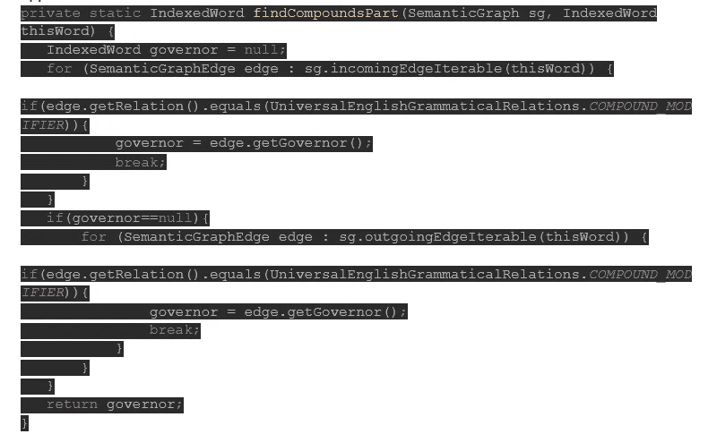
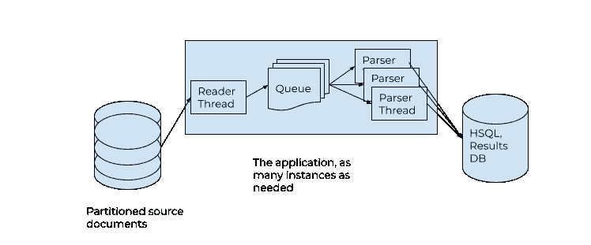

# 自动本体生成，第 3 部分:软件

> 原文：<https://medium.com/geekculture/automated-ontology-generation-part-3-software-323c60de3f99?source=collection_archive---------13----------------------->

工具包和 SDK

# 程序设计语言

在之前的帖子([第一部分](/geekculture/automatic-ontology-generation-part-1-15fd17827418)，[第二部分](/geekculture/automatic-ontology-generation-part-2-results-81ec0fe3c2cc))中，我讨论了对 Upwork 的用户配置文件和工作帖子集进行 NLP(自然语言处理)以自动生成本体。在这里，我将谈论我们使用的软件，我们在那里发现的怪癖，我们偶然发现的石头。我们决定用 Java 实现这个软件。Java 绝对不是任何 NLP 实现的默认选择。不过，在这种情况下，Java 是合适的，因为我们正在编写(并且大部分时间都在使用)的软件不执行任何矩阵运算，而且 Upwork 的几乎每个软件开发人员都可以读写 Java 代码。Java 还提供了对多线程的简单方便的访问，支持并行处理。

# 文本分析工具包

我们在 Upwork 使用 [CoreNLP](https://stanfordnlp.github.io/CoreNLP) 。首先，我想说 CoreNLP 是一个很棒的工具包。如果没有它，用 Java 做 NLP 将会非常困难。它是免费和开源的，这非常有帮助。也就是说，有两件事给我们带来了严重的痛苦:缺乏关于许多重要功能的文档，以及明显缺乏大规模测试。继续阅读血淋淋的细节。

我们使用带有 MaxentTagger 类的 POS(词性)标记作为基线，这是我们稍后可以改进的最简单的情况。该类是线程安全的，我们的应用程序设法在多线程上每 10 分钟处理大约 60K 个文档，这是我们将与其他软件进行比较的基准。与任何其他并行处理任务一样，您必须确保所使用的线程数量适合您正在运行的硬件。解析会消耗大量的 CPU 周期，因此我们将解析线程的数量设置为内核数量— 1。然后我们尝试使用 CoreNLP 的[简单 API](https://stanfordnlp.github.io/CoreNLP/simple.html) 来添加依赖解析。我们喜欢它的优点，不受缺点的影响。事实证明，使用简单 API 进行依赖解析比一开始就使用 MaxentTagger 进行 POS 标记要慢 3 倍。它在 10 分钟内只处理了 2 万份文件。然后，我们发现 SimpleAPI 在处理更多文档时速度会呈指数级下降。在第一个小时结束时，SimpleAPI 花了 10 多秒来处理一个文档。显然，这种性能水平是不可接受的，因为 Upwork 有成千上万的文档要处理。

我们转到了标准 API T1。标准 API 的性能最初高于简单 API:每 10 分钟 30K 个文档。性能也会随着时间的推移而下降，但幸运的是，性能下降不像简单 API 那样剧烈:几个小时后，应用程序在单个实例上仍然每 10 分钟处理大约 15K 个文档。我们遵循了 https://stanfordnlp.github.io/CoreNLP/memory-time.html[发布的所有指南。我们还发现 NER(命名实体识别)在 Upwork 的规模上不是一个选项。通过将 NER 配置为解析管道选项，我们设法在 10 分钟内仅处理了 5K 个文档。由于业务需求，我们需要能够在相同的硬件上处理至少 20 K 个文档/ 10 分钟。我们获得了此处显示的结果。下一个障碍，谢天谢地不再与性能相关，是我们需要使用](https://stanfordnlp.github.io/CoreNLP/memory-time.html) [SemanticGraph](https://nlp.stanford.edu/nlp/javadoc/javanlp-3.5.0/edu/stanford/nlp/semgraph/SemanticGraph.html) 类来分析依赖关系(发现复合术语)。使用简单的 API，依赖性检查变得简单明了，但对于标准 API 使用的 SemanticGraph 就不一样了。这里的问题是完全缺乏任何例子(至少我们找不到任何例子)来解释从类的方法中得到的结果。我在这里讨论的不是数据类型，而是集合的内容和各种方法返回之间的链接。例如，有一个方法*getleavertices()*返回一组索引词，但是没有解释这些索引词是什么。我想，如果你是一名 NLP 科学家，并且每天都在做文本分析工作，那么你就应该对这些事情了如指掌。然而，如果你想将文本分析应用于一个商业问题，而 NLP 不是你的谋生之道，那么输出就不明显。因此，就使用而言，你基本上只能靠自己。为了帮助未来的探索者，下面是我们应用程序中处理复合名词的一段代码:

java code for finding the parts of a compound term

代码寻找给定依赖项的复合关系(如果有)的[调控器](https://en.wikipedia.org/wiki/Government_(linguistics))。代码实现了“腰带和吊带”策略:它检查传入和传出的边，因为我们在 web 上找不到任何文档来解释一组边是否足够，或者在什么情况下两个边都需要检查。

# 数据库/存储

我们使用可靠的 HSQLDB(嵌入式 RDBMS)作为结果的中间/最终存储。它可以作为服务器嵌入和运行在相同的数据文件上，你可以用一个关键字从内存中的表切换到磁盘上的表，它是快速、可靠和有据可查的。我们还发现，与解析文档所需的时间相比，应用程序写入数据库和与数据库相关的计算所花费的时间可以忽略不计。在我们的环境中，写时间大约是解析时间的 10%-20%。我们也没有使用任何特定于 HSQLDB 的特性，因此可以用任何其他关系数据库替换它，而无需更新代码。

# 语言检测

Upwork 的所有文件(用户资料，职位，目录项目等)必须用英语书写。然而，我们发现大约有 1%的文档是用其他语言写的，或者太短，或者只是垃圾。为了过滤掉这些文档，我们使用了[语言检测器](https://github.com/optimaize/language-detector)，它工作得非常好。可用的语言数量有限，但由于我们的主要目标是将英语与所有其他语言分开，所以这一点也不会困扰我们。

# 应用程序本身

我们将应用程序本身设计为一组无共享的执行。我们在查询级别对源数据进行划分——每次执行只检索为该执行分配的源文档的子集。例如，如果每个源文档在范围 R 中有一个惟一的标识符，并且我们想同时执行 10 个实例，那么每个实例获得 R/10 范围之一中的文档，假设标识符在这些范围中均匀分布。第一个分区的范围是 0 到 R/10，第二个分区的范围是 R/10 到 2*R/10，依此类推。

每个应用程序都有一个线程读取源文档，过滤掉非英语语言的文档和垃圾文档，并将文档放入容量有限的队列中，以便解析线程进行解析。一个解析线程也将这些术语存储在 HSQLDB 数据库中，一路递增运行的聚合。

High level view of application design

另外唯一值得一提的是，我们确保编写用于存储术语和执行所有计算的 SQL，以避免线程和应用程序实例之间的死锁。

# 摘要

我们开始这个项目是为了发现我们是否可以自动或至少半自动地增长我们的本体。我们需要跟上人类知识的进步。我们需要发现人们提供技能的新专业，或者在 Upwork 的网站(upwork.com)上搜索员工。我们还需要一种方法来产生本体标签的文本(职位空缺，个人资料，目录项目等)，这样标签才能跟上进度。例如，如果一个新的 javascript 框架刚刚出现在市场上，我们希望确保学习它的人可以毫不延迟地宣传他们的技能。

这三篇文章中描述的框架([第一部分](/geekculture/automatic-ontology-generation-part-1-15fd17827418)、[第二部分](/geekculture/automatic-ontology-generation-part-2-results-81ec0fe3c2cc))为我们建立了一个非常有效的开端。我们仍然需要本体学家在更新本体之前查看结果，但是更新的周转时间现在要短得多，需要的精力也少得多。