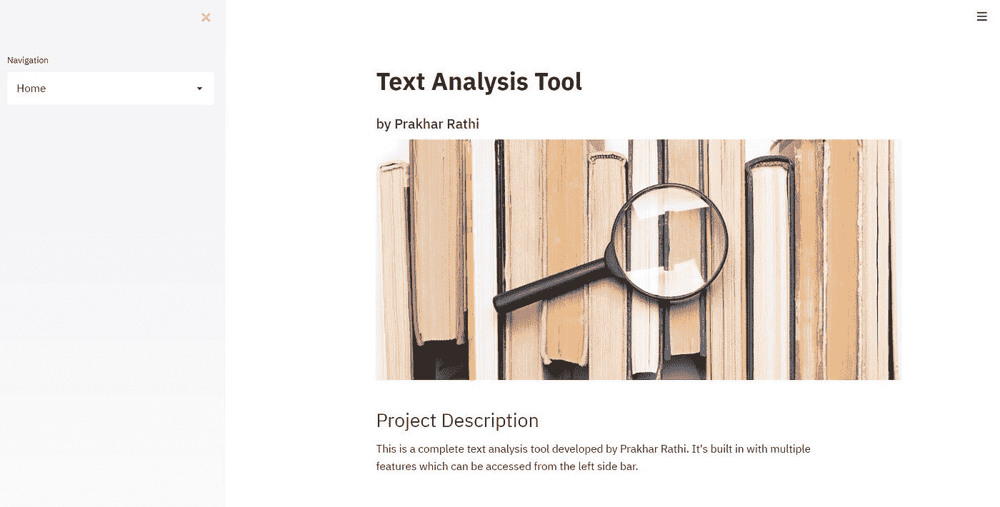
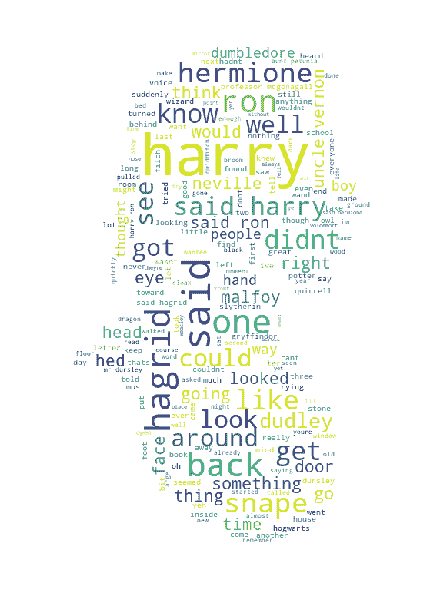
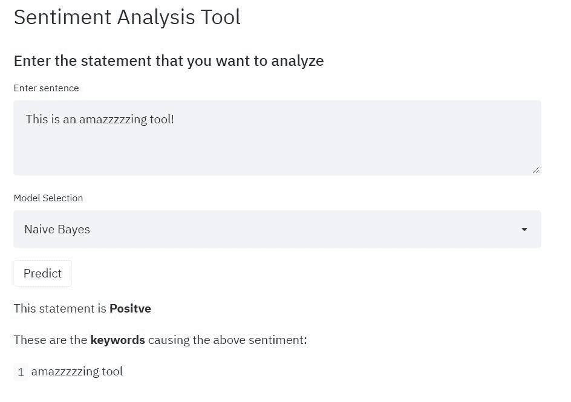
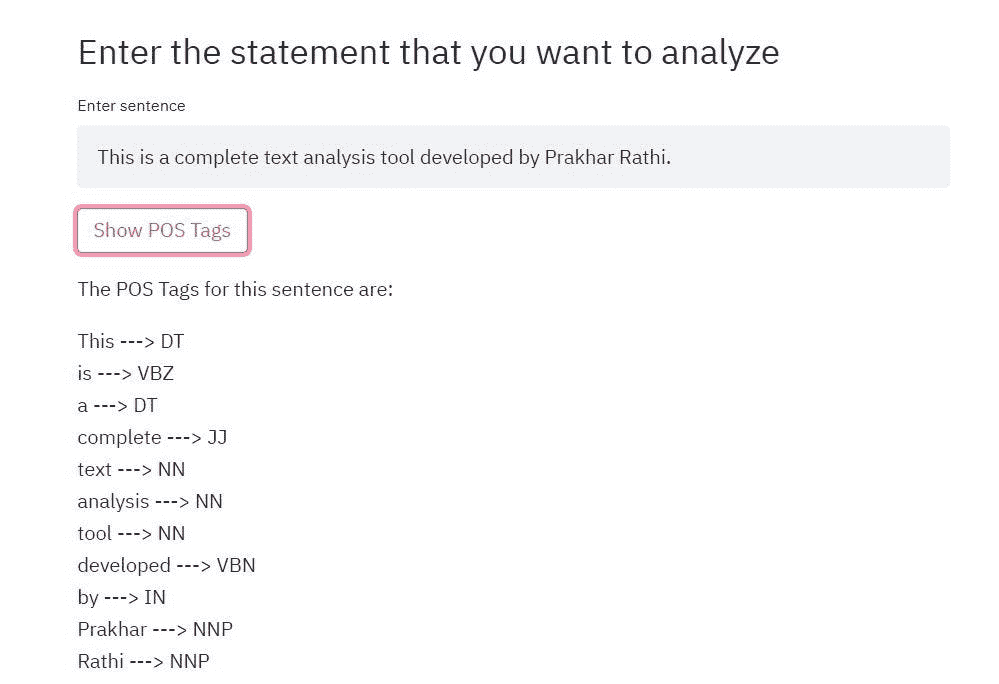
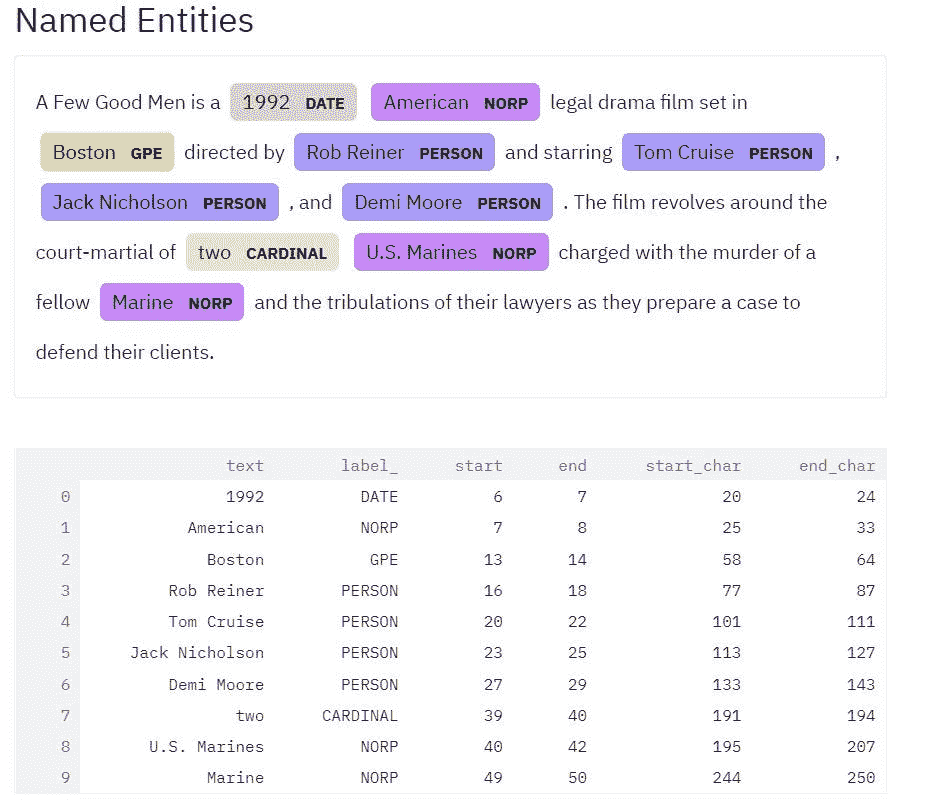

# 使用 Streamlit 进行自动文本分析

> 原文：<https://medium.com/geekculture/automated-text-analysis-using-streamlit-10b2a320b1b1?source=collection_archive---------6----------------------->

Image by [Gerd Altmann](https://pixabay.com/users/geralt-9301/?utm_source=link-attribution&utm_medium=referral&utm_campaign=image&utm_content=1989152) from [Pixabay](https://pixabay.com/?utm_source=link-attribution&utm_medium=referral&utm_campaign=image&utm_content=1989152)

## 使用 Streamlit 构建的高效快速的文本分析工具，包括文本摘要、词性标注和命名实体识别。

## 文本分析简介

文本分析是将大量非结构化文本转换为定量数据以揭示见解、趋势和模式的自动化过程。结合数据可视化工具，这种技术使公司能够理解数字背后的故事，并做出更好的决策。它是一种人工智能(AI)技术，使用自然语言处理(NLP)将文档和数据库中的非结构化文本转换为适合分析的标准化结构化数据，或驱动机器学习(ML)算法。[1]

## 需要自动化文本分析流程

任何处理过 NLP 问题的人都知道，在开始任何 ML 解决方案之前，文本分析是最重要的步骤。编写所有这些代码通常会花费很多时间，因此，能够快速完成这个过程非常重要。创建一个自动化的文本分析应用程序有很多好处。任何想要开始数据探索的人都不必编写管道来可视化他们的数据并开始建模。像这样的应用程序减少了探索性数据分析(EDA)和模型构建之间的时间。

在这个程度上，我已经使用 [Streamlit](https://streamlit.io/) 构建了一个自动化文本分析的应用程序。如果你不知道什么是 Streamlit，你可以看看[这篇文章](https://towardsdatascience.com/creating-multipage-applications-using-streamlit-efficiently-b58a58134030)我写的关于使用 Streamlit 构建数据应用的强大用例。

# 文本分析应用程序

我的应用程序中有许多用于数据可视化和分析的工具。用户界面是我的应用程序的一个重要方面。用户界面提供了多种工具，可以使用左侧下拉选项进行选择。

Preview of the user interface of my application

在下面的文章中，我提供了一个我构建的应用程序的运行过程。你可以在这里找到这个应用[的代码。](https://github.com/prakharrathi25/Text-Analytics-Tool)

## 要求

运行这个应用程序需要大量的库。我在这里把它们都列出来了[。](https://github.com/prakharrathi25/Text-Analytics-Tool/blob/main/requirements.txt)

# 可以从应用程序访问的工具

这个应用程序中集成了许多工具，你可以把它们都放在这样的下拉列表中。

## 1.词云生成器☁️

词云是一种数据可视化方法，形成了文本分析的一个组成部分。它是一种文本表示，其中单词根据它们在我们的语料库中出现的频率以不同的大小显示。频率较高的单词被赋予较大的字体，并从频率较低的单词中突出出来。这项任务的先决条件是一组文本清理和处理功能。

我已经将这些功能集成为我的工具的一部分，一旦文本被添加到应用程序中，它就会运行。我添加的另一个功能是**屏蔽功能**，其中输出可以根据提供给生成器的图像定义为特定的形状。

函数`create_wordcloud`已经在不同的文件中创建，可以在这里找到[。](https://github.com/prakharrathi25/Text-Analytics-Tool/blob/a728337fe300d4ef10b6bcd0f923ac3771d4dc95/text_analysis.py#L71)

Word cloud output for Harry potter data and [Snape mask](https://github.com/prakharrathi25/Text-Analytics-Tool/blob/main/images/snape_mask.jpg)

## 2.n 元语法分析

n 元语法是来自给定文本或语音样本的 n 个项目的连续序列。根据应用，这些项目可以是音素、音节、字母、单词或碱基对。n 元语法通常是从文本或语音语料库中收集的。在这个分析中，我试图找出最常见的 n-gram。虽然单词云侧重于单个单词，但这种分析可以产生多个短语，而不是一个。这是用来分析一个人的写作风格，看看它有多重复，以及在写作中经常出现什么模式。它以类似的方式实现，所以我不再赘述，代码可以在[这里](https://github.com/prakharrathi25/Text-Analytics-Tool/blob/a728337fe300d4ef10b6bcd0f923ac3771d4dc95/app.py#L84)找到，输出在[这里](https://camo.githubusercontent.com/c042cd9f982aa5d0063d1292cb93f33847aa01637d994392fea0703b8d2032d2/68747470733a2f2f692e696d6775722e636f6d2f343055644e38422e706e67)找到。

**3。关键词情感分析**

这是一项分为两部分的任务。第一部分是情感抽取，给定一个句子，识别它是肯定句还是否定句。第二阶段是识别句子中的哪个关键词引起了那种情绪。基于单词对语句的最终情感值的贡献来提取关键词。

**数据集:**首先在大型语料库上对模型进行训练，以使其更加健壮和可推广。这些数据是用一个我用来收集谷歌 Play 商店评论的刮刀收集的。该网站收集了大约 12500 条评论。scraper 的实现可以在名为`[sentiment_analysis_data_collection.ipynb](https://github.com/prakharrathi25/Text-Analytics-Tool/blob/main/Notebooks/sentiment_analysis_data_collection.ipynb)`的笔记本文件夹中找到。

情绪分析任务的代码可以在[这里](https://github.com/prakharrathi25/Text-Analytics-Tool/blob/a728337fe300d4ef10b6bcd0f923ac3771d4dc95/app.py#L172)找到。

**5。文本摘要**

给定一个大的语料库，我们需要将其总结成一个摘要，该摘要涵盖关键点并尽我们所能传达原始文档的确切含义。我已经创建了一个提取文本摘要工具，它从原始摘要中提取相同的单词、短语和句子，从而选择给定文本中最重要的句子。有不同的方法来估计一篇大文章中最重要的句子。使用压缩比来计算句子的数量。

> 句子计数= η *总句子计数

其中 *η* 是 0 到 1 之间的压缩比。我使用了不同形式的文本排序算法来构建与文本相关的图表。在图中，每个句子被认为是一个顶点，每个顶点都与另一个顶点相连。这些顶点为另一个顶点投票。每个顶点的重要性由较高的投票数定义。【6】我用的算法可以在`[Text_Summarization.ipynb](https://github.com/prakharrathi25/Text-Analytics-Tool/blob/main/Notebooks/Text_Summarization.ipynb)`笔记本里找到。Streamlit 中的摘要代码可以在这里找到[。](https://github.com/prakharrathi25/Text-Analytics-Tool/blob/a728337fe300d4ef10b6bcd0f923ac3771d4dc95/app.py#L216)

**6。词性标注**

在传统语法中，词类是具有相似语法属性和相似句法行为的词的范畴。词类是有用的，因为它们揭示了一个词及其相邻词的许多信息。知道一个单词是名词还是动词可以告诉我们可能的邻近单词。将词性标签分配给语料库中的单词的活动被称为词性标注。我打算基于[宾夕法尼亚树库](https://www.ling.upenn.edu/courses/Fall_2003/ling001/penn_treebank_pos.html)标签集【4】来做标记。它是一组 45 个标签的集合，已经被用于标注许多语料库。

实现可以在`text_analysis.ipynb`笔记本中找到。应用程序的结果如下所示。

**7。命名实体识别**

命名实体识别(NER)是信息识别的一个非常重要的方面，在知识图、聊天机器人和许多其他实现中都有进一步的应用。该任务包括将文本分类成预定义的类别，例如人名、组织、地点、时间表达式、数量、货币价值等。

我为此使用的库是 SpaCy，它执行命名实体注释。我还添加了一个选择框，我们可以从中选择要显示的命名实体。SpaCy 的命名实体识别模型已经在 OntoNotes5 语料库上进行训练[5]。一旦用户输入一个句子，它就被标记化、标记，然后添加到 NER 函数中，该函数有助于不同实体的选择和可视化。结果如下图所示。

POS 标签和 NER 的代码可在[这里](https://github.com/prakharrathi25/Text-Analytics-Tool/blob/a728337fe300d4ef10b6bcd0f923ac3771d4dc95/app.py#L137)找到。本文的目的不是在这里为您提供所有的代码，因为这是一个具有许多方面的巨大应用程序。您可以自行探索存储库和 Streamlit 的强大功能。本文旨在向您介绍文本分析的概念以及在 Streamlit 上部署 ML 工具。希望你喜欢它！

 [## prakharrathi 25/文本分析工具

### 这是一个应用程序，自动化的过程中的文本分析与用户友好的图形用户界面。📱已经实施了…

github.com](https://github.com/prakharrathi25/Text-Analytics-Tool)  [## 使用 Streamlit 创建多页面应用程序(高效！)

towardsdatascience.com](https://towardsdatascience.com/creating-multipage-applications-using-streamlit-efficiently-b58a58134030) 

# 参考

[1] Brimacombe，J. M. (2019 年 12 月 13 日)。什么是文本挖掘、文本分析和自然语言处理？语言学。[接入。](https://www.linguamatics.com/what-text-mining-text-analytics-and-natural-language-processing)

[2] Metsis，v .，Androutsopoulos，I .和 Paliouras，G. (2006)用朴素贝叶斯过滤垃圾邮件——哪个朴素贝叶斯？第三届电子邮件和反垃圾邮件会议(CEAS)，山景城，2006 年 7 月 27-28 日，28-69。

[3]朱拉夫斯基博士(2000 年)。语音和语言处理。培生教育印度公司。

[4]米切尔·p·马库斯、玛丽·安·马辛凯维奇和比阿特丽斯·圣托里尼。1993.建立一个大型带注释的英语语料库:宾夕法尼亚树库。计算机。语言学家。第十九条，第二条(1993 年 6 月)

[5] Weischedel，Ralph，等 OntoNotes Release 5.0 LDC2013T19。网络下载。费城:语言数据联盟，2013 年。

[6]米哈尔恰、拉达&塔劳、保罗。(2004).TextRank:给文本带来秩序。