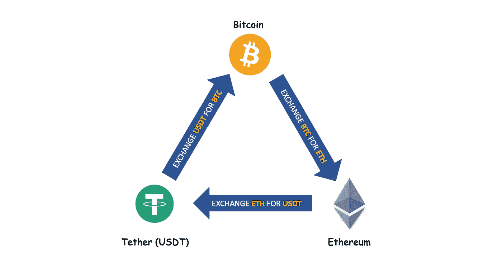
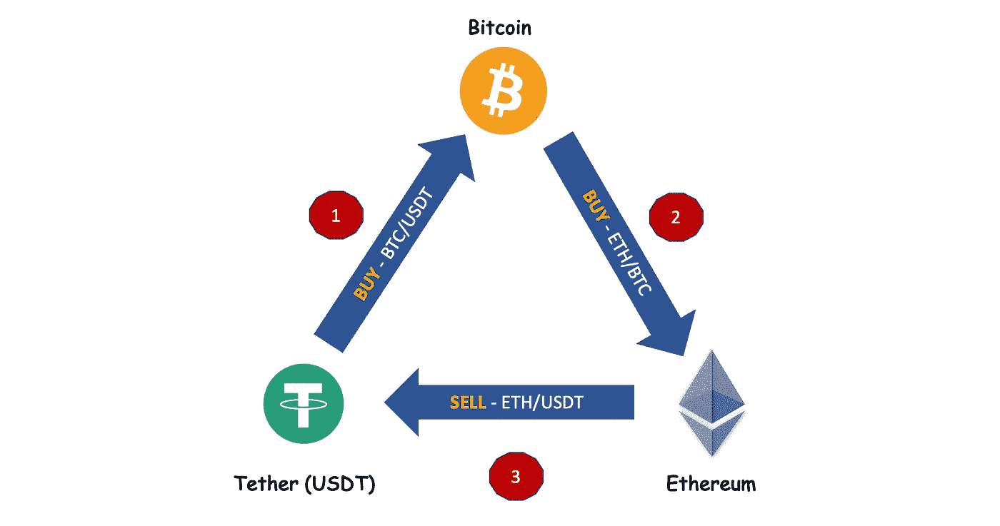
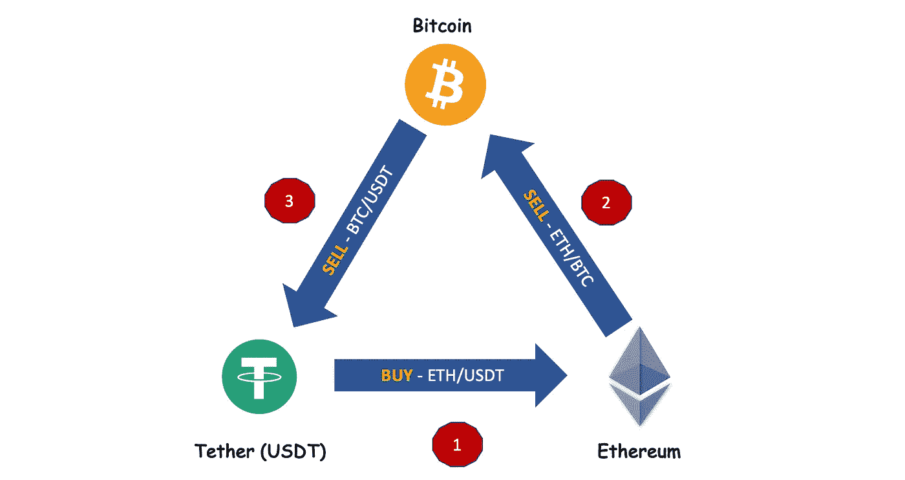
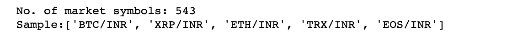
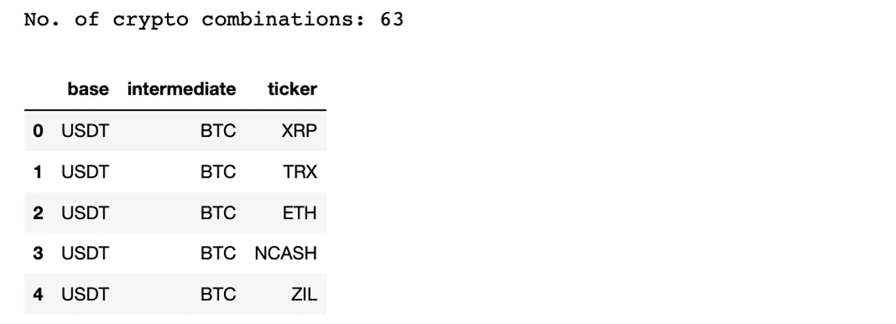
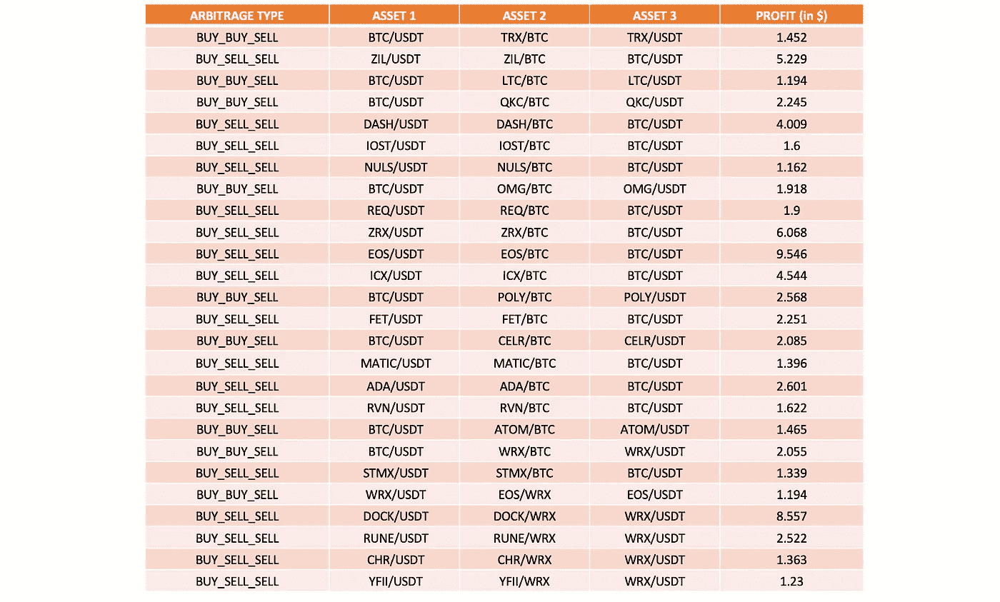

# 密码的自动化三角套利分 4 步进行

> 原文：<https://medium.com/geekculture/automated-triangular-arbitrage-of-cryptos-in-4-steps-a678f7b01ce7?source=collection_archive---------0----------------------->

用 Python 构建自己的套利交易算法

# 介绍

套利利用了市场上资产价格的差异。套利已经在外汇市场上做了很多年，但考虑到加密市场的波动性，它也可以应用于加密市场。套利机会可能存在于同一交易所内，也可能存在于不同交易所之间。

三角套利是一种试图同时利用三种不同资产价格差异的技术。例如，我们可以用 BTC 换 USDT，用 BTC 换瑞士联邦理工学院，再用瑞士联邦理工学院换回 USDT。如果同时做这三笔交易的净值是盈利的，那么这三笔交易同时执行。



**Example of Triangular Arbitrage** (Image by Author)

在本文中，我们将探讨同一交易所内的套利机会，特别是我们将深入探讨三角套利方法。重点是开发和实现一个交易算法，它可以识别利润并触发所需的交易订单。

与买卖时机至关重要的传统交易相比，套利被认为是一种风险较低的交易方式。此外，在套利交易中，由于所有要求的交易都是同时执行的，因此盈利/亏损可以立即得知。

# 三角套利的方法

有不同的买卖 3 种资产的方法来实现三角套利。在本文中，我们将考虑两种方法。

## 方法 1:买—买—卖



**BUY-BUY-SELL Approach of Triangle Arbitrage** (Image by Author)

在上面的例子中，我们从 USDT 作为初始投资开始。在完成这 3 笔交易后，我们最后又剩下 USDT 了。以下是将要执行的交易:

1.  用系绳(USDT)买比特币(BTC)
2.  用比特币购买以太坊(ETH)(BTC)
3.  出售以太坊(ETH)的系绳(USDT)

在第三次交易结束时，我们可以比较最终的 USDT 和我们在第一步开始的初始投资。如果这导致了可观的利润，那么这三笔交易可以同时开始。

## 方法 2:买—卖—卖



**BUY-SELL-SELL Approach of Triangle Arbitrage** (Image by Author)

与第一种方法类似，相同的资产用于检查不同流程中的套利机会。在上述示例中，评估了以下 3 个交易:

1.  购买以太坊(ETH)带系绳(USDT)
2.  卖以太坊(ETH)换比特币(BTC)
3.  卖比特币(BTC)换系绳(USDT)

# 交易算法——4 步实施

下面是实施三角套利交易算法的不同步骤的概述。我们将在接下来的章节中详细研究这些步骤。

> 第一步:获取所有有效的加密组合
> 第二步:执行三角套利
> 第三步:下达交易订单
> 第四步:捆绑在一起

在进行这些步骤之前，我们需要初始化交易所来进行套利。选择您拥有交易账户的交易所以及支持 api 交易的交易所。在这个例子中，我使用了 WazirX 交易所，因为我在这个交易所有一个交易账户。

```
import ccxt
from config import myconfig
exchange = ccxt.wazirx({
                         “apiKey”: myconfig.API_KEY,
                         “secret”: myconfig.API_SECRET
                       })
```

ccxt 包支持各种交易所，如果您在任何其他交易所都有帐户，那么您只需在上面的代码片段中更改交易所的名称，就可以获得相同的代码。参考此[页面](https://github.com/ccxt/ccxt/wiki/Exchange-Markets)获取 ccxt 支持的交易所列表。

# 步骤 1:获取所有有效的加密组合

我们需要一个基础货币与我们的交易账户开始投资。这里我们认为 USDT 是基础货币。请注意，即使是法定货币，如印度卢比或美元，也可以被视为基础货币。

交易所支持数百种密码，因此我们可以衍生出不同的组合来执行三角套利。我们可以对有限的组合集进行硬编码，或者允许代码考虑交换中所有可能的组合。下面的代码片段实现了识别所有可能的套利组合的第二种方法。

在撰写本文时，该交易所支持 543 种加密资产。



接下来提取所有可能的组合来应用三角套利的买-买-卖和买-卖-卖方法。

代码能够识别 63 种不同的套利组合。



例如:如果必须在第一笔交易中应用买-买-卖算法，则:

1.  为 USDT(基础)购买 BTC(中级)
2.  为 BTC(中级)购买 XRP(股票代码)
3.  为 USDT 出售 XRP 股票(股票代码)

如果这种循环交易可以带来利润，那么我们可以同时执行这三种交易。

# 第二步:进行三角套利

从交换中提取三种资产的价格，并在执行三次买/卖转换后确定最终价格。

同样，购买-销售-销售方法也需要实施。为了避免代码拥挤，这里只提供了一段代码。请参考文章末尾链接的 git 存储库，以获得完整的可执行代码。

通过考虑交易所对每笔交易的佣金和交易的最低预期利润，计算执行三角套利的利润/损失。

# 第三步:下交易订单

下面是在交易所执行这三笔交易的代码。如果交易所不支持市价交易，则需要执行限价交易。如果价格在订单执行前波动，限价订单有时会导致交易订单被卡住。

# 第四步:捆绑在一起

将上述步骤打包成一个包，并对所有可能的组合运行它。

对于每个组合，执行以下 3 个步骤
(例如:购买——BTC/USDT，出售——ETH/BTC，出售——ETH/USDT)

1.  在完成 3 笔交易后，确定最终的卖出价格
2.  计算这些交易的利润/损失
3.  如果交易带来了期望的利润，则下 3 个交易订单

# 结果

下面是运行此代码一次迭代的示例结果。

考虑初始投资 100 美元。通过 63 个组合和 2 种方法，总共检查了 126 个套利组合，其中 26 个组合的利润如下。



**Sample Results from Triangular Arbitrage for 1 iteration**

请注意，上表来自日志，而不是来自实际执行的交易。尽管这张表显示了一个美好的数字，但在现实中，它可能并不总是一帆风顺的。

# 为什么这可能是一个颠簸的旅程…

1.  由于所有三个订单需要同时执行才能实现利润，因此由于网络延迟或交易所的问题，有些订单可能无法按时执行。在这种情况下，您可能会被密码卡住，可能需要手动干预。
2.  这里考虑的加密价格是实时报价。在订单执行之前，价格可能会波动。更好的方法是从订单簿中获取条目，并根据数量选择报价。
3.  交易所同时需要三个股票价格来执行三角套利。一些交易所设置了不允许重复 api 调用的速率限制。在这种情况下，api 可能会抛出 ratelimitexceed(HTTP 429 太多请求)异常。这可以通过在 api 调用之间使用 1 秒钟的睡眠定时器来处理。但是如果价格在几秒钟内发生变化，订单可能无法执行。
4.  一些交易所不允许以市价下单(就像我的例子)。需要限价。在这种情况下，由于价格波动，订单也有可能无法执行。

# 代码回购

参考这个 git 回购访问完整的代码:[三角任意密码](https://github.com/Lakshmi-1212/TriangularArbitrageCryptos)

# 结论

基于交易所及其提供的 api 支持，可以进一步调整交易算法。尝试通过改变基础货币、使用市场价格交易或检查其他套利方法来玩弄代码。

同样，免责声明，这篇文章只是为了教育的目的，让你了解不同类型的交易选择。记住，你是在和其他几个交易机器人竞争。如果你想在真实交易中进行实验，那么首先要确保你已经建立了一个强大的交易算法，然后再冒险尝试以避免损失。

此外，如果您对在交易机器人应用程序中包装这些代码感兴趣，可以参考这篇文章:[用 Python 构建一个基本的加密交易机器人](/geekculture/building-a-basic-crypto-trading-bot-in-python-4f272693c375)

感谢阅读到最后:-)。快乐实验！！

## 如果“PYTHON+TRADING”让你着迷，那就看看这些吧…

*   [*算法交易 Python 技术分析入门*](/geekculture/beginners-guide-to-technical-analysis-in-python-for-algorithmic-trading-19164fb6149)
*   [*用 Python 构建一个基本的加密交易机器人*](/geekculture/building-a-basic-crypto-trading-bot-in-python-4f272693c375)
*   *Cryptos 的自动化三角套利分 4 步进行【你在这里】*
*   [*识别交易模式——交易者行为分析*](/geekculture/identifying-trading-patterns-behavioural-analysis-of-traders-5184dfa0350b)
*   [*股票基本面分析使用 Python*](/geekculture/fundamental-analysis-of-stocks-using-python-d5ad050e6372)