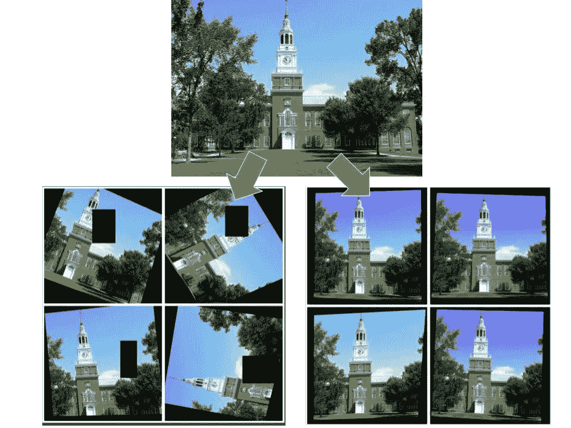

# 自动数据扩充:概述和 SOTA

> 原文：<https://medium.com/geekculture/automatic-data-augmentation-an-overview-and-the-sota-109ffbf43a20?source=collection_archive---------31----------------------->

想要一个最先进的计算机视觉模型？你需要一个粗糙的数据增强管道。在人工智能发展的这个阶段，这是没有商量余地的。

但是拼凑数据扩充管道的过程通常是手工和迭代的；这是一种痛苦。但是，请注意，我说的是“常规”。这是因为有一个繁荣的(但迄今为止没有很好地实现)关于自动化的粗糙增强管道的搜索过程的文献。



Demonstration of augmentations of RandAugment using [MuarAugment](https://pypi.org/project/MuarAugment/), the package I created. Image is of Baker-berry tower at Dartmouth College. Adapted from [source](https://www.thoughtco.com/thmb/vE1HNWDSGzet3hfO0TL4_YyzkU4=/1001x785/filters:no_upscale():max_bytes(150000):strip_icc()/baker-tower-dartmouth-58b5bc133df78cdcd8b69976.jpg).

# **自动搜索:概述**

迄今为止，大致有两种方法。“人工智能模型方法”试图通过增强策略的大空间进行搜索，以使用增强学习或 GANs 找到最佳策略。它已经产生了显著的效果，[对抗性自动增强](https://paperswithcode.com/paper/adversarial-autoaugment-1)达到了目前最先进的性能。我认为这种方法是自动化数据增强的未来；然而，可能还没有(还没有！)非常适合个人开发者。在这个过程中，我们必须训练一个完整的 GAN——这个过程需要复杂的实现和大量的计算资源。如果我们唯一的 GPU 能力来自 Kaggle 内核和 Colab 笔记本，那就不太好了(尽管[更快的自动增强](https://paperswithcode.com/paper/faster-autoaugment-learning-augmentation)有助于减少计算费用，我相信这种方法在至多几年的时间内会变得更容易使用)。

我想要一个自动搜索过程，我可以扑通一声，停止思考。幸运的是，这正是我们通过另一种数据增强管道搜索策略“基于随机性的方法”得到的结果，这种方法减少了搜索空间(通过使用更少的参数)并随机采样策略。牺牲灵活性来换取速度，这种方法体现在 [RandAugment](https://paperswithcode.com/method/randaugment) 算法中，产生了与人工智能模型方法相竞争的性能……就在几年前。后一种方法得到了进一步的发展，现在已经超过了 RandAugment。然而，RandAugment 仍然要快得多，如果你只是需要一个“足够好”的数据增强管道——一个易于使用，仍然比手动和迭代拼凑好的管道——它是一个可行的选择。

还有另一种尚未广为人知的算法，介于基于随机性和人工智能模型方法的两极之间。它确实使用深度学习模型来选择最佳转换；然而，这个模型一点也不像一个单独的 GAN，而恰恰是被训练的那个。这种算法比 RandAugment 慢得多，但仍然比最快的基于人工智能的方法“更快的自动增强”快几倍，同时在性能上与性能最好的基于人工智能的方法“对抗的自动增强”相匹配。

我很想给你这个算法的名字，但它似乎缺少一个，或者至少是一个好的。论文《论数据扩充中线性变换的泛化效应》(2020)，将这种算法称为“基于不确定性的变换采样方案”。我们需要一个新名字。

“MuAugment”怎么样，代表基于不确定性的 M 模型**U**T4 增强？我们就这样吧。

# **潜入 MuAugment**

在做 MuAugment 之前，我们必须了解 RandAugment。幸运的是，RandAugment 非常简单。

我们有一个“k”变换的列表(例如，水平翻转，改变亮度)。从每个图像的“c”个增强版本中选择“n”(“n”< `K`) of the `K` transforms uniformly at random without replacement, each with a magnitude `M`. Array those `N` transforms into a composition, and apply that composition to the incoming image. That’s RandAugment. Here’s a code sample:

```
import numpy as np
import albumentations as def rand_augment(N, M):
    # N_TFMS=3 here
    transforms = [A.HorizontalFlip(p=1), 
                  A.Rotate(M*9, p=1),  
                  A.RandomBrightness(M/20, p=1)] composition = np.random.choice(transforms, N, replacement=False)   
    return A.Compose(composition)
```

We apply RandAugment `C` different times on each image. Using the model that is training, select the `S` (`S` < `C`) *最有用的*个版本。仅将每个图像的“s”增强版本输入模型进行训练。我们如何确定哪些增强是最有用的？我们通过模型向前传递每个“c”增强，损失越大，增强越有用。那是 MuAugment。

为什么高损失意味着有用的增加？嗯，一个小的损失意味着模型已经学会了如何很好地预测那种类型的图像，所以如果对它进行进一步的训练，模型只会拾取偶然的，可能是虚假的模式——过度拟合。相反，大的损失意味着模型还没有学习图像类型和它的目标之间的一般映射，所以我们需要在那些类型的图像上进行更多的训练。

因此，MuAugment 是挑选最难的*增强和训练的一种方式。RandAugment 的效果不太好，因为它会产生简单和困难的扩充，并将两者都输入到模型中。因此，它更容易在容易的增强上过度拟合，而在困难的增强上不足拟合。当像 MuAugment 这样的算法确保在硬扩充上的额外拟合，同时跳过简单的扩充时，该模型会学习更多可概括的模式。*

你可能会想到 MuAugment 的一个问题。有时，应用于图像的变换过于剧烈，以至于图像变得难以理解，完全失去了目标信息。所以我们最终给模型输入了纯噪声。然而，纯噪波在输入模型时会产生很高的损失，因此使用 MuAugment 选择那些无法识别的图像(如果它们是创建的)。除了选择适当的超参数以减少不可理解的图像的产生，这个问题没有简单的解决方案，因此将合成中的变换数量“n”保持在 4 以下并且将每个变换的幅度“m”保持在 6 以下是一个好主意。

如果有时间，试试网格搜索。为“m”输入一个数值范围，以找到最佳大小来缩小搜索空间，只需在范围[2，4]中选择一个“n”值。作为一种试探，较大的模型和数据集需要更多的正则化，因此使用较大的量级“m”会表现得更好。这是因为更大的模型更容易过度拟合，并且更长的数据集具有更高的信噪比，应该将其降低到最佳点。因此，在网格搜索中对“m”的值进行采样时，请记住这一点。

# **总结**

我们调查了数据增强策略搜索算法的动植物。有些人把另一个人工智能模型放在我们的任务之上。其他人使用更少的参数和随机的集合转换样本。前者比后者执行得更准确，但速度要慢得多。进入 MuAugment:人工智能模型和基于随机性的方法的混合。它从一系列变换中随机抽取成分，并只使用最有用的(即损失最高的)成分作为训练数据。为了获得最佳结果，将变换幅度的不同值放入网格搜索中。

如果您希望在您的项目中使用 MuAugment 或 RandAugment，请考虑使用 [MuarAugment](https://github.com/adam-mehdi/MuarAugment) 。它是一个包，提供了一个简单的 API 和为速度而优化的实现。我将在 MuarAugment GitHub 中加入教程，并很快发布一篇 *Medium* 文章解释它的用法。

## 引用:

1.  Cubuk 等人 2019，“RandAugment:搜索空间缩小的实用自动化数据增强”。
2.  张等 2020，“[自动化数据增强的艺术](https://hazyresearch.stanford.edu/data-aug-part-3)”。
3.  吴等 2020，“论数据增强中线性变换的泛化效应”。
4.  张等 2019，《对抗性自增强》。
5.  Hataya 等人 2019，“更快的自动增强:使用反向传播学习增强策略”。