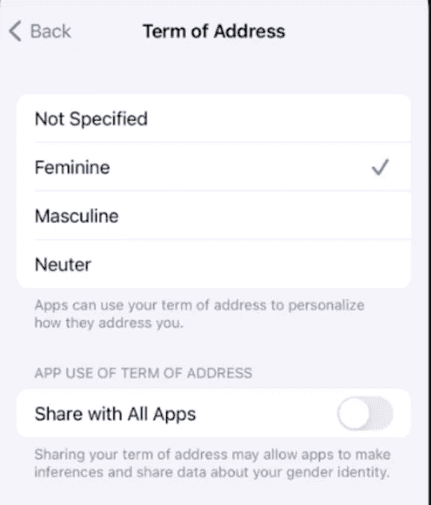

# 自动语法协议和可本地化的新 API

> 原文：<https://medium.com/geekculture/automatic-grammar-agreement-b953cbf5d101?source=collection_archive---------3----------------------->

## WWDC 基金会框架中引入的新功能初探


Photo by [AltumCode](https://unsplash.com/@altumcode?utm_source=unsplash&utm_medium=referral&utm_content=creditCopyText) on [Unsplash](https://unsplash.com/s/photos/developer?utm_source=unsplash&utm_medium=referral&utm_content=creditCopyText)

上个月早些时候，WWDC 会议召开了(实际上和去年一样),发布了一系列关于苹果开发生态系统的新公告。虽然其他人(包括我自己)都对新的 async / await 功能或全新的 Xcode cloud 感到兴奋，但我认为，基础框架中添加了一个很酷的功能，但被很大一部分 iOS 开发人员低估了:新的属性字符串 API。

如果在任何时候，你不得不处理某种类型的属性字符串，你可能会知道这不是一件小事。即使是最基本的布局，比如带下划线的标签，也需要一段代码来正确设置 UI，这很难阅读和理解。更糟糕的是，如果您的应用程序是多语言的，并且需要本地化字符串，您需要在可本地化的字符串中创建某种具有自定义语法的实用程序来满足您的需求。直到现在，在处理可本地化的属性化字符串时，还缺乏标准化。

iOS 15 和 Swift 5.5 在这方面有了巨大的改进，还引入了一个新的语言功能，名为**自动语法协议**。让我们来看看。

## **归因串**

**Markdown 语法支持**

我们现在可以用一个具有 markdown 语法的字符串创建一个属性化的字符串。

如果您使用 SwiftUI，也可以在文本视图中直接使用 markdown 语法。

这种兼容性最酷的一点是，我们可以以更清晰、更易读的方式组合多种格式。

**可本地化&插补支持**

如果需要支持多语言，现在可以利用 markdown 语法初始化属性化字符串。

这已经很酷了。但是，我们也可以添加字符串插值到我们的本地化字符串！。例如，如果我们想给我们的用户一个更个性化的欢迎，我们现在可以这样做:

## 自动语法协议

想象一下，我们有一个咖啡订单应用程序。在结帐屏幕中，我们希望向用户显示他们的订单，如下所示:

```
// English
1 small cappuccino - $2.99
2 medium espressos - $4.99
```

但是，如果我们的应用程序也支持西班牙语，我们需要重新排序文本以匹配正确的语法。此外，我们必须管理我们使用的形容词的单数/复数。

```
// Spanish
1 capuchino chico - $2.99
2 expresos medianos - $4.99
```

在英语中，无论你指的是一个还是多个项目，你都要说 *medium* 。然而，在西班牙语中，如果你引用一个项目，你可以说 *mediano* ，如果你引用多个项目，你可以说 *medianos* 。此外，在西班牙语中，名词位于形容词之前。所以，如果你的应用程序支持多语言，你必须考虑所有这些。即使是像我们刚刚讨论的小例子。

新特性**自动语法协议**承担了这一责任，并自动完成所有转换。为了在加载可本地化的字符串时应用它，我们必须使用**自动语法协议**的 Markdown 语法扩展:

^[……](屈折:真)。我们从^符号开始，后面是方括号。在括号内，我们放入我们想要变音的字符串。最后，我们指出我们希望文本的这一部分在括号之间发生屈折。

```
// Localizable.string 

"small" = "small";
"medium" = "medium";
"espresso" = "espresso";
"cappuccino" = "cappuccino";
// 1 small cappuccino - $2.99
"^[%lld %@ %@](inflect: true) - **$%@**" = "%1$lld %2$@ %3$@ - **$%%4$@**";

// Localizable.string - Spanish
"small" = "chico";
"medium" = "mediano";
"espresso" = "expresos";
"cappuccino" = "capuchino";
"^[%lld %@ %@](inflect: true) - **$%@**" = "%1$lld %3$@ %2$@ - **$%%4$@**";
```

这是一个巨大的改进，尽管我们仍然需要自己翻译文本，但我们不必根据用户配置的语言来改变代码中参数的顺序。

此外，iOS 15 将提供一个新的设置选项:**称谓**，我们可以用它来指定我们的性别以及我们希望系统如何对待我们。这也将由语法一致特性自动处理。



在西班牙语中，我们使用的名词可能因性别而异。例如，对于 Welcome，如果用户是男性，我们应该说 Bienvenido，如果用户是女性，我们应该说 Bienvenida。

在 iOS 15 之前，我们可能需要这样的东西:

```
// Localizable.string - Spanish

"Welcome" = "Bienvenido/a";
```

有了**自动语法协议**，我们可以在语法中使用屈折属性

```
// Localizable.string - Spanish

"^[Welcome](inflect: true)" = "Bienvenido";

// Will print: Bienvenido or Bienvenida depending on the user's configuration
```

请注意，所有这些功能都处于测试阶段，所以，你可能会发现一些不稳定和一些变化在未来。

如果你想深入研究这个问题，你可以观看 [WWDC 演讲](https://developer.apple.com/videos/play/wwdc2021/10109/)和阅读[官方文件](https://developer.apple.com/documentation/foundation/attributedstring?changes=_2_8#see-also)。

一如既往，如果你有任何问题，可以在下面留言=)