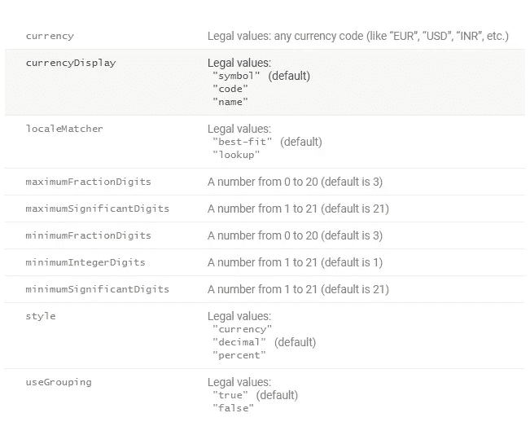

# JavaScript 所有国家的自动数字格式

> 原文：<https://medium.com/geekculture/automatic-number-format-with-javascript-all-countries-8b457ac0b491?source=collection_archive---------4----------------------->


你好，你们好，这次我们将讨论如何根据我们想要的国家来制作数字格式。

在 JavaScript 中，有许多不同的方法来打印以逗号作为千位分隔符的整数。要用 JavaScript 打印整数，可以使用 JavaScript 数字格式。

您可以学习其他教程:

[JavaScript 教程# 1:JavaScript 简介](https://temanngoding.com/tutorial-javascript-1-pengenalan-javascript/)

[Javascript 错误处理](https://temanngoding.com/penanganan-eror-javascript/)

[将时间 am pm 转换为 24 小时](https://temanngoding.com/tutorial-javascript-convert-waktu-am-pm-to-24-jam/)

虽然保存一个数字值类似于保存一个字符串值，但两者之间还是有一些区别。在本教程中，您将了解各种 JavaScript 数字格式。您将学习如何将数字转换为字符串，如何显示指数和小数。

手动将数字格式化为货币字符串可能是一个繁琐的过程。虽然这通常可以通过几行代码来完成，但是遵循标准规范而不是自己硬编码是一个很好的实践，而且开发人员编写代码也更容易。

我将给出一些如何根据每个国家的货币自动格式化数字的例子。

# JavaScript 格式编号

```
console.log(new Intl.NumberFormat('id-ID', {
  style: 'currency',
  currency: 'IDR',
  minimumFractionDigits: 0,
}).format(123456789)); // Rp 123.456.789

console.log(new Intl.NumberFormat('en-US', {
  style: 'currency',
  currency: 'USD',
  minimumFractionDigits: 0,
}).format(123456789)); // $123,456,789

console.log(new Intl.NumberFormat('en-IN', {
  style: 'currency',
  currency: 'INR',
  minimumFractionDigits: 0,
}).format(123456789)); // ₹12,34,56,789

console.log(new Intl.NumberFormat('en-DE', {
  style: 'currency',
  currency: 'EUR',
  minimumFractionDigits: 0,
}).format(123456789)); // €123,456,789
```

上面的代码提供了一个根据货币格式化的输出数字。这里我会给出你可以使用的参数。

# 参数

`ar-SA` 阿拉伯语(沙特)
`bn-BD` 孟加拉语(孟加拉)
`bn-IN` 孟加拉语(印度)
`cs-CZ` 捷克语(捷克)
`da-DK` 丹麦语(丹麦)
`de-AT` 奥地利德语
`de-CH` “瑞士”德语
`de-DE` 标准德语(德国口语)
`el-GR` 现代希腊语
`en-AU` 澳大利亚英语
`en-CA` 加拿大英语
`en-GB` 英国英语【T6
`es-AR` 阿根廷西班牙语
`es-CL` 智利西班牙语
`es-CO` 哥伦比亚西班牙语
`es-ES` 卡斯蒂利亚西班牙语(如西班牙中北部所说)
`es-MX` 墨西哥西班牙语
`es-US` 美国西班牙语
`fi-FI` 芬兰语(芬兰)
`fr-BE` 比利时法语
`fr-CA` 加拿大法语
`fr-CH` 【瑞士】法语
`fr-FR` 标准法语(尤其是在
`ja-JP` 日语(日本)
`ko-KR` 韩语(大韩民国)
`nl-BE` 比利时荷兰语
`nl-NL` 标准荷兰语(如荷兰人所说)
`no-NO` 挪威语(挪威)
`pl-PL` 波兰语(波兰)
`pt-BR` 巴西葡萄牙语
`pt-PT` 欧洲葡萄牙语(如葡萄牙人所写和所说)
`ro-RO` 罗马尼亚语(罗马尼亚)
`ru-RU` 俄语(俄罗斯联邦)【俄罗斯

设置数字格式的选项。



因此，我传达这个信息，我希望它是有用的。

谢谢您:

来源:[https://www . w3schools . com/jsref/jsref _ tolocalestring _ number . ASP](https://www.w3schools.com/jsref/jsref_tolocalestring_number.asp)

[https://temanngoding . com/format-number-otomatis-dengan-JavaScript-semua-negara/](https://temanngoding.com/format-number-otomatis-dengan-javascript-semua-negara/)