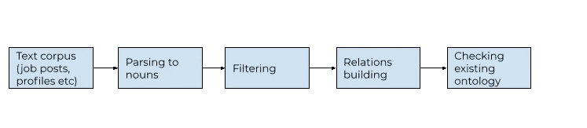
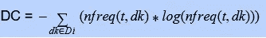

# 自动本体生成，第 1 部分

> 原文：<https://medium.com/geekculture/automatic-ontology-generation-part-1-15fd17827418?source=collection_archive---------30----------------------->

正如我以前写的，Upwork 在网站的很多地方都使用了本体论，包括语义搜索、浏览路径、SEO 和其他一些。我们过去常常手工生成本体图。一个本体学家团队为不同的类别创建了精选的分类法，创建了或多或少特定于职业的层次结构。虽然这种方法有很多好处，但也有一些难以解决的问题。例如，覆盖范围:我们不知道我们的分类法覆盖了档案和工作的哪一部分。我们不知道在我们的市场中是否有全部职业在本体中几乎没有(或很少)表示。另一个问题是跟上:在一些职业中，术语变化非常快，所以我们的本体学家总是在追赶。

为了克服这些限制，我决定实现基于真实数据的自动本体发现和构建。目标是定期自动生成候选本体更新，并让本体学家以最少的过程和人工参与快速管理它们并添加到生产本体中。我决定采用[1]中描述的方法作为基础。我发现这种方法非常吸引人，有几个原因:团队使用非监督方法来构建本体。这正是我们的情况所需要的，因为我们的目标是快速产生更新和引导“空”职业，随后由本体团队提供改进。最初的软件是用 Java 编写的，这给了我们高度的保证，即该过程可以通过并行化来扩展。此外，Upwork 的大部分软件开发都是用 Java 完成的，所以我们可以假设一个普通的软件开发人员能够理解和维护我们将要生产的代码。

在这篇文章中，我将描述我们在项目第一阶段实现的功能。在下一篇文章中，我将分享结果。

我上面提到的文章描述了作者自动构建本体的各个步骤。我决定在第一次迭代中实现该过程的简化版本。我们的过程包括 3 个简单的步骤(以及对名词的初步解析):

Ontology generation pipeline

过滤

在这里，我们寻找与特定业务领域相关的术语。在 Upwork 中，当新用户创建简档或发布职务时，UI 会要求用户选择简档(或职务)所属的主要类别。这就是我们如何找到原始文档的业务域。第一个过滤器是*领域相关性* (DP)过滤器(由文章作者命名)。过滤器确定术语在给定业务领域中的具体程度。

DP = freq(t/Di)/maxj(freq(t/Dj)，其中 t 是我们正在过滤的项，Di 是当前域，Dj 是任何其他域。通俗地说，我们将一个给定领域中的术语频率除以该术语在除了这个领域之外的所有领域中的最大频率。如果这个术语对于给定的域是特定的，那么它在任何其他域中都不存在，我将除数设置为 1。我们从进一步评估中排除了所有价值低于期限 DP 值标记 30%期限。然后我们计算域*一致性* (DC)滤波器。

DC calculation

这个过滤器的目标是找出术语 t 在域 Di 的文档 dk 中的流行程度。nfreq 是术语 t 在文档 dk 中的归一化频率，计算为在该文档中的频率除以该术语在任何领域的任何文档中的最大频率。过滤器惩罚每个文档中出现频率较高的术语，同时奖励在一个域的更多文档中出现的术语。

作为最后一个过滤器，我们将*摘要过滤器* (SF)计算为归一化的 DC、DP 和 *k.* 常数 *k* 的线性组合。假设在标题中发现的术语更重要，如果该术语已经出现在该领域中的任何文档的标题中，我们将该术语设置为 0.02。对于标题中不存在的术语， *k* 为 0。我们基于原始出版物的作者所做的元参数优化选择了 k 的值。我怀疑 *k* 在很大程度上依赖于文本语料库，但参数优化是我们可以在稍后阶段做的事情，当我们验证产品工作得相当好，为我们的本体提供良好的更新时。对于大范围的文本数据来说， *k* 的当前值应该是相当好的。

SF = 0.4*norm(DP(Di，t))+0.6*norm(DC(Di，t))+k。为了归一化，我们将域 Di 中的项 t 的滤波器值除以该域中该类型滤波器的最大值。我们排除所有价值低于 40% SF 标记的术语。

关系建设

对于剩余的术语，我们使用包含方法建立关系。该方法基于术语的共现。直观上，如果某个领域有两个特定术语，并且一个术语仅(或主要)在另一个术语出现时出现，而另一个术语出现在比包含第一个术语的文档更多的文档中，则第二个术语比第一个术语包含得更广(第一个术语更窄)。例如，在“艺术和插图”领域，“动漫”可以是一个“更广泛”的概念，“赤壁”，“fanart”等等。我们用的公式是:P(x j y)> = t；凯文·梅耶尔，弗拉维斯·弗拉辛卡，弗雷德里克·霍根博姆

# Ontology checking

At last we check for the appearance of terms and relations we found in the existing ontology. There are multiple goals we are trying to achieve with that check: we calculate the coverage of the ontology vs terms from the new crop of profiles or other documents. We calculate the recall value to see if it’s time to recalibrate the meta parameters, we find places to plug in newly found terms based on various similarity criteria. And we simplify the job of our ontology team taking away a part of manual labor. Finally, we rejoice :)

[1] A Semantic Approach for Extracting Domain Taxonomies from Text
Kevin Meijer, Flavius Frasincar, Frederik Hogenboom