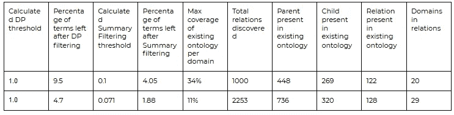
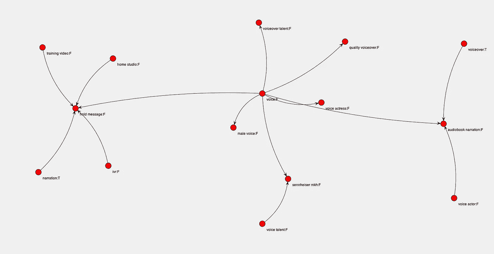

# 自动本体生成，第 2 部分:结果

> 原文：<https://medium.com/geekculture/automatic-ontology-generation-part-2-results-81ec0fe3c2cc?source=collection_archive---------9----------------------->

在之前的帖子([链接](/geekculture/automatic-ontology-generation-part-1-15fd17827418?source=friends_link&sk=144bea948b72c3070975d7605259aba1))中，我已经讨论了一个本体自动生成的过程。在这篇文章中，我将写下将这个过程应用到 Upwork 的活跃自由职业者档案集的结果。我将写另一篇文章，讨论我们使用的软件和各种实现问题。目前:

# 结果

由于理解和控制 CoreNLP(文本分析软件工具包)的困难，我们运行自动本体生成软件(简称为生成器)，以两种不同的模式实现我在以前的文章中描述的过程:仅使用词性(POS)标记器和除了使用词性标记器之外还使用依存解析器。依存解析器提供了识别复合名词的能力。比如只使用 POS tagger，“Java developer”会碰到两个独立的名词“Java”和“developer”。依赖解析器将在它们之间添加一个我们可以利用的链接。

在下表中，我使用了前一篇文章中描述的术语。为了便于记忆，“DP”代表“领域相关性过滤器”。“汇总过滤器”取决于 DP 值、DC(“域共识”)值和一个小系数。

results

顶行列出了位置标签解析的结果，底行是依赖解析器的结果。Dependency parser 在分析与 POS tagger 相同的文档后产生了更多的术语，因为 dependency parser 将复合术语添加到构成复合的术语中。也就是说，这些部分是否可以在文本语料库中自行找到。继续“Java developer”的例子，两个解析器都会找到“Java”和“developer”，但是依赖解析器也会找到“Java developer”作为复合词，所以是 3 个术语而不是 2 个。

很明显，依赖解析器产生了更有用的结果。它在大约一半的领域中发现了大约两倍于 POS 解析器的关系。在我们发现的关系和术语之间有一个重要的回忆，然而正如我们所期望的，在我们现有的本体中，一些领域比其他领域有更好的覆盖范围。我们可以自信地引导大量的域名，这些域名已经有一段时间没有升级了。例如，对于“语音天赋”领域，我们发现大约有 400 个术语绝对值得包含在本体中。在这些术语中，软件发现了几个新的关系，但是通过查看发现的关系(见下面“语音人才”域的图片)可以很清楚地看出，软件遗漏了相当多的本应存在的关系。

Voice Talent Domain relations

例如，有一个“声音”->“声音女演员”和“声音演员”->“有声读物旁白”的关系，但没有“声音”->“声音演员”或“声音女演员”->“有声读物旁白”的关系。玩弄定义关系的阈值是最接近的目标之一。当前阈值 0.4 可能太高，因此一些关系正在丢失。然而，在这项工作的开始，我们着手发现尽可能高质量的数据。这样，我们认为我们一眼就能看出这种方法是否值得花更多的时间。我们总是可以在获得基线后降低阈值。与此同时，我们的本体学家正致力于将发现的术语添加到本体中。现在我们确信这种方法值得追求，请继续关注更多的本体更新！