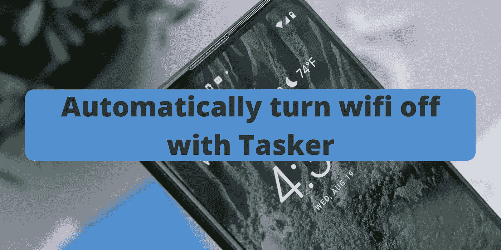
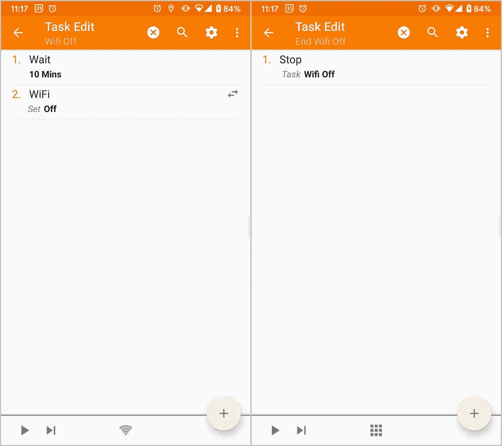
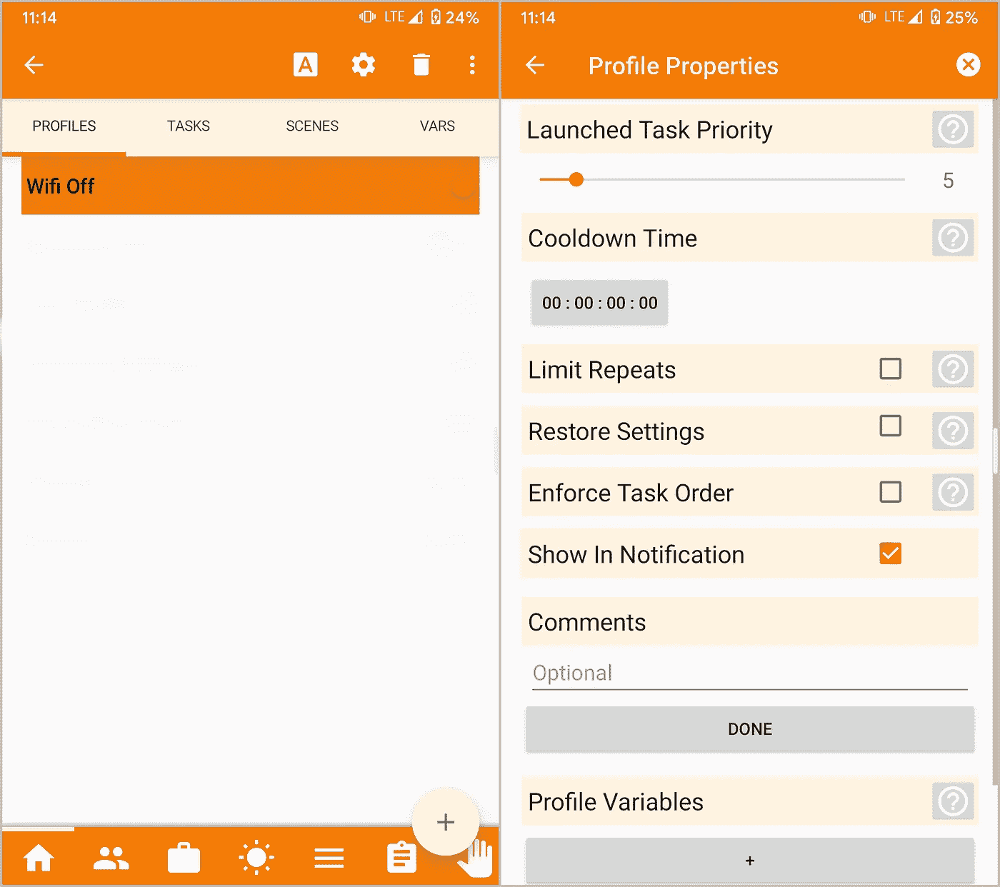

# 用 Tasker 自动关闭 wifi

> 原文：<https://medium.com/geekculture/automatically-turn-wifi-off-with-tasker-6cbd8d73362c?source=collection_archive---------1----------------------->

Photo by [Daniel Romero](https://unsplash.com/@rmrdnl?utm_source=unsplash&utm_medium=referral&utm_content=creditCopyText) on [Unsplash](https://unsplash.com/s/photos/wifi-android?utm_source=unsplash&utm_medium=referral&utm_content=creditCopyText)

几年前，一直保持连接会消耗大量电池电量。如今，随着蓝牙低能耗和电池越来越大等解决方案的出现，这已经不是什么问题了。

无论如何，有些设置用户可以在不需要的时候关闭。例如，断开无线网络时关闭 wifi 可以节省一些电池。而且，由于 Android 10 的 [*自动打开 wifi*](https://www.youtube.com/watch?v=LmIcc_ursPU)功能，你不需要记得稍后再打开它。

在这个故事中，我将展示如何在我的手机与网络断开一定时间后关闭 wifi。但是，请记住，这对于其他一些设置也是有效的。

# 第一步。确定条件

首先要做的是在 [Tasker: State A-Z](https://tasker.joaoapps.com/userguide/en/help/sh_index.html) 和 [Tasker: Variables](https://tasker.joaoapps.com/userguide/en/variables.html) 页面上查找 **Wifi 连接**状态和 **Wifi 状态** *%WIFI* 变量。

在这些页面上，您还可以找到 Tasker 监控的所有其他设置。一个例子是具有 **BT 连接**状态和**蓝牙状态***%蓝色*变量的蓝牙。

# 第二步。准备任务

我创建了两个任务: **Wifi 关闭**和**结束 Wifi 关闭**。

第一个任务等待一段时间，然后使用**等待**和 **wifi** 动作关闭 WiFi。第二个使用**停止**动作停止第一个。

# 第三步。创建配置文件

现在可以用创建的元素来设置配置文件。

配置文件条件如下:

*   **Wifi 已连接**状态:检查 Wifi 未连接。勾选*反转*选项。
*   **变量值**状态:检查 wifi 是否打开。如果对此有问题，请将上的**值设置为小写。**

它运行以下任务:

*   **Wifi 关闭**为*进入任务*。它在设备与网络断开连接时运行。
*   **结束 Wifi 关闭**作为*退出任务*。当设备已连接到另一个网络或 wifi 已关闭时，它就会运行。

配置文件属性中的**强制任务顺序**选项必须取消选中，这样才能按预期工作。这样，*退出任务*可以在*进入任务*结束之前完成。

正如开始所解释的，您也可以对其他设置使用相同的方法。下面的截图是一个蓝牙的例子。

