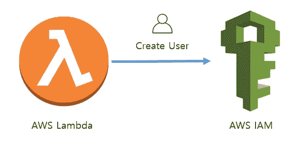

# 使用 AWS python SDK boto3 编程 AWS IAM 第 2 部分

> 原文：<https://medium.com/geekculture/automating-aws-iam-using-lambda-and-boto3-part-2-3732b9b884f8?source=collection_archive---------1----------------------->

## 创建 IAM 编程用户，并将受管或自定义策略和电子邮件凭据附加到用户。

在[第 1 部分](/@manmohan.bohara/automating-aws-iam-using-lambda-and-boto3-part-1-404eb507e85b)中，我们讨论了如何使用登录配置文件创建 AWS IAM 控制台用户。在本节中，我们将讨论如何创建编程式 IAM 用户。编程用户可以从 AWS CLI 和 SDK 使用…