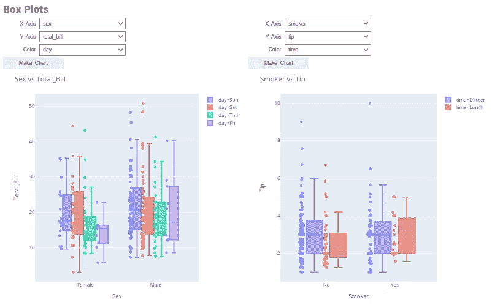

# 使用 Pywedge 实现 EDA 自动化

> 原文：<https://medium.com/geekculture/automating-eda-using-pywedge-e718e977ac32?source=collection_archive---------28----------------------->

使用 Pywedge 创建数据可视化

Pywedge(Source: By Author)

# Pywedge 是什么？

Pywedge 是一个开源的 python 库，它是一个完整的包，可以帮助您可视化数据，预处理数据，还可以创建一些基线模型，这些模型可以进一步调整，以便为数据创建最佳的机器学习模型。