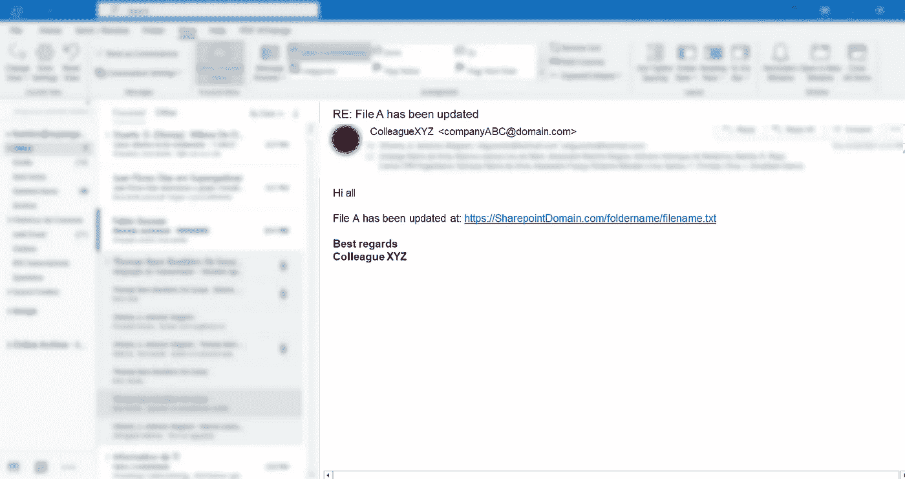

# 自动发送文件更新的电子邮件通知— Java WatchService & Mail API

> 原文：<https://medium.com/geekculture/automating-email-notifications-for-file-updates-java-watchservice-mail-api-c734d2b32cc?source=collection_archive---------11----------------------->

代码实现+用例解释

E 每天早上 8 点，当我打开我的工作笔记本电脑，打开我的微软 Outlook 收件箱时，毫无疑问我会收到**至少 7-8 封电子邮件** ，所有这些邮件都是关于在那 9 个小时*(不包括午餐时间)中下午 6 点之前的几个文件更新:*

Illustration by Author | A sample dummy screenshot to showcase an email notification about a file update from a colleague