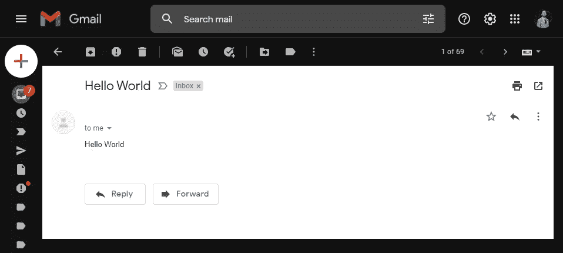
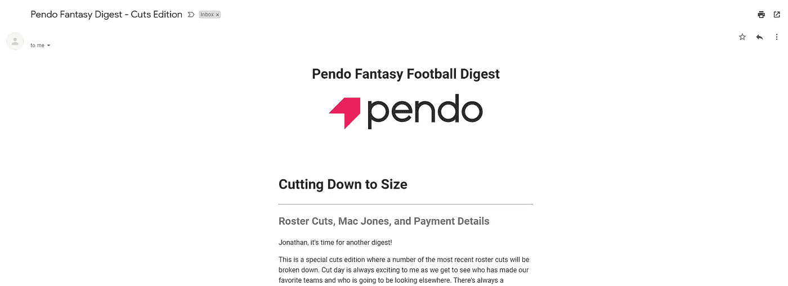

# 使用 Go 自动处理电子邮件

> 原文：<https://medium.com/geekculture/automating-emails-with-go-587a87b1f298?source=collection_archive---------12----------------------->

## 如何使用 Go 标准库发送 HTML 邮件

Photo by [Stephen Phillips - Hostreviews.co.uk](https://unsplash.com/@hostreviews?utm_source=medium&utm_medium=referral) on [Unsplash](https://unsplash.com?utm_source=medium&utm_medium=referral)

我在 7 月份开始学习围棋，以支持我从高级 QA 工程师向软件工程师职位的过渡。在此期间，我通过大量的课程、书籍和文章来学习这门语言的来龙去脉。然而，学习语言不仅仅是简单的阅读和观看视频；真正精通需要 ***做*** 。

考虑到这一点，我开始寻找需要解决的项目，以锻炼我新发现的对围棋的热爱。

# 梦幻足球和 Go

自 2016 年以来，我一直在玩梦幻足球，最初是一个单一的联赛，后来扩大到每年三个。今年，我迈出了下一步，担任 Pendo 第五季的专员。作为这种改变的一部分，我想通过给我的球员提供一些特别的东西来纪念我领导一个梦幻联盟的第一个赛季，这是一份涵盖我们联盟新闻和笔记的每周文摘。

我最初的想法是每周给联盟中的每个球员发一封电子邮件。在制定阶段，我会写一封基本的文本电子邮件，然后通过输入从谷歌表单收集的电子邮件，手动将它逐个发送给每个团员。三个联盟有 36 名成员，这注定是乏味的。

那么，我该如何加快这个过程呢？

答案？走吧。

# 导入 CSV

我要做的第一件事是从谷歌表单中导入数据，因为我肯定不会手动将 36 封电子邮件输入 Gmail。最简单的方法是以 CSV 格式下载表单，然后导入。

让我们在本教程中使用这个 CSV:

players.csv

谢天谢地，我在 Udemy 上学习托德·麦克劳德的[用谷歌的 Go 编程语言进行网络开发](https://www.udemy.com/course/go-programming-language/)课程时，已经学会了导入 CSV 文件。

我们需要做的第一件事是创建一个函数，它接受我们目录中 CSV 文件的文件名。然后使用标准的`os`包打开文件。然后，我们可以使用新打开的文件作为`csv`包的阅读器来生成一个新的 CSV 阅读器。

一旦完成，我们使用`readAll`方法收集 CSV 文件的所有行，然后遍历。

运行此命令将返回包含行数据的切片的切片。

Output from printing rows.

我们可以通过思考我们的数据是如何构成的来清理这个问题。每个切片包含一个球员的名字和电子邮件。我们可以使用该信息创建一个结构，然后创建该结构的一个空片段。这允许我们在代码中使用点符号。

一旦我们遍历了我们的行，我们就可以将行数据添加到一个 struct 文本中，并将其追加到我们的空切片中。最后，我们从函数中返回切片。

# 发送电子邮件

现在我们有了数据，我们可以用它来发送电子邮件。为此，我们将使用`net/smtp`包。我按照基本教程进行了设置。

我们需要做的第一件事是创建一个发送电子邮件的函数，在函数中导入我们的 CSV，然后遍历我们的数据。接下来，我们将为服务器构建一个结构，然后添加一个构建地址的方法。

我们现在可以构建一个包含发件人、收件人、主题和正文的邮件头。我们将在发送电子邮件时使用它。

电子邮件必须以字节发送，所以我们将字符串转换成字节，然后返回。我们现在可以构建我们的授权并使用`net/smtp`包发送一封基本的电子邮件。

运行该程序将会发送一封电子邮件，如下所示:

I clearly need to check my email more often.

这看起来不太好，是吗？

我们可以通过发送 HTML 电子邮件来稍微修饰一下。为此，我们需要修改现有的代码，使其解析 HTML 模板，然后将模板作为电子邮件正文插入。HTML 电子邮件允许我们使用公司徽标等图像，以及更吸引人的电子邮件样式。

# 设计和解析模板

首先，我们需要设计一个 HTML 模板。虽然我已经很多年没有在前端工作了，但是我想我仍然理解基本的 HTML。

我们将从添加`style`标签开始，这样我们可以使我们的电子邮件移动友好。我们最不想做的事情就是给一个无法在所有设备上阅读的用户发送电子邮件。理想情况下，我们希望我们的内容位于页面中间，占据大约 33%的屏幕空间。这样，读者不必为了阅读邮件内容而扫描整个屏幕。然而在手机上，我们希望内容占据整个屏幕。

一旦样式完成，我们就可以开始向主体添加标题和内容了。

A mobile-friendly email template.

既然我们的模板已经构建好了，我们将继续构建一个函数来解析模板，并将结果作为电子邮件正文发送出去。为此，我们需要使用 Go 的标准库中的`html/template`包。

我们可以使用`ParseFiles`函数加载一个模板文件，然后使用`bytes`包生成一个新的缓冲区。缓冲区实现了`io.Writer`接口，允许它在模板`Execute`方法中使用。最后，我们将使用缓冲区的`String`方法来返回模板的字符串版本。

将所有这些放在一起，您就可以发送如下所示的电子邮件:

The most recent edition of Pendo’s Fantasy Football Digest.

# 摘要

使用 Go 强大的标准库可以轻松发送一批电子邮件。`encoding/csv`包允许我们读取 CSV 文件，而`net/smtp`包让我们能够发送基本的电子邮件。有了`html/template`，我们可以解析丰富的 HTML 模板电子邮件，以获得更加动态的邮件。

**Jonathan Thompson** 是 Pendo.io 后端的一名助理软件工程师。他目前与妻子和一位名叫 Winston 的金发女郎居住在北卡罗来纳州罗利。你可以在 [LinkedIn](https://www.linkedin.com/in/jonathanmnthompson/) 上与他联系，或者在 [Twitter](https://twitter.com/jacks_elsewhere) 或 [Github](http://github.com/ThompsonJonM) 上关注他。