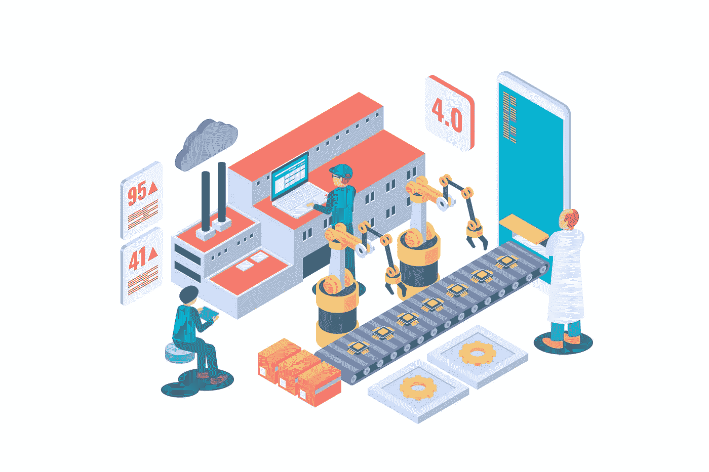

# 在没有代码自动化平台的情况下自动化脸书广告线索

> 原文：<https://medium.com/geekculture/automating-facebook-ad-leads-with-no-code-automation-platform-fb45f9720fa3?source=collection_archive---------22----------------------->

脸书广告线索帮助您找到对您的产品或服务感兴趣的潜在客户，并收集他们的信息，如姓名、电子邮件地址、电话号码等。此外，它还可以用来收集时事通讯、价格估计和业务信息的注册信息，以便将销售线索转化为交易。

以下是实施脸书领先广告的一些优势:

**1。本地功能的可用性**

用户可以通过自动填写的表格输入他们的信息，而不用离开使用 Lead Ads 的平台。通过保持你在脸书的领先地位，而不是在平台和网站之间来回转移，你可以避免干扰用户体验。

**2。对移动设备的响应能力**

脸书领先广告在移动设备上非常有用。由于响应式设计，您的销售线索将能够完成您的表单，无论他们使用什么设备来查看您的广告。因为该应用程序已经针对移动设备进行了优化，所以您可以相信您的广告也会如此。

**3。轻松收集数据**

广告商从领先广告中受益，因为他们从潜在买家那里获得信息，而无需构建新的登陆页面或转换漏斗。该平台拥有您获得新线索所需的一切，并且数据可以很容易地与您的 CRM 集成。

**4。具有高度特异性的片段**

脸书 Lead Ads 支持基于兴趣、人口统计和其他因素的细分。这表明回应你的脸书广告的人已经对你的产品或服务感兴趣了。

你知道吗？您可以使用最佳的无代码自动化平台集成和自动化脸书广告线索和其他应用程序，以充分利用其优势。

# 你如何将脸书的广告线索与其他应用程序集成，以实现流程自动化？

连接脸书领先广告、谷歌表单、WhatsApp 和 Gmail 来获取通知。以下是您可以使用 Quickwork(头号工作流自动化平台)做的事情。

点击此处了解您可以利用脸书的广告线索做些什么—[https://automation.quickwork.co/#/](https://automation.quickwork.co/#/)