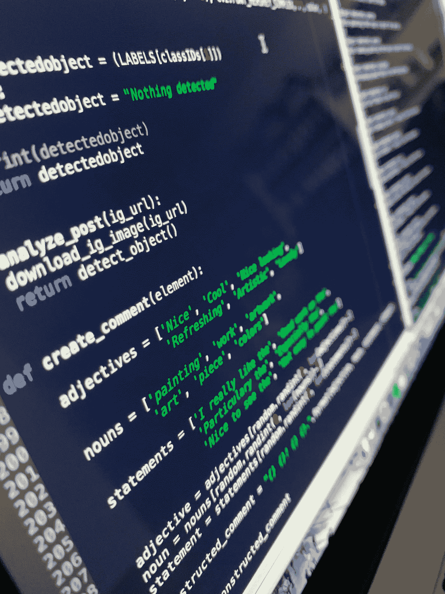
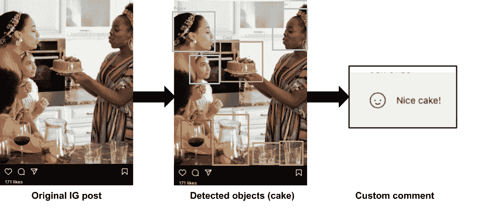
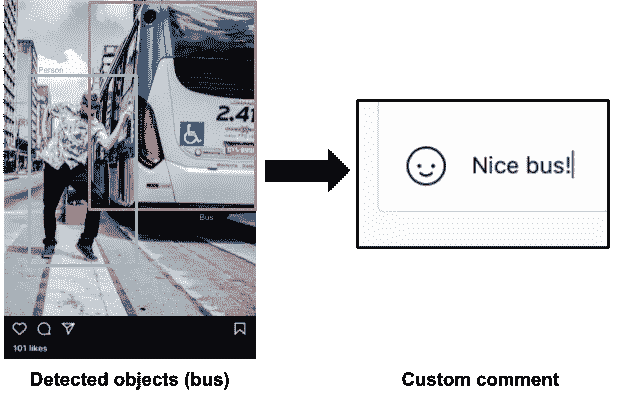
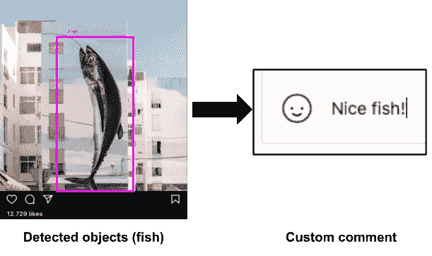
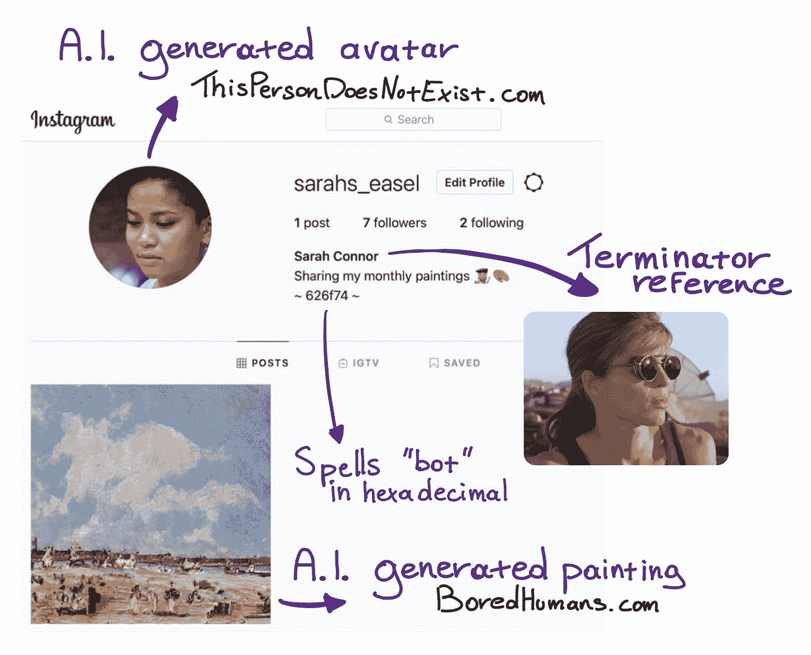
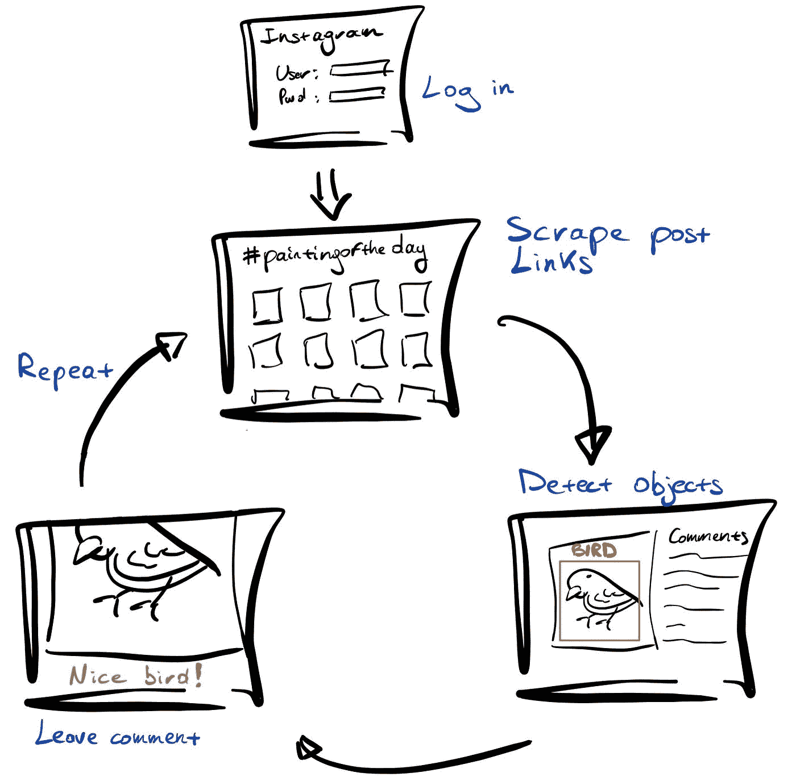
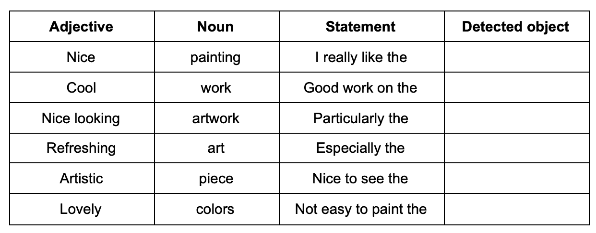
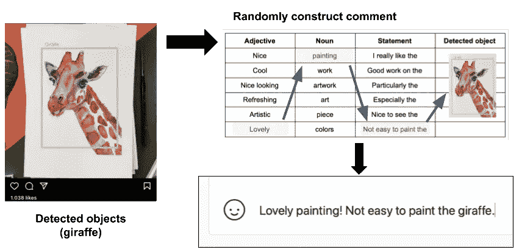
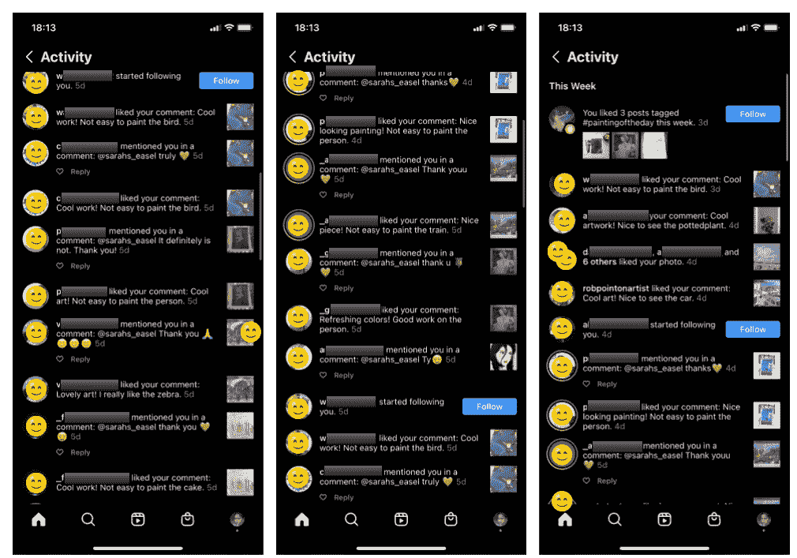

# 使用图像识别实现 Instagram 评论自动化

> 原文：<https://medium.com/geekculture/automating-instagram-comments-using-image-recognition-3db568d8d7ea?source=collection_archive---------17----------------------->

## 我使用 Python 构建了一个 instagram bot，它使用对象检测来自动生成和发布相关评论

Image by Author

# Instagram 机器人:什么，如何和为什么？

Instagram 每月约有 10 亿活跃用户，是最受欢迎的社交媒体之一。Instagram 的主要目的是与你的关注者分享照片或视频。不仅个人在 Instagram 上有自己的个人账户，从苹果到附近的花店等公司也都有账户来推广业务和分享内容。

这个平台的受欢迎程度导致了追随者的高价值。像所有的社交网络一样，你的关注者越多，就会有越多的人看到你的内容。追随者不仅会被你发布的内容的质量所吸引，还会被你提供的互动频率所吸引。如果你喜欢很多帖子并留下很多评论，你可能会吸引更多的关注者。

由于发表评论和喜欢帖子是一项耗时的重复任务，许多人试图通过创建机器人来实现自动化。机器人是简单的脚本，将执行如下操作:

*   喜欢帖子
*   留下评论
*   关注个人资料
*   等等

活跃在 Instagram 上的读者很可能遇到过明显的机器人。虽然你最喜欢的婴儿潮一代可能会爱上评论“*酷的图片！如果你关注我，你可能会赢得一部 iPhone* ”，作为一个精通技术的读者，你可能会看穿这一点，只会感到恼火。所以让我们看看我们是否能做得更好。

# 想法是:建造一个更智能的机器人

被讨厌的机器人惹恼了，我在想；有没有可能制造一个稍微聪明一点的机器人来欺骗更多的人？

而不是留下诸如“很酷的图片！”，我在考虑使用图像识别来实际检测图像中的内容，并使用输出来生成更合适的评论。

Image source: pexels.com (I could not use actual IG images for copyright reasons)

使用这种技术可能更容易欺骗人们认为是一个真实的人而不是一个机器人在发表评论。但是在我接触代码之前，我必须选择一个更具体的策略，因为我不能只是开始评论随机的帖子。

# 游乐场:今日绘画

在尝试了一些随机的帖子后，我发现创建有意义的评论是很棘手的，因为它们不太明显是由机器人写的。举个类似这样的例子:

Image source: pexels.com

在背景中留下一个关于一个随机物体的评论，比如一辆公共汽车，会很奇怪，而且会让人觉得这是电脑生成的。所以我必须想出一个主题，其中随机对象仍然相关。

想着我可以分析和评论的话题，我选择了艺术和绘画。每分钟都有新的绘画图片被上传到# paintingoftheday 标签下，人们喜欢阅读关于他们艺术的评论。此外，评论现实生活中绘画中的随机物体也不会那么尴尬，例如:

Image source: pexels.com

评论一幅画中的一个随机物体可能指的是技巧、颜色或细节。

另一个选择绘画的好理由是，我自己的个人资料也需要有内容。我是说，为什么会有人跟踪一个空的侧写？获取虚假但真实的内容并不是一件容易的事情。由于有许多人工智能模型可以生成绘画，我决定用其中的一个来冒充画家。

# 机器人:见见莎拉·寇娜

莎拉·寇娜是我的机器人的名字，她年轻，时髦，每个月都贴一张她最新画的照片。

她的名字来自电影《终结者》中的莎拉·寇娜，她的个人资料描述是十六进制的“机器人”(626f74)。

她的头像也是人工智能在 thispersondoesnotexcist.com 上生成的。我不得不刷新几次来找到一个看起来“时髦”的人，他不直视“相机”，使它成为一个更自然的化身。

Image source: Instagram.com

# 技术:机器人的内部结构

机器人必须执行并重复以下序列:

*   登录
*   获取最新# paintingoftheday 帖子的链接
*   使用图像识别来查找所述帖子中的对象
*   对帖子的评论，指的是检测到的对象。
*   重复

Image by Author

让我们仔细看看每个步骤:

## 第一步:登录

这是最简单的一步。在 Python 脚本中使用 Selenium，该机器人进入 instagram.com 并以@sarahs_easel 登录。基本上，它只是自动化你如何使用你的网络浏览器登录。

## 第二步:获取最新帖子的链接

仍然使用 Selenium，机器人现在将导航到 Instagram 页面，显示所有# paintingoftheday 帖子。现在是时候调用另一个库了，Beautiful Soup 4，它将从源代码中抓取所有的文章链接。这会生成一个长长的 instagram URL 列表，其中包含标签为“今日绘画”的帖子。列表中的第一个 URL 是最近的帖子。

## 第三步:检测物体

使用 BS4 从 Instagram 下载图片并不那么简单，所以作为一种变通方法，我使用 Selenium(浏览器自动化)导航到帖子并截图。这个本地存储的截图被输入到一个名为 [YOLO](https://pjreddie.com/darknet/yolo/) 的预先训练好的图像识别模型中。

该模型将扫描图像并返回找到的具有匹配置信度的所有对象。为了简单起见，我只使用了可信度最高的对象。为了防止图像没有返回任何对象，我在下一篇文章中提供了模型。这个过程不断迭代，直到返回一个带有检测到的对象的绘画。

## 第四步:留下评论

现在是过程中的关键步骤；留下评论。

为了生成评论，我起草了一个包含不同部分的表格；

Image by Author

Python 脚本将从每一列中选择一个随机值来创建注释，如下所示:

令人耳目一新的工作！尤其是【被检测对象】。

注释的最后一部分是 AI 模型检测到的对象(在步骤 3 中)。同样，我们将求助于 Selenium 来自动化浏览器的使用，并在文章下键入评论。

Image source: pexels.com

就这样，机器人完成了它的工作。如果我们幸运的话，收到评论的用户很好奇，会看看 Sarah 的个人资料并关注她。

# 其他任务

除了发表评论，莎拉·寇娜还有 3 个任务:

*   避免被发现
*   记录她的工作
*   自己发布内容

## 避免被发现

机器人令人讨厌，产生虚假内容，总体来说对 Instagram 几乎没有贡献。因此，Instagram 像其他任何社交媒体一样，试图搞垮机器人。莎拉·寇娜的部分任务是不被发现，但这并不容易，因为我不知道 Instagram 用什么标准来标记机器人的行为。为了保证安全，我使用 cron 设置了一个非常低的活动级别，如果我成功了，以后可能会提高这个级别。

目前的模式如下:

*   东部时间上午 8 点开始一天的工作
*   每隔 5 到 15 分钟发表一条评论(保持随机)
*   80 条评论之后，应该是美国东部时间晚上 10 点左右，是时候收工了。
*   第二天重复

我知道 80 条评论不算多，但更多的是关于实验。请记住，只需改变几个变量，我就可以轻松地将它扩展到每天 1000 篇帖子。然而，这将带来更高的被检测到的风险。

## 记录工作

作为一名数据极客，我理解“测量即了解”的原则，所以我让 Sarah 记录她的工作。我曾短暂地考虑过建立一个 PostgreSQL 数据库，但我意识到一个简单的 csv 就足以记录这个项目的进展。每次迭代后，机器人会向 csv 添加包含日期时间、检测到的对象、帖子 url、评论等数据的行。

## 发布内容

莎拉的画是由[boredhumans.com](https://boredhumans.com/art.php)生成的。最初，我还计划将发布过程自动化。但在摆弄了 Chrome 中的 Selenium 和手机模拟器后，我发现在 Instagram 上自动发布内容有点麻烦。因为低频率的贴画是可以接受的(毕竟画它们需要时间对吧？)我满足于每月手动上传一幅新画。

虽然这与我想自动化整个过程的理念有些冲突，但我也不想因为一个技术障碍而阻碍整个项目。

# 结果:好机器人还是坏机器人？

虽然我没有遇到任何大的障碍，但我花了相当长的时间来编写代码。想法是将代码部署在一台 Raspberry Pi 计算机上，让它全天候运行。但是当然在部署它之前，我想在我的本地系统上运行一个测试。

## 试运转

在测试之前。我已经分别测试了大部分功能(比如登录、发表评论、解析图片等)。在组合了所有函数并添加了一些计时器之后，是时候进行大测试了，我让脚本运行，直到它成功发布了 10 条评论。

当我看着机器人努力工作，Selenium 自动化我的浏览器时，不到两分钟就有人回复了第一条评论；

Image source: Instagram.com

我的第一个想法是“哦，该死的，这似乎真的很好”，但后来我想到了电脑后面的人。这个人可能在这幅画上花了很多时间和精力，并且似乎对有人注意到并欣赏它感到非常兴奋。他/她很少知道，这种欣赏只不过来自于一个 Python 脚本。当机器人继续工作时，更多类似的评论开始出现在我的通知中。回复率真的很高(不可否认是在一个很小的样本中)。这实际上很有意义，因为顶部从最近的帖子开始，这意味着发布这幅画的人很可能仍在使用该应用程序。

不幸的是，并非所有的评论都切中要害。预训练模型可以检测的对象数量有限，并且不总是那么准确。例如，如果画旁边有一个咖啡杯，它可能指的是咖啡杯而不是画本身。或者在其他情况下，它可能会将彩色手机壳与蛋糕或其他东西混淆，

总的来说，我认为测试结果足够好，可以将脚本部署到 Raspberry PI 上。

然而，…

## 道德困境

这个项目的假设是看看我是否可以使用简单的图像识别算法来构建一个动态的 Instagram 机器人。然而，由于太专注于技术挑战，我没有对“屏幕背后的人”给予足够的关注。

Image source: memegenerator.net

在非常有限的测试运行中，几乎每个人都回复了评论，导致我的通知看起来像这样:

Image source: Instagram app

人们自然地、理所当然地为他们的作品感到骄傲，所以看到他们因 Python 脚本的虚假赞美而欣喜若狂感觉不对。虽然我真的很好奇，也很兴奋，想看看我能把这个项目进行到什么程度，并人为地增加一个社交媒体帐户，但我决定不让这个机器人运行。看到人们被虚假的赞美弄得如此兴奋，这是我无法忍受的。

此外，我也避免了公开代码的最初计划，因为我不想让一些道德沦丧的广告公司使用它。这不是火箭科学，任何有一些基本的网页抓取和图像识别技能的人都可以建立它，但我不想降低更多的门槛。

# 机器人在行动

通常，我总是用文章来描述我的项目。对于这个特殊的项目，我做了一个很好的屏幕记录，展示了机器人的行动。鉴于屏幕录制本身需要一些内容，我决定探索一些新的领域，并录制一个简短的 YouTube 视频来描述这个项目。尽管我花了很多时间审查所有的用户名和评论，但不幸的是，我收到了可能侵犯版权的投诉。为此，我删除了视频。如果我有时间和动力去模糊视频中的一切，我会把它发布在我的社交媒体账户上。

# 结论

## 好机器人

总的来说，我对结果很满意。尽管测试非常有限，但结果看起来很有希望。总的来说，好的评论是好的，更重要的是，instagram 用户与评论互动，似乎相信它们是真实的。

此外，不太准确的结果也没什么大不了的。当评论没有意义时，人们可能会理解它是一个机器人(也可能不是)，不会关注莎拉·寇娜的个人资料，但这可能是它的结束。当然，如果莎拉有更多的追随者，那么过于频繁地被标记为机器人可能会有风险。

## 改进的余地

如上所述，这是现有脚本技术的一个相当简单的组合，留下了大量的改进空间。有些事情我本可以做得更好:

*   为评论创造更好的措辞。也许用 GPT 3 号。
*   使用更好的图像识别模型，可以检测更广泛的对象
*   进一步扩展脚本，使其也能跟踪回复
*   自动发布内容

## 进一步研究

一开始我考虑在决定不部署后彻底放弃这个项目。但是再考虑一下，我可能会稍微改变一下路线。我想到的一些事情是:

*   做一些比发表评论和仅仅使用图像识别来分析内容更不具侵犯性的事情。
*   专注于其他话题，而不是艺术作品。
*   尽可能多地移除浏览器自动化，让整个解决方案变得没有头绪。

我还不确定我是否会继续这个项目，但如果我做了，我一定会分享结果。

## 未来就在现在

这个项目显示了愚弄人是多么容易。我自己可能也会被愚弄，以防机器人会回复这篇文章，说什么“好文章。我真的很喜欢 web scraping 的应用。

我不想太哲学化，但是人类和计算机生成的内容之间的区别越来越模糊。现代计算机生成内容的可能性、质量和规模都在不断提高。正因如此，我会建议大家保持警惕，对网上看到的一切都要半信半疑。

最后，我想向少数参与测试并收到虚假评论的人道歉。

人工智能研究员莱克斯·弗里德曼最近分享了威廉·莎士比亚的这句话，我认为这可能是结束这个项目的合适的话；爱所有人，信任少数人，不伤害任何人。

如果你想看看我做的其他东西，比如咕哝说唱探测器，一定要看看我的个人资料。或者通过我的网站与我联系: [https://www.zhongtron.me](https://www.zhongtron.me/)

快乐编码:)。