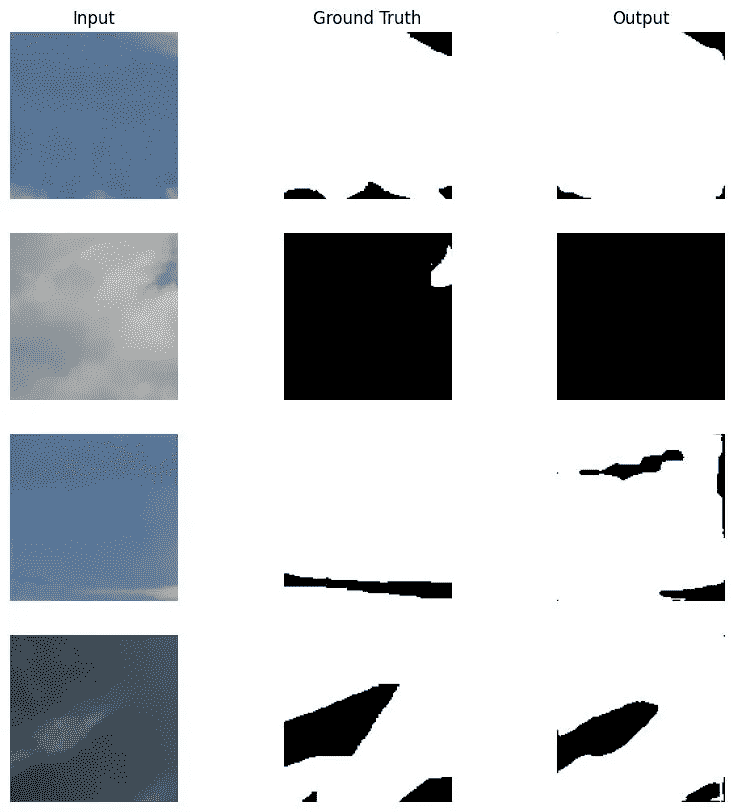
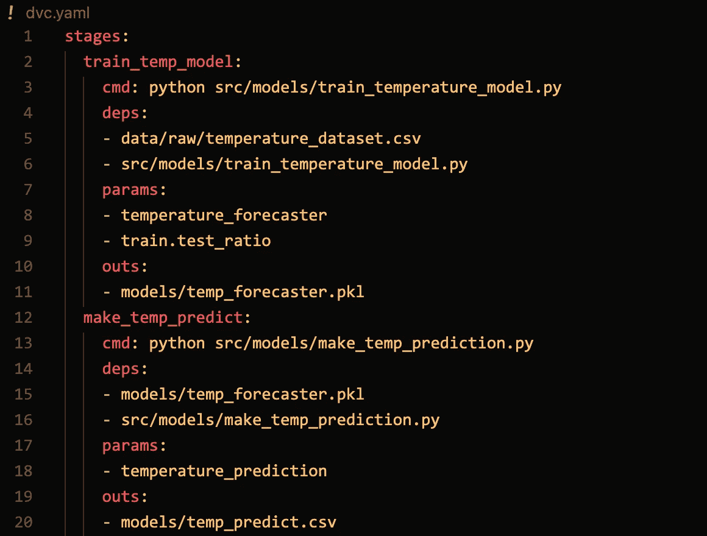
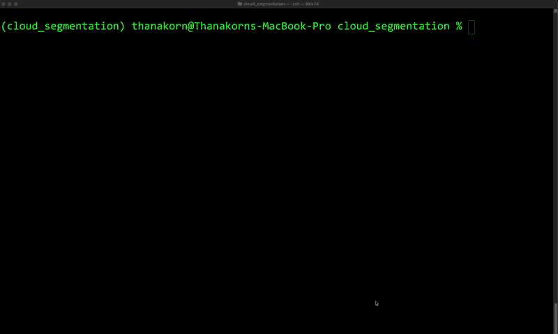
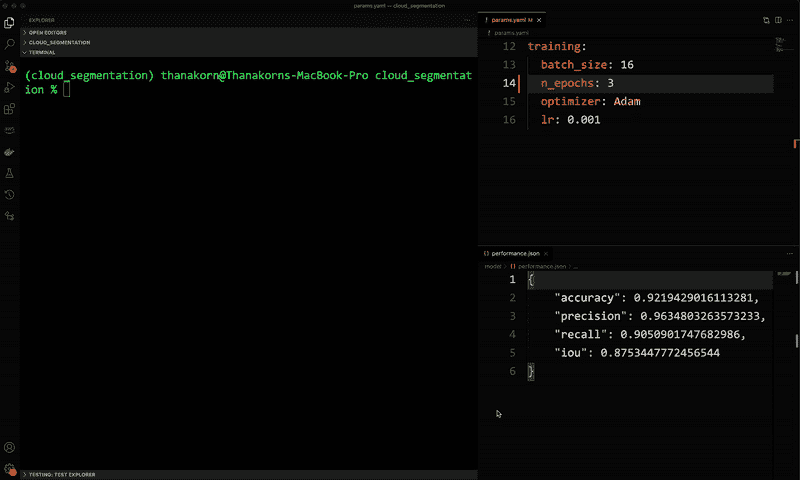
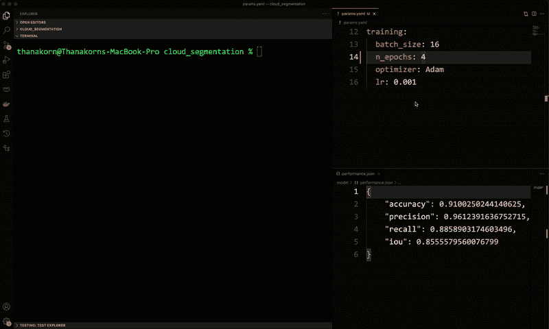

# 使用 DVC 自动化 ML 工作流

> 原文：<https://medium.com/geekculture/automating-ml-workflow-using-dvc-a649efd43e30?source=collection_archive---------10----------------------->

## 实践教程

# 介绍

我在之前的[帖子](/@thanakornpanyapiang/3-reasons-why-you-should-automate-your-machine-learning-workflow-9b59b4a0aa6)中解释了自动化 ML 工作流如何有利于 ML 开发人员的生产力。在本文中，我将一步一步地展示如何使用名为 DVC 的开源工具做到这一点。

我们开始吧！

# 项目详细信息

我们将建立一个工作流程，用于训练语义分割模型来识别图像中的云。本项目的数据集来自于 Q. Li，W. Lu，J. Yang 的论文*A Hybrid Thresholding Algorithm for Cloud Detection on Ground-Based Color Images】*，该论文可从 github 知识库 *下载。*这里是我们希望从训练好的模型中得到的一些样本输出。



Samples of final results.

构建模型的工作流程分为以下 4 个阶段:

1.  **数据预处理**:数据集中的图像大小不同。为了使模型训练更有效，我们将把它们分成大小相等的小块。
2.  **数据验证**:拆分后有很多面片是无云的。我们将只选择有大量云的图像，这样数据集就不会被负类淹没。此外，在这一阶段，我们将把所有图像分为训练集、验证集和测试集。
3.  **模型训练**:我们将训练一个深度学习模型来对图像中的云像素进行分类。在这个项目中，我们使用的模型是 UNet。
4.  **模型验证:**我们将测量一些性能指标，看看模型的表现如何。

该项目由 4 个 Python 脚本组成，其中每个脚本分别代表工作流的一个阶段，如下所示:

*   `**split_image**.**py**`
*   `**select_image.py**`
*   `**train_model.py**`
*   `**eval.py**`

脚本的所有参数都在如下的`params.yaml`中。

```
preprocessing:
  patch_height: 128
  patch_width: 128
  min_cloud_ratio: 0.05
  val_ratio: 0.1
  test_ratio: 0.2model:
  n_classes: 1
  in_channels: 3training:
  batch_size: 16
  n_epochs: 10
  optimizer: Adam
  lr: 0.001
```

这个项目的代码在这个[仓库](https://github.com/thanakorn/cloud_segmentation/tree/v1)里。

传统上，您必须逐个手动运行每个脚本。但是，这是非常低效的。我们希望有一个单一的命令来为我们做所有的事情，而且它应该比简单地运行所有的事情更智能。例如，如果模型参数被更新，它应该知道只有`train_model.py`和`eval.py`需要运行，因为这种变化与数据预处理无关。

# 该工具

我们用来自动化工作流程的工具是 DVC。首先，您必须在您的项目中安装并启动它，这很简单，只需使用以下命令。一旦完成，你就可以开始了(如果你想学习 DVC 的基础知识，看看这个[帖子](/@thanakornpanyapiang/data-versioning-with-dvc-a474af1247f5)):

```
pip install dvc
dvc init
```

然后，你必须创建`dvc.yaml`文件，其格式如下:



Sample dvc.yaml file. (Image by author)

`dvc.yaml`定义您的工作流程。`stages`部分包含流程的所有阶段。每个阶段有如下三个组成部分:

*   `cmd` 执行该阶段的命令。支持任何 Unix 命令。
*   `deps` 阶段所依赖的文件或文件夹。通常，这个部分包含代码文件及其所有输入。
*   `params` 这指定了`params.yaml`文件中的阶段参数。您可以在 YAML 文件中指定一个特定值或一个部分。
*   `outs`
    舞台产生的输出。与`deps`类似，文件和目录都支持。每个阶段必须至少有一个输出，否则就是错误。

请注意，`dvc.yaml`文件中的顺序并没有定义工作流程的顺序。DVC 将根据每个阶段对另一个阶段的依赖性来解决订单问题。

# 添加阶段

让我们将第一个阶段`split_image.py`添加到工作流中。该脚本获取文件夹`data/images`和`data/gt`中的所有图像，并根据`params.yaml`的`preprocessing`部分中配置的大小将它们分割成小块。然后，将所有补丁保存到`data/preprocessed/images`和`data/preprocessed/gt`文件夹中。所有这些分别是阶段的依赖、参数和输出。所以，我们要做的就是把它们放入`dvc.yaml`的相关部分，就像这样

```
stages:
  split_image:
    cmd: python src/workflow/split_image.py
    deps:
    - src/workflow/split_image.py
    - data/images
    - data/gt
    params:
    - preprocessing.patch_height
    - preprocessing.patch_width
    outs:
    - data/preprocessed/gt
    - data/preprocessed/img
```

要执行工作流，只需在终端中运行以下命令

```
dvc repro
```

完成后，所有的依赖项和输出都会自动进行版本控制，这意味着如果您进行了更改，但不喜欢结果，您可以随时将其恢复。此外，如果您运行工作流而不做任何更改，您会得到以下结果:

```
Stage 'split_image' didn't change, skipping                                     
Data and pipelines are up to date.
```

没有不必要的运行。越来越聪明了，对吧？

# 将所有阶段链接在一起

将其余部分添加到工作流类似于第一个。首先列出所有相关数据，然后将它们逐个放入`dvc.yaml`文件中。以下是其余阶段的依赖项、参数和输出:

*   `**select_image.py**`
    -依赖:`data/preprocessed/img``data/preprocessed/gt`
    -参数:`min_cloud_ratio``val_ratio``test_ratio`
    -输出:`train.txt``val.txt``text.txt`
*   `**train_model.py**`
    -依赖:`train.txt`和`val.txt` -参数:`params.yaml`
    中`model`和`training`下的所有内容-输出:`model/model.pth`
*   `**eval.py**` -依赖:`model/model.pth`和`data/preprocessed/test.txt` -参数:-
    -输出:`model/performance.json`

我们通过使一个阶段的输出成为下一个阶段的依赖项来将阶段链接在一起，以此类推。这样，工作流变得比把所有东西都放在一个文件或笔记本里更容易维护和追踪。当然设计需要时间，但是相信我，这是值得的。

综上所述，`dvc.yaml` 文件看起来是这样的:

```
stages:
  split_image:
    cmd: python src/workflow/split_image.py
    deps:
      - src/workflow/split_image.py
      - data/gt
      - data/images
    params:
      - preprocessing.patch_height
      - preprocessing.patch_width
    outs:
      - data/preprocessed/gt
      - data/preprocessed/img
  select_image:
    cmd: python src/workflow/select_image.py
    deps:
      - src/workflow/select_image.py
      - data/preprocessed/img
      - data/preprocessed/gt
    params:
      - preprocessing.min_cloud_ratio
      - preprocessing.val_ratio
      - preprocessing.test_ratio
    outs:
      - data/preprocessed/train.txt
      - data/preprocessed/val.txt
      - data/preprocessed/test.txt
  train_model:
    cmd: python src/workflow/train_model.py
    deps:
      - src/workflow/train_model.py
      - data/preprocessed/train.txt
      - data/preprocessed/val.txt
    params:
      - model
      - training
    outs:
      - model/model.pth
  eval:
    cmd: python src/workflow/eval.py
    deps:
      - model/model.pth
      - data/preprocessed/test.txt
    params:
    outs:
      - model/performance.json
```

现在，当你运行`dvc repro`时，整个过程按正确的顺序执行，你会得到你想要的最终结果。



Image by author

从现在开始，`dvc repro`是我们需要产生结果的唯一命令。不需要记住哪个脚本做什么，或者哪个跟随哪个。都是自动的。

# 当数据被修改(和恢复)时

假设我们希望训练一个模型的时间长一点，所以我们增加了`params.yaml`中的历元数。关于数据预处理没有什么变化，对吗？因此，当我们运行时，只需要执行`train_model`和`eval`。让我们看看进展如何。



Image by author

正如我们所希望的那样，只运行必要的阶段，它会自动发生。不需要人工决策。这也适用于其他类型的变化。比如数据文件夹里有新的图片，Python 脚本被修改等等。

工作流程完成后，我们发现我们更喜欢旧的。因此，我们决定恢复超参数并重新运行



Image by author

嘿，看，旧的结果被缓存了。我可以在瞬间恢复它们。不需要重新培训。

如果你想自己尝试一下，代码可以在这里[找到。](https://github.com/thanakorn/cloud_segmentation/tree/dvc-integration)

# 结论

我们已经学习了如何使用 DVC 来自动化数据科学项目的 ML 工作流。为了使这篇文章简明扼要，我略去了一些关于 DVC 的细节。如果你认为这是一个很棒的工具，并且想长期使用它，我强烈推荐你进一步研究它(我也有一篇关于 DVC 基础的[文章](/@thanakornpanyapiang/data-versioning-with-dvc-a474af1247f5))。

最后一件事，记住这个工具只是帮助你更容易和更快地完成你的工作。构建组织良好且可重复的数据科学项目始于您的工作方法。如果你仍然以一种无组织的方式工作，比如把所有的东西都放在一个笔记本里，那么任何工具都是无用的。但是，如果你花时间设计它如何正常工作，把整体分成一个小的可管理的部分，你就真的接近目标了。

感谢阅读。如果你喜欢这篇文章，你可以[在 Medium 上关注我](/subscribe/@thanakornpanyapiang)。下一篇文章再见。