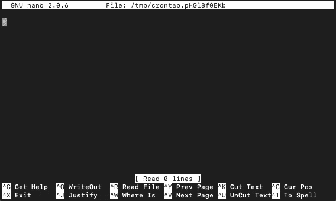

# 使用 crontab 在本地自动化 Python 脚本。

> 原文：<https://medium.com/geekculture/automating-python-scripts-locally-using-crontab-2031151b559f?source=collection_archive---------19----------------------->

## 终极省时器。


## 介绍

在本文中，我将展示如何在您的个人机器上轻松地自动执行任何 python 脚本。

让我分享一个简短的故事来说明为什么这是有用的。

在疫情期间，我的大学实施了一项协议，要求学生每天早上在可以使用校园设施之前，在大学网络上填写一份在线调查。在这项调查中，一个人必须手动否定前一天经历的症状，或与可能有传染性接触的人接触过。虽然这样做的目的无疑是高度合法的，结果非常有效，但在通常的“没什么可报告的”情况下，它需要积极的否定，这一事实使它有点费力和烦人。当任务既费力又烦人时，它们是自动化的完美目标。因此，我在寻找一种方法来扭转对行动的需求，并编写一个脚本来填充我的在线调查，这样我只需要在我有症状或接触报告的情况下进行干预(幸运的是，这从未发生)。声明:尽管有很多人感兴趣，但出于安全考虑，我故意不与任何人分享实际的脚本。

然而，让我分享一下**我是如何**做到的。

为了使任务自动化，需要两个步骤:

*   首先，您需要编写一个 Python 脚本来完成这个动作。根据您的应用程序，这可能包括几个不同的步骤。在我的例子中，这相对简单，因为它只需要导航到正确的 web 地址，定位特定的 HTML 元素，并与它们进行交互。
*   其次，您需要一种在正确的时间(和正确的环境)自动执行这个脚本的方法。

首先，让我们考虑一个类似于我用来自动填写每日 Covid 症状调查的 web 抓取脚本的例子。

## 示例脚本

在继续之前，确保您已经安装了 [selenium](https://selenium-python.readthedocs.io) ，这可以使用 pip 或 conda install 轻松实现。它是使用 Python 进行网络抓取的主流包。

`pip install selenium`

Selenium 提供了一个简单的 API，允许您的 Python 脚本访问 WebDriver 的全部功能，web driver 是一个自动化的软件，它控制您的浏览器，并允许您以与人类用户相同的方式与任何网页进行交互。为谷歌 Chrome 安装 Chrome 驱动程序是一个显而易见的选择。安装后，将脚本定向到 WebDriver，如下所示:

```
from selenium import webdriverdriver = webdriver.Chrome("/Applications/chromedriver")
```

其中 cromedriver.exe 的位置作为参数传递。

driver 对象有大量有用的方法，允许脚本访问网页并与其 HTML 元素交互。举个例子，

```
driver.get("https://some-url")login = driver.get_element_by_id("Login")
login.click()
```

运行后，将打开 Chrome，转到指定的 URL，找到 ID =“log in”的 HTML 元素，然后单击它，模仿人类的动作。您还可以通过名称或类别轻松定位网页元素，您可以通过检查源代码轻松查找一次(在 Chrome 中，只需右键单击并“检查”)。

在我的例子中，在从一个单独的配置文件中加载我的网站特定的凭证之后，我继续像这样登录我的帐户:

```
from config import username, passwordusername_field = driver.find_element_by_id("username")
username_field.send_keys(username)pw_field = driver.find_element_by_id("password")
pw_field.send_keys(password)submit_button = driver.find_element_by_name("Submit")
submit_button.click()
```

提交调查是相应完成的…关于与页面交互的更多详细信息和 selenium 提供的许多功能，请查看[这个](https://selenium-python.readthedocs.io/locating-elements.html)页面。

现在让我们考虑第二步。假设我们有一个工作的 Python 脚本，我们如何自动化它的执行？当然，每当我们想要执行脚本和处理任务时，我们可以去我们的机器并运行它，但是如果我们甚至根本不需要担心手动初始化执行，那将会更整洁(和更有用)。与将脚本部署到提供定时执行的在线云服务(这是另一种可能性)不同，有一种非常简单的方法可以在本地调度任何脚本的执行。

## Crontab

对于任何一个 macOS 上的人来说，这种简单的方式叫做 crontab。它基于默认的软件实用程序 cron，这是一个基于时间的作业调度程序，适用于类似 Unix 的计算机操作系统，包括 macOS。对我来说，它被证明是必须有用且易于使用的开发工具之一，它节省了我数小时的时间和内存。

因此，让我们来看看如何将脚本添加到 Mac 的内部时间表中。在终端中，输入:

```
env EDITOR=nano crontab -e
```



Crontab Nano Editor with menu bar.

这将打开 nano 编辑器，应该是这样的。现在，您可以通过使用以下语法指定第一行来将 cron 作业添加到列表中:

```
* * * * *  command to execute
│ │ │ │ │
│ │ │ │ └─── day of week (0 - 6) (0 to 6 are Sunday to Saturday, or use names; 7 is Sunday, the same as 0)
│ │ │ └──────── month (1 - 12)
│ │ └───────────── day of month (1 - 31)
│ └────────────────── hour (0 - 23)
└─────────────────────── min (0 - 59)
```

其中星形选择所有值。因此，如果我的 web 抓取脚本应该在每天中午 12 点运行，我应该输入:

```
00 12 * * * cd User/PythonScripts/folder && OnlineSurveyScript.py
```

其中 *cd* 导航到右边的文件夹， *& &* 后面的文件是 Python 脚本。玩一玩，熟悉一下这里的语法。

此外，通过在 crontab 文件的顶部插入`MAILTO="<email adress>"`,您可以将脚本文件的输出或最终的错误消息发送到您的电子邮件地址。我建议你这样做，这样你就能及时了解工作的最新情况。如果您喜欢安静地运行作业，只需离开`MAILTO=""`。

保存并退出。就是这样。

所有这一切的吸引力在于，这两个工具结合起来，可以让您轻松实现无数有趣任务的自动化。想象一下，例如，一个脚本，每天早上开市前从雅虎财经(或 Reddit…)下载最新的金融数据，执行一些你选择的计算，然后将结果发送到你的手机，或直接发送到你的交易算法。或者，它可以唤醒并扫描某一类别的亚马逊产品，寻找当天的最佳销售优惠，等等。对于其中的大多数产品，您甚至不必自己进行网络搜索，因为有许多 API 包装程序。

对于更高级的目的，您可能想考虑更复杂的基础设施。然而，对于小的个人任务，这会节省你很多时间和精力，甚至可能给别人留下深刻印象。