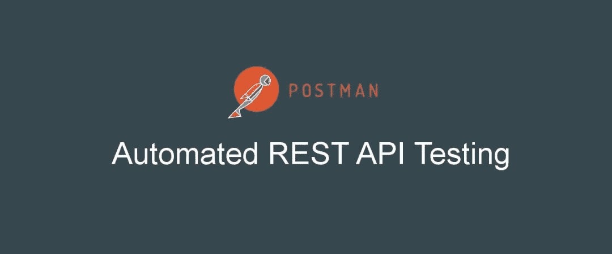
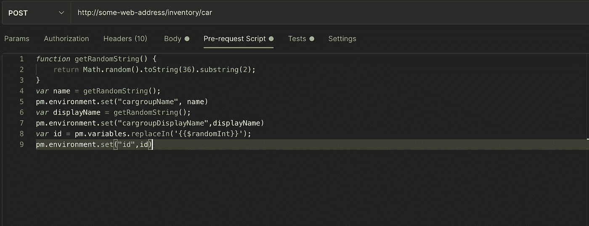
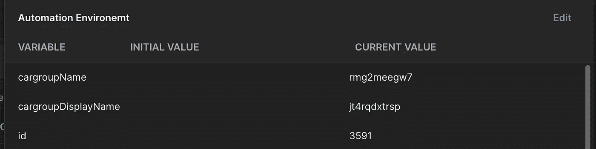
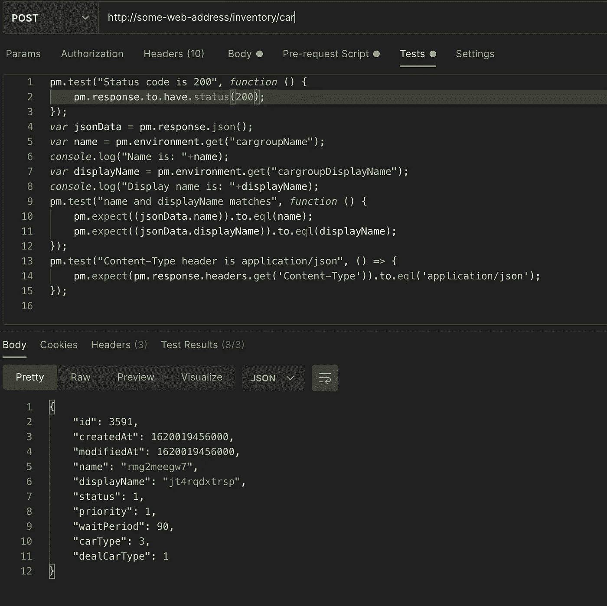
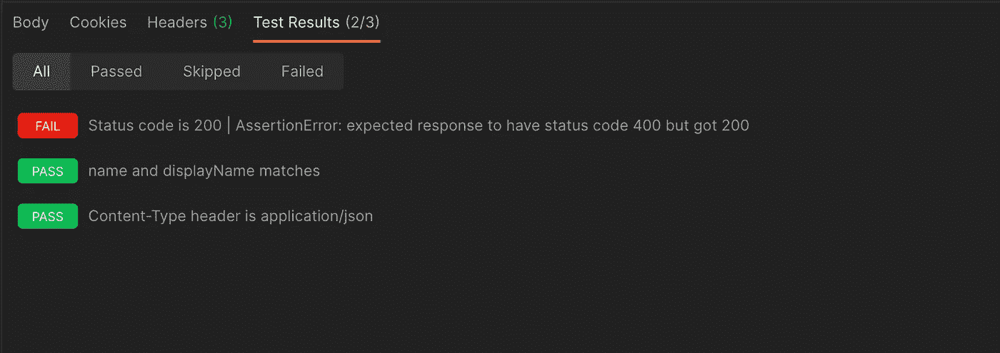
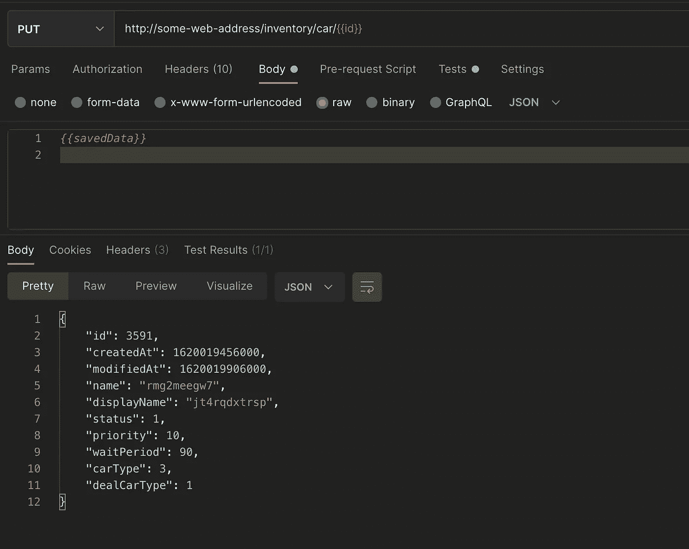
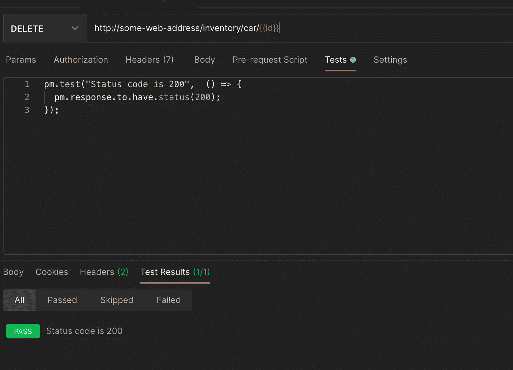
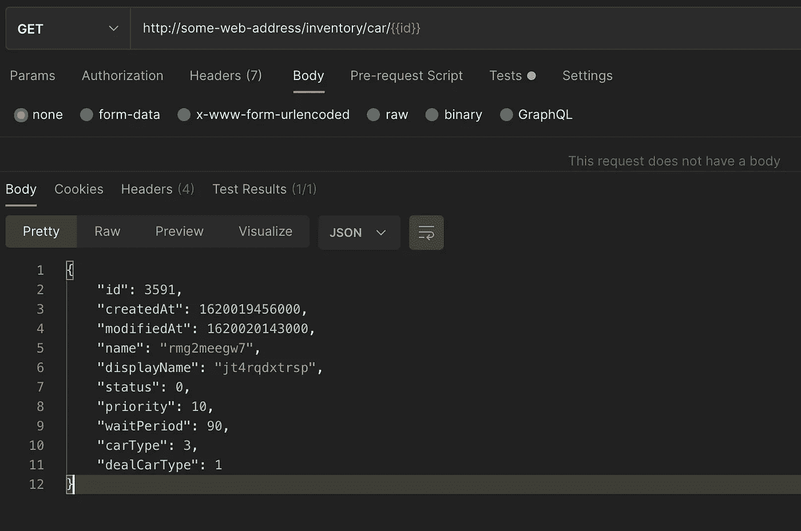
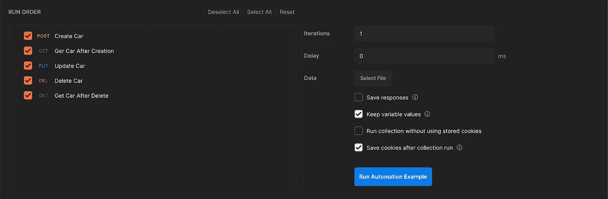
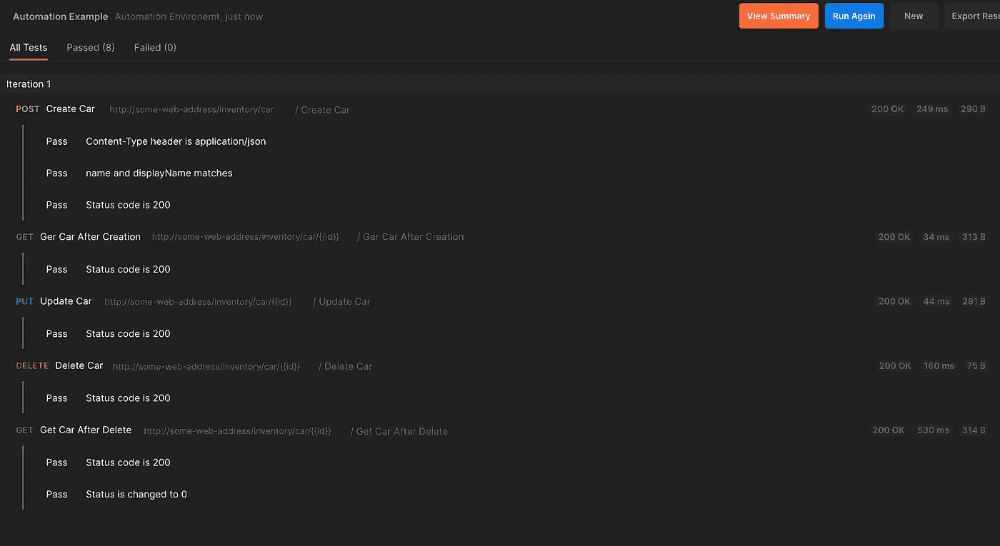

# 邮递员:自动化 Rest APIs

> 原文：<https://medium.com/geekculture/automating-rest-apis-with-postman-c740049b56dd?source=collection_archive---------6----------------------->

Postman 是测试 API 的优秀工具。后端开发人员、web 开发人员、移动开发人员和 QA 测试人员都可以使用它。Postman 不仅用于手动测试 API，也是一个很好的自动化工具。

可以使用 JavaScript 编写自动化脚本，在 [chai.js](https://www.chaijs.com/) 中编写断言，这是一个 BDD/TDD 断言库。Postman 允许与[纽曼](https://www.getpostman.com/docs/v6/postman/collection_runs/command_line_integration_with_newman)一起运行测试，并添加到您的构建管道中。您还可以使用 [Junit](https://junit.org/junit5/) 和 Newman 导出测试报告。本文的范围仅限于编写测试脚本。

## 编写测试脚本

你可以在 Postman 的两个地方添加 Javascript 代码。

1.  [预请求脚本](https://learning.postman.com/docs/writing-scripts/pre-request-scripts/):在请求运行之前，您可以在 Postman 中使用预请求脚本来执行 JavaScript。在**预请求脚本**选项卡下，您可以添加 JavaScript 代码来设置变量值、参数、标题和请求主体数据。
2.  [测试脚本](https://learning.postman.com/docs/writing-scripts/test-scripts/):您可以使用**测试**标签来编写测试脚本。您的测试脚本可以使用动态变量，对响应数据执行测试断言，并在请求之间传递数据。测试脚本将在请求运行后执行。您将能够在响应数据旁边的**测试结果**选项卡中看到输出。

您可以将预请求和测试脚本添加到集合、文件夹、集合中的请求或未保存到集合的请求中。

在本文中，我们将讨论如何自动化 POST、GET、PUT 和 DELETE APIs。在 Postman 中实现自动化需要基本的 JavaScript 知识。

## **发布请求**

在自动化过程中，我们将考虑以下请求和响应。

***终点:***

> http://some-web-地址/库存/汽车

***请求体:***

***回复正文:***

每次触发请求时，API 需要不同的 id(整数)、name(字符串)、displayName(字符串)。让我们看看如何将随机值传递给这些字段。

我们可以使用以下函数/库在请求中生成随机/动态数据。

1.  [faker.js](https://www.npmjs.com/package/faker) : Faker.js 是一个 JavaScript 库，它公开了在运行时生成随机数据的函数。
2.  `Math.random()`:此方法返回大于等于 0.0 小于 1.0 的伪随机双精度值。
3.  JavaScript Lodash _ : `_.random (min,max)`生成给定范围内的随机整数。

***前置请求脚本***

Pre-request Script

在上面的脚本中，我们首先使用`Math.random()`来生成随机字符串。**名称**和**显示名称**。接下来，我们创建一个环境变量 **cargroupName** 并将其值设置为**名称**和变量 **cargroupDisplayName** 并将其值设置为**显示名称**。为了设置环境变量 **id** 的值，我们使用了`faker.js`提供的函数`$randomInt`。

或者，我们可以使用`pm.environment.set(“id”,_.random(1000,10000))`来设置环境变量 **id** 的值。其返回值介于 1000 和 10000 之间。

环境变量中设置的所有值都将在请求正文中使用。

Request Body

Environment Variables

在执行之前，将运行预请求脚本并设置变量值。这些值将在请求正文中使用。现在让我们看看测试脚本看起来会是什么样子。

Test Script And Response

Passed Test

我们已经使用`chai.js`编写了断言。上面的测试脚本包含了三个由`pm.test()`定义的测试。我们也可以使用`console.log`登录到 postman 控制台。让我们看看失败的测试是什么样的

Failed Test

## 获取请求:

现在我们想使用 GET 请求读取创建的资源，id 应该从 POST 响应中传递。我们只需要将 **id** 放入 API 端点，因为它已经被设置为环境变量。

***终点:***

> [http://some-web-address/inventory/car/{ { id } }](http://some-web-address/inventory/car/{{id}})

Response and Test Script

这里，在从 GET 请求接收到响应之后，它被更新，并且 JSON 中的**优先级**字段被更新为 10。更新后的 JSON 被保存到环境变量中，以便在 PUT 请求中使用。

## **上传请求:**

环境变量 **savedData** 可以直接在 PUT 请求中使用，您可以在响应中看到**优先级**字段被更改为 10。

***终点:***

> http://some-web-address/inventory/car/{ { id } }

Request Body And Response

## **删除请求:**

同样，我们可以使用环境变量 **id** 调用删除请求来执行删除操作。

***终点:***

> http://some-web-address/inventory/car/{ { id } }

Delete Request

执行删除后，获取检查状态的请求。在这里，您可以看到状态更改为 0。

Get Request After Delete

## 正在执行集合

邮差允许我们管理整个系列。API 可以按照所需的顺序排列，在执行集合时，API 将按照定义的顺序运行。

Run Sequence of APIs In Collection

Run Collection Window

在这里，您可以选择包含哪些 API，定义迭代次数，保存响应和其他事情。点击**运行自动化示例**按钮运行收集。自动化示例是集合的名称。

Running a Collection

## 邮递员自动化的利与弊

**优点:**

1.  您不需要创建或维护自动化框架。
2.  易于使用，不需要代码连接到 REST 客户端或生成报告。
3.  提供的代码片段使脚本开发速度更快。

缺点:

1.  测试脚本/预请求脚本不能重用，因此没有代码可重用性。
2.  无法与 allure、范围报告等报告框架集成。
3.  不支持连接到数据库或 excel 文件。
4.  难以在多个数据集上测试脚本。

如果你想自动化小型微服务的 CRUD APIs，Postman 是一个很好的工具，因为它很简单，你不需要创建任何框架。

*完整项目和更多库可以在我的*[*github*](https://github.com/attrideepak)*上找到。*