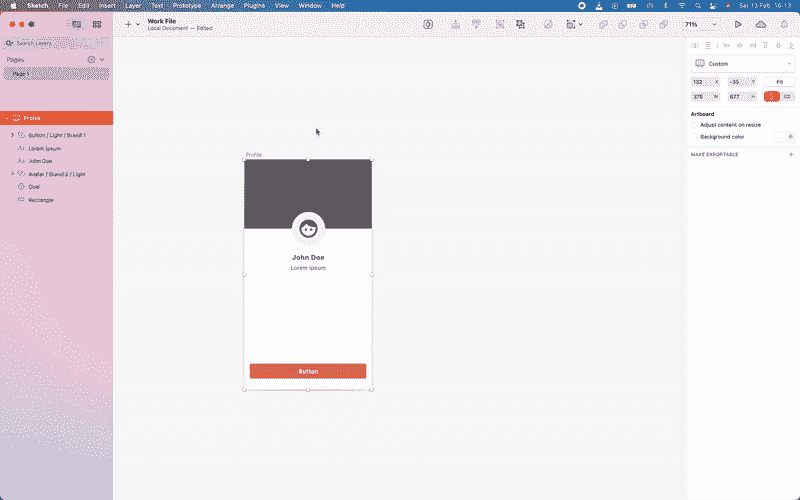
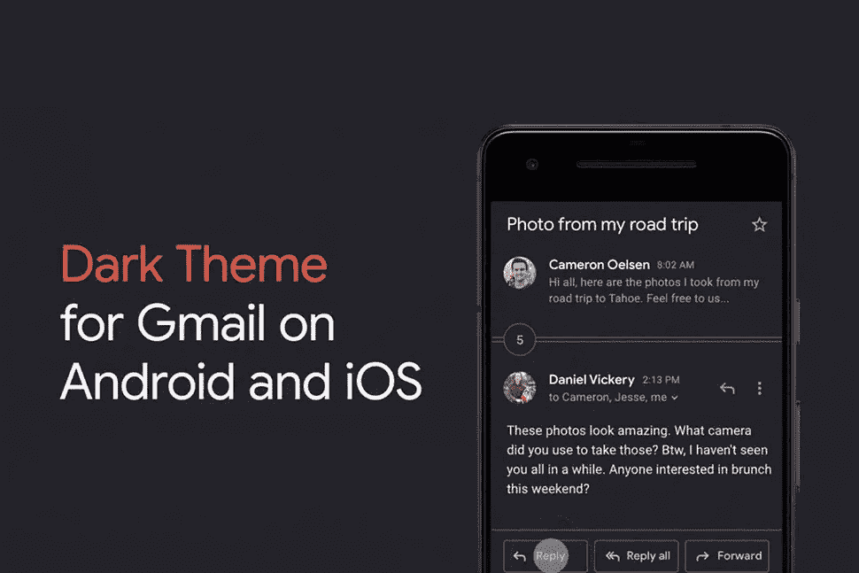
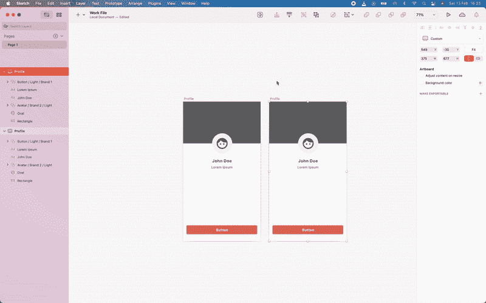
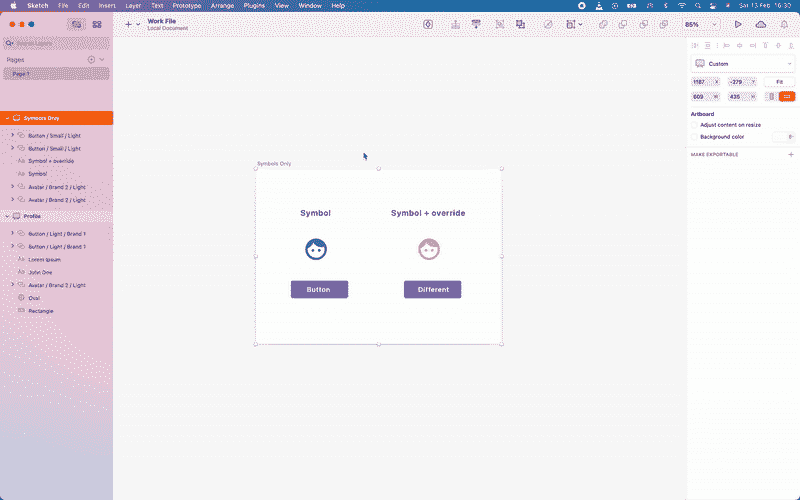
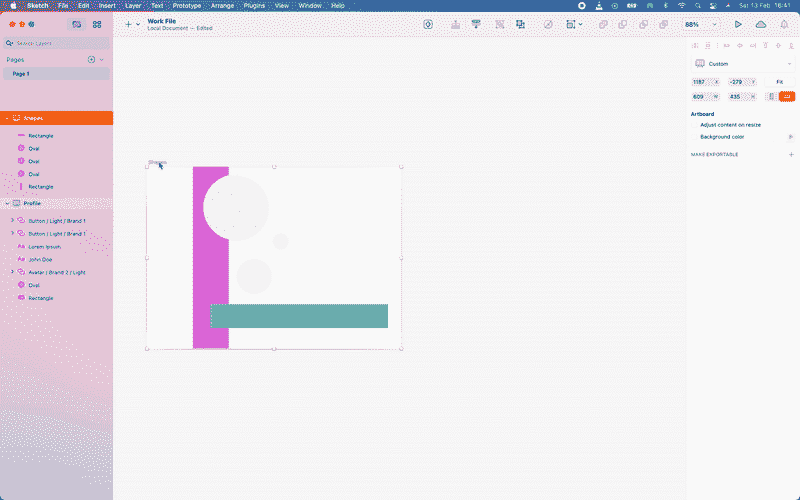
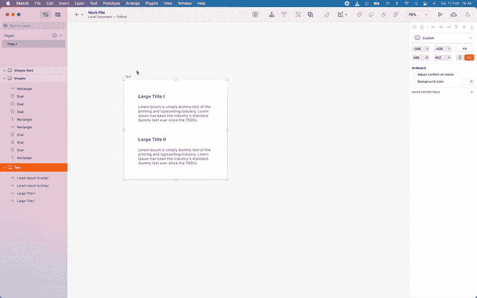
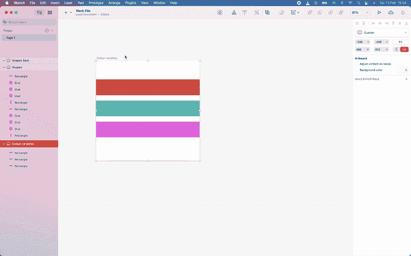

# 自动化设计:在草图中立即切换明暗模式

> 原文：<https://medium.com/geekculture/automating-ui-design-instant-light-dark-mode-switch-2bec90e6efc3?source=collection_archive---------1----------------------->

## 插件可以帮助我们摆脱多余的任务

Quick preview into how a plugin could make our UI design process more efficient

黑暗模式(Dark mode)于 2018 年由[苹果](https://developer.apple.com/videos/play/wwdc2018/210/)向世界揭示，被称为“人们肯定会爱死的”全新酷炫外观。谷歌紧随其后，强调与白色高架风格的材料设计相比，黑暗模式对电池寿命和屏幕疲劳的积极影响。你可能记得夜间模式已经存在，通常用于阅读、写作或导航。然而，夜间模式只是另一个功能。黑暗模式被“推销”为每个人都想尝试的酷趋势，是设备范围内的首选，显然只会带来好处(这里不讨论它是否真的有帮助)。

**让我们开始吧** 尽管黑暗模式的宣传力度很大，但我们作为设计者、开发者和管理者都知道接下来会发生什么:更多令人兴奋的工作。各公司竞相实施，甚至公开宣布(Whatsapp、Instagram、Gmail)。

Images used in articles, presentations and FAQ sections. [Source](https://blog.whatsapp.com/dark-mode-now-available-for-i-phone-and-android/?lang=en) and [source](https://www.pocket-lint.com/apps/news/google/149502-how-to-turn-on-gmail-s-new-dark-mode)

起初，设计一个产品的黑暗模式其实很有趣。找到相同的颜色、高度和文本风格，既刷新了你的可访问性原则，又教会了你新的、特定的黑暗模式实践。这部分最终结束了。

机器人之路
在黑暗模式下完成了主要流程的重建，你和你的团队都很兴奋，看起来棒极了。你甚至主动用黑暗模式更新了你设计系统中的所有相关组件。然而，除了所有正在进行的工作和即将到来的新特性之外，还有几十个更小的流需要更新。

Doing this for 20 different screens is just a pain and very error prone

这迟早会变得机械和重复。此外，每一个新设计都必须这样做，每次更新都要花两倍的时间。

机器人方式自动化肯定有更简单的方式来实现。符号、图层和文本样式在暗模式和亮模式下均可用。它们在设计中的布局也非常完美，所以:

> 为什么一个软件不能复制/粘贴一个设计，并简单地切换所有的组件、风格等等。从一种模式到另一种模式？

我决定创建一个草图插件来自动完成这项工作。作为一名非专业开发人员，我花了整整两个月的时间，用了整整一年的时间，才让它达到一个不错的状态(这里有关于这个过程的更多信息)。在这一点上，我正在积极地将这个插件用于我的工作，同时将它展示给几个对它感兴趣的设计团队和公司。

它是如何工作的？
设计师可以选择一个或多个画板，运行插件并在几秒钟内实现亮/暗模式。它可以由在 Sketch 中拥有一个或多个共享库的个人或团队使用。

The artboard name also changes by adding “Dark” to its name. I’m using the shortcut here, to skip going through the menu

很明显，在使用它的时候有一些**条件**，这些都是在多个设计师测试之后，在他们的工作设置中添加的。

*   该插件可以切换符号、符号覆盖、文本、文本样式、图层样式、形状和颜色变量。*它不适用于群组*。
*   符号必须基于一个或多个外部库。本地符号不起作用。
*   符号、颜色、文本和样式的名称中必须包含“亮”和“暗”字样；位置不重要。
*   颜色、图层样式和文本样式可以是单一库中的通用样式，如“颜色”、“文本”等。或者是其他链接的单个库的一部分。
*   颜色变量可以基于当前打开的文档，或者在单个“颜色”库中。

**切换符号** 如上所述，符号设置在一个或多个外部库中。在这种情况下，有两个链接:按钮和卡片。任何类型的替代都有效，无论是文本、子符号还是图层样式。

The avatar icon and button are two symbols. Each one can be re-used with overrides, in this case layer style for the avatar and text for the button. The plugin takes all that into account

**切换图层样式** 有时候你可能只是简单地使用一个形状，而没有把它变成一个符号。然而，它的颜色和/或高度应该遵循图层样式。所有的形状属性保持不变，图层样式在明暗之间切换。

Brought them back in the original artboard to show the difference

**切换文本样式** 这些都很简单，只要它们的命名一致。

**切换颜色变量** 最近用 Sketch 实现了色板…颜色变量。我仍然不确定从长远来看这些将如何处理图层样式，但插件目前可以处理它们。

Colour variables are extracted from a linked library in this case: “Brand Colours”. They can also be local, in the working document.

**这是未来吗？** 设计工具仍在迫使我们在屏幕前花费数小时推像素，大部分时间是重复的。我们现在有能力摆脱机器人任务，如命名图层、安排画板，甚至提出替代布局。然后我们可以利用这段时间做更多的一手和二手研究，探索完全不同的选择，并专注于我们的 UI 设计对人们体验的影响。

如果你有兴趣测试这个插件，请告诉我，这里有最新的版本:[https://github.com/chaos-machine/switch-theme](https://github.com/chaos-machine/switch-theme)。我期待着任何反馈，它在实际设置中使用得越多，就越能让我们的生活变得更轻松。