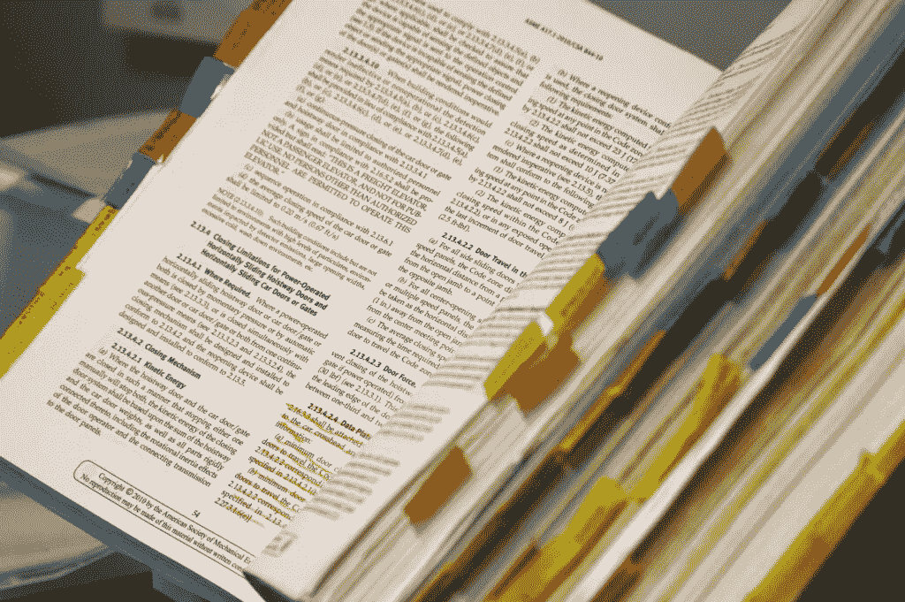

# 用 Python 抓取 Web 文章

> 原文：<https://medium.com/geekculture/automating-web-scraping-articles-with-python-49dce6714517?source=collection_archive---------23----------------------->

## 使用 Python 中常见的 Web 抓取技术构建一个文章库，供您离线阅读。使用 BeautifulSoup、urllib3 和 pdfkit。

Photo by [Russ Ward](https://unsplash.com/@rssemfam?utm_source=unsplash&utm_medium=referral&utm_content=creditCopyText) on [Unsplash](https://unsplash.com/s/photos/research?utm_source=unsplash&utm_medium=referral&utm_content=creditCopyText)

最近，我对创造第二个大脑很感兴趣，作为对我当前目标的补充，即建立一个自动化生命。我打算创建一个内容库，我…