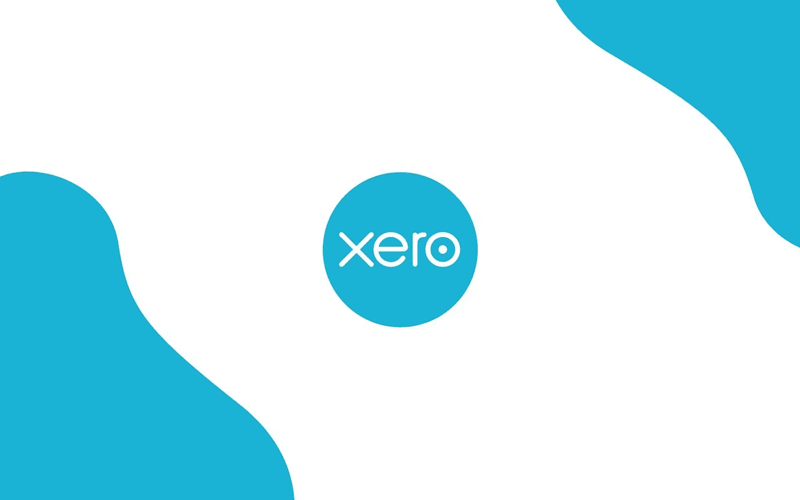
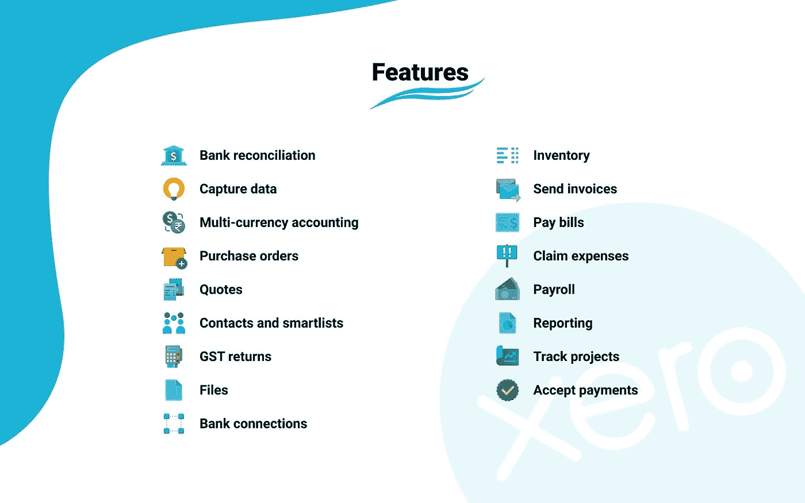

# 使用 Quickwork 自动化 Xero

> 原文：<https://medium.com/geekculture/automating-xero-using-quickwork-d7723577fcad?source=collection_archive---------72----------------------->

Xero 是一款云会计软件，可以帮助您在任何地方管理您的业务。Xero 专为小型企业设计，它提供了高效运营公司的工具，同时让您能够掌控业务绩效——无需会计师。

从本质上来说，Xero 是一个强大的会计系统，对小企业来说很容易使用，但对大公司来说非常有用。这是您开展业务所需的一切。

在它提供的所有功能中，最重要的是与几十个应用程序集成的能力。这些包括收据和里程跟踪、库存管理、销售点系统和支付处理以及时间管理。它允许您围绕您需要完成的会计流程来安排和组织任务。它自动同步您的所有交易，并使它更容易审查费用报告等等。

# 特点:

Xero 会计软件是各种规模企业的强大工具。它允许公司轻松跟踪销售、库存和费用。该软件有能力跟踪除美元以外的几种货币。它还具有一套强大的功能，如发票、库存管理和账单支付，可用于任何规模的公司。

# 可以与 Xero 连接的应用:

1.  **条纹:**为新条纹费用创建 Xero 发票
2.  **PayPal:** 为新的 PayPal 销售创建新的 Xero 发票
3.  **Pipedrive:** 当新的 Pipedrive 交易达到一定阶段时，创建 Xero 发票
4.  **宽限:**获取新 Xero 发票的宽限预警消息
5.  **WooCommerce:** 为新的 WooCommerce 订单创建 Xero 发票
6.  **Mailchimp:** 从 Xero 的新联系人中添加新的 Mailchimp 用户

通过 Xero 和 Quickwork 集成，您可以实现更多功能。要检查 Xero 可用的触发器和操作，请单击此处的，我们将带您进入应用程序页面。如果您希望简化您的流程，或者只是希望了解我们如何帮助您发展业务，[今天就和我们](https://quickwork.co/?utm_source=Blog_Post&utm_medium=Organic_Interlink&utm_campaign=Contact_Us)聊聊吧！