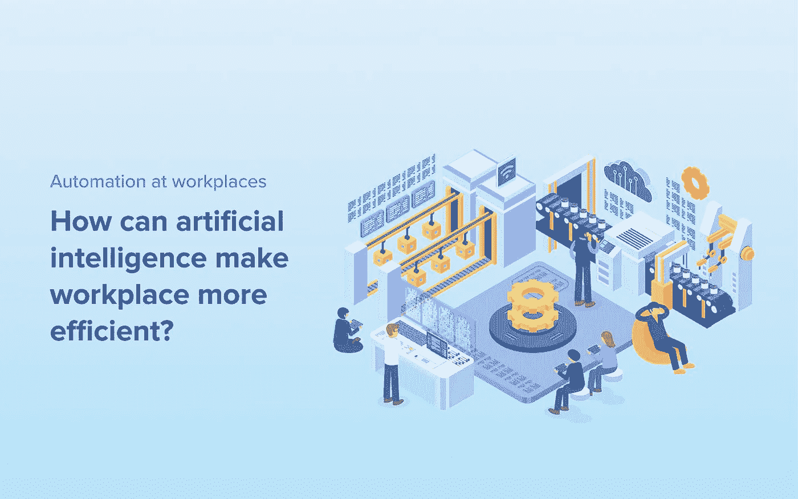

# 工作场所的自动化:人工智能如何让工作场所更高效？

> 原文：<https://medium.com/geekculture/automation-at-workplaces-how-can-artificial-intelligence-make-workplace-more-efficient-ae3a82ae3181?source=collection_archive---------30----------------------->

随着新冠肺炎疫情的进行，在家工作在世界各地已经变得司空见惯。随着人们开始在管理家庭、孩子在线学习和工作之间周旋，工作与生活平衡的界限已经消失。

根据美国精神病学协会 2020 年关于新冠肺炎对心理健康影响的民意调查，近一半(48%)的美国人报告说，他们一直担心可能会感染新冠肺炎，超过三分之一(36%)的人说，疫情对他们的心理健康产生了严重影响。

企业已经明白持续的焦虑状态对员工的影响。减少业务工作流程中的手动任务和重复活动已成为企业关注的重点，以防止单调和紧张的工作对员工产生负面影响。

# 人工智能如何帮助员工？

在过去几年的技术进步中，人工智能吸引了很多关注。从开发将简化内容搜索的人工智能和使用人工智能改善癌症检测的巨额支出和投资，到银行发布的新 API，人工智能自动化领域发生了很多事情。

人工智能是指使用机器学习和智能技术，从数据中学习，并能够以一种能够提供建议和检测谬误的方式理解数据。人工智能不会取代工作，相反，它将接管大量耗时的任务，让员工专注于更重要的战略活动。

# AI 将如何提升生产力和工作？

1.  **减少手动任务:**
    自动化将取代大量手动工作，如数据集成，这将使数据的传输和访问更加容易。这意味着员工将花费更少的时间去寻找和组织信息。减少文书工作和耗时的管理任务，最终会减少工作时间，提高工作效率。
2.  **更好的洞察力:**
    随着技术的进步和每天都有更新的应用程序推出，算法在捕捉趋势和行为模式方面变得越来越好，越来越聪明。自动化不仅仅有助于数据集成，它还将为数据解释和更好地分析手头的信息开辟道路。这意味着员工将能够专注于重要的数据。通过自动化，他们将能够在几分钟内过滤掉不重要的数据，并获得统计数据和见解，而这通常需要几天或几周的时间来整理和组织。
3.  **更多战略任务:**
    通过处理重复性的日常任务，自动化将清理时间表，使员工能够更专注于做出对业务至关重要的更复杂、更具创造性的决策。
4.  **更好的机会:**
    技术的目标是改善人类，帮助他们探索更好的途径。技术进步将允许员工建立新的技能组合，探索更多的工作角色，学习新事物变得更加容易和容易。

就 API 和集成而言，技术的进步使我们能够以更加开放和互联的方式访问数据和应用程序。它允许应用程序互相“说话”，让人们更容易管理他们的工作。

有许多应用程序可以接管日程安排、数据共享、生成发票等任务，以及业务工作流程中常见的一系列其他管理任务。随着时间的推移，API 和人工智能只会变得更好，更精简，每个行业都将从中受益。员工必须学会如何适应这种转变，更好地利用自己。

您可以尝试使用我们的 Quickwork Journey Builder 创建自动化工作流程。要了解更多关于自动化的信息，请联系我们。