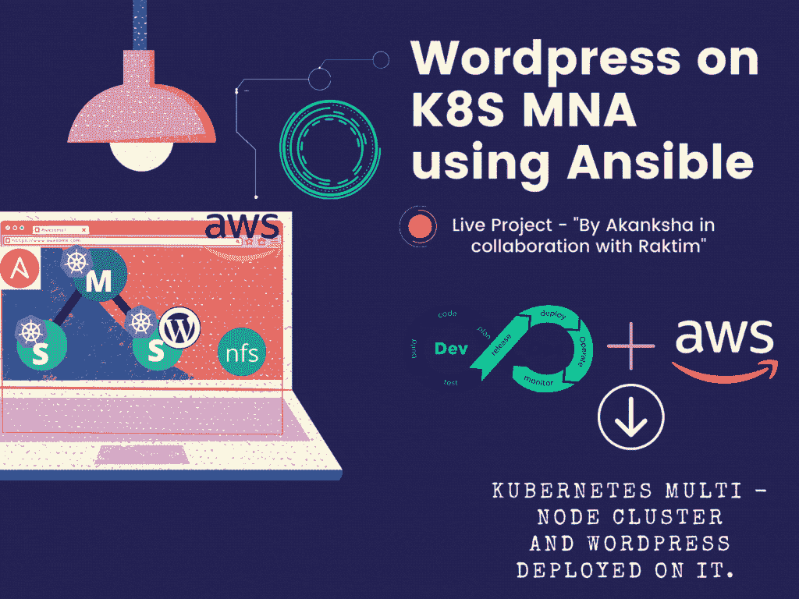
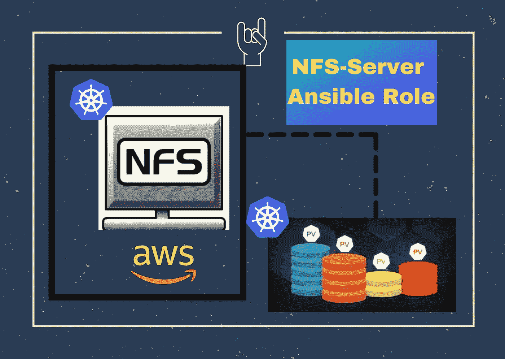
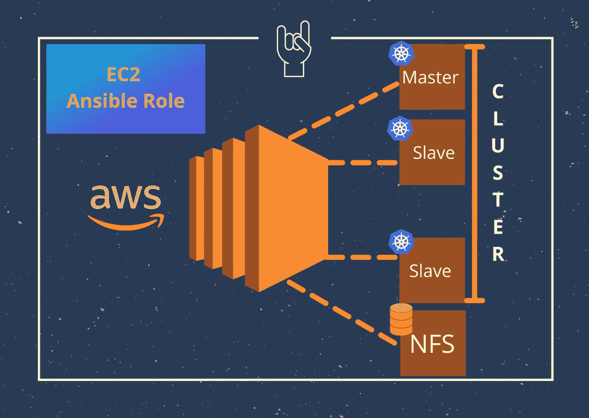
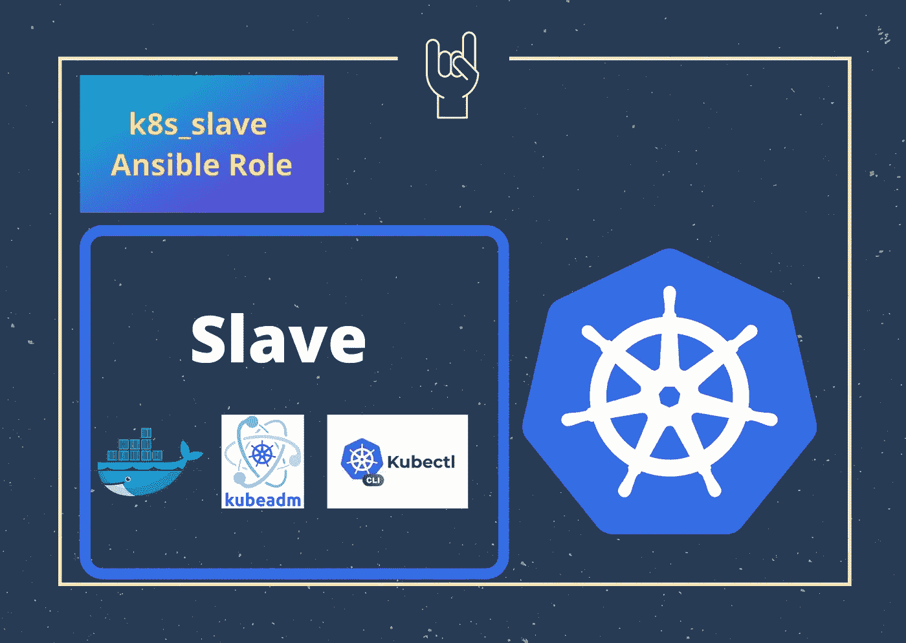

# 自动化——使用 Ansible 通过 AWS 在 Kubernetes 多节点集群上部署 WordPress

> 原文：<https://medium.com/geekculture/automation-wordpress-deployment-on-kubernetes-multi-node-cluster-launched-over-aws-using-ansible-cb6707906af2?source=collection_archive---------10----------------------->



Created by Akanksha

## 使用 WordPress 部署网站是一项简单的任务，但当涉及到高可用性和快速部署以及编排和自动供应设施时，我们指的是基于云的 MNA。

著名的网站和博客构建工具 WordPress，我们将使用 Ansible 的 Automation 在 Kubernetes 上部署。问题来了，我们为什么需要这种部署，创建 POD 的必要性是什么？

豆荚是 Kubernetes 管理周期的最小单位。如果我们看到官方定义——**吊舱**是 **Kubernetes** 中最小、最基本的可展开物体。一个 **Pod** 代表集群中正在运行的进程的一个实例。**pod**包含一个或多个容器，例如码头集装箱。当一个 **Pod** 运行多个容器时，这些容器作为单个实体进行管理，并共享 **Pod 的**资源。

当我们在我们的容器上部署我们的 WordPress 来启动一个网站时，使用 WordPress 部署网站是一项简单的任务，但当涉及到高可用性和快速部署以及编排和自动供应设施时，我们指的是基于自动化的云的 MNA，以实现出色的敏捷设置，只需几秒钟即可完成部署和端点分发。

让我带你去看看这些技术和它们的需求，几天前我写了一篇关于**“使用 ANSIBLE 在 AWS 上自动化 KUBERNETES 集群”**的博客。

[](https://akanksha77.medium.com/automate-kubernetes-cluster-over-aws-using-ansible-3a1b3f78cfee) [## 使用 ANSIBLE 在 AWS 上自动化 KUBERNETES 集群

### 🤔KUBERNETES 集群！！这是什么！？Kubernetes 是一个编排工具，它可以帮助管理服务容器…

akanksha77.medium.com](https://akanksha77.medium.com/automate-kubernetes-cluster-over-aws-using-ansible-3a1b3f78cfee) 

# Kubernetes:

Kubernetes 是一个监控和管理容器的编排工具。它是由谷歌在 2014 年设计的，是一个开源工具。Kubernetes 是为容器的部署、维护和扩展而建立的，以维护特定的状态，并通过各种功能为环境提供持续支持，这些功能包括 pod、标签、选择器、控制器、复制控制器、部署控制器、副本集和服务。Kubernetes 使用声明性方法进行编排，因此使用声明性语言，即 YAML 或…..([参考我之前在 Kubernetes 上的博客](/linuxworld-informatics-pvt-ltd/in-this-article-i-will-explain-that-how-industries-use-orchestration-tool-to-minimize-server-a3fb7c88cf72))

[](/linuxworld-informatics-pvt-ltd/in-this-article-i-will-explain-that-how-industries-use-orchestration-tool-to-minimize-server-a3fb7c88cf72) [## 在本文中，我将解释行业如何使用编排工具来最小化服务器…

### slack——聊天机器人、群组消息和广播频道的应用程序也使用 Kubernetes 进行事件通知…

medium.com](/linuxworld-informatics-pvt-ltd/in-this-article-i-will-explain-that-how-industries-use-orchestration-tool-to-minimize-server-a3fb7c88cf72) 

# Ansible:

自动化在 IT 领域已经存在了几十年，但 Ansible 主要是为“配置管理”而设计的，该工具以高度可伸缩性和启动业务的能力进入市场，无需向员工支付高额工资，只需编写脚本来继续配置由负载平衡器启动的每个节点。现在问题来了，Ansible 作为自动化提供了什么，我们能依赖它来完成配置管理的所有步骤吗？……( [参考我之前在 Ansible](https://akanksha77.medium.com/this-article-will-give-you-an-idea-that-how-advancement-and-automation-made-the-configuration-of-62b15ad680ea) 上的博客)

[](https://akanksha77.medium.com/this-article-will-give-you-an-idea-that-how-advancement-and-automation-made-the-configuration-of-62b15ad680ea) [## 本文将让您了解进步和自动化是如何使配置…

### 自动化在 IT 领域已经存在几十年了，但 Ansible 主要是为“配置管理”而设计的。

akanksha77.medium.com](https://akanksha77.medium.com/this-article-will-give-you-an-idea-that-how-advancement-and-automation-made-the-configuration-of-62b15ad680ea) 

# AWS:

AWS (Amazon Web Services)提供高水平的服务，因此它是世界上最受欢迎的公共云。根据最近的 Gartner 报告，AWS 在提供最具可用性和安全性的资源和服务方面排名世界第一。AWS 提供了一组完全托管的服务，您可以使用它们来构建和运行无服务器应用程序。无服务器应用不需要为后端组件(如计算、数据库、存储、流处理、消息排队等)提供、维护和管理服务器。([参考我在 AWS 上的博客)](https://www.linkedin.com/pulse/serverless-computing-cola-company-case-study-akanksha-singh/)

[](https://akanksha77.medium.com/this-article-will-give-you-an-idea-that-how-advancement-and-automation-made-the-configuration-of-62b15ad680ea) [## 本文将让您了解技术进步和自动化是如何使…

### 自动化在 IT 领域已经存在几十年了，但 Ansible 主要是为“配置管理”而设计的。

akanksha77.medium.com](https://akanksha77.medium.com/this-article-will-give-you-an-idea-that-how-advancement-and-automation-made-the-configuration-of-62b15ad680ea) 

# WordPress:

WordPress (WP)是一个用 PHP 编写的免费开源内容管理系统(CMS ),配有 MySQL 或 MariaDB 数据库。它非常灵活，有数以千计的主题、插件和网站开发支持选项，让[了解更多关于 WordPress 的信息！！](https://www.wp101.com/tutorial/what-is-wordpress/)

# 在继续进行之前，让我们简要介绍一下我们的计划:

1.  我们总共有四个 EC2 实例和一个本地系统，它是一个控制器节点(*RHEL 操作系统位于基础操作系统)，我们将从这里运行角色，只需点击一下鼠标就可以设置好一切。
2.  实例将由“EC2 角色”提供
3.  主节点设置是将通过运行“K8s_master”发生的下一个任务
4.  下一步是使用“K8s_slave”部署和配置从节点并向主节点注册
5.  接下来，NFS 服务器将开始提供目录。
6.  然后是用于 Wordpress pod 设置和 PVC 声明的 kube_wordpress 角色。
7.  最后是运行所有角色的设置文件。

***第一步:创建可行的配置文件:***

Ansible 是一个无代理的自动化工具，它需要控制器节点上的清单文件，我已经提到这是我们的本地系统。清单文件可以在路径(/etc/ansible/ansible.cfg)中的控制器节点内全局创建，也可以在我们将要运行剧本/角色的工作区中创建。

*为此项目创建工作区:*

```
**# mkdir kube-ansible
# cd kube-ansible
# mkdir roles
# vim ansible.cfg**
```

ansible.cfg

[有关上述文件的解释，请访问！](https://docs.ansible.com/ansible/latest/reference_appendices/config.html#ansible-configuration-settings-locations)

***步骤 2:为 AWS 登录和验证实例创建两个文件:***

1.  一个名为`cred.yml`的安全库文件，包含 IAM 访问权限和用于验证您的 AWS 帐户的密钥。在您的目录“my-ws”中使用`ansible-vault create cred.yml`创建(给出密码)

```
*file format:* access_key: GUJGWDUYGUEWVVFEWGVFUYV 
secret_key: huadub7635897^%&hdfqt57gvhg
```

2.创建名为`ansible.pem`的文件，这是我们用来通过 AWS 帐户远程创建 ec2 实例的密钥对。

# 步骤:

> *1。转到 AWS 管理控制台*
> 
> *2。EC2 仪表板*
> 
> *3。成对钥匙*
> 
> *4。创建新的密钥对*
> 
> *5。赐名为* `*ansible*`
> 
> 6。选择。“PEM”文件格式
> 
> 7。将密钥下载到您的本地系统
> 
> *8。将密钥转移到您的角色为* `*kube-ansible*`的同一目录下的责任控制器节点

***第三步:创建职责角色:***

接下来，我们将为自动化创建五个主要角色，首先我们将创建 NFS 服务器，然后是其余四个 EC2 实例，包括一个主服务器、两个从服务器和一个客户端 Kubernetes 设置。

```
**# mkdir role
# cd role
# ansible-galaxy init ec2
# ansible-galaxy init k8s_master
# ansible-galaxy init k8s_slave
# ansible-galaxy init k8s_client
# ansible-galaxy init nfs-server**
```

现在我们已经有了所有的任务、模板、变量文件*和其他基于已知文件结构*的可解析工件，它们都被预嵌入到角色中，我们只需要通过包含模块和 jinja 属性注释来编写我们所需要的所有东西的声明/描述(用 YAML 语言)。

要了解更多角色信息，请访问！

***步骤 4:为存储类设置编写 NFS-服务器角色:***



NFS-Server Setup

在我们的 Kubernetes 多节点设置中，此服务器的主要用途是用于存储类，因为 PV 是注册的，PVC 批准仅在此存储中完成。我们已将 EBS 卷分配给此服务器，进一步的卷分配由网络文件系统完成。该角色本身表明它意味着将存储共享为目录，并在以后在 PVC 上挂载共享文件夹(永久卷声明)。

🤔**PVC 有什么用？**
我们的 WordPress 依赖于 SQL 存储，因为它为客户端登录 WordPress 提供数据库。此外，当我们保证没有停机设置时，我们必须有一个持久的数据存储，以便由于任何种类的 POD 或节点 SPOF，我们的数据不能丢失，客户端不能因此而存活。现在问题来了，它是如何工作的？我们如何将同一个 PVC 连接到另一个 POD？ —答案是我们在 Kubernetes 中有标记的概念，通过它我们可以链接到我们的资源和服务。我们需要给出的是资源种类，以及由 etcd(内部 Kubernetes 数据库)管理和存储的元数据。PVC 是指客户请求批准并从本地或外部(网络)存储中提供所请求存储。

```
**# cd role/nfs-server/tasks
# vim main.yml**
```

task.yml

我们有变量文件，它包含在角色执行时将被直接调用/替换的值。它包括“共享目录”变量。分别为 WordPress 和 MySQL Pods 命名为“/wp”和“/mysql”的两个目录。

```
**# cd role/nfs-server/vars
# vim main.yml**
```

var.yml



ec2-ansible-role

***第五步:为设置编写 EC2 角色:***

为了在 AWS EC2 中启动实例，我们有以下 aws-ec2 角色。为此，我们需要一些登录 aws 帐户的凭证。然后我们将看到角色是如何编写的:

```
**# cd role/ec2/tasks
# vim main.yml**
```

task.yml

我们在这个 ec2 角色中运行八个任务，一个是安装 boto3 for AWS API 以进行连接，然后是安全组，之后是 EC2 实例创建，然后使用 ansible add_host 模块创建动态清单。最后，切换到与所有实例的 ssh 连接。

我们有变量文件，它包含在角色执行时将被直接调用/替换的值。我们有四个 **instance_tags** ，两个 **python_pkgs** 变量和 **sg_name** ， **region_name** ， **subnet_name** ， **ami_id** ， **keypair** ，I**instance _ flavor**，并根据您的帐户 ARN(亚马逊资源名称)或亚马逊 id 给出值。

```
**# cd role/ec2/vars
# vim main.yml**
```

var.yml


k8s-master-role

***第五步:编写 k8s_master 角色:*** 对于 Kubernetes 主节点设置角色描述如何在 kube_master 角色的 tasks 文件夹中进行配置。vars 文件夹也包含一些变量值:

```
**# cd role/k8s_master/tasks
# vim main.yml**
```

task.yml

我们在这里有 11 个任务，包括安装 **kubeadm** 、 **kubelet** 和 **kubectl** 命令，然后从 **dockerhu** b 中提取所有管理映像，随后是它们的 pod 创建和网络覆盖，以及**守护程序驱动程序设置**，最后我们使用 flunnel CNI 为从节点连接创建一个注册密钥。

我们有变量文件，它包含在角色执行时将被直接调用/替换的值。它包括名为 service_name 变量，并包含以下值:

Docker:容器引擎程序，帮助启动容器，然后 POD 通过标记和标签选择方法管理容器。Docker 需要安装在主节点和从节点上，因为后台的 kubelet 程序连接到 docker 引擎并启动容器。

kube let:**kube let**是运行在每个节点上的主要“节点代理”,它管理运行在单个节点上的容器。

```
**# cd role/k8s_master/vars
# vim main.yml**
```



k8s-slave-role

***第六步:编写 k8s_slave 角色:***

现在让我们在 tasks 文件夹中为 kube_slave 角色编写剧本，然后在 vars 文件夹中提到变量值。与 Kubernetes 主机相同，从机的先决条件是三个软件，即 Docker、Kubeadm 和 ip-tables。我们必须更新在 slave 中使用了/etc/sysctl.d/k8s.conf 文件的 ip 表。

从节点向主节点的注册/加入只能通过主节点在整个设置和初始化之后提供的密钥来完成。我们需要在从节点中复制密钥。为此，我们在这里使用了令牌。

```
**# cd role/k8s_slave/tasks
# vim main.yml**
```

task.yml

```
**# cd role/k8s_master/vars
# vim main.yml**
```

var.yml


kube-wordpress-role

***第七步:编写 kube_wordpress 角色:***

这里我们复制了 pod /服务设置的 YAML 代码，因此我们需要角色的三个组成部分，即任务、文件和模板(jinja2 格式代码文件)。

```
**# cd role/kube_wordpress/tasks
# vim main.yml**
```

task.yml

我们有这个模板文件，用于在处理后将 Jinja2 文件复制到我们的从节点，以便为我们的 WordPress 和 MySQL 节点请求和安装 PV:

```
**# cd role/k8s_master/vars
# vim storage.yml.j2**
```

storage.yml.j2

我们也有这个角色的文件，其中 4 个文件命名为“ [kustomization.yml](https://github.com/akankshaS77/WordPress-on-Kubernetes-AWS-Ansible/blob/main/kube-ansible/roles/kube-wordpress/files/K8s-WordPress/kustomization.yml) ”、“ [mysql-deploy.yml](https://github.com/akankshaS77/WordPress-on-Kubernetes-AWS-Ansible/blob/main/kube-ansible/roles/kube-wordpress/files/K8s-WordPress/mysql-deploy.yml) ”、“ [secret.yml](https://github.com/akankshaS77/WordPress-on-Kubernetes-AWS-Ansible/blob/main/kube-ansible/roles/kube-wordpress/files/K8s-WordPress/secret.yml) ”、“ [wordpress-deploy.yml](https://github.com/akankshaS77/WordPress-on-Kubernetes-AWS-Ansible/blob/main/kube-ansible/roles/kube-wordpress/files/K8s-WordPress/wordpress-deploy.yml) ”，它们将创建 pods。

以下是所有的四个文件，YAML 代码创建的基本概念与 Kubernetes 的 reources，kind，apiVersion 关键字编写:

```
**# cd role/kube_wordpress/files
# vim kustomization.yml
# vim mysql-deploy.yml
# vim secret.yml
# vim wordpress-deploy.yml**
```

Kustomization.yml

mysql-deploy.yml

secret.yml

wordpress-deploy.yml

***步骤 8:创建设置行动手册以运行所有角色并创建 AWS 集群:***

最后，编写我们的 Setup.yml 文件，通过调用这些角色来自动完成所有的任务。我们需要在主工作区内创建文件，即 kube_ansible:

```
**# cd kube_ansible/
# vim setup.yml**
```

setup.yml

**步骤 9:运行剧本 Setup.yml**

使用 ansible-playbook 命令运行剧本，并提供 vault 密码以验证和登录 AWS 帐户。

```
**# ansible-playbook setup.yml -ask-vault-pass**
```

因此我们已经实现了我们的目标“自动化——使用 Ansible 在 AWS 上启动的 Kubernetes 多节点集群上的 WordPress 部署”。

你可以在我的 GitHub 上找到这个项目，只要 fork 和 let 使这个项目对客户来说更加系统独立和可靠。

[](https://github.com/akankshaS77/WordPress-on-Kubernetes-AWS-Ansible.git) [## akankshas 77/WordPress-on-Kubernetes-AWS-ansi ble

### 使用 Ansible Automation 在 AWS EC2 实例上提供 Kubernetes 多节点集群，并在…上部署 Wordpress

github.com](https://github.com/akankshaS77/WordPress-on-Kubernetes-AWS-Ansible.git) 

如果您想为这个项目做出贡献，或者有进一步的疑问或意见，您可以通过 LinkedIN 联系我:

[](https://www.linkedin.com/in/akanksha-singh-as/) [## 阿康沙·辛格-成功负责人@ ARTH -技术学院- LinuxWorld Informatics Pvt 有限公司…

### 在全球最大的职业社区 LinkedIn 上查看阿康沙·辛格的个人资料。阿康沙有 3 个工作列在…

www.linkedin.com](https://www.linkedin.com/in/akanksha-singh-as/) 

## 感谢阅读。希望这个博客给你一些有价值的输入！！