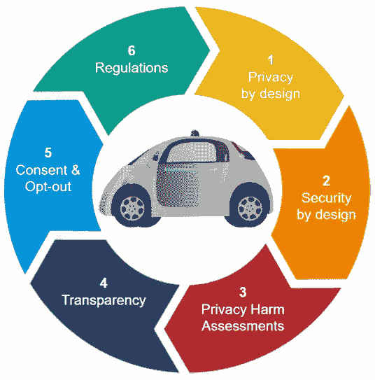

# 自动驾驶汽车-保护个人信息的建议

> 原文：<https://medium.com/geekculture/autonomous-vehicle-recommendations-to-protect-personal-information-df5744bf3ae?source=collection_archive---------77----------------------->

AV Recommendations

可以采用多种措施来帮助保护由自动车辆(AVs)收集和存储的个人信息。以下是一些建议:

# **1)隐私设计**

从产品开发过程的开始，考虑到上下文和内容，AV 的设计可以包括设计隐私。由 AV 收集的数据具有由多个驾驶员、租赁车辆、所有权变更等引起的复杂性，因为它们在车辆中留下了数据的痕迹。

美国联邦贸易委员会认可“设计隐私”，并呼吁实体实施最佳实践来保护消费者的私人信息。这些最佳实践包括将隐私作为商业数据实践的默认设置*。*

来自 AVs 的数据可以匿名，但考虑到技术发展和监管指导，必须采取措施确保数据不能被重新识别。

# 2)安全源于设计

由于以下原因，AVs 的安全性越来越受到关注:I)潜在攻击者对功能的暴露增加；ii)车辆功能对不同自治系统的依赖；以及 iii)城市交通基础设施中单个车辆与无数其他智能系统的交互。智能和复杂自治系统(如反病毒系统)的安全设计原则鲜为人知，也鲜有实践。

公平信息实践原则(FIPPs)⁴)可以作为设计 AVs 的基准，因为 AVS 为其运营收集了大量数据。泰斯拉没有遵循 FIPP 的安全原则。从垃圾场买来的撞坏的特斯拉汽车泄露了 PII⁵，因为数据没有加密。

可以对静态和动态的所有通信进行端到端加密，以保护 AV 数据。端到端加密将使任何被盗数据变得无用。如果国家标准与技术研究所(NIST)⁶)能够提供一些针对 AVs 的指导方针，以识别潜在的威胁和漏洞，提供对安全影响的理解，并指定减轻风险的指导方针，那就更好了。

# **3)持续的隐私危害评估**

AV 的算法需要大量的数据来训练和提高性能，这取决于用于训练它们的数据的质量和数量。随着反病毒系统的发展，可以利用丹尼尔·j·索洛夫的《隐私危害 taxonomy⁷》、海伦·尼森鲍姆的《情境 approach⁸》和穆里根等人的《analytic⁹隐私框架》频繁分析数据收集和使用情况，以防止对数据主体造成伤害。

# **4)透明度**

为了获得用户的信任，制造商可以提供关于如何收集数据、使用什么功能、如何使用它们、算法如何基于输入做出反应等方面的透明度。

AV 制造商可以在透明模型报告算法的设计过程中使用模型卡⁰框架。模型卡在各种条件下提供基准评估，例如跨不同的文化、人口统计或表型群体和交叉群体。模型卡还披露了模型的使用环境、性能评估程序的细节以及其他相关信息。

# **5)端到端同意和退出**

通知和同意是 Principles⁴公平信息实践的关键原则，是许多隐私法律和框架的基础。根据各种法规，司机可能有权选择退出个人数据销售(CCPA 的“不要出售我的个人信息”)，访问或下载他们的数据，或删除他们的所有数据(GDPR 和 CCPA)。

AVs 有许多使用数据的组件和第三方服务(OEM)。一个简化的界面为每项服务提供了同意和选择退出的选项，这些选项通过高级别和粒度部分进行了明确定义。此外，根据加州司法部(DOJ)隐私政策声明和隐私声明，提供更短的上下文隐私声明，因为它们具有更大的承诺。

# **6)法规和指南**

目前大多数关于机动车安全的法规都是基于人类驾驶车辆的假设。从车辆的设计到在社会中的采用，道德必须被赋予最重要的地位，在这种情况下可以采用新的法规。

此外，生物特征数据收集大大提高了隐私和安全的风险，因为消费者无法在数据被出售或泄露后更改他们的指纹或虹膜。伊利诺伊州政府提出了⁴生物识别信息隐私法案(BIPA ),要求在收集生物识别数据之前征得知情同意。

国会和州立法机构可以通过⁵司机隐私法来保护 AV 数据，类似于保护事件数据记录器(EDR)数据的联邦和州法律。

以人为本的 AV 数据收集、使用和保留政策需要统一的联邦法律。联邦政府可以监管⁶的数据隐私，因为汽车制造商可以承诺取消个人信息⁷(用户离家的时间和用户去了哪里)，但由于不同制造商维护的标准不同，存在一些制造商允许重新识别的风险。

**参考文献**

*[*https://www . FTC . gov/sites/default/files/documents/reports/federal-trade-commission-report-protecting-consumer-privacy-era-rapid-change-recommendations/120326 privacy report . pdf*](https://www.ftc.gov/sites/default/files/documents/reports/federal-trade-commission-report-protecting-consumer-privacy-era-rapid-change-recommendations/120326privacyreport.pdf)*

**【2】*[*https://www . FTC . gov/system/files/documents/reports/federal-trade-commission-staff-report-2013 年 11 月-workshop-title-internet-things-privacy/150127 io trpt . pdf*](https://www.ftc.gov/system/files/documents/reports/federal-trade-commission-staff-report-november-2013-workshop-entitled-internet-things-privacy/150127iotrpt.pdf)*

**【3】*[*https://arxiv.org/pdf/1810.00545.pdf*](https://arxiv.org/pdf/1810.00545.pdf)*

**【4】*[*https://national public safetypartnership . org/Documents/The _ Fair _ Information _ Practice _ Principles _ in _ The _ Information _ Sharing _ environment . pdf*](https://nationalpublicsafetypartnership.org/Documents/The_Fair_Information_Practice_Principles_in_the_Information_Sharing_Environment.pdf)*

**【5】*[*https://www . CNBC . com/2019/03/29/Tesla-model-3-keeps-data-like-crash-videos-location-phone-contacts . html*](https://www.cnbc.com/2019/03/29/tesla-model-3-keeps-data-like-crash-videos-location-phone-contacts.html)*

**【6】*[*https://www.nist.gov/*](https://www.nist.gov/)*

**【7】*[*https://www . law . upenn . edu/journals/law review/articles/volume 154/issue 3/solove 154 u。第 477 号公共法律修正案(2006 年)。pdf*](https://www.law.upenn.edu/journals/lawreview/articles/volume154/issue3/Solove154U.Pa.L.Rev.477(2006).pdf)*

*【8】[*【https://doi.org/10.1162/daed_a_00113】*](https://doi.org/10.1162/daed_a_00113)*

**【9】*[*https://doi.org/10.1098/rsta.2016.0118*](https://doi.org/10.1098/rsta.2016.0118)*

**【10】*[*https://arxiv.org/pdf/1810.03993.pdf*](https://arxiv.org/pdf/1810.03993.pdf)*

**[*https://OAG . ca . gov/sites/all/files/ag web/pdf/cyber security/making _ your _ privacy _ practices _ public . pdf*](https://oag.ca.gov/sites/all/files/agweb/pdfs/cybersecurity/making_your_privacy_practices_public.pdf)**

***【12】***

****【13】*[*http://www . nhtsa . gov/static files/rule making/pdf/Autonomous-Vehicles-Policy-Update-2016 . pdf*](http://www.nhtsa.gov/staticfiles/rulemaking/pdf/Autonomous-Vehicles-Policy-Update-2016.pdf)***

***【14】*[【https://www.ilga.gov/legislation/ilcs/ilcs3.asp?ActID=3004】T21&ChapterID = 57](https://www.ilga.gov/legislation/ilcs/ilcs3.asp?ActID=3004&ChapterID=57)**

***【15】*[*https://www . congress . gov/bill/114 th-国会/参议院-bill/766/text*](https://www.congress.gov/bill/114th-congress/senate-bill/766/text)**

***【16】*[*https://www.gao.gov/products/GAO-14-81*](https://www.gao.gov/products/GAO-14-81)**

***【17】*[*https://www . the guardian . com/technology/2016/jun/08/自驾-汽车-立法-无人机-数据-安全*](https://www.theguardian.com/technology/2016/jun/08/self-driving-car-legislation-drones-data-security)**

****感谢**的阅读！请👏如果你喜欢这篇文章，请跟我来，因为它鼓励我写更多！**