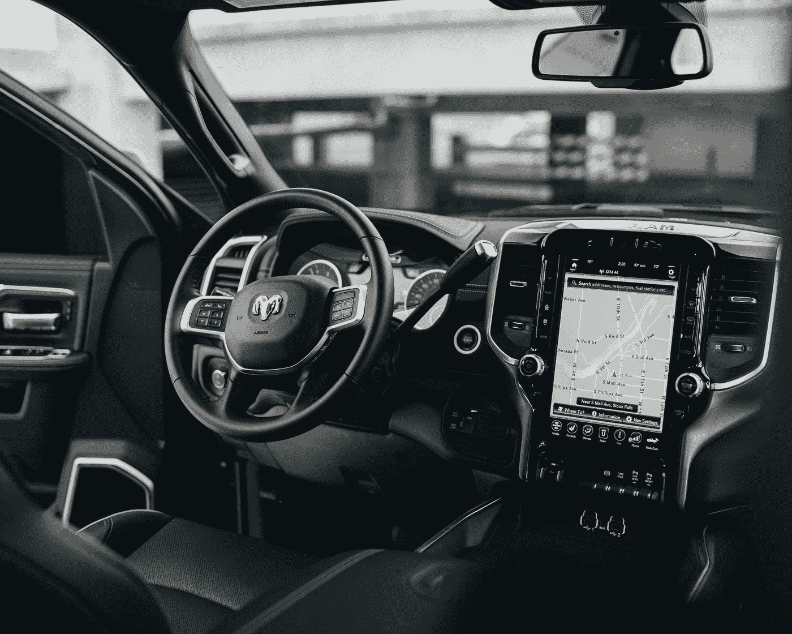

# 自动驾驶汽车——负面影响和负担

> 原文：<https://medium.com/geekculture/autonomous-vehicles-negative-impact-and-burden-17903133eaf5?source=collection_archive---------18----------------------->

Photo by [Brock Wegner](https://unsplash.com/@isthatbrock?utm_source=medium&utm_medium=referral) on [Unsplash](https://unsplash.com?utm_source=medium&utm_medium=referral)

一些障碍阻碍了自动驾驶汽车(AVs)的广泛接受。消费者感知、社会影响、系统特征、地理和经济因素影响采用。下面列出了一些关键挑战:

## **1 -人类行为:消费者信任、决策&控制**

信任 AVs 来执行关键决策的人可能需要更长的时间。AVs 已经在市场上存在了近十年，并且有了显著的免提改进。然而，我们已经看到了一些现实生活中的情况，其中司机打瞌睡或忽视正在进行的交通需求，导致制造商每隔几分钟就增加强制性检查，以确保司机专心。另一方面，在驾驶员选择不信任自动驾驶模式，从而将这些车辆用作传统驾驶员管理的情况下，也存在怀疑和不情愿。

## **2 -驱动**

为了从当前的高级驾驶员辅助系统(ADAS)模式实现第 4 级和第 5 级(自主)，需要在每辆车内的激光雷达、传感器、视频单元和中央处理单元之间实现同步集成，从而实现显著的增强。到目前为止，现实情况下的驱动测试产生了不同的结果，包括驾驶员的错误决策导致了严重的撞车事故，以及影响驾驶员及其周围环境的重大故障。

## **3 -计算资源能力&物体检测效率**

目前正在开发的大多数 AVs 原型实际上是在测试增加的传感器复杂性和处理进入车辆的大量信息所需的软件算法，做出正确的决策，然后采取行动。这种处理需要大量的软件，目前估计一部完整的 AV 需要 10 亿行代码。AV 在肤色检测方面也面临挑战。深色皮肤的行人通常不会被发现，这可能会导致潜在的事故。

## **4 -极端天气条件**

AV 系统集成了多个信息系统。导航依赖卫星网络支持的全球定位系统(GPS)。然而，卫星和无线电信号会受到太阳黑子的干扰。随着 AVs 在经济中的比重越来越大，它们有必要具备在极端 conditions⁴.环境下运营的弹性

## **5 -自主价格**

有人建议，如果在 2020 年生产，与普通 car⁵.相比，4 级和 5 级汽车的成本可能会增加 75，000 至 100，000 美元事实上，这个数字可能太低，因为考虑到实现 4 级和 5 级自主所需的传感器数量，总成本可能超过$100,000⁶。为了让消费者买得起，影音产品的价格需要大幅下降。

***参考文献***

*[1] SAE 国际。(2018).SAE 国际发布了自动驾驶车辆“驾驶自动化水平”标准的更新视力表。Sae.org。*[*https://www . SAE . org/news/press-room/2018/12/SAE-international-releases-updated-visual-chart-for-its-%(2019 年 7 月)。世界经济论坛执行官表示，自动驾驶汽车面临两个重要挑战。美国消费者新闻与商业频道；美国消费者新闻与商业频道。*](https://www.sae.org/news/press-room/2018/12/sae-international-releases-updated-visual-chart-for-its-%E2%80%9Clevels-of-driving-automation%E2%80%9D-standard-for-self-driving-vehicles)[*https://www . CNBC . com/2019/07/01/autonomous-vehicles-face-two-challenges-technology-and-business-model . html*](https://www.cnbc.com/2019/07/01/autonomous-vehicles-face-two-challenges-technology-and-business-model.html) *【3】pink stone，j .(2019 . 3 . 11)。无人驾驶汽车更容易撞到肤色较深的人。在线邮件。
[4]霍巴克，A. (2020 年 4 月 14 日)。空间天气对自主飞行器导航的影响。*【Www.sae.org】**。*[*https://www . SAE . org/publications/technical-papers/content/2020-01-0140/*](https://www.sae.org/publications/technical-papers/content/2020-01-0140/) *【5】影响自动驾驶汽车的 7 大关键挑战。(2019).Arm.com。*[*https://community . arm . com/developer/IP-products/system/b/embedded-blog/posts/7-key-challenges-impact-the-mass-deployment-of-autonomous-vehicles*](https://community.arm.com/developer/ip-products/system/b/embedded-blog/posts/7-key-challenges-impacting-the-mass-deployment-of-autonomous-vehicles) *【6】自动驾驶汽车:多快、多快？* [*https://www . Forbes . com/sites/uh energy/2019/05/21/自驾-汽车-how-soon-and-how-much/？sh = 6d 87d 3 e 38 BD 2*](https://www.forbes.com/sites/uhenergy/2019/05/21/self-driving-automobiles-how-soon-and-how-much/?sh=6d87d3e38bd2)*

***感谢**阅读！请👏如果你喜欢这篇文章，请跟我来，因为它鼓励我多写点东西。*