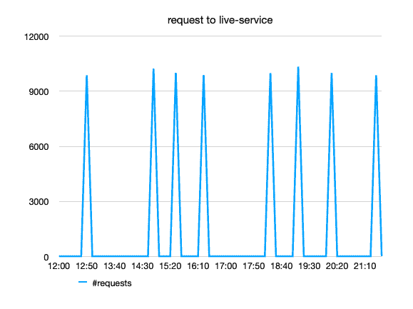
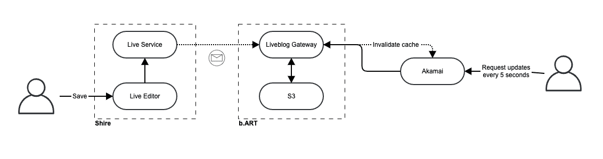

# 自动扩展的奇特案例:如何扩展不可预测的闪存流量

> 原文：<https://medium.com/geekculture/autoscaling-how-to-scale-unpredictable-flash-traffic-899cebaa3934?source=collection_archive---------14----------------------->

*由 Jo De Coninck (CDN 产品负责人)、Kenneth De Win(开发人员)和 Gert Leenders(云解决方案架构师)撰写*

**Flash 流量是自动伸缩的陷阱之一。这种流量最著名的例子就是黑色星期五。如何解决扩展困难？让我们找出答案。**

与您的正常流量基线相比，flash 流量属于异常值；它通常比你平均收到的流量高很多倍。另一个特点是其陡峭的曲线。通常，从活动开始的那一刻起，流量就开始激增。这些特征使得很难将它们整合到自动缩放算法中。在 DPG 媒体，我们也会遇到突发事件，但我们是在实时新闻更新中体验到的。下面是我们的旅程，描述了我们如何解决闪存流量的扩展难题。

# 什么是 DPG 媒体的直播服务

这篇关于自动缩放的文章围绕 DPG 媒体的(微)服务展开，为数字新闻媒体提供实时新闻更新。为了简单起见，在本文的剩余部分，我们称这个服务为“实时服务”。

其核心是，直播服务提供各种事件的实时更新:体育比赛、灾难、恐怖袭击、投票结果等。从事件列表中，您可能已经猜到直播服务在大多数时间都提供非常受欢迎的内容。它既是高浏览量的病毒式内容，也是持续更新的实时内容。

# 拥挤的车流

如果您不久前看了一下 live-service 的内部，您会发现几个 ECS Fargate 容器正在运行一个 Spring Boot 应用程序。在容器的前面，一个应用负载平衡器充当了我们的内容交付网络(CDN)的起源。

事实上，直播服务的流量是如此之大，如果没有 CDN 在它面前，它将无法生存。虽然大多数情况下，将 CDN 放在内容之前是简单明了的，但直播服务却不是这样。

我们的第一个教训是，尽管我们实现了非常高的 CDN 卸载百分比，但每次 CDN 缓存被清除时，实时服务的压力都太大了。**这是一种有趣的模式:只要 CDN 从缓存中提供服务，后端就不会感到压力。然而，CDN 缓存一失效，大量的请求就像流量山洪爆发一样袭击了直播服务。**在一瞬间，流量激增根本没有时间扩展或做出反应——直播服务就这样被淹没了。😓

到达起点(实时服务)的流量如下:

对于实时服务，每次 CDN 缓存清除都感觉像是针对它发动了 DDoS 攻击。问题是双重的:太多的请求到达了后端，所有的请求都是在同一瞬间发出的。

# 模糊的视觉:在意想不到的地方寻找解决方案

现在可能已经很清楚，flash 流量对于自动扩展来说是一种糟糕的模式。加上新闻更新的不可预测的时间，你可能会想是否有自动缩放的空间。有！所以让我们带你经历一下。

# 快速失败

要解决的第一个问题是在非常高的流量泛滥的情况下完全失败——实时服务变得完全没有响应，并且无法再提供缓存更新。为了克服这一点，实施[快速失效模式](https://dev.to/aws-builders/the-curious-case-of-autoscaling-4lb6)。**最终，一个 CDN 所需要的只是一个刷新其缓存的单一响应；其他请求全部失败**也没关系。

# 异步刷新缓存

然而，仅仅快速失败是不够的。是时候仔细看看我们的 CDN 的功能了，在这种情况下是 Akamai。为了帮助降低负载，我们首先启用了[缓存预刷新](https://learn.akamai.com/en-us/webhelp/api-gateway/api-gateway-user-guide/GUID-C08A2F17-BC1E-4F9E-89AE-09CF435C4F2D.html)，这是减轻原点压力的第一个巧妙技巧。

Akamai 预刷新允许您始终从缓存提供内容，并异步调用 origin 进行缓存刷新。它避免了当缓存过期时向客户端提供较慢的响应。这是通过消除对始发转发刷新调用的等待来实现的。

这里有一个预刷新的例子:

*假设一个对象的缓存生存时间(TTL)设置为 10 分钟。一旦填充了缓存，接下来 10 分钟内的所有后续请求都将由缓存提供服务。但是，当预刷新设置为 TTL 的 90%时，在第 9 分钟后到达的请求将返回缓存的对象。Akamai 还将向源异步转发一个刷新请求，让缓存再热 10 分钟。*

# 避免请求泛滥

我们必须承认，异步缓存刷新并不能解决所有问题。对于流行的内容，预计许多客户端会同时请求相同的内容；预取并不能解决这个问题。以上面的例子为例，想象成千上万的并发请求在第 9 分钟到达。Akamai 将从缓存中为所有这些请求提供服务，但它也会为其中的每一个请求向源发起一个请求。这就是我们前面提到的交通闪食。

为了避免山洪爆发，Akamai 有一个隐藏的功能，叫做“公开-早期”。Akamai 只能根据请求打开的这一功能，只将一个刷新调用转发给源，并告诉其他请求等待该响应。该功能也被称为[请求折叠](https://www.akamai.com/uk/en/multimedia/documents/product-brief/cloud-wrapper-product-brief.pdf)，其目的是减少到原点的行程。

# 缓存标签

关于缓存标签的一点小注意:缓存标签在实时服务中很方便。使用缓存标签，您可以将对象链接在一起，以便对它们应用相同的缓存逻辑。假设有一篇文章、一个实时博客和一个自动收报机，每个都发布了一场特定足球比赛的当前比分。通过向所有这些项目添加相同的 cache-tag(例如，match-id ),您可以无限期地缓存它们，并在分数发生变化时使用一个 purge-command 清除所有项目的缓存。

# 起源 2.0: AWS S3 拯救

虽然 CDN 设置解决了这个问题，但是根据我们一路走来学到的一切，我们找到了一个更好的解决方案。如果你看看现在的实时服务，你会发现它使用了不同的来源，需要不同的扩展方法。虽然我们的大多数服务使用 AWS 自动扩展原则进行扩展，但实时服务完全通过 CDN 来处理扩展。在其目前的设置中，live-services 只负责保持 CDN 的来源新鲜。为此，每当有新闻更新时，它就在 S3 上创建静态资产。

**S3 再一次感觉像是瑞士军队的多功能工具。随着 live-services 将其静态资产放在 S3，CDN 只需指出 S3 的来源。S3 的可用性和持久性确保我们可以安心睡觉。**然而，这还不够吗，Akamai 总是提供不新鲜的食物。

# 数十亿次请求

总而言之，直播服务是格特(本文作者之一)开始为 DPG 媒体工作的一个完美例子。格特:“我有相当好的记录，但从未遇到过像 DPG 媒体服务大军那样高的流量。在 DPG 媒体，我学会了在另一个层面上应对流量，在直播服务中，以及它的每个其他方面，从大数据和机器学习到数据库交易和消息。这很有趣，也很有挑战性。因为高流量会带来高影响，有时也会带来高压力。”