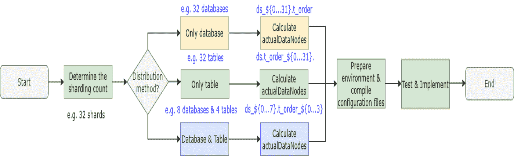
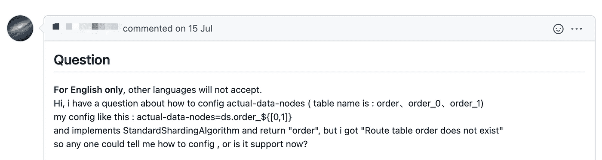
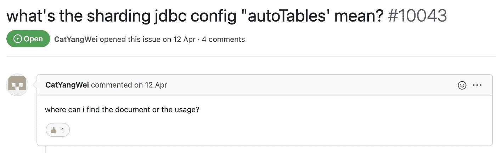

# AutoTable:您的管家式分片配置工具

> 原文：<https://medium.com/geekculture/autotable-your-butler-like-sharding-configuration-tool-9a45dbb7e285?source=collection_archive---------23----------------------->

# 摘要

在孟浩然撰写的上一篇文章[“DistSQL 简介”](https://shardingsphere.apache.org/blog/en/material/jul_26_an_introduction_to_distsql/)中，Apache ShardingSphere 提交者分享了 dist SQL 设计背后的动机，解释了它的语法系统，并令人印象深刻地展示了如何使用一条 SQL 创建一个分片表。

我们相信，您现在应该更加熟悉 Apache ShardingSphere 可以为您带来的新功能。

文章发表后，我们收到了许多读者和用户的来信。他们想知道使用 DistSQL 配置分片规则的细节，以及他们是否仍然可以使用 DistSQL 快速创建和配置带有 YAML 或名称空间等配置的分片表。今天，我们将向您介绍新的分片配置管家自动表。

# 背景

`Sharding`是 Apache ShardingSphere 的核心特性。我们猜测，您的旧分片工作流(没有数据迁移)可能如下所示:

**图 1:** 分片工作流程



在这样的工作流中，您必须清楚地知道您的分片策略，以及实际的表名和它们的数据源。然后，您将这些信息作为您的分片规则的基础。

表分布结果之一可以是 8 个分片数据库，每个包含 4 个表

**图 2:** 8 个数据库* 4 个表分布


# 问题

只有当你 100%确定表的分布时，你才能编写正确的`actualDataNodes`规则。否则，你可能会写错。在这种情况下，正确的分片规则如下所示:

```
tables:t_order:actualDataNodes: ds_${0..7}.t_order_${0..3}databaseStrategy:standard:shardingColumn: order_idshardingAlgorithmName: database_inlinetableStrategy:standard:shardingColumn: order_idshardingAlgorithmName: table_inlineshardingAlgorithms:database_inline:type: INLINEprops:algorithm-expression: ds_${order_id % 8}table_inline:type: INLINEprops:algorithm-expression: t_order_${order_id % 4}
```

ShardingSphere 实际上有非常用户友好的配置规则。然而，用户可能仍然有困难，例如:

*   未能理解分片策略或规则；
*   分片规则和实际表分布不一致；
*   错误的配置表达式。

*我们一直关注用户问题。例如，我们注意到我们的一个用户发现了以下问题:*



# 你为什么需要自动表格？

Apache ShardingSphere 版本 5.0.0 推出了`AutoTable`，这是一种让你更容易配置分片的新方法。

从字面上看，`AutoTable`的意思是自动化的表分片。使用 AutoTable 时，只需指定分片计数和数据源。由于 AutoTable，您不再需要担心实际的表分布。正确的配置格式如下所示:

```
autoTables:t_order:# Specify your datasourcesactualDataSources: ds_${0..7}shardingStrategy:standard:shardingColumn: order_idshardingAlgorithmName: modshardingAlgorithms:mod:type: MODprops:# Specify your sharding-countsharding-count: 32
```

由于可自动配置，ShardingSphere 能够识别出逻辑表`t_order`有 8 个数据源，需要 32 个分片表，然后自动计算分配结果:8 个分片数据库* 4 个分片表。结果完全一样。

# AutoTable & DistSQL

现在，你更了解`AutoTable`了。然而，当您将 AutoTable 与 DistSQL 结合使用时，结果会更加令人印象深刻，因为它可以大大简化您的分片配置。与旧方法不同，DistSQL 配置规则会立即生效，因此您不再需要重新启动它。此外，一个规则的改变不会对其他规则产生影响。

DistSQL 支持三种用于管理分片表规则的表达式:create、alter 和 drop。

```
# Create a sharding table ruleCREATE SHARDING TABLE RULE t_order (RESOURCES(resource_0,resource_1),SHARDING_COLUMN=order_id,TYPE(NAME=hash_mod,PROPERTIES("sharding-count"=4)));# Ater a sharding table ruleALTER SHARDING TABLE RULE t_order (RESOURCES(resource_0,resource_1),SHARDING_COLUMN=order_id,TYPE(NAME=hash_mod,PROPERTIES("sharding-count"=10)));# Drop a sharding table ruleDROP SHARDING TABLE RULE t_order;
```

> 注意:规则变更可能会对旧数据产生影响。为了解决这个问题，我们提供了 ShardingSphere 扩展，允许您迁移数据，并使您更方便地管理分布式数据。我们很高兴在不久的将来分享更多关于 ShardingSphere 缩放的内容。

# 常见问题解答

# 我可以在 JDBC 使用自动表格吗？

是的，你可以。

ShardingSphere-JDBC 和 ShardingSphere-Proxy 都支持自动表。此外，您还可以在代理中使用 DistSQL 进行动态配置，以满足您的各种访问需求。

# AutoTable 支持哪些分片算法？

AutoTable 支持所有自动分片算法:

*   MOD:模分片算法
*   HASH_MOD:哈希模分片算法
*   体积范围:基于体积的范围分片算法
*   边界范围:基于边界的范围分片算法
*   AUTO_INTERVAL:自动间隔分片算法

更多信息，请阅读 Apache ShardingSphere 文档“[自动分片算法](https://shardingsphere.apache.org/document/current/en/user-manual/shardingsphere-jdbc/configuration/built-in-algorithm/sharding/)”。

除了使用内置算法，您还可以开发 SPI 扩展，在必要时定制自己的分片算法。

# 我已经用过 YAML 了。我现在可以使用 AutoTable 吗？

我们不建议你这么做。

如果您确定这样的切换可以使表格分配结果符合您的期望，您可以尝试一下。否则，请不要这样做。

但是，如果您想创建一个新表，您可以使用 AutoTable。

# AutoTable 的最佳方案是什么？

AutoTable 旨在成为您的分片配置管家。你所要做的就是告诉它你需要多少个分片，然后它就省去了你记忆实际表位置和表数的麻烦。

要使用 AutoTable，您最好先配置规则，然后使用`CREATE TABLE`来创建表。旧习惯难改，但请改变您的旧习惯:首先创建表，然后配置规则。现在 ShardingSphere 更像是你的分布式数据库的一个接入点，而不是中间件。

# 我的数据源名称不连续，或者我有太多的数据源名称。我可以使用 AutoTable 吗？

是的，你可以。当您指定数据源时，它们的名称不需要连续。要解决这个问题，您可以同时使用枚举表达式和内联表达式:

```
CREATE SHARDING TABLE RULE t_order (RESOURCES('resource_${0..9}',resource_12,resource_15,"resource_$->{17..19}"),...);
```

# 我可以同时使用 AutoTable 和旧方法吗？

是的，你可以。

更多信息请阅读:[https://github . com/Apache/sharding sphere/blob/master/sharding sphere-JDBC/sharding sphere-JDBC-core/src/test/resources/config/config-sharding . YAML](https://github.com/apache/shardingsphere/blob/master/shardingsphere-jdbc/shardingsphere-jdbc-core/src/test/resources/config/config-sharding.yaml)

# 奖励:

@CatYangWei 是第一个询问`AutoTable`的 GitHub 用户。



我们要感谢他帮助我们找到了问题。我们很感激。为了表达我们的感激之情，我们稍后会联系您，并给您送上一份礼物。作为社区的感谢👏👏👏

我们也欢迎其他社区成员帮助我们发现更多问题，以改善社区。

# ShardingSphere 社区:

sharding sphere Github:【https://github.com/apache/shardingsphere 

Twitter:[https://twitter.com/ShardingSphere](https://twitter.com/ShardingSphere)

ShardingSphere 松弛通道:[apacheshardingsphere.slack.com](http://apacheshardingsphere.slack.com/)

投稿指南:[https://shardingsphere.apache.org/community/en/contribute/](https://shardingsphere.apache.org/community/cn/contribute/)

# 作者

江


> *spherex 中间件开发工程师& Apache ShardingSphere 贡献者。*