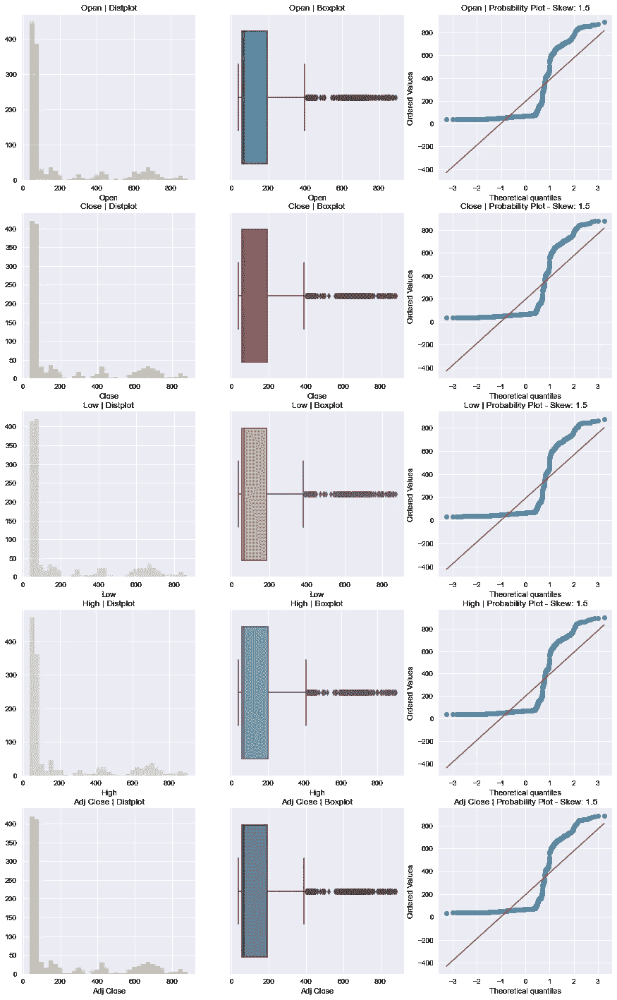

# Autoviz:用 Python 从任何数据集创建简单的图表

> 原文：<https://medium.com/geekculture/autoviz-create-simple-charts-from-any-dataset-in-python-6514db8252b6?source=collection_archive---------14----------------------->

另一个有用且简单的 python 包是 **Autoviz** ，它允许快速和体面的探索性数据分析(EDA)。

**Autoviz** 是另一个帮助用户简化 EDA 过程的包，这对任何数据相关的项目都至关重要。

这篇文章着眼于用户如何利用这个包来创建和分析他们的数据集。如果…