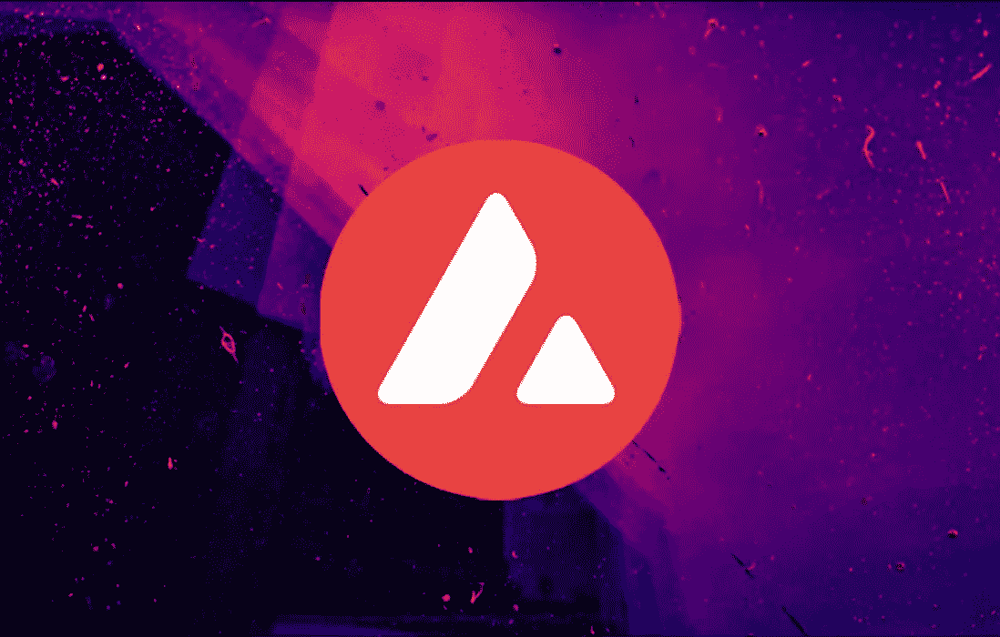

# 雪崩(AVAX)爬上加密 10 强——以太坊黑仔？

> 原文：<https://medium.com/geekculture/avalanche-avax-climbs-into-the-crypto-top-10-ethereum-killer-f780fa689dfd?source=collection_archive---------14----------------------->

以太坊的竞争对手在宣布一项重大交易并增加其 AVAX 令牌的稀缺性后继续取得进展。

与加密市场的普遍抛售相反，Avalanche 公司表现稳健。在币安，硬币甚至可以在短时间内达到 150 美元，创下历史新高。