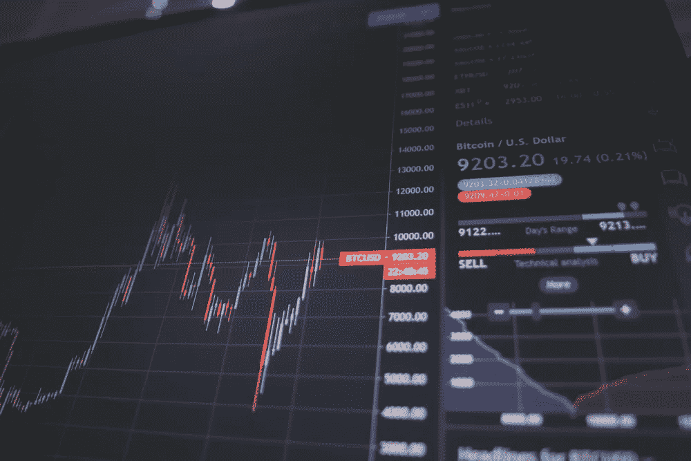

# 平均动量指标。他们在交易中添加了什么吗？

> 原文：<https://medium.com/geekculture/averaging-momentum-indicators-do-they-add-anything-in-trading-de4c1f964d75?source=collection_archive---------9----------------------->

## 对多个回望期的动量进行平均，以创建一个指标——Python 回溯测试。

www.pxfuel.com

平均化可以在分析中打开新的大门，比如众所周知的相对强弱指数就是对一类动量进行平均化的结果。在本文中，我们将介绍简单的动量…