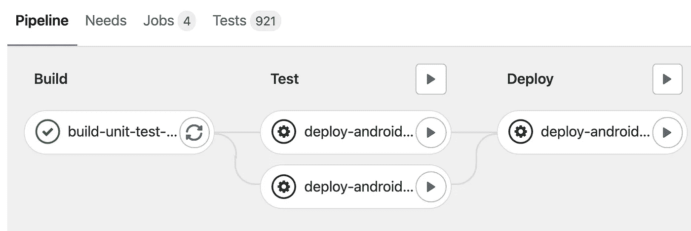
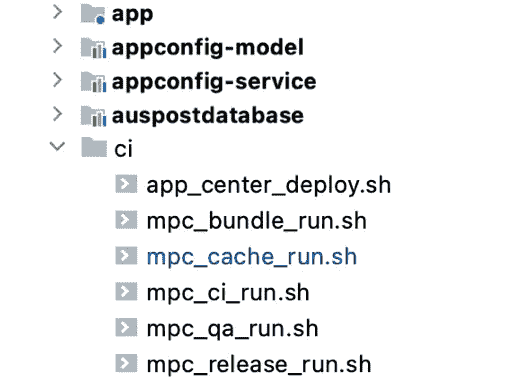
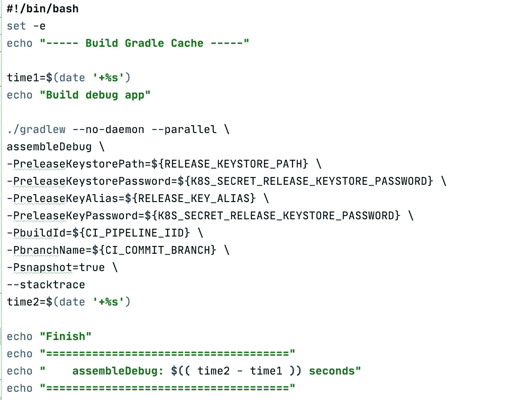
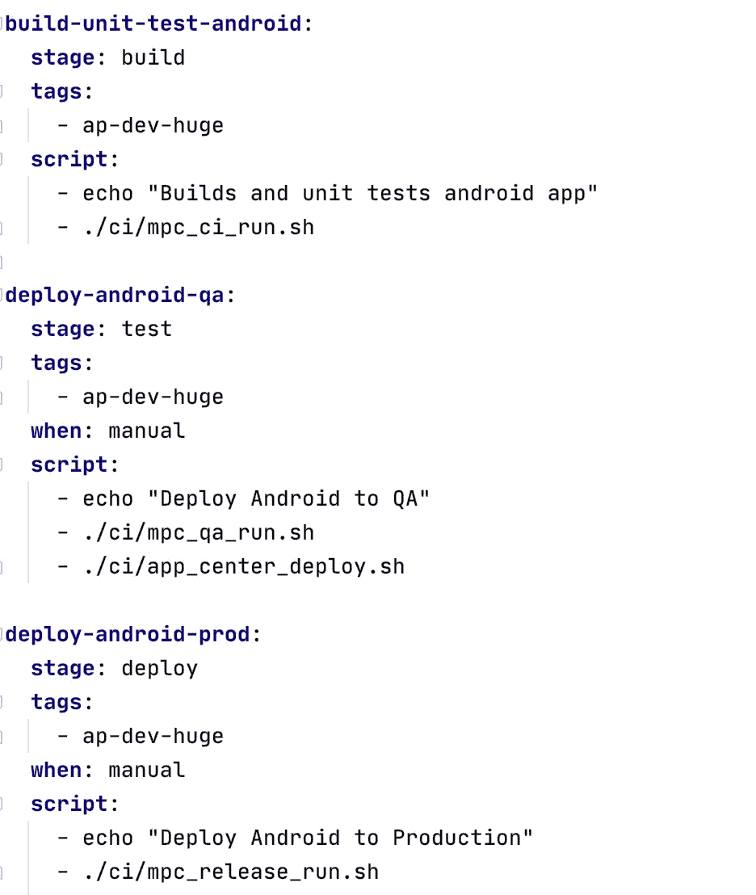

# 避免 CI/CD 锁定—使您的构建更加可移植

> 原文：<https://medium.com/geekculture/avoid-ci-cd-lock-in-make-your-builds-more-portable-2d616e349185?source=collection_archive---------11----------------------->

Our Gitlabs pipeline.

我们最近将 Android CI/CD 管道从 Bitbucket/Bamboo 迁移到了 Gitlabs。如果你关注我的博客，这是我们在今年的[工程路线图](https://proandroiddev.com/our-engineering-roadmap-1231dc5812)中计划要做的事情。这些 CI/CD 产品各有利弊，真正的问题不是哪个产品更好，而是当企业决定更换产品时，如何使迁移更容易。即使您没有使用 Bitbucket/Bamboo 或 Gitlabs，遵循本文中概述的原则应该可以最大限度地减少将来迁移 CI/CD 的潜在工作量。在此之前，让我们看一下您的 CI/CD 的 3 个关键功能。

1.  scheduler——这允许您创建每日、每夜或每周的构建，等等。
2.  触发器—确定构建作业的启动方式。这通常是通过将代码推送到存储库来自动完成的，或者是通过按下 UI 中的按钮来手动完成的。
3.  orchestrator——如何组织不同的构建作业以形成管道。

如果您记住了这一点，那么应该可以更容易地决定在哪里以及如何配置您的 CI/CD。如果您在 CI/CD 中添加了额外的内容，请考虑将其移动到更合适的位置。

这里有一些简单的技巧来帮助提高你的构建的可移植性；

1.  将构建脚本保存在代码库中。这意味着您可以轻松地跟踪变更，并在不影响其他分支的情况下变更您的构建。

Directories in the repo.

2.把你的 Gradle 命令放到一个 shell 脚本中。这意味着多个 Gradle 命令可以通过一个脚本轻松执行，并且很容易维护您的构建中使用的参数。一个格式良好的 shell 脚本在像 Android Studio 这样的编辑器中比在 CI/CD 的 UI 中更容易阅读。

The mpc_ci_run.sh script to execute our build.

3.尽可能使用 Gradle 插件而不是 CI/CD 插件。所有 Gradle 命令可以在任何地方执行，但是 CI/CD 插件只能在您的 CI/CD 管道上执行。如果您没有使用 Gradle，这也适用于任何其他构建技术，例如您可能正在使用的 Maven。最受欢迎的 CI/CD 服务器之一拥有超过 [1500 个插件](https://plugins.jenkins.io/)！

4.使用容器——它们确保你的构建是可移植的和可复制的，几乎所有的现代 CI/CD 解决方案都使用它们。

5.最小化 CI/CD 中的配置。如果您使用单个 shell 脚本(或最少数量的脚本)来执行每个构建工作，那么事情就会变得简单且易于维护。这意味着您的 CI/CD 配置中的配置应该很少改变。

Our .gitlab-ci.yml file.

我们从 Bitbucket/Bamboo 的迁移轻而易举，令人惊讶的是，我们的 Gitlab YAML 文件不超过 106 行。我希望这些简单的提示对你有用，请继续关注。

注意:我不像以前那样写很多文章，主要原因是远程工作。我过去常常花大部分通勤时间写文章来打发时间，但现在不再这样了。也许当我们回到办公室的时候，你会看到更多的文章！