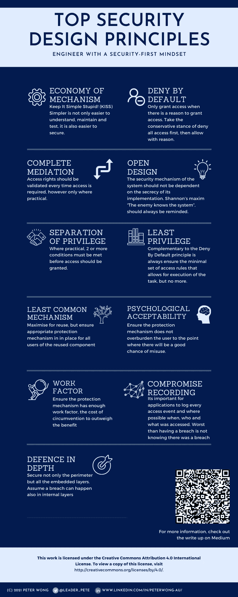

# 安全第一工程:在设计过程中嵌入安全设计原则

> 原文：<https://medium.com/geekculture/avoid-costly-redesigns-to-fix-security-design-flaws-using-these-generally-accepted-security-design-276f582145e4?source=collection_archive---------38----------------------->

在设计任何系统时，从平台到平台上的单个组件以及平台之间的任何地方，都应考虑以下安全设计原则，以确保所设计的系统及其信息不会受到未经授权的使用。

安全补救是一场永无止境的猫捉老鼠游戏，仅仅遵循诸如 [OWASP 十大](https://owasp.org/www-project-top-ten/)漏洞之类的规范性建议是不够的(尽管这是最低要求)。它需要在解决方案中嵌入安全原则。

每个工程解决方案，包括我们如何在 CI/CD 管道中交付这些解决方案，都需要设计为符合这些安全原则。

然而，实际上，一个系统并不能满足所有这些原则，因此必须做出权衡。但是，应该知道做出了哪些权衡，并确保它们与可接受的风险状况相匹配，并与向客户交付必要的功能相平衡。

此外，这只是解决安全问题的一种方法，而不是唯一的方法。其中包括一个持续的测试、审查和改进过程，以保持领先地位。然而，让我们把那些考虑留到下次。

安全设计原则最初是由 [Saltzer 和 Shroeder](https://www.cs.virginia.edu/~evans/cs551/saltzer/) 在 1975 年的开创性工作阐明的，并且已经通过现实世界的实践为现代环境进行了修订。以下是我们在 Signify R & D 工程实践中采用的原则。随着时间的推移，这些原则也会随着情况的变化而调整，以应对当今的安全挑战。

将在现代软件工程的背景下，特别是在微服务平台开发的背景下，解释以下原则。

1.  **经济的机制**
    保持简单愚蠢！(KISS) Simpler 不仅更易于理解、维护和测试，也更易于保护。复杂性可能意味着有比必要的更多的执行路径，并增加了引入后门的风险。问问自己，有没有更简单的方法可以达到同样的效果？你真的需要另一个微服务或额外的 API 端点吗？你的职能是否超出了必要的范围？你是否提供了多余的选择？
2.  **默认拒绝**
    只有当有授权访问的理由时才授权访问。采取保守的立场，首先拒绝所有访问，然后有理由地允许。这样更容易管理访问规则，而访问规则通常是一个较小的子集。首先考虑只为最高特权用户启用新的 API 端点，然后只有在有充分理由的情况下，才逐步开放其访问。
3.  **完全中介**
    每次需要访问时，都应验证访问权限，但仅在可行的情况下。定期审查身份验证机制，对实施进行关键分析，以确保访问不是基于过时的缓存断言进行的。在当前版本的 [OWASP 十大](https://owasp.org/www-project-top-ten/)中，身份验证失败排在第二位，但在以前的版本中也排在前列。
4.  **开放式设计**
    系统的安全机制不应该依赖于其实现的保密性。香农的格言“敌人知道系统”，应该经常提醒。所有 NSA(美国国家安全局)推荐的加密算法的实现细节都是众所周知的。保护机制如何工作的开放式设计也允许外部评估，因此有机会进行改进。然而，当然如何管理秘密(密钥、密码等)需要得到保护和审查，以确保它们不被暴露。
5.  **权限分离**
    在可行的情况下，必须满足两个或更多条件才能授予访问权限。双因素身份认证是坚持这一原则的一个很好的例子。这个原则也适用于批准过程，例如，开发人员不应该单独发布对产品的变更。
6.  **最小特权**
    默认拒绝原则的补充是始终确保允许执行任务的最小访问规则集，但仅此而已。定期检查您访问控制机制，并询问是否需要权限。评估用户类型的角色及其权限。检查授予数据库的权限，并撤销不再需要的权限。
7.  **最少的公共机制**
    好的软件工程的目标之一，就是最大化重用。然而，这需要与安全考虑相平衡。评估你的 API 被使用的所有不同的上下文，平衡重用的竞争需求和非预期使用的风险。如果该 API 需要共享，那么需要评估该重用组件的所有用户的保护机制是否到位。
8.  **心理可接受性**
    确保保护机制不会让用户负担过重，以至于很有可能被误用。我们都知道这一点，当它要求我们定期更改我们的密码，并确保我们可以轻松地记住我们的密码，我们求助于不安全的密码，不同的一些增量(例如，P@$$wordJan，P@$$wordFeb 等)。这里我们需要平衡安全性和可用性。
9.  **工作因素**
    工作因素是对规避保护机制的成本的衡量。强力攻击需要付出多大的努力？该原则建议提供一种利用工作因素的保护机制。
10.  **妥协记录**
    2020 年，认定一次违约的平均时间为 [228](https://www.varonis.com/blog/data-breach-response-times/) 天。安全漏洞会发生。这是事实！然而，最糟糕的是不知道它们何时发生，也不能及时做出反应。因此，确定这些事件的日志和警报的优先级非常重要。对于应用程序来说，记录每一个访问事件以及可能的时间、人员和内容是非常重要的。
11.  **深度防御**
    几乎所有工程解决方案都是分层的。这只是很好的练习。依赖项的实现细节被抽象掉了。它是 S.O.L.I.D 中的 D，其中 D 表示依赖倒置原则。然而，仅仅保护解决方案的边界是不够的。需要假设任何一层都可能发生违规，因此每一层都应该有适当的保护机制。一种非常常见的做法是以明文形式保存数据库凭证。另一个需要解决的常见做法是，不要在内部服务间通信中启用 HTTPS 加密，因为会错误地认为边界是安全的。然而，这里也需要一定程度的实用主义。这需要与提供这些保护的努力相平衡。

让我们现实一点，认识到构建一个解决方案的挑战，这个解决方案将对解决方案及其信息的未授权使用提供高度保护。然而，如果我们注意到这些安全原则，我们可以大大减少安全违规的数量和严重性。

在 R&D，我们非常重视安全，而不是事后才想到。这些安全原则支撑着我们的一切建设。它根植于我们所有工程师的头脑中，从系统级架构审查到代码审查的所有审查都是根据这些原则进行评估和测试的。我们甚至将它嵌入到我们的代码审查清单中。尽可能早地考虑这些因素，以避免在稍后阶段为解决客户暴露的安全漏洞而进行重新设计的代价高昂的最坏情况。

请在这里找到一张[海报](https://www.canva.com/design/DAEfPpJid7k/NSVC5i6h7rFzcF_2EXrdDQ/view?utm_content=DAEfPpJid7k&utm_campaign=designshare&utm_medium=link&utm_source=sharebutton)，您可以下载、打印并分享。希望这有助于在设计、评审和测试您的工作产品时，将这些原则放在您头脑的最前面。

希望听到关于您如何将安全实践融入您的特定环境的反馈，并欢迎分享您学到的任何经验教训。把它们放在下面的评论里。欢迎所有评论