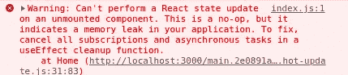
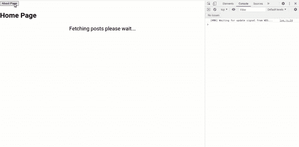

# 通过取消 API 调用来避免 React 应用程序中的内存泄漏

> 原文：<https://medium.com/geekculture/avoid-memory-leaks-in-your-react-app-by-canceling-api-calls-9cf692c06573?source=collection_archive---------2----------------------->


Photo by [Joe Zlomek](https://unsplash.com/@sanatoga?utm_source=medium&utm_medium=referral) on [Unsplash](https://unsplash.com?utm_source=medium&utm_medium=referral)



你肯定在使用 React 应用程序时遇到过这个警告。即使 JavaScript 语言有一个自动化的内存管理机制，如果我们不小心实现程序，内存泄漏仍然有可能发生。这同样适用于 React 应用程序。内存泄漏不是一个好现象，应该避免。

内存泄漏最容易被忽视的原因是 API 调用处理不当。因为对 API 的调用是异步的，所以在请求完成之前，启动任务的组件可能会被卸载。例如，当用户转到另一个页面而当前页面尚未完成加载时，就会发生这种情况。

# 演示

为了演示，让我们使用一个简单的 React 应用程序，它有两个组件，`Home`和`About`，还有一个在两者之间切换的按钮。`Home`组件从我们将使用`json-server`设置的 API 中获取博客文章数据。我们还将把服务器的响应时间延迟到 3 秒，这样我们就有足够的时间在 API 请求完成之前在两个组件之间进行切换。

在我们的`App.jsx`中，我们有一个按钮来切换`isHome`状态，并有条件地呈现`Home`或`About`组件。

在初始渲染期间,`Home`组件从我们的 API 服务器获取博客文章数据。

`About`组件只包含一些要在 DOM 中呈现的文本。

我们还需要添加`json-server`，并在我们的`package.json`文件中将其配置为 3 秒的响应延迟。

```
{
 "scripts":{
     ...
    "server": "json-server --watch db.json --port 3001 --delay 3000"
}
}
```

现在，如果我们在加载过程中运行我们的项目并点击“About Page”按钮，我们将在控制台上得到一个内存泄漏警告。



Memory leak warning shows up on the console

# 解决方案

解决这个问题的方法是在调用`useEffect`清理函数时取消 API 请求。取消请求的首选方式是使用`AbortController`，如 [Web API 文档](https://developer.mozilla.org/en-US/docs/Web/API/AbortController)中所述。通过将`AbortSignal`传递给`fetch`方法，然后在卸载组件之前调用`abort`,`AbortController`将允许我们中止 web 请求。

我们需要对我们的`Home`组件稍作修改，以避免内存泄漏问题。我们初始化一个新的`AbortController`实例，并将来自控制器的信号作为信号属性传递给我们的`fetch`方法。然后我们在我们的`useEffect`钩子的返回函数上调用`controller.abort`。

现在，如果我们像以前一样尝试，在加载过程中切换到`About`组件，内存泄漏警告将不会出现在控制台中。

# 结论

好了，这就是这篇文章。希望你喜欢读它。你可以在这里找到演示[的源代码。](https://github.com/eyuelberga/react-memory-leak-demo)