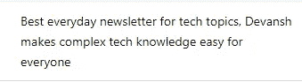

# 避免经理和工程师犯下的数十亿美元的错误

> 原文：<https://medium.com/geekculture/avoiding-the-billion-dollar-mistake-managers-and-engineers-make-5d89504c31e2?source=collection_archive---------5----------------------->

## 这个错误会让您的组织在金钱、工程时间和潜在增长方面损失惨重

我知道这个头衔承诺了很多，

这里有一点不准确。我们将要报道的错误不值十亿美元。它价值数十亿美元。而且这个数字只会越来越大。

如果你能改正这个错误，你会收获很多很多的好处。在这篇文章中，我会举一些例子来说明人们是如何避免这种错误从而获得巨大回报的。这件事最大的好处是什么？

这种方法需要做得更少。我不是在引诱你。纠正这个错误需要做更少的工作。不需要长时间。

如果这听起来像是你的事情，请继续阅读。你不会想错过的。

# 主要亮点

1.  **错在哪里-** 这会让很多人震惊。错误在于，当你有一个当前有效的解决方案时，盲目地试图设计更好的解决方案。先别急着离开。这不好是有原因的。
2.  **为什么这是一个错误——**工程很难。而且非常贵。这就是为什么你会得到这么高的报酬。大量的时间投入到通过改进工程来改进你的产品上会导致大量的成本(特别是当你的产品已经运行得相当好的时候)。比起问题本身，你更应该关注问题的背景。
3.  **这意味着什么-** 如果你正在改善用户服务，而不是仅仅追逐指标，寻找改变用户体验的方法。如果你正在开发工具来帮助企业，不要仅仅通过设计更好的产品来解决问题(高成本、滞后等)。看看问题的背景。你也许可以用一种更便宜的方法求解根。我会给你一些我最喜欢的技巧，帮助你更好地解决问题。

显然，在有些情况下，你必须深入了解工程。这就是本文其余部分的目的。然而，一些最伟大的创新来自应用在正确地方的相对简单的产品/想法。这篇文章将通过一些例子教你如何发现这些问题。

Photo by [ThisisEngineering RAEng](https://unsplash.com/@thisisengineering) on [Unsplash](https://unsplash.com/)

# 为什么完美工程是一个十亿美元的错误

在这篇时事通讯中，我一直在谈论收益递减规律。其核心是，它告诉我们一些深刻的东西——你做的越多，你得到的效用就越低。当你饿的时候吃第一个苹果，你会感觉很好。第二个苹果感觉不错。10 号会让你发誓不再吃苹果。

还有 80-20 原则，告诉你 80%的成果来自 20%的工作。这也意味着另外 20%的成果来自于 80%的工作。我为什么要说这些？

很有可能你们中的大多数人都在开发已经具有合理功能的产品。工程师、产品经理和领域专家已经投入了大量的工作时间来让事情运转起来。你拿工资是为了改进产品，而不是让它工作。如果你渴望在大型科技公司工作，这只会更加真实。

在这种情况下，你的额外工程会真正增加多少？与已经投入的集体时间相比，你可以花费的时间将会很少。所有直接的优化大概都做了，难/棘手的就……难了。你要为工程上 1%的改进投入数周的工作。这耗费了大量资源。这笔钱本可以更好地用在其他方面。

我们在这份时事通讯中报道过一个这样的例子(很久以前)。一个团队正在努力降低其服务的运营成本。**当工程团队专注于工程重型解决方案时，一位创意工程师开始深入研究这个问题**。他注意到有一些客户增加了很多成本，但并没有增加多少收入。通过降低这些客户的成本，这个问题将得到解决。而不需要昂贵的工程。而且快得多。这让他获得了许多晋升。要了解更多，请阅读下面的帖子-

 [## 一个软件工程师如何在 4 年内从 SW2 到校长

### 如何快速升职？一名工程师如何在不到 4 年的时间里获得 4 次晋升

blog.devgenius.io](https://blog.devgenius.io/how-a-software-engineer-went-from-sw2-to-principal-in-4-years-4c708dbfae40) 

还有其他例子可以说明这种方法的惊人之处。最引人注目的是休斯顿机场的故事。机场的工作人员面临着许多人的抱怨，他们厌倦了等待他们的行李。想办法更快拿到行李会很贵。相反，他们开始安排乘客到最远的接机通道。这意味着乘客不得不走更长的路，从而减少了等待的时间。他们面临的投诉大幅下降。

像这样的情况还有很多。我最喜欢的一句名言是*对于拿着锤子的人来说，一切看起来都像钉子*。通常，当有人向我咨询问题时，我的大脑会自动将机器学习作为一种解决方案。我们的思维已经进化到走捷径。我们将默认我们所知道的。对于工程师来说，这意味着他们将很少从工程的角度看问题。你想把这个弄掉。请记住，你不是为了建造/管理令人惊叹的工程项目而获得报酬的。你为某人创造价值而获得报酬。简单明了。你的技术知识只是帮助你实现这一目标的工具。

> 要成为百万富翁，帮助别人赚 200 万，然后向他们要一半。
> 
> *-Devansh(是的我在引用自己的话。处理一下)*

既然我们意见一致，让我们进入下一步。你怎样才能阻止自己犯这种错误，并通过提供实施简单但回报丰厚的解决方案让自己脱颖而出？让我们开始吧。

# 如何避免这种错误

那么，如何才能避免犯过度工程化的错误呢？你如何发现简单的解决方案最有效的途径？这不是一门精确的科学，但这些步骤可能会帮助你-

1.  **了解最终用户-** 如果你的平台达到了指标，那它就不是伟大的。如果最终用户以一种你可以从中获利的方式参与进来，那就太好了。因此，你应该花很多时间去了解你的最终用户。然后，您可以创建有助于用户更好参与的解决方案。我最喜欢的例子是 Twitter 上的“@”功能(它创造了一个新的 meta)和像 button 这样的 Instagrams。这两个特性实现起来都相对简单。两者都允许终端用户以更深入的方式参与平台。抖音做了类似的事情。它在拥挤的社交媒体市场中脱颖而出，给了最终用户我们都非常渴望的东西——**病毒式**。抖音让某人很容易就像病毒一样传播开来，让成千上万的人登上了这个平台。他们不必在更好的推荐、功能或内容上竞争(这些都很难实现)。如果你花些时间去了解你的最终用户，你会发现各种各样的方法来使事情变得更好。其中一些可以简单地实现。
2.  **关注其他人-** 关注你的竞争对手或已经达到你目标的人也很有用。他们的学习和经历可以教会你很多东西。众所周知，社交媒体公司在看到有用的功能时会互相抄袭。所有 LinkedIn 有影响力的人都有惊人相似的生活经历。[YouTube 都在缩略图里做了相似的脸](https://qoves.com/why-do-youtubers-keep-using-the-surprised-face-thumbnail/)。这样的例子不胜枚举。然而，你可以更进一步。通过学习其他领域的想法/最佳实践，你会发现你的领域/项目中缺失的部分。
3.  了解问题的根源- 有时当你在处理一个问题时，明智的做法是后退一步，全面地了解这个问题。是什么导致了这个问题？**所有用户遇到的问题是一致的，还是只有少数用户遇到的问题？**这个问题如何影响更大的系统？这就是我们的超级工程师快速提升的原因。在更广阔的背景下理解这个问题可以让你找到经济高效的解决方案。

我的建议可能看起来非常简单。在很多方面确实如此。但是简单不等于容易。这种方法需要大量的远见和耐心，而不是立即投入到你的工程/专业知识中，并从整体上评估问题。然而，这是一种会带来很多好处的方法。

如果你喜欢这篇文章，你会喜欢我的每日电子邮件简讯[技术使之变得简单](https://codinginterviewsmadesimple.substack.com/)。它涵盖了算法设计、数学、人工智能、数据科学、最近的技术事件、软件工程等主题，让你成为更好的开发人员。 [**我目前正在进行全年八折优惠，所以一定要去看看。**](https://codinginterviewsmadesimple.substack.com/subscribe?coupon=1e0532f2) 使用此折扣会降低价格-

***每月 800 印度卢比(10 美元)→ 533 印度卢比(8 美元)***

***每年 8000 印度卢比(100 美元)→6400 印度卢比(80 美元)***

[你可以在这里了解更多关于时事通讯的信息](https://codinginterviewsmadesimple.substack.com/about)

# 向我伸出手

使用下面的链接查看我的其他内容，了解更多关于辅导的信息，或者只是打个招呼。另外，查看免费的罗宾汉推荐链接。我们都得到一个免费的股票(你不用放任何钱)，对你没有任何风险。**所以不使用它只是失去免费的钱。**

为了帮助我了解你[填写这份调查(匿名)](https://forms.gle/7MfQmKhEhyBTMDUD7)

查看我在 Medium 上的其他文章。https://rb.gy/zn1aiu

我的 YouTube:[https://rb.gy/88iwdd](https://rb.gy/88iwdd)

在 LinkedIn 上联系我。我们来连线:[https://rb.gy/m5ok2y](https://rb.gy/f7ltuj)

我的 insta gram:[https://rb.gy/gmvuy9](https://rb.gy/gmvuy9)

我的推特:[https://twitter.com/Machine01776819](https://twitter.com/Machine01776819)

如果你想在科技领域发展事业:[https://codinginterviewsmadesimple.substack.com/](https://codinginterviewsmadesimple.substack.com/)

获得罗宾汉的免费股票:[https://join.robinhood.com/fnud75](https://join.robinhood.com/fnud75/)