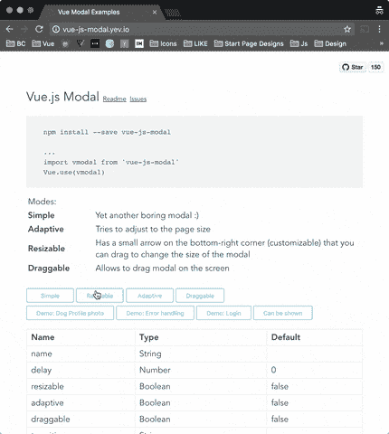
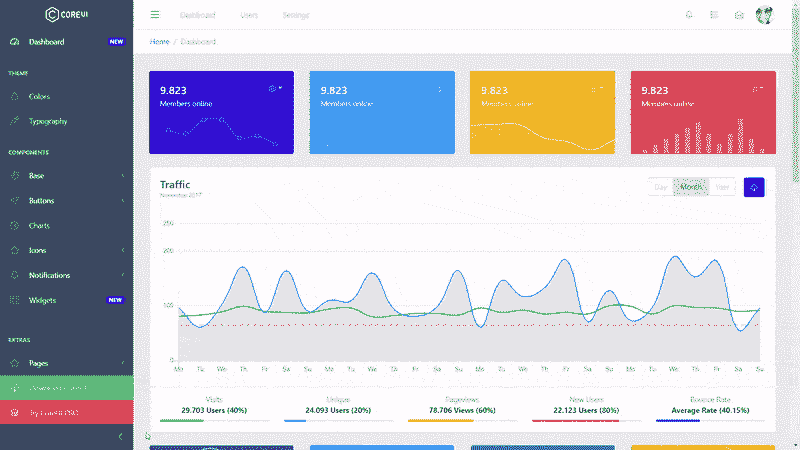
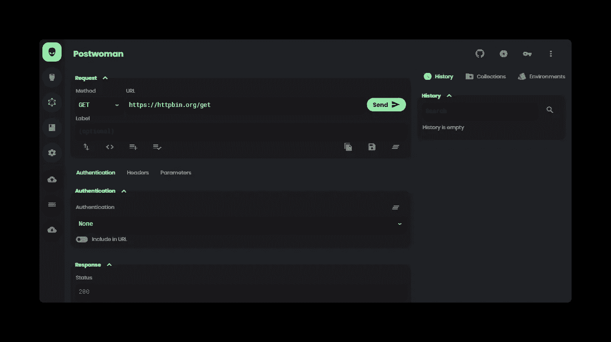
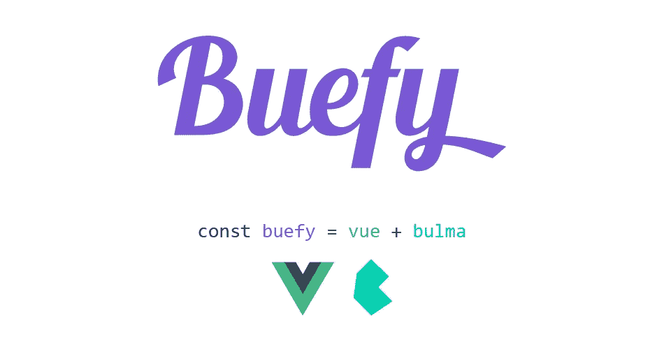
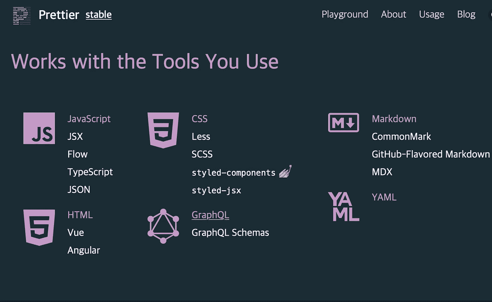
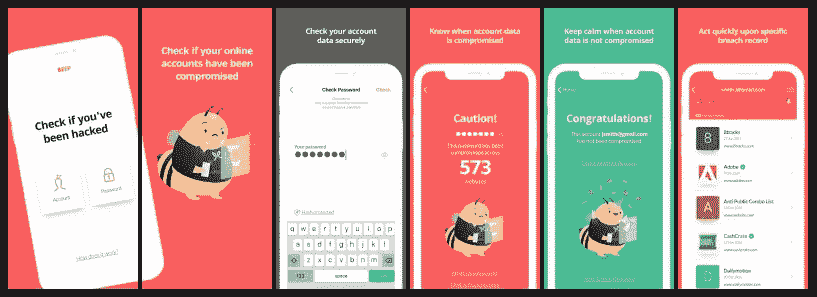

# Awesome Vue.js 开源项目

> 原文：<https://medium.com/geekculture/awesome-vue-js-open-source-projects-6aaf0a9fa372?source=collection_archive---------18----------------------->

一组非常棒的热门 vue.js 开源项目。获得灵感或者从已经为你写好的样板文件开始的好方法。

朋友们好。事实上，Vue.js 正在成为最流行的前端框架。所以，没必要在这篇文章里去翻历史，去解释什么是 vue.js。最近，我在忙一个 vue.js 速成班，并在寻找鼓舞人心的项目进行演示和实践。看到这些令人惊叹的 vue.js 项目，我感到很惊讶，觉得花时间来编制这个列表是值得的。

请不要以项目的排列顺序来评判项目。我不是来比较或评价这些项目的。这些中的每一个都很棒。我只是把它们列出来，由你来选择适合你或你最感兴趣的。我将很高兴在评论中听到你喜欢哪些以及为什么。如果你想让我就其中任何一个或任何你感兴趣的话题写一篇专门的文章，也请在评论中告诉我。

# CoreUI 免费 Vue 引导管理模板

CoreUI Free Vue Bootstrap Admin Template

> 科瑞意在改变 UX 的游戏规则。纯净透明的代码没有多余的组件，所以这款应用足够轻便，可以提供极致的用户体验。这也意味着移动设备，在那里导航就像在台式机或笔记本电脑上一样简单直观。CoreUI 布局 API 可以让你为几乎任何设备定制你的项目——无论是移动设备、Web 还是 Web app——core ui 涵盖了所有设备！

 [## coreui/coreui-free-vue-admin-template

### 为什么我们决定创建 CoreUI？请阅读这篇文章:万事通，无所不能。为什么启动管理…

github.com](https://github.com/coreui/coreui-free-vue-admin-template) 

# 女邮递员

postwoman

> **一个免费、快速、漂亮的 API 请求生成器**
> 
> *替代邮递员的网络——帮助您更快地创建请求，节省宝贵的开发时间*

 [## liyastomas/post woman

### 聊天:电报，不和谐捐赠:开放集体，贝宝，Patreon，GitHub 赞助商❤️轻量级:制作与…

github.com](https://github.com/liyasthomas/postwoman) 

# Vue.js modal

> 简单易用、高度可定制、移动友好的 Vue.js 模式。

 [## euvl/vue-js-modal

### 版本 2.0.0+可能会有突破性的变化。

github.com](https://github.com/euvl/vue-js-modal) 

布埃菲

> 基于布尔玛的 Vue.js 轻量级 UI 组件

 [## 布埃菲/布埃菲

### Buefy 是基于布尔玛框架和设计的 Vue.js 响应式 UI 组件的轻量级库。

github.com](https://github.com/buefy/buefy) 

# 较美丽

> 漂亮是一个固执己见的代码格式化程序。它通过解析您的代码并根据自己的规则(考虑到最大行长度，必要时换行)重新打印代码来强制执行一致的风格。

 [## 更漂亮/更漂亮

### JSX JSON CSS SCSS Less HTML Vue Angular graph QL Markdown YAML 你的…

github.com](https://github.com/prettier/prettier) 

# 使虚弱

> Vuetify 是一个 Vue UI 库，拥有精美的手工材质组件。不需要设计技能—创建令人惊叹的应用程序所需的一切都唾手可得。

 [## Vue 材料设计组件框架— Vuetify.js

### Vuetify 是一个用于 Vue.js 的材料设计组件框架。它旨在提供所有必要的工具来创建…

vuetifyjs.com](https://vuetifyjs.com/en/) 

# 浅蓝色 Vue 管理

> 这个仪表盘是我们的[浅蓝色 Vue Full](https://flatlogic.com/admin-dashboards/light-blue-vue) 的精简版(只包含几个组件)。有所有现成的组件，这是完整版本。它是建立在 vue-cli-3 之上的，所以它在 web 上得到很好的支持。你可以通过改变 SCSS 变量轻松定制模板。所有的填充和颜色都在 _variables.scss 文件中。

 [## 平面逻辑/浅蓝色-vue-管理

### 用 Vue.js 和 Bootstrap 4 构建的免费开源管理仪表板模板。由 Flatlogic 与❤️共同开发。如果你…

github.com](https://github.com/flatlogic/light-blue-vue-admin) 

# 哔声:移动帐户漏洞扫描器

> 每天，超过 400 万条在线数据记录被盗或丢失。Beep 会告诉您，您的在线帐户是否在这些数据泄露事件中被盗。只需输入您的电子邮件地址、用户名或密码，我们会告诉您是否已被黑客攻击。
> 
> Beep 是首批基于 Vue 构建的应用之一。JS 和 Ionic 框架。有了这种组合，PHP 开发人员再也不用纠结 Angular 来构建跨平台的 Ionic 应用了。我们甚至建造了自己的路由器。

 [## ModusCreateOrg/beep

### 每天，超过 400 万条在线数据记录被盗或丢失。哔声告诉你，如果你的在线帐户已经…

github.com](https://github.com/ModusCreateOrg/beep) 

# Vue 店面

> Vue 店面—电子商务的 PWA。100%离线，平台无关，无头，支持 Magento 2。永远开源，麻省理工许可。

 [## divante ltd/vue-店面

### Vue Storefront 是一个独立的 PWA storefront 您的电子商务，可以连接任何电子商务后端(如…

github.com](https://github.com/DivanteLtd/vue-storefront) 

# Vue 元素管理

> [vue-element-admin](https://panjiachen.github.io/vue-element-admin) 是一款面向管理界面的生产就绪型前端解决方案。它基于 [vue](https://github.com/vuejs/vue) ，使用 UI 工具包 [element-ui](https://github.com/ElemeFE/element) 。

 [## 潘家陈/vue-元素-管理

### vue-element-admin 是一个用于管理界面的生产就绪前端解决方案。它基于 vue 并使用 UI…

github.com](https://github.com/PanJiaChen/vue-element-admin) 

这只是 vue.js 社区正在构建的令人敬畏的项目的一小部分。我希望你喜欢阅读这篇文章，并受到启发，与 vue.js 一起发展。非常感谢你的时间，并祝你好运。

现在，如果你对学习 Vue JS 感兴趣，请在 Vue JS 上查看我们的课程

 [## Vue。JS 速成班+指南

### 动手操作初级和中级 Vue JS 基础课程

www.udemy.com](https://www.udemy.com/course/vuejs-complete-course-plus-guide/?couponCode=A08B94C7C6D1F25CB902)  [## Vue 3 必需品

### 为 Vue 技能打下坚实的基础，让您的 Web 开发更上一层楼

www.udemy.com](https://www.udemy.com/course/vue-3-essentials/?couponCode=7C53C70A1C905B406C94) 

谢谢你。