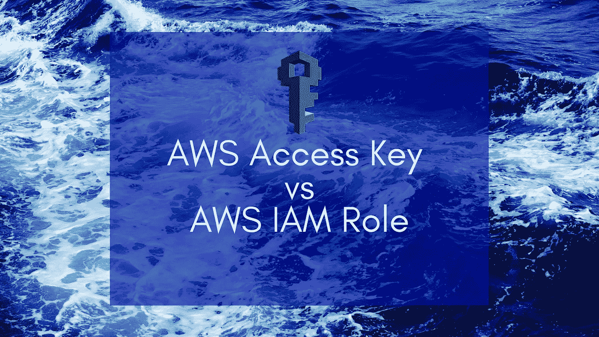

# AWS 访问键 v/s IAM 角色

> 原文：<https://medium.com/geekculture/aws-access-keys-vs-iam-roles-c060c1a151bc?source=collection_archive---------7----------------------->

AWS 访问键允许您在开发机器上使用命令行访问各种 AWS 服务。但这也伴随着很多风险。让我们看看它会造成什么危害，以及有哪些类似 IAM 角色的替代方案。

## 我是如何被黑的

我是 AWS 访问密钥的超级用户。我过去喜欢 AWS 客户端的命令行界面。我运行的所有 EC2 实例都有密钥…