# AWS 第 6 篇:EC2 中的安全组

> 原文：<https://medium.com/geekculture/aws-article-6-security-groups-in-ec2-6aa6e9a1faf?source=collection_archive---------30----------------------->

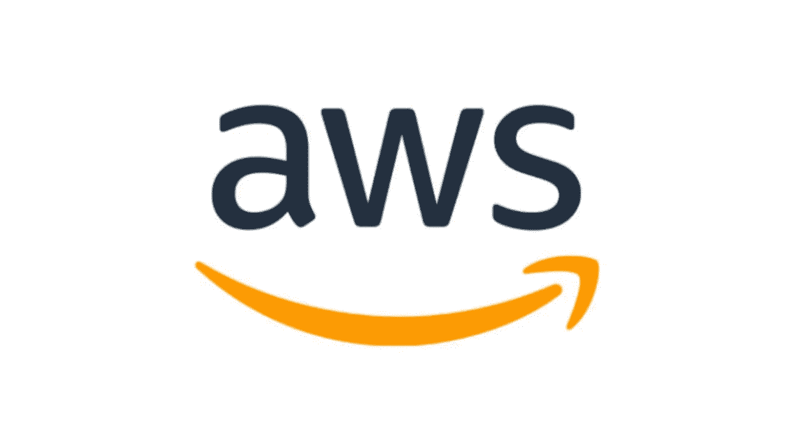

→安全组是 EC2 实例之上的**防火墙。**

→根据**位置**、 **IP** 或**以及其他一些条件，只有特定的用户才能访问。**

→假设你用的是公司的笔记本电脑。在那里你会发现很多限制——我们**不能打开 Gmail、Youtube** 和**一些出于安全考虑保留的网站**。这是由于服务器的安全组。

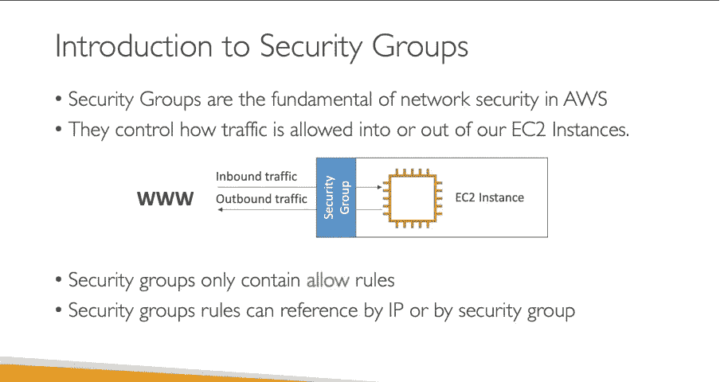

→需要了解的一些关键词:

> **入站/入站流量:**请求进入 AWS 服务器
> 
> **出站/出站流量:**来自 AWS 服务器外部的请求。

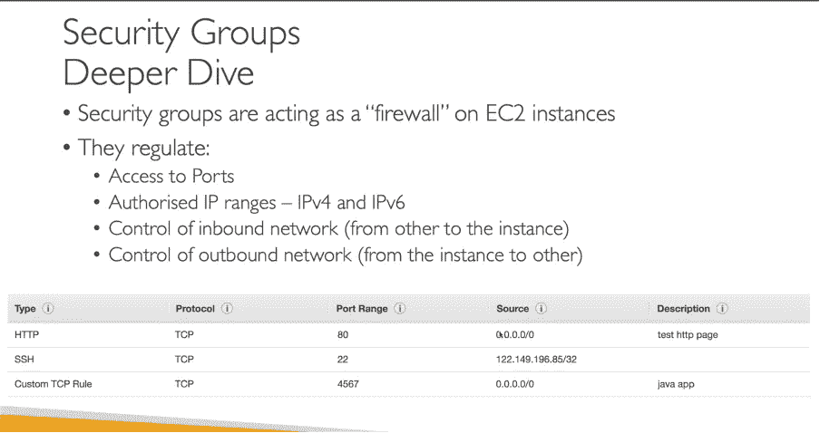

让我们看一个例子:

→ **两个开发者**正在从**不同地区**访问**同一个端口**。一个是**授权的**，另一个**不是**。

→防火墙将**不允许**任何**未经授权的访问**。

→ EC2 可以发送**任何出站请求。**

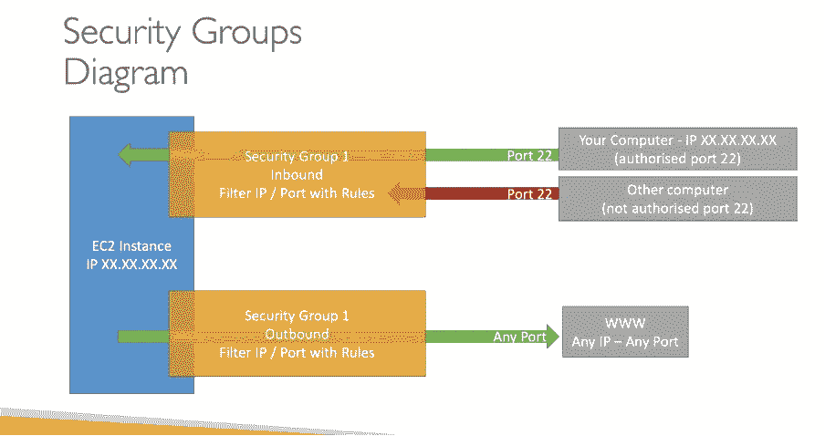

→关于安全组需要知道的几点:

→还有一种方法是**建立一个安全组**可以**允许一些安全组**。

→从这个意义上说，这很好，一旦所有单独的安全组都设置好了。新的安全组将执行 OR 操作。需要担心的 IP 的事情会少一些。

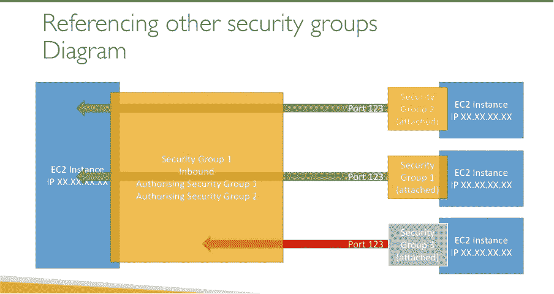

# AWS 中的经典端口:

→在配置不同协议时，会要求我们选择协议，即 HTTP、HTTPS、SSH 等

→每个端口被分配给一个特定的端口。以下是端口列表:

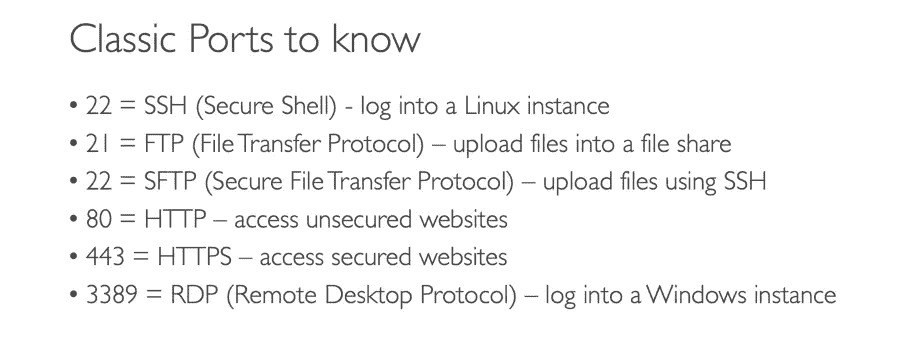

# 浏览 AWS 帐户中的安全组:

→登录您的 AWS 帐户→搜索 EC2 实例→单击左侧的安全组。

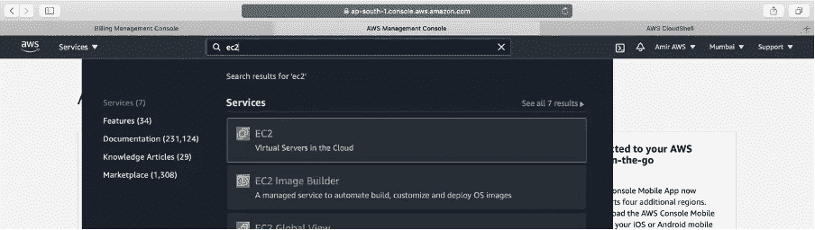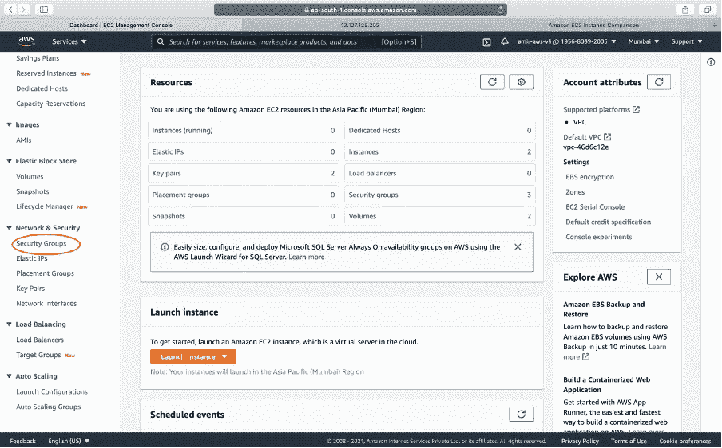

→在这里，我们将进入一个页面，在这里我们将看到安全组的**列表。通常**一个是默认的**在**创建账户的时候**，另一个是我们在下面看到的 EC2 实例运行的数量(在我的例子中是两个)。**

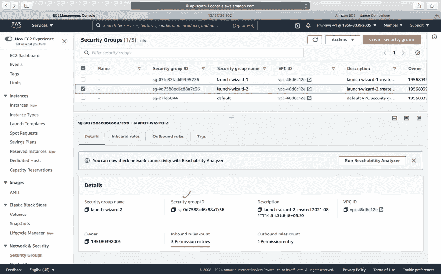

→让我们在第二个选项卡中检查**入站** **(即请求进入 AWS)** :

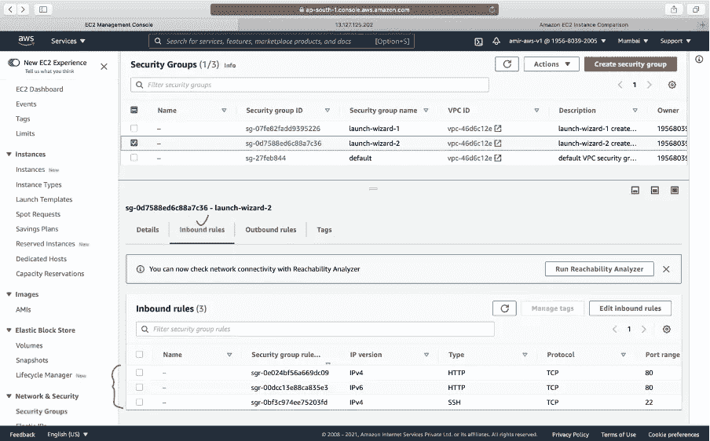

因此，允许三种类型的请求——HTTP(IP v4 和 6)和 SSH

即目前接受 HTTP 服务器(非安全服务器)。

→让我们检查第三个选项卡中的**出站** **(即来自 AWS 外部的请求)**实例。

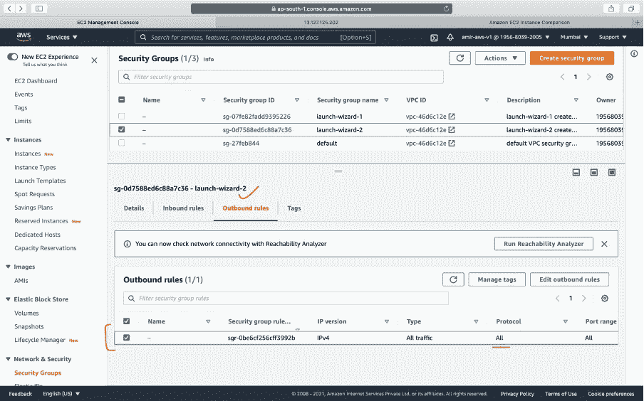

默认情况下，所有请求都可以从 EC2 实例发送。

→让我们转到 EC2 实例，打开 AWS 服务器:

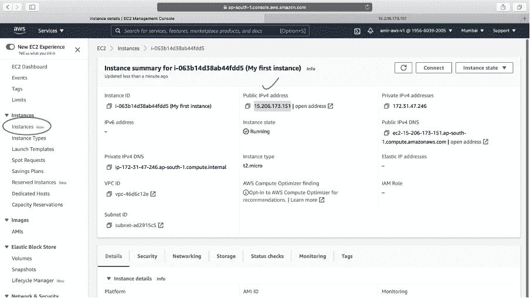

→在浏览器中打开**公共 IP 时，呈现**网页**。这意味着网络服务器**目前正在工作。****

→让我们把**一些入站规则**到**限制到 URL** 并了解更多

点击左边的**安全组**→点击**编辑入站规则**按钮

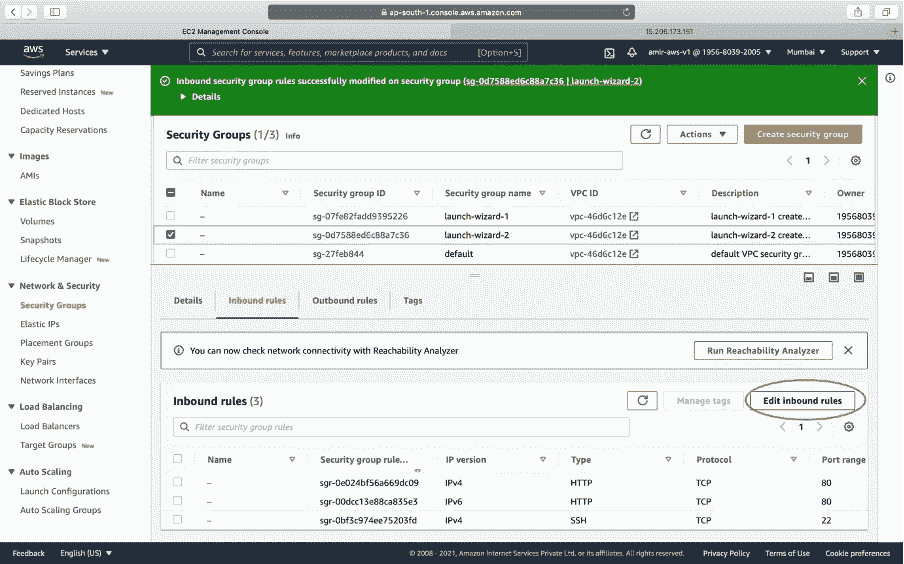

→据观察，我们通过 HTTP 请求运行了 web 服务器，该请求目前正在运行。

→在**编辑页面**上，我们有一个从 EC2 实例呈现的 **HTTP** 服务器。让我们删除 HTTP 请求并重新加载服务器

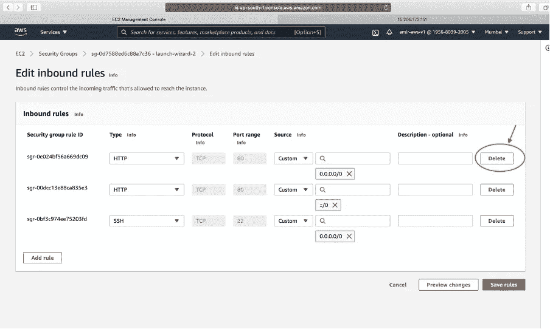

→这一次页面将无休止地加载，并在 30 秒后抛出超时错误。

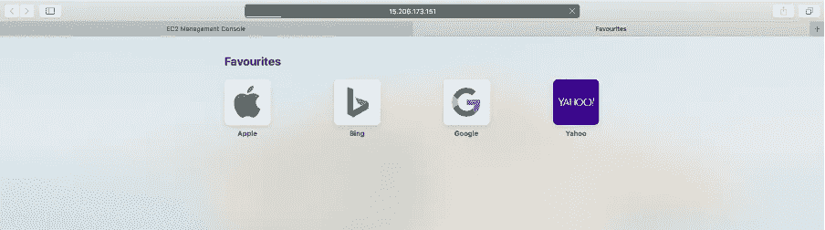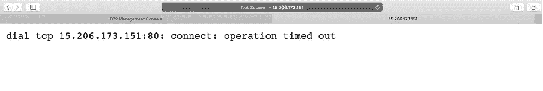

→让我们添加更多的安全规则与它们一起玩。点击**添加规则**按钮。

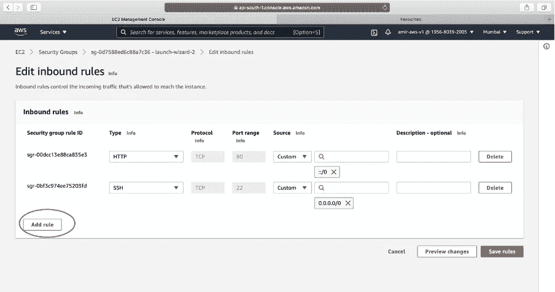

→这里我们可以添加 **n 个请求类型**，我们将**添加 HTTP 安全组**。我们可以选择一个来源—任何地方，然后任何 IP 都可以访问该 web 服务器。

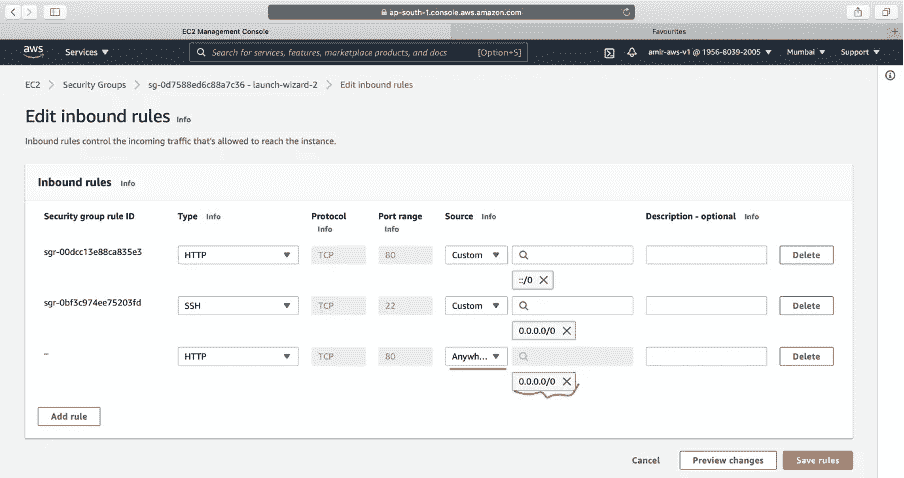

b.选择来源作为我的 IP:

这次 web 服务器将只从我的机器上打开。

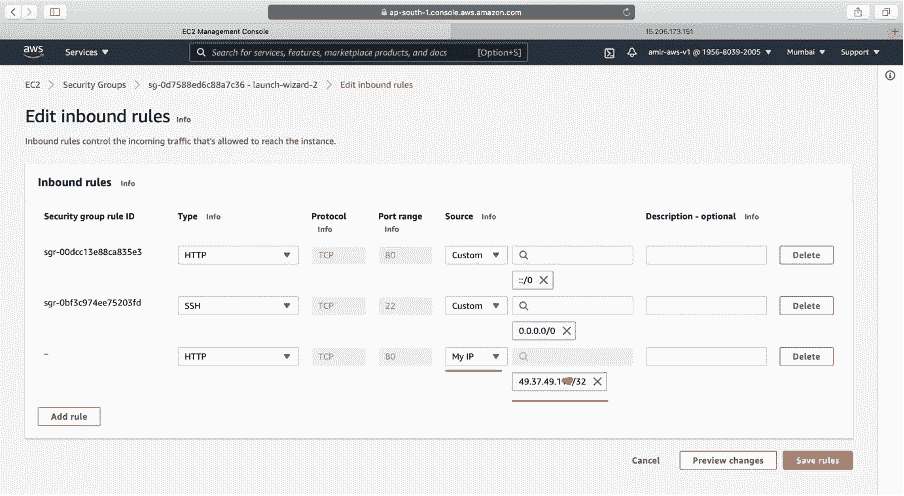

→让我们保存规则并重试打开服务器。现在可以成功打开了。

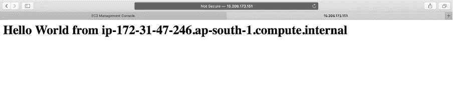

# 关于安全组的帮助视频:

 [## AWS 文章 1:使用亚马逊服务前建立预算的方法

### 编辑描述

www.loom.com](https://www.loom.com/share/586b3fc330ec492b822ed10f781263cb) 

# 结束语:

保护应用程序非常重要。我们开发的应用程序将为公司或客户带来业务。这些对用户的限制是控制不必要的黑客攻击的好方法。

在下一篇文章中，我们将了解 AWS 中的 SSH。

> 谢谢你一直坚持到最后🙌。如果你喜欢这篇文章或者学到了新的东西，请点击下面的分享按钮来支持我，让更多的人了解我和/或在 [Twitter](https://twitter.com/amir__mustafa) 上关注我，看看我在那里学到和分享的其他技巧、文章和东西。

